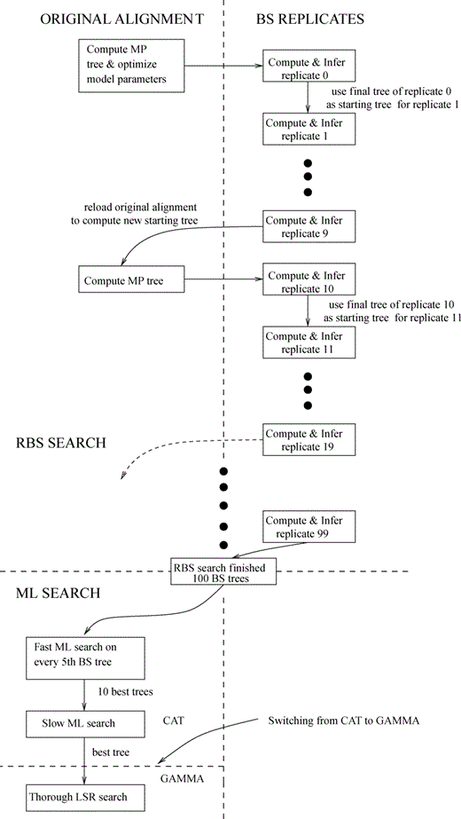

# Table of Contents

1.  [Reference](#org67810be)
2.  [Which version of RAxML to use?](#org47bca9d)
3.  [RAxML flags](#orgcfd5534)
4.  [Test runs](#org235771f)
5.  [Test run evaluation](#org73e4c75)
6.  [Bootstrapping and Best-scoring tree search](#orge09c0a4)


<a id="org67810be"></a>

# Reference

-   <https://cme.h-its.org/exelixis/resource/download/NewManual.pdf>
-   [Rapid Bootstrapping paper](https://academic.oup.com/sysbio/article/57/5/758/1618491)


<a id="org47bca9d"></a>

# Which version of RAxML to use?

-   RAxML comes in many different flavors, trying to take advantage of the computing hardward's capability.
-   **Run mode**: sequential, hybrid MPI/Pthreads, MPI, PThreads
    -   Sequential: no parallelization
    -   MPI: message passing interface
    -   PThreads: multi-core shared memory systems
    -   hybrid: use MPI to distribute bootstrap replicates or independent tree searches to different shared memory nodes in a cluster while using PThreads to parallelize the likelihood calculation of single tree searches
-   **Vectorization**
    Modern x86 processors are powerful because they have so-called vector instructions.
    -   SSE3, AVX and AVX2 are all vector instructions that are built-in to the CPU.
    -   They are in the order of old->recent
    -   The CPUs in the ARGON cluster are heterogenous, but the minimum of them support AVX.
-   **So which one to use?**
    -   According to the author, the sequential version is intended for small to medium datasets
    -   For protein alignment with ~1000 site patterns (informative alignment columns, I think), the PThreads version can still efficiently run on 16 threads (more than that and the efficiency may actually drop, even below the sequential version).


<a id="orgcfd5534"></a>

# RAxML flags

The "Easy & Fast Way" based on the author's manual for v8.x to infer trees with a large number of bootstrapping replicates is "to use the novel rapid BS algorithm and combine it with an ML search".

Basic command:

```bash
raxmlHPC -f a ­x 12345 ­p 12345 ­# autoMRE ­m PROTGAMMAAUTO --auto-prot=ml ­s <FASTA> ­n TEST
```

-   -f a : tell RAxML to conduct a rapid Bootstrap analysis and search for the best-scoring ML tree in one program run. must be used with -x; if this is not specified, the output only includes the bootstrap trees but not the best-scoring ML tree.
-   -x : turn on rapid bootstrapping and setting the seed for random number
-   -p : set the random number seed for starting tree
-   -# autoMRE : automatically determine the number of rapid BS runs based on convergence
-   -m PROTGAMMAAUTO : 
    
    > The example below will automatically determine which is the best (the one with the highest likelihood score on the parsimony starting tree) protein substitution model for your dataset using the base frequencies that come with the models. It will chose among the following models: DAYHOFF, DCMUT, JTT, MTREV, WAG, RTREV, CPREV, VT, BLOSUM62, MTMAM, LG,  MTART, MTZOA, PMB, HIVB, HIVW, JTTDCMUT, FLU, DUMMY, DUMMY2. These models will not be considered: LG4M, LG4X, PROT<sub>FILE,GTR</sub><sub>UNLINKED</sub>, GTR!
    > RAxML will now also automatically test models with and without empirical base frequencies.
    > The criterion for making this choice can now be selected via the
    > –auto­prot=ml|bic|aic|aicc option.
    > Example: `raxmlHPC ­m PROTGAMMAAUTO ­s alg ­p 12345 ­n TEST`


<a id="org235771f"></a>

# Test runs

1.  Run on interactive `qlogin` session using 2 threads
    
    `raxmlHPC-PTHREADS-AVX -x 12345 -p 12345 -# autoMRE -m PROTGAMMAAUTO -s OG5_132045_N500.faa -n TEST -T 2`

2.  `qsub` to the scheduler, asking for 8 threads, based on the suggestions above
    ```bash
    #!/bin/bash
    ############################
    # author: Bin He
    # date: 2020-06-27
    # title: RAxML tree search
    # use: qsub raxml.sh
    #----------------------
    # scheduler parameters
    #$ -q BIO-INSTR
    #$ -M bhe2@uiowa.edu
    #$ -m ea
    #$ -pe smp 8
    #$ -N raxml
    #$ -cwd
    #$ -o job-log/$JOB_NAME_$JOB_ID.out
    #$ -e job-log/$JOB_NAME_$JOB_ID.err
    #----------------------
    # -m ea will email the
    #    user when the job
    #    ends or aborts
    ########################
    
    # these are useful flags to set to make the code more robust to failure
    # copied from Vince Buffalo's Bioinformatic Data Analysis book
    set -e
    set -u
    set -o pipefail
    
    /Users/bhe2/bin/raxmlHPC-PTHREADS-AVX -f a -x 12345 -p 12345 -# autoMRE -m PROTGAMMAAUTO -s OG5_132045_N500.faa -n TH8 -T 8
    ```

3.  Using the MPI distributed process mode
    ```bash
    #!/bin/bash
    ############################
    # author: Bin He
    # date: 2020-06-27
    # title: RAxML tree search
    # use: qsub raxml-mpi.sh
    #----------------------
    # scheduler parameters
    #$ -q BIO-INSTR
    #$ -M bhe2@uiowa.edu
    #$ -m ea
    #$ -pe orte 24
    #$ -N raxml
    #$ -cwd
    #$ -o job-log/$JOB_NAME_$JOB_ID.out
    #$ -e job-log/$JOB_NAME_$JOB_ID.err
    #----------------------
    # -m ea will email the
    #    user when the job
    #    ends or aborts
    # -pe orte 24 requests a 
    #    parallel environment
    #    with 24 slots
    #############################
    
    # these are useful flags to set to make the code more robust to failure
    # copied from Vince Buffalo's Bioinformatic Data Analysis book
    set -e
    set -u
    set -o pipefail
    
    module load openmpi/2.1.2_gcc-3.8.0
    
    /Users/bhe2/bin/raxmlHPC-MPI-AVX -f a -x 12345 -p 12345 -# autoMRE -m PROTGAMMAAUTO -s OG5_132045_N500.faa -n MPI.${JOB_ID}
    ```

4.  Results
    -   Run on 8 core took about 1 hr, which is 2x faster than using 2 cores. So the speed-up is less than linear.


<a id="org73e4c75"></a>

# Test run evaluation

| Run mode | Slots | Model | # RBS | per RBS time | ML search time |
|----------|-------|-------|-------|--------------|----------------|
| MPI      |    16 | WAG   |   500 |         0.55 |            151 |
| PThreads |     8 | WAG   |   500 |         1.12 |            400 |
| PThreads |    16 | WAG   |   500 |         1.17 |            307 |

- clearly, the MPI version is much faster
- PThreads version cannot run efficiently on this alignment (567 distinct patterns) on more than 8 cores.

# Bootstrapping and Best-scoring tree search



-   The way boostrapping works for phylogenetics is normally to make N boostrap replicates and run the same ML tree search algorithm on them. The resulting BS tress can either be used to compute a "majority-rule consensus tree" (conceptually similar to computing an average tree), or use them to provide support values for the best-scoring ML tree on the original alignment
-   The rapid bootstrapping (RBS) implementedin RAxML relies on the new heuristic introduced in RAxML v7
    -   RBS starts with the computation of a stepwise random addition order MP tree, which yields distant starting points in the search space that are nonetheless close to the optimal tree (reference from a book I requested from the engineering library, details to be filled in).
        
        > every 10th BS replicate r<sub>0</sub>, r<sub>10</sub>, r<sub>20</sub>, … is seeded with a new stepwise random addition order MP starting tree that is computed on the original alignment to reduce the risk of navigating into local optima
    -   Thereafter, the model parameters and branch lengths are optimized on the **original alignment**
        -   ML parameters will not be re-optimized for any of the RBS replicates after this initial optimization
        -   In v8 (the one I'm using), this initial optimization uses the same model as used for the best-scoring ML tree search, instead of the GTR+CAT approximation as stated in the Stamatakis 2008
    -   Using this set of parameters, RAxML compute the first BS replicate and optimize the tree under ML using a "quick and dirty" per-replicate search
        
        > In contrast to the standard RAxML search procedure, where the rearrangement radius/setting is determined automatically (see the on-line supplement of Stamatakis, 2006b, for details), we use a randomly assigned radius between 5 up to and including 15.
        
        I admit that I still don't fully understand how this quick and dirty approach could still yield BS trees that can be useful for assessing the credibility of the best-scoring ML tree on the original alignment
    -   The final tree of BS replicate 1 is used as the starting tree on BS replicate 2 (a different boostrap sample of the original alignment)
-   After N (>100) RBS searches, the second part of the program run, search for best-scoring ML tree on the original alignment, begins
    -   The search first performs "fast ML search" on *every 5th* BS (final) tree (thus it automatically does what the -# N does without bootstrapping)
    -   On the 10 best trees, the algorithm performs a slow (thorough?) ML search to produce the best-scoring tree.

