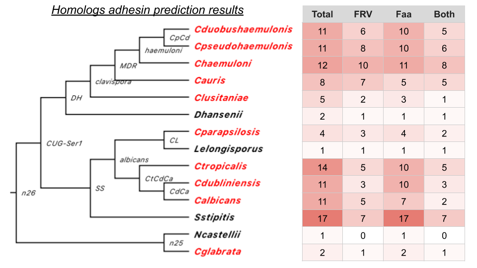

# Summary
Phylogenetic analysis of the homologs of XP_028889033, including BLAST identifying its homologs, gene tree reconstruction, reconciliation of the gene tree with the species tree and characterization of the adhesin associated properties of the homologs. Main findings include
- BLAST hits didn't include any sequences in well assembled genomes such as _S. cerevisiae_, _K. lactis_ etc. in the Saccharomycetaceae family. The only two species represented from this latter group among the BLAST hits are _C. glabrata_ and _N. castellii_. At face value, this would suggest the protein existed prior to the split between _C. glabrata_ and _C. auris_ (or _C. albicans_) but was subsequently lost in the species in the Saccharomycetaceae except _C. glabrata_ and _N. castellii_. This is not easy to understand.
- Taking advantage of the "Genome view" feature in the FungiDB's BLAST output, I confirmed Lindsey's observation that a large proportion (need to quantify) of the homologs are located towards chromosomal ends (defined as 5% tail of a chromosome on both ends).
- Gene tree recovered the Clavispora groups Jan initially identified. By and large, homologs from the _C. albicans_ clade and _C. auris_ clade form two distinct groups in the gene tree, suggesting that gene duplications within these two clades occurred mostly after the two diverged from each other (i.e. more "recent").
    

- A couple of puzzling observations in the gene tree:
    a. The sequences from _C. lusitaniae_ forms an outgroup to the _C. albicans_ and _C. auris_ clades, contradicting the species phylogeny where _C. lusitaniae_ is an outgroup to _C. auris_ but forms a sister clade with _C. albicans_
    a. _C. glabrata_ and _N. castellii_ sequences group together and forms a distinct clade from the rest of the CUG clade sequences. When I root the gene tree on the former clade, the implication, as stated above, is that the gene family is present in the common ancestor of all the species, but was subsequently lost in all Sacharomycetaceae species except in _C. glabrata_ and _N. castellii_.
- Reconciling the gene tree with the species tree allows for inference of gene duplications and losses
    - The most notable result is that two internal branches and two terminal branches showed higher than average gene gains. The former includes the branch leading to the MDR clade (_C. auris_ and its close relatives) and the branch leading to _C. dubliniensis_ and _C. albicans_. The latter includes the branches leading to _S. stipitis_ and _C. tropicalis_.
- Ran FungalRV and FaaPred on all the homologs:
    

    a. FungalRV predicts fewer adhesins than FaaPred does, except for _C. auris_, in which the former predicts more adhesins. Rachel made the second part of the observation and wondered why that would be the case. My sense is that because we identified this protein family by identifying the putative adhesin in _C. auris_, and assuming that not all members of the protein family in different species are adhesins, we would expect _C. auris_ homologs to have a higher likelihood to be adhesins. Next, if we assume FungalRV is more stringent but also generally better at predicting adhesins, we would then expect FungalRV to predict more adhesins than Faapred does. In general, I think we should trust FungalRV results more than FaaPred.
    a. By and large, known fungal pathogens, such as _C. auris_ and the MDR clade it is in, and the three species group that includes _C. albicans_, _C. tropicalis_ and _C. dubliniensis_ had the most members in the protein family. Although, FungalRV predicts that only a minority of the members among the _C. albicans_ clade are adhesins, while the same program predicts many more of the _C. auris_ clade members as adhesins. See above for potential reasons.
- GPI-anchor prediction suggests that most of the homologs do contain a GPI-anchor
    

    - GPI-SOM predicts 82 of the 110 sequences have GPI anchor.
    - Pred-GPI predicts 90 of the 110 sequences have GPI anchor.
    - Simple fuzzy protein match is not useful, as all 110 sequences have >= 1 hit
    - The most interesting finding here is that among the 17 homologs in _S. stipitis_, only 5 were predicted to have a GPI-anchor by GPI-SOM and 3 by PredGPI, suggesting that this protein family in this species may play a different role?
- Search for the GVVVVTT and associated beta-aggregation prone signature among the homologs:
    

    - this motif is most prominent in the Clavispora group that contains the query sequence, but is notably absent outside that group, suggesting that the motif, which resides in the C-terminal 2/3 of the proteins that didn't participate in the gene-tree reconstruction, likely evolved after the group diverged from the _C. albicans_ group.
    

# Todo and next meeting topic
- Make sure that the Nakaseomyces species proteins are included in my BLAST database -- is it true that only _C. glabrata_ contains homologs of the query sequence?
- Explore alternative (bootstrap) trees to see if the position of the _C. lusitaniae_ sequences and the split between the _C. auris_ clade and _C. albicans_ clade are present in the majority of the alternative trees.
- Finish GPI-anchor slide
- Parse TANGO results to identify alternative beta-aggregation motifs in the _C. albicans_ group sequences.
- lower priority: predict N- and O-glycosylation sites

Next meeting will either be next Monday and the one afterwards, 3:30-4:30 pm. Lindsey will give an update on the structural analysis of XP_028889033
