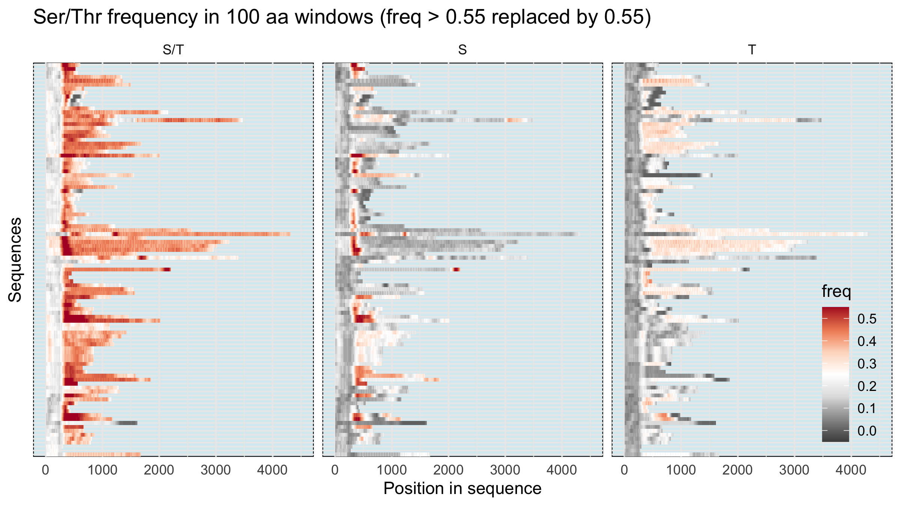
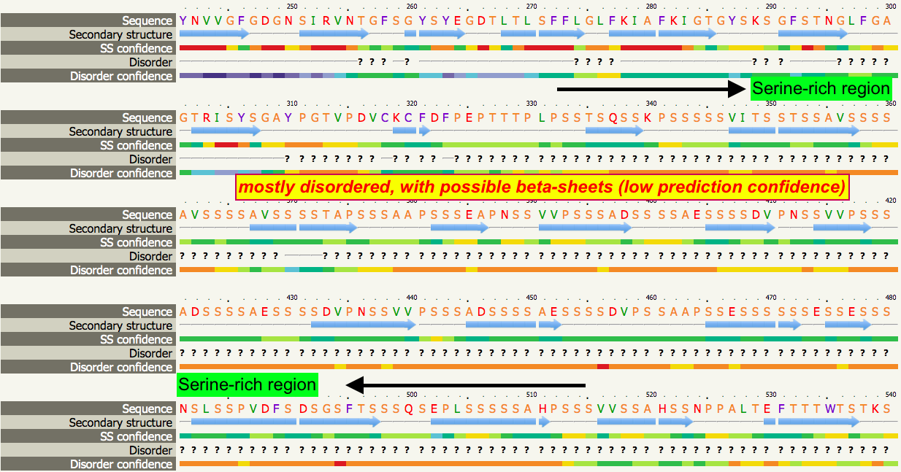

# Summary
Bin presented updates on the case study. Main points:

## _S. cerevisiae_ homologs of PF11765
- _S. cerevisiae_ does contain homologs of the PF11765, but the sequences are far more divergent from the _C. auris_ protein than the _C. glabrata_ homologs identified via BLAST.
- More importantly, they show a very different domain architecture compared with the other homologs, where the PF11765 domain is in the middle rather than in the N-terminal of the protein right after the signal peptide.
- Based on these results, Bin's conclusion is that _S. cerevisiae_ does contain members of the protein family, but they have evolved both in the domain sequence and domain location. Interestingly thought, one of the two proteins, Hpf1, is implicated for cell wall related functions.
- The decision is to leave them out of the main analysis, which doesn't change the overall story being told. They will be mentioned in the text and some results may be presented in the supplementary.

## Serine/Threonine content
- Serine-rich region immediately after the NTD in many homologs, followed by a long region that is threonine-rich (not as enriched as serine). Serine and threonine don't seem to occupy similar regions.

    

- Jan mentioned a reason for the serine and threonine to be enriched in different parts of the protein.
    - see Issues/Shared progress results
- Rachel asked if the Serine-rich domain is folded or disordered. Bin has submitted the sequence to Phyre2 for homology modeling.
    - the answer is that the region is likely disordered

        

## TANGO sequences
- Try excluding motifs found in the NTD (PF11765) before clustering.
- Use a regular expression to group all GVVIVTT variants.
- The key question in this part may be less about how the C-terminus sequences evolved relative to the NTD, but rather to characterize the number and distribution of $\beta$-aggregation motifs.

# Todo and next meeting topic
- [ ] FungalRV-independent list of candidate adhesins in _C. auris_ [HB]

    Use a combination of signal peptide, GPI-anchor, protein length, presence of N-terminal domain and number of TANGO predicted $\beta$-aggregation prone sequences.

- [ ] Search for recently published papers on fungal adhesin, especially in _C. auris_ [JF]
- [ ] Summarize I-Tasser threading-based structural modeling [LFS]
- [ ] Predict N- and O-glycosylation sites and investigate the chromosomal locations of the predicted adhesins in all species [RS]
