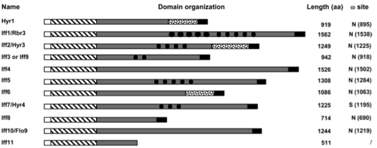

This post is in response to Jan's criticism on using the Hyr/Iff-like (Hil) family to name the 104 proteins. As I understand it, Jan's concerns are twofold. First, the name is improper, for several reasons. For one thing, the _C. albicans_ proteins in the list have already been named the Hyr/Iff family, and therefore including them in the Hyr/Iff-like family is not right. For another thing, this group of proteins were identified and grouped together solely (almost) based on the presence of the PF11765 domain. So the proper name for them should be "PF11765 domain containing proteins" (although that is also not correct, as we didn't include proteins with the domain but have a very different domain architecture). Second, using the Hil family to refer to all the 104 proteins makes it difficult to highlight the distinct features in the subset that includes _C. auris_ Hil1 through Hil4, which uniquely have a β-aggregation prone sequence embedded in their tandem repeat unit, resulting in not single or a handful but several tens of β-aggregation motifs. Below I address the first questions in two parts. As for the second question, I agree with Jan's argument and would like to revise the manuscript to highlight those distinct features and the possibility that those distinct features result in different adherent functions in _C. auris_ compared with _C. albicans_.

For the first part of the first question, the concern is the double-naming of the _C. albicans_ Hyr/Iff family. I cite several literature here to argue that this not a concern. First, the name "Hyr/Iff family" is not used consistently in the literature in _C. albicans_. For example, in both an early description of some of the IFF genes (Bates et al 2007, PMID: 17371861) and a more recent study of the entire family (Boisramé et al 2011, PMID: 21841123), the authors used the name "IFF family" either throughout the article or in some parts of it, e.g. abstract. "IFF" stands for "IPF (Individual protein family) family F", which was given during the initial annotation of the _C. albicans_ genome, and the family includes the previously reported hypha-specific GPI-CWP, _HYR1_. To acknowledge that Hyr1 is part of the family even though it has a different name, the name "HYR/IFF family" was used in other papers. Second, sequence diverence among the 12 members in the _C. albicans_ family is large, and several members have yet other names than the "IFFx" given during the initial annotation, such that calling them "Hyr/Iff-like" is not inappropriate. See below for a figure that shows the names and sequence divergence of the 12 members of this family in _C. albicans_.  
Fig 2A from Boisramé 2011

Lastly, in a well-cited comparative genomics paper for the CUG-Ser1 clade of _Candida_ species, the authors used the "Hyr/Iff-like family" (without the acronym of Hil) to refer to the PF11765-domain containing proteins in all the species they analyzed, including in _C. albicans_. This can be seen in the supplementary table file [here](https://static-content.springer.com/esm/art%3A10.1038%2Fnature08064/MediaObjects/41586_2009_BFnature08064_MOESM274_ESM.xls). So there is a precedence for this.

The second part of the first question is about defining protein families and homology relationship. The question boils down to can we equate domain homology to protein homology. It is important to point out that while the PF11765 domain surely had a single evolutionary origin and thus all the instances of this domain in the 104 proteins are clearly homologous, the same CANNOT be said about the rest of the protein, which includes the N-terminal signal peptide, C-terminal GPI-anchor sequence and the central domain that is rich in tandem repeats. In particular, the central domains exhibit dramatic variability even among closely related sequences (specified by the domain tree). So calling this group of proteins a family is referring strictly to their shared evolutionary origin of the well-folded N-terminal domain. Since a domain is only part of a protein, one problem that could arise is that different parts of a protein may have different evolutionary histories. That is certainly true in our case, where the central domain sequence, and the tandem repeat sequences therein, must have evolved independently except among really closely related sequences. I think it is still appropriate to define this group of proteins as a single family based on two criteria: 1) they share the single annotated, well-folded domain in them, i.e. PF11765; 2) they share the overall domain architecture, i.e. N-terminal signal peptide followed by the PF11765 domain, the central domain and the C-terminus GPI-anchor, which suggest they likely perform similar functions.

To 