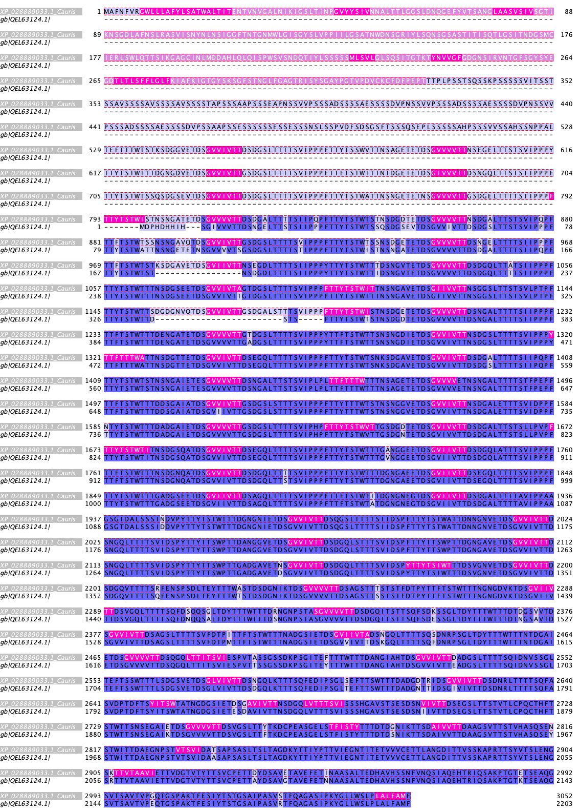
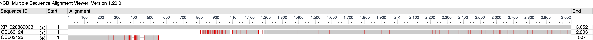
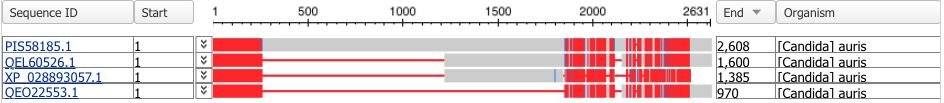
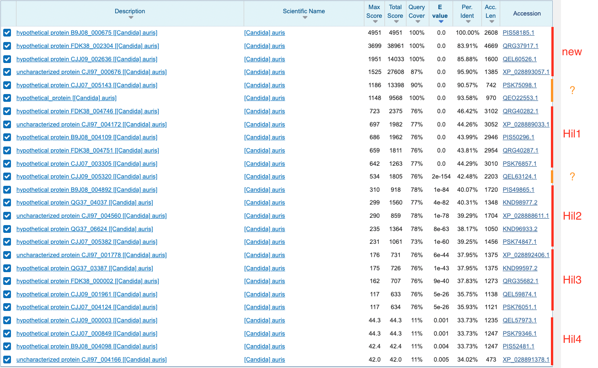
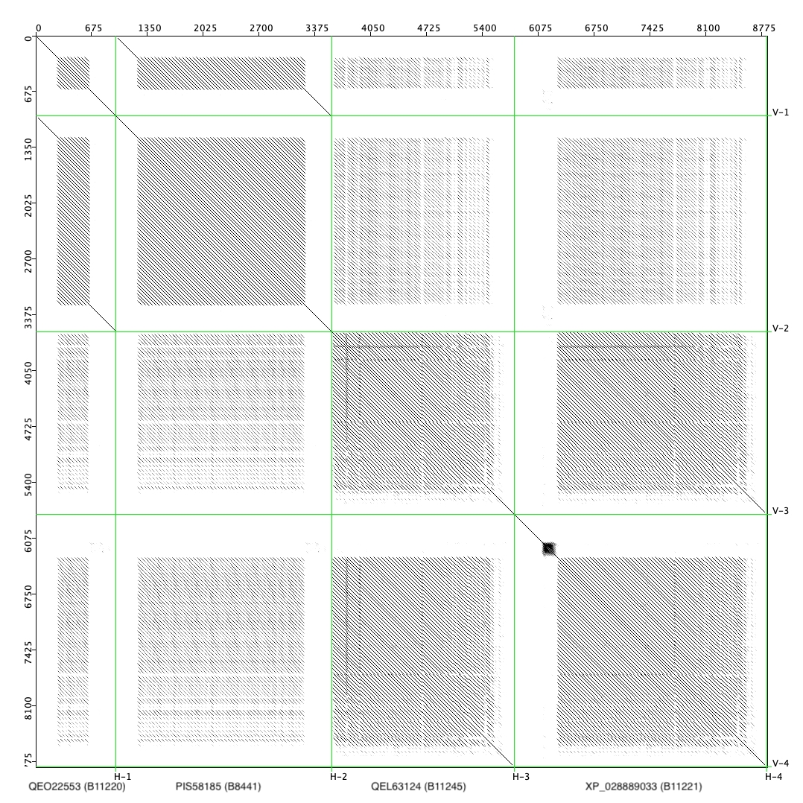

# Questions

Are there other genes in the _C. auris_ genome that share the sequence properties of the Hil family? If so, they could be potential adhesins.

# Background

We originally wanted to compare the adhesin genes in diverse species of yeasts to determine if the number, sequence features and other properties are similar or distinct among the adhesin genes in different species, whether they were ancestral and inherited, or were many of them species specific, suggesting that they evolved de novo. The attempt is documented in the `archive` folder. The basis of that analysis was the predicted adhesins in a number of yeast species. However, we realized that the fungal adhesin predictors are far from being able to accurately predict the adhesins and not including false positives. Analysis built on top of the prediction results would then be highly unreliable. We thus focused most of our energy on the case study of the Hyr/Iff-like (Hil) family proteins. After detailed analyses of that family, we started to wonder if **there are more proteins that are like the Hil proteins** in the _C. auris_ proteome, hence the current analysis.

# Notes

## 2021-07-09 PIS58185.1

While analyzing the TANGO hit sequences in the _C. auris_ proteome, it came to our attention that while most of the strong TANGO hits are GVVIVTT-like and the vast majority of them are in the Hil family proteins, there are two notable exceptions: first, one protein, QEL63124 from the clade IV strain B11245 (another clade IV strain B11243 has it as well) has all the G[VI]{4}TT sequences outside of the Hil family; second, a GVVIVTT-like sequence, "GVVIVT", occurs for a total of 82 instances but all outside of the Hil family. Below we will analyze these two cases separately.

### QEL63124

In the case of QEL63124, we found that it is highly similar to Hil1 except it lacks the N-terminal PF11765 domain. In fact, it is 94% identical and 95% similar to XP_028889033 (alignment starts at around residue 800), with 2% gaps (47 sites). See below for the annotated alignment.

Upon inspecting its [chromosomal location](https://www.ncbi.nlm.nih.gov/protein/qel63124), we found it is right next to the Hil1 protein in this strain, which is [QEL63125.1](https://www.ncbi.nlm.nih.gov/protein/QEL63125.1/). Their chromosomal locations are 

| Gene     | Chr  | CDS translated from                                          |
| -------- | ---- | ------------------------------------------------------------ |
| QEL63124 | 6    | complement(join(CP043447.1:935929..941539, 941629..942091,942537..943049, 943123..943147)) |
| QEL63125 | 6    | complement(CP043447.1:943433..944956)                        |

QEL63125 is identified as the Hil1 homolog in B11245 but it is only 507 amino acids long. Given that QEL63124 is right next to QEL63125 and matches nearly perfectly to the central and C-terminal domain of Hil1 in B11221, I think it is almost certain that QEL63125+QEL63124 = Hil1 in B11245.

### PIS58185

A total of four proteins contained the "GVVIVT" sequences and all are outside of the Hil family. They are:

| pID            | gID          | Length | Chromosome                     | Strain | Clade |
| -------------- | ------------ | ------ | ------------------------------ | ------ | ----- |
| PIS58185.1     | B9J08_000675 | 2608   | Chr2(scaffold3):351970..359796 | B8441  | I     |
| QEO22553.1     | NA           | 970    | Chr3:1752934..1755846          | B11220 | II    |
| XP_028893057.1 | CJI97_000676 | 1385   | Chr2:1465685-1470012           | B11221 | III   |
| QEL60526.1     | CJJ09_002636 | 1600   | Chr2:1449654..1454456          | B11245 | IV    |

From this table our guess is that except for QEO22553.1, the others are probably orthologs.

**Update 2021-07-19 [HB]** Further investigation suggested that proteins #3 and #4 are likely orthologs as they are both on chromosome 2 in different strains, with similar coordinates. The shorter length of the B11221 protein is because it is translated from a partial mRNA, which lacks the C-terminal portion. This also leads to it missing the C-terminal GPI-anchor signal peptide, which I expect it to have. PS58185 is different in that it is much longer, and because chromosome 1 in B8441 is split between two scaffolds, it is unclear whether its chromosomal location is syntenic with the ones in B11221 and B11245. Finally, QEO22553 is on a different chromosome and is much shorter. Below is the [COBALT](https://www.ncbi.nlm.nih.gov/tools/cobalt/cobalt.cgi) MSA result:

_red color indicates highly conserved columns while blue color indicates less conserved ones._

**Update 2021-07-28 [HB]** It turns out that there were many chromosomal translocation events in the clade II strains, including in B11220. As a result, the Chr3 region that contains QEO22553 (1.1-2.1Mb) actually maps to the 1.0-2.0 Mb region on chromosome 2 of B8441. Therefore all four genes are likely orthologs of each other.

 

We then used PIS58185.1 as query and searched against the non-redundant proteome database with blastsp. The result is stored in `output/PIS58185/20210709-PIS58185-blastp-in-cauris.txt`. Below is a graphic annotation of the search result:

This is rather interesting: Hil1-4 are the longer Hil family members in _C. Auris_, which also have regularly spaced GVVIVTT sequences, and they are the ones that showed up in this search, suggesting that the C-terminal sequence of PIS58185 bear significant similarity with Hil1-4. To see how similar is PIS58185 to Hil1-4, we aligned it to the Hil1 sequence XP_028889033 and got the following:

The result revealed that PIS58185 has significant similarity with XP_028889033 in the non-NTD portion. Unlike in the case of QEL63124 however, there is substantial sequence differences behind the similarity, and therefore we can be pretty confident that this is not due to misassembly, as we suspected for QEL63124. Interestingly, Hil1-4 has GVVIVTT while PIS58185 has GVVIVT. A separate [analysis](https://github.com/binhe-lab/C037-Cand-auris-adhesin/tree/master/02-case-studies/07-Cauris-polymorphism/output/dot-plot) that included Hil1-8 showed that the tandem repeat unit, which contains the GVVIVTT motif, likely had a common origin during evolution among Hil1-4 and Hil7-8, which, after subsequent evolution, now contained different copies and also diverged in the repeat unit. Combined with the results above, we hypothesize that the C-terminal tandem repeats in PIS58185 has the same evolutionary origin as those in the Hil family. It's not possible to determine the exact evolutionary process without further analyses of the tandem repeats themselves though.

### Additional sequences

Three additional sequences also showed up. Two of them, PSK75098 and QEO22553, belong to B11243 and B11220 of clade IV and II respectively. They are both shorter than 1000 amino acids. The third, QEL63124, is the protein mentioned above. We aligned them using dot-dot plot to visualize their relationship.

It appears that the first two proteins share the N-terminal domain but the latter has more repeats. The third one lacks any N-terminal domain and only has the repeats. It's not clear yet what the evolutionary relationship is among these proteins. What is clear is that they share significant similarities in their repeat content.

## 2021-07-23 Pfam domains in candidate GPI-anchored CWPs

*Goal*

- Read and learn about the Pfam domains present in our candidate adhesin list.

*Approach*

- Search pfam and related databases and keep notes for each domain

*Notes*

| Domain         | Pfam ID                                                      | # proteins | Representative    | Function                                                     |
| -------------- | ------------------------------------------------------------ | ---------- | ----------------- | ------------------------------------------------------------ |
| GLEYA          | [PF10528](https://pfam.xfam.org/family/GLEYA)                | 3          | ScFlo5, CgEpa1    | Adhesion, mannose-binding                                    |
| Candida_ALS_N  | [PF11766](https://pfam.xfam.org/family/PF11766)              | 3          | CaAls1-9          | Adhesion1                                         |
| Collagen       | [PF01391](https://pfam.xfam.org/family/PF01391#tabview=tab0) | 1          | NA                | NA                                                           |
| Flo11          | [PF10182](https://pfam.xfam.org/family/PF10182)              | 1          | Flo11             | homotypic binding, cell adhesion                             |
| PLA2_B         | [PF01735](https://pfam.xfam.org/family/PLA2_B)               | 1          | CaPlb5            | GPI-anchored Phospholipase B                                 |
| Asp            | [PF00026](https://pfam.xfam.org/family/PF00026)              | 7          | CaSap9 (aka Yps1) | GPI-anchored aspartyl protease                               |
| CFEM           | [PF05730](https://pfam.xfam.org/family/PF05730)              | 5          | CaRbt5            | cell surface receptors or adhesins                           |
| Glyco_hydro_72 | [PF03198](https://pfam.xfam.org/family/PF03198)              | 2          | CaPhr1            | glycosidases with a role in proper cross-linking of β-1,3- and β-1,6-glucans |
| X8             | [PF07983](https://pfam.xfam.org/family/PF07983)              | 2          | CaPhr1            | glycolsyl hydrolase, bind carbohydrates                      |
| Glyco_hydro_16 | [PF00722](https://pfam.xfam.org/family/PF00722)              | 2          | CaCrh11           | transglycosylase                                             |
| Zip            | [PF02535](https://pfam.xfam.org/family/PF02535)              | 1          |                   |                                                              |

1. Donohue, Dagmara S., Francesco S. Ielasi, Katty V. Y. Goossens, and Ronnie G. Willaert. “The N-Terminal Part of Als1 Protein from Candida Albicans Specifically Binds Fucose-Containing Glycans.” *Molecular Microbiology* 80, no. 6 (June 2011): 1667–79. https://doi.org/10.1111/j.1365-2958.2011.07676.x.
2. Based on Pfam description of the protein domain being an enzyme acting on the lysophospholipids
3. 

### GLEYA

*Pfam*

... related to lectin-like binding domains found in the *S. cerevisiae* Flo proteins and the *C. glabrata* Epa proteins. rich in β-strands.

*SCOP*

belongs to the PA14 superfamily

### Candida_ALS_N

*pfam*

This N-terminal domain is likely to be the sugar or ligand binding domain of yeast alpha-agglutinin [1] and agglutinin-like (ALS) proteins.

### Collagen

*pfam*

Members of this family belong to the collagen superfamily. Collagens are generally extracellular structural proteins involved in formation of connective tissue structure. The sequence is predominantly repeats of the G-X-Y and the polypeptide chains form a triple helix. The first position of the repeat is glycine, the second and third positions can be any residue but are frequently proline and hydroxyproline. Collagens are post-translationally modified by proline hydroxylase to form the hydroxyproline residues.

### Flo11

*pfam*

This presumed domain is found at the N-terminus of the S. cerevisiae Flo11 protein. Flo11 is required for diploid pseudohyphal formation and haploid invasive growth. It belongs to a family of proteins involved in invasive growth, cell-cell adhesion, and mating, many of which can substitute for each other under abnormal conditions

### PLA2_B

*pfam*

Lysophospholipase, catalyse the release of fatty acids from lysophsopholipids and are capable *in vitro* of hydrolyzing all phospholipids extractable from yeast cells. Therefore this one may be a CWP that doesn't function as an adhesin.

### Asp

*pfam*

Aspartyl proteases (APs), also known as acid proteases, ([intenz:3.4.23.-]) are a widely distributed family of proteolytic enzymes

### CFEM

*pfam*

The CFEM (Common in several fungal extracellular matrix) domain is a fungal-specific domain that contains eight cysteines and is found in some proteins with proposed roles in fungal pathogenesis.

### Glyco_hydro_72

*pfam*

a widespread group of enzymes that hydrolyse the glycosidic bond between two or more carbohydrates, or between a carbohydrate and a non-carbohydrate moiety.

## 2021-07-26 Discussion and reading notes

The adhesin group met today. Both Jan and 
