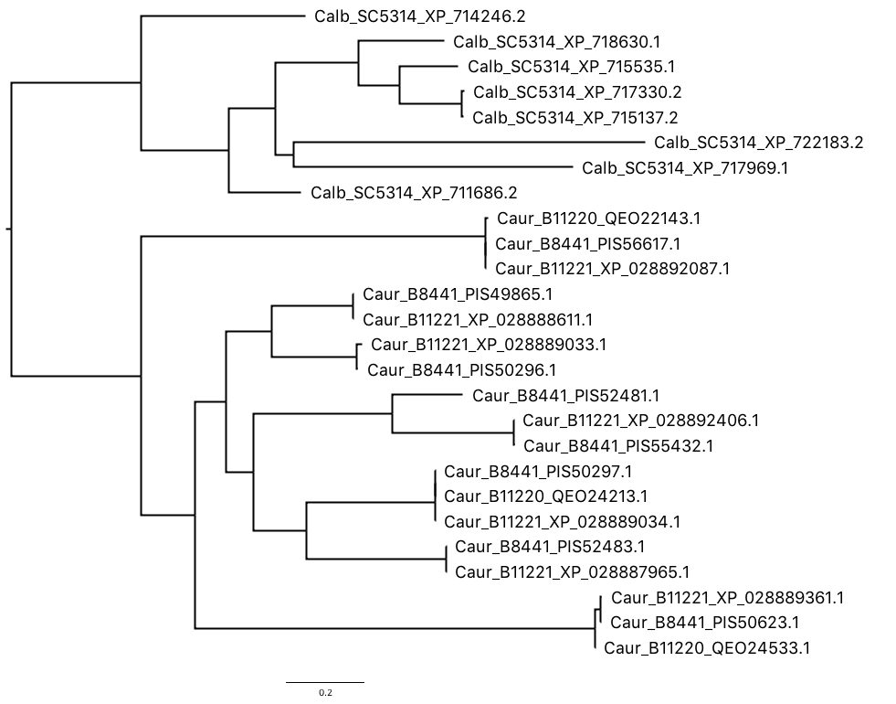

```{r setup, cache=FALSE, include=FALSE}
knitr::opts_chunk$set(echo = TRUE)
# set the root directory to be the output folder for OrthoMCL
# note that with the Rproject set, the default working directory
# is where the .Rproj file is.
knitr::opts_knit$set(root.dir = normalizePath("../../output/OrthoMCL/"))
knitr::opts_knit$get("root.dir")
```

```{r load_libraries, echo=FALSE}
# install the package if not already available
if (!requireNamespace("tidyverse", quietly = TRUE))
    install.packages("tidyverse")
if (!requireNamespace("rentrez", quietly = TRUE))
    install.packages("rentrez")

# load the package
suppressMessages(library(tidyverse))
suppressMessages(library(rentrez))
```

## Executive summary
1. _C. auris_ (all three strains) have fewer genes predicted by either FungalRV or FaaPred to be adhesins (47 by FungalRV, vs ~60 in _S. cerevisiae_ and _C. glabrata_ and 84 in _C. albicans_)
    - This lower number could be a result of 1) the model was trained on positive adhesins sets that _included_ the three non _auris_ species, and thus can be more sensitive to them, or 2) _C. auris_ genome is less complete. Being more closely related to _C. albicans_ and yet having far fewer predicted adhesins suggests that either adhesins are highly species-specific, or that the _C. auris_ genome is not as well assembled. I'm not sure genome assembly is the issue.
1. The proportion of predicted adhesins mapped to an existing orthogroup in OrthoMCL-DB v5 is much lower (60%) than the other three species (80-90%), possibly because _C. auris_ is the only species not included in constructing the OrthoMCL v5
1. Examining the gene tree for one of the orthogroups shows that the many members in that orthogroup duplicated in each of _C. auris_ and _C. albicans_ after they diverged from each other!
1. Classify each orthogroup in the dataset by how many species have members in that orthogroup (1,2,3 or 4), and compare the proportion of predicted adhesins in each species that fall in one of the groups or "unmapped". This shows that more than half of the predicted adhesins are either "unmapped" or mapped to an orthogroup that is only represented by that species alone.
    - Using various stringency criteria (FRV score > 0 or 0.511, with or without FaaPred positive), I found that the proportion of unmapped and species-specific orthogroups remain roughly the same (>50% for _S. cerevisiae_ and _C. albicans_, ~50% for _C. auris_ and _C. glabrata_). One interpretation, given the first two species are far more studied and better represented in the adhesin positive set, is that the predictor is more sensitive for species-specific adhesins in these two species, which would imply a high proportion of species-specific adhesins.
    - Looking at the FungalRV score distribution for the above five groups didn't show lower scores for the unmapped.
    - In _C. albicans_ and _S. cerevisiae_, the predicted adhesins belonging to orthogroups shared by 2 or 4 species have higher scores than those in species-specific orthogroups. Combined with the observation that these two species have higher number of predicted adhesins falling in species-specific orthogroups suggest to me that those ones are less trustworthy.
    - In all four species, the orthogroups with members in 3 species are the smallest in number and the adhesins in them tend to have the lowest scores. Knowing that the four species form two pairs of relatively closely related groups suggest to me that those orthogroups shared by 3 species are less trustworthy (haven't thought carefully about what may cause these).
    - _C. glabrata_ has a lot of unmapped adhesin predictions, which have comparable FungalRV scores as the other groups, suggesting that this species may have evolved new adhesins since it diverged from _S. cerevisiae.
- I'll leave the functional annotation for the top orthogroups to the other `orthomcl-gene-exploration.Rmd`.

## Questions

Are the known and _predicted_ adhesin genes from _C. auris_, _C. albicans_ and _C. glabrata_ from the same group of adhesin families? In other words, do they use an ancestral pool of adhesin genes or did they evolve species-specific ones by co-option or _de novo_ evolution? If they share certain families, are the number of paralogs (members of a family) similar or different?

_Update 2020-05-31_

After my initial analysis of the OrthoMCL results (see [`OrthoMCL.Rmd`](https://github.com/binhe-lab/C037-Cand-auris-adhesin/blob/master/01-global-adhesin-prediction/analysis/protein-family-classification/OrthoMCL.Rmd)), I found that some of the orthogroups don't make obvious sense in terms of mediating adhesion, such as gene families annotated as alcohol dehydrogenases and other enzymes. Some of them may genuinely be relevant, such as aspartyl protease, which could be involved in cell wall remodeling triggered by host-fungal interaction. However, it does seem likely to me that the list of predicted adhesins contain an appreciable amount of false positives. To resolve this, I plan to take two approaches: 1) narrow down the list by including only those genes predicted by both FungalRV and FaaPred. This should reduce false positive rate, although it comes at the cost of higher false negative rates. 2) instead of analyzing the orthogroup mapping assuming all the predicted adhesins are correct, use the functional annotation for the orthogroups to vet the adhesins, and remove predictions that obviously _don't make sense_. Similarly, I can combine other predicted features such as Signal Peptide, GPI anchor and low complexity repeat regions to further eliminate potential false positives. In this document I will first try the FaaPred dataset.

## Approach
As previously, the OrthoMCL results were obtained using the VEuPathDB's [Galaxy site](http://veupathdb.globusgenomics.org/) to map the predicted adhesins from all five genomes to "orthogroups". These are pre-computed groups of putative orthologous protein sequences. These are calculated using the OrthoMCL program. Here is a [description](https://orthomcl.org/orthomcl/about.do#background) of how that is done. 

Briefly

- All-v-all BLASTP of the proteins.
- Compute percent match length
    - Select whichever is shorter, the query or subject sequence. Call that sequence S.
    - Count all amino acids in S that participate in any HSP (high scoring pairs, from BLAST local alignment).
    - Divide that count by the length of S and multiply by 100
- Apply thresholds to blast result. Keep matches with E-Value \< 1e-5 percent and match length \>= 50%
- Find potential in-paralog, ortholog and co-ortholog pairs using the Orthomcl Pairs program. (These are the pairs that are counted to form the Average % Connectivity statistic per group.)
- Use the MCL program to cluster the pairs into groups

## Data

- OrthoMCL output, including `mappedGroups.txt`, `MCS.tabular` and `paralogPairs.txt`.
    - `mappedGroups.txt`: the mapping between the proteins in the input file and the pre-calculated Orthogroups. 
    - `paralogPairs.txt`: pairwise distance calculated among the input sequences. 
    - `MCS.tabular`: the clustered proteins based on the `paralogPairs.txt`, which only include those sequences that don't get mapped to the existing Orthogroups.
- FungalRV predictions: `../FungalRV/all-fungalrv-results-20200529.txt`
- FaaPred predictions: `../Faapred/all-faapred-seq-names-20200531.txt`

### load data

Note! Please make sure that the threshold used below is correct before interpreting the remaining of this document
```{r load_adhesin_prediction}
# -------- Change Me! ----------
# 0. Set the fungalRV score threshold
#    The website application's default is 0, but the paper recommends 0.511 to achieve the best balance
#   between true positive and false positive
frv.th = 0.511
# -----------END ---------------

# 1. FungalRV
#    the following file contains the metadata for all genes
#    header: species, strains, protein_id and FungalRV score
#    threshold used by current version of Fungal RV: Score > 0 
frv.res <- read_tsv("../FungalRV/all-fungalrv-results-20200529.txt", comment = "#", col_types = "cccd", na = "Can't be processed")

# 2. FaaPred
faa.res <- scan("../Faapred/all-faapred-seq-names-20200531.txt", what = "string")

# 3. Make T/F variables for FungalRV and FaaPred results
adhesin <- frv.res %>% 
  mutate(fungalRV = ifelse(Score > frv.th, TRUE, FALSE),
         faapred = ifelse(ID %in% faa.res, TRUE, FALSE))
```

Load OrthoMCL mapping for proteins from the _Candida_ species
```{r load_orthomcl_mapping_no_scer}
# the following file contains the mapped results for the proteins with FungalRV score > 0 in all proteomes except for _S. cerevisiae_
frv.mapped <- read_tsv("all-fungalRV-orthoMCL-v5/mappedGroups-20200309.txt", col_types = "ccciidd")

# merge the frv.mapped with frv.res to provide gene information
frv.mapped.rest <- frv.mapped %>% 
  left_join(adhesin, by = c("protein_id"="ID")) %>% 
  select(Species, Strain, protein_id, group_id = orthomcl_group_id, frv_score = Score, fungalRV, faapred)

head(frv.mapped.rest, 3)
```

We need to process _S. cerevisiae_ data separately because instead of using the OrthoMCL mapping program, I downloaded the preprocessed results from [FungiDB](https://fungidb.org)

Note: the code below is _not_ run by default. Only run it when the _S. cerevisiae_ mapping data are updated.
```{r convert_scer_ID, echo=TRUE, eval=FALSE}
# the S. cerevisiae mapping data is downloaded from fungiDB (which is from OrthoMCL v5)
scer.mapped <- read_tsv("all-fungalRV-orthoMCL-v5/S_cerevisiae_orthoMCL_v5_download.txt", col_types = "ccccccccc")
# rearrange the columns and make any non-orthomcl-group-ids "NA"
scer.mapped <- scer.mapped %>%
  select(gene_id, description, orthogroup_id, pfam_id, pfam_description, geneName, entrez_id) %>% 
  mutate(orthogroup_id = ifelse(substr(orthogroup_id, 1, 4)=="OG5_", orthogroup_id, "NA"))

# collect predicted adhesins in S. cerevisiae by FungalRV
# note the threshold here is not altered, because my goal is to convert as many IDs 
# as entrez_link() allows doing so for all _S. cerevisiae_ is not possible due to 
# NCBI's API limit, but can be achieved by splitting the list into several batches 
# of hundreds. I didn't do so since we don't need the information for most of the 
# proteome (anything with score below zero are considered non-adhesin)
frv.scer <- adhesin %>% 
  filter(Species == "S_cerevisiae", Score > 0)

# translate these IDs to entrez_id so we can bring in the orthomcl mapping results
lnk <- entrez_link(dbfrom = "protein", id = frv.scer$ID, db = "gene", by_id = TRUE)
frv.scer$entrez_id <- sapply(lnk, function(x) x$link$protein_gene)

# pull in the orthogroup and other annotation
frv.mapped.scer <- frv.scer %>% 
  left_join(select(scer.mapped, group_id = orthogroup_id, entrez_id), by = c("entrez_id"="entrez_id")) %>% 
  select(Species, Strain, protein_id = ID, group_id, frv_score = Score, fungalRV, faapred)
write_tsv(frv.mapped.scer, "all-fungalRV-orthoMCL-v5/S_cerevisiae_mapped_w_entrezID.txt")
```

```{r process_and_merge_scer_data}
# read S. cerevisiae results generated above
frv.mapped.scer <- read_tsv("all-fungalRV-orthoMCL-v5/S_cerevisiae_mapped_w_entrezID.txt", col_types = "ccccdll")
# merge Scer results with the rest
frv.mapped.all <- rbind(frv.mapped.rest, filter(frv.mapped.scer, substr(group_id,1,8) != "OG5_scer"))

str(frv.mapped.all)
```

Note that _S. cerevisiae_ data contain a number of orthogroups with unusual group_id, such as  `r head(frv.mapped.scer %>% filter(substr(group_id,1,8) == "OG5_scer") %>% pull(group_id))`. These groups have only one member, that is, the _S. cerevisiae_ gene. However, when I search in the OrthoMCL-DB v6r1, some of them, like "OG5_scer|scer_s288c__YJL116C" coorespond to "OG6_1300006", which do contain 8 core members and 110 peripheral members. For the moment, though, I **excluded** them from "mapped" list by assigning "NA" to their group_id.

Now let's load the Markov clustering results. This files contains the grouping produced by the MCL algorithm for those sequences that don't map to the orthomcl groups, and cluster them using the all-against-all blastp scores among themselves using the Markov Clustering Algorithm (MCL)
```{r load_mcs, warning=FALSE}
# the following file contains unmapped genes grouped by MCS algorithm
#frv.mcs <- read_tsv("all-fungalRV-orthoMCL-v5/MCS-20200605.tabular", comment = "#", col_types = "cc")
frv.mcs <- read_tsv("all-fungalRV-orthoMCL-v5/MCS-20200605.tabular", col_names = FALSE, col_types = "ccc")
frv.mcs$group_id <- paste("MCS",1:nrow(frv.mcs), sep = "_")
frv.mcs.long <- frv.mcs %>%  
  pivot_longer(-group_id, names_to = "member", values_to = "protein_id") %>% 
  # remove empty entries
  filter(!is.na(protein_id)) %>% 
  select(protein_id, group_id) %>% 
  left_join(adhesin, by = c("protein_id" = "ID")) %>% 
  select(Species, Strain, protein_id, group_id, frv_score = Score, fungalRV, faapred)

# merge with the mapped results
frv.cmbd <- bind_rows( mapped = frv.mapped.all, mcs = frv.mcs.long, .id = "type")
frv.cmbd %>% 
  filter(type == "mcs") %>% 
  group_by(group_id) %>% 
  count(Strain) %>% 
  pivot_wider(id_cols = group_id, names_from = Strain, values_from = n)
```
**Clearly, the MCS groups almost certainly represent the orthologs in the three _C. auris_ strains. No additional groups were recovered.**

**In the analysis below, we will use `frv.mapped.all`**

Lastly, we will load the meta-table downloaded from [fungiDB beta site](https://beta.fungidb.org/fungidb.beta/app/). Note that the OrthoMCL groups are based on OrthoMCL-v6r1, but the other meta-information are not specific to that version.
```{r load_fungidb_meta_table}
fungidb <- read_tsv("all-fungalRV-orthoMCL-v6r1/all_species_orthogroup_results_from_fungidb.txt", col_types = "ccccccicc", na = "N/A")
fungidb$organism <- with(fungidb, factor(organism, levels = unique(organism), labels = c("C_auris", "C_albicans", "C_glabrata", "S_cerevisiae")))
```

## Analysis

### A. How many predicted adhesins were successfully mapped in each species/strain?

First, let's check the prediction results.

- The "**Submitted**" represent the number of proteins getting a FungalRV score greater than zero - this is the default cutoff of the FungalRV web application, but is not the recommended cutoff as it potentially includes many false positives. We use this to "nominate" candidate adhesins, and also these were submitted to OrthoMCL program for mapping.
- The "**FungalRV**" group were those genes with a FungalRV score greater than the cutoff of 0.511, which is what the authors recommended.
- The "**FaaPred**" group were those among the FungalRV score > 0 that were predicted by FaaPred to be an adhesin. Because we didn't run FaaPred on ALL the genes, due to the 25 sequence limits of their web app and lack of access to their source code, this set is only a subset of what FaaPred would have predicted in these genomes.
- The "**Both**" grouop represent the intersection of FungalRV and FaaPred predictions.

```{r prediction_results, echo=FALSE}
# total number of adhesins submitted per species
frv.stat <- adhesin %>% 
  group_by(Species, Strain) %>% 
  summarize(FungalRV = sum(fungalRV, na.rm = T), 
            FaaPred = sum(faapred, na.rm = T), 
            Both = sum(fungalRV & faapred),
            Submitted = sum(Score > 0, na.rm = T), 
            Total = n())
print(frv.stat)

frv.stat %>%
  rename(FungalRV_0 = Submitted) %>% 
  select(-Total) %>% 
  pivot_longer(cols = c(Both, FaaPred, FungalRV, FungalRV_0), 
               names_to = "Predicted_by", values_to = "n") %>% 
  ggplot(aes(x = Strain, y = n,  fill = Predicted_by)) + 
  geom_bar(stat = "identity", position = position_dodge(0.7)) +
  scale_fill_brewer(type = "div", palette = 2) + coord_flip()
```

Next let's look at how many of the sequences submitted to OrthoMCL were successfully mapped.
```{r percent_mapped_v5, echo=FALSE}
# combined both mapped and MCS clustered
#frv.cmbd %>% 
#  group_by(Strain) %>% 
#  summarize(mapped = sum(type == "mapped"),self_group = sum(type == "mcs")) %>% 
#  right_join(frv.stat, by = c("Strain" = "Strain")) %>% 
#  mutate(unmapped = Submitted - mapped - self_group) %>% 
#  select(Species, Strain, mapped, self_group, unmapped, Submitted)

frv.mapped.stat <- frv.mapped.all %>% 
  count(Strain) %>% 
  right_join(frv.stat, by = c("Strain" = "Strain")) %>% 
  mutate(mapped = n, unmapped = Submitted - mapped) %>% 
  select(Species, Strain, mapped, unmapped, Submitted)

print(frv.mapped.stat)
# plot the results
frv.mapped.stat %>% 
  select(-Submitted) %>% 
  pivot_longer(cols = c(mapped, unmapped), names_to = "status", values_to = "n") %>% 
  mutate(status = ordered(status, levels = c("unmapped","mapped"))) %>% 
  ggplot(aes(x = Strain, y = n, fill = status)) + geom_col() + coord_flip() + scale_fill_brewer(palette = "Paired")
```

Note that although all _S. cerevisiae_ proteins appear to be "mapped", `r length(frv.mapped.scer %>% filter(substr(group_id,1,8) == "OG5_scer") %>% pull(group_id))` belong to those unusual "OG5_scer|scer_S288c_xxx" groups.

### B. Reduce the three _C. auris_ strains to a single superset

While the individual strains could reveal variation within species, the unequal assembly quality of the three strains' genome makes this approach less convincing. Instead, we could take advantage of the three genomes to come up with a superset of adhesins that "exist" in the _C. auris_ population. Here the idea is to use the OrthoMCL mapping to remove redundant genes. Among the _C. auris_ genes that map to one of the OrthoMCL groups, we pick one of them as a representative, e.g. choose the one that is the longest.

#### Count the number of genes in each _C. auris_ strain belonging to every orthogroup
Let's first examine the grouping of the _C. auris_ proteins, including the OrthoMCL groups and the MCL clustering result for those not mapped to the existing groups (only the top seven rows are shown, the rest have 0 or 1 member in each strain)
```{r examine_C_auris_proteins, echo=FALSE}
# extract only the C. auris entries
caur <- frv.mapped.all %>% 
  filter(Species == "C_auris", frv_score > 0) 

# let's check the number of genes in each orthogroup by strain
caur.wide <- caur %>% 
  select(Strain, group_id) %>% 
  group_by(group_id) %>% 
  count(Strain) %>% 
  pivot_wider(id_cols = group_id, names_from = Strain, values_from = n) %>% 
  arrange(desc(B11220+B11221+B8441))
head(caur.wide, n = 7)
```
_Discussion_

We can see that most of the orthogroups contain one or zero gene in each strain. A few orthogroups contain multiple members. I think it will be interesting to pull one of the latter groups out, e.g. OG5_132045, extract all the sequences in that group and build a gene geneaology tree.

#### Reconstruct the gene tree for a representative orthogroup
```{r extract_multiple_member_groups, eval=FALSE}
example_set <- frv.mapped.all %>% filter(group_id == "OG5_132045") %>% pull(protein_id)
cat(example_set, file = "all-fungalRV-orthoMCL-v5/OG5_132045/OG5_132045.txt", sep = "\n")
```

Next I used a custom script to extract the fasta sequences, which were aligned and submitted to a tree construction algorithm to infer the gene geneaology relationship.



_Discussion_

It's clear that gene duplications happened in _C. albicans_ and _C. auris_. Within _C. auris_, it appears that most of the genes are shared across the three strains, suggesting that the gene duplications happened before the split of those three strains from their common ancestor.

#### Reduce the three _C. auris_ sets to a pan _C. auris_ set

Next I'd like to reduce three _C. auris_ sets into a pan-species set. Since all I need  in the following analysis is to count the _number_ of proteins in each orthogroup, I don't really care which member I retain and which I leave out. To do so, I will create a new variable in `caur` that records the strain with the largest number of proteins in each group. Then, using both `group_id` and this new variable, I can obtain a list of `protein_id` that I want to retain.
```{r reduce_caur_set, echo=FALSE}
caur.strains <- c("B11220","B8441","B11221") # arranged in the order of genome assembly completeness. B11220 is the most recently updated, and is the most well assembled; B8441 is still the reference strain in most databases, e.g. fungidb
caur.reduced <- caur.wide %>% 
  # find out which strain has the largest number of members in each group
  mutate(use.strain = caur.strains[which.max(c(B11220, B8441, B11221))]) %>% 
  select(group_id, use.strain) %>% 
  # append this information to the caur data frame (subset of the frv.cmbd)
  right_join(caur, by = c("group_id" = "group_id")) %>% 
  # only retain rows where the Strain matches the `use.strain`
  filter(Strain == use.strain) %>% 
  select(Species, Strain, protein_id, group_id)
```

Original set
```{r original_set, echo = FALSE}
caur %>% 
  select(Strain, group_id) %>% 
  group_by(group_id) %>% 
  count(Strain) %>% 
  pivot_wider(id_cols = group_id, names_from = Strain, values_from = n) %>% 
  arrange(desc(B11220+B11221+B8441)) %>% 
  head(n = 4)
```

Reduced set
```{r reduced_set, echo=FALSE}
caur.reduced %>% 
  select(Strain, group_id) %>% 
  group_by(group_id) %>% 
  count(Strain) %>% 
  pivot_wider(id_cols = group_id, names_from = Strain, values_from = n) %>% 
  mutate(total = sum(c(B11220,B11221,B8441), na.rm = TRUE)) %>% 
  arrange(desc(total)) %>%
  select(group_id, B11220, B11221, B8441) %>% 
  head(n = 4)
```

Now let's make a new data frame holding the reduced _C. auris_ set and the other species
```{r reduced_data_frame}
# get the list of C. auris protein_id that need to be removed
caur.remove <- setdiff(caur$protein_id, caur.reduced$protein_id)
# remove tho corresponding entries from the combined data set 
frv.reduced <- frv.mapped.all %>% 
  filter(!protein_id %in% caur.remove)
```

### C. Proportion of shared vs species-specific (predicted) adhesins
_Goal_

Use a bar or pie chart to represent the number (or proportion) of predicted adhesins that fall in one of the four categories
1. Unmapped
1. Mapped to a group that is not shared with any of the remaining 3 species.
1. Mapped to a group that is shared by one other species.
1. Mapped to a group that is shared with two other species.
1. Mapped to a group that is shared across all four species.

_Approach_

1. Subset the data
1. Separately count the number of proteins in each species and group them based on whether they belong to an orthogroup or self_group that is shared by at least one other species.

This analysis will be done on four different subsets of the data.

1. All genes with a FungalRV score greater than zero -- this is what we submitted to OrthoMCL, and also what is used in many other analyses as the input set. It probably contains a fair number of false positives.
1. Genes with a FungalRV score greater than `r frv.th` -- this is the recommended score cutoff for FungalRV.
1. Genes with a FungalRV score greater than 0 and also predicted by FaaPred to be adhesins.
1. Genes that are predicted by FungalRV (recommended threshold) and FaaPred

#### 1. FungalRV_0

Let's first examine the group membership, ordered by the size of each group in the reduced data set in descending order.
```{r}
# subset the data
frv.tally = list()
frv.tally$frv_low <- frv.reduced %>% 
  # no filtering
  # count the number of genes in each strain belonging to one orthogroup
  group_by(group_id) %>% 
  count(Species) %>% 
  # spread the table wider, one row per orthogroup
  pivot_wider(names_from = Species, values_from = n, values_fill = list(n = 0)) %>% 
  mutate(Total = C_albicans+C_auris+C_glabrata+S_cerevisiae) %>% 
  select(group_id, C_auris, C_albicans, C_glabrata, S_cerevisiae, Total) %>% 
  arrange(desc(Total))

frv.tally$frv_low %>% filter(Total > 2)
```

Next let's compute the number of genes in each species belonging to the four groups.
```{r}
# for each orthogroup, count the number of species with at least one member
frv.group.Nsps = list()
frv.group.Nsps$frv_low <- frv.reduced %>%
  group_by(group_id) %>%
  summarize(N_sps = length(unique(Species)))

# for each species, count the number of genes belonging to groups with 4,3,2 or 1 species representation
frv.mapped.low <- frv.reduced %>%
  # bring in the species number computed above
  left_join(frv.group.Nsps$frv_low) %>% 
  group_by(Species) %>% 
  count(N_sps)
```

Now we will plot the proportions for each species depending on whether the predicted adhesin belongs to an orthogroup that is specific to one species (`N_sps=1`), shared across 2, 3 or all 4 species (`N_sps = 2,3,4`), and also genes not mapped to any orthogroup (`N_sps = unmapped`)
```{r, echo=FALSE}
# append the unmapped number
frv.unmapped.low <-  frv.mapped.stat %>% 
  group_by(Species) %>% 
  summarize(n = as.integer(mean(unmapped))) %>% 
  mutate(N_sps = 0) %>% 
  select(Species, N_sps, n)

# combine mapped and unmapped and save in the group status list
frv.group.sps = list()
frv.group.sps$frv_low <- rbind(frv.mapped.low, frv.unmapped.low) %>% 
  # calculate the proportions
  # from https://stackoverflow.com/questions/40249943/adding-percentage-labels-to-a-bar-chart-in-ggplot2
  mutate(pct = prop.table(n), 
         N_sps = factor(N_sps, levels = 0:4, labels = c("unmapped",1,2,3,4))) %>% 
  arrange(Species, N_sps)

ggplot(frv.group.sps$frv_low, aes(x = Species, y = n, fill = N_sps, label = scales::percent(pct, accuracy = 1))) + 
  geom_bar(stat = "identity", width = 0.5) + 
  geom_text(position = position_stack(vjust = 0.5), size = 3) +
  coord_flip() + scale_fill_brewer(palette = "Paired") + theme_minimal() +
  ggtitle("Number of FungalRV_0 predicted adhesins with shared orthogroup") + ylab("# of predicted adhesins")
```

Now let's learn something about the top OG groups, e.g. what functional domains do these orthogroups have in common? What EC and GO terms are they associated with?

To answer this question, we will collect the list of orthogroup id's and paste them manually onto the OrthoMCL-DB website's [search group id tool](https://orthomcl.org/orthomcl/showQuestion.do?questionFullName=GroupQuestions.ByNameList), and then download the output as a custom table.

```{r orthogroup_output, include = FALSE}
# print the top orthogroups' IDs
cat(paste(frv.tally$frv_low$group_id, collapse = ","))
# copy and paste the list to https://orthomcl.org/orthomcl/showQuestion.do?questionFullName=GroupQuestions.ByNameList
# then choose the columns to report. I chose
# num. sequences | average % identity | domains | EC numbers | Group | Keywords
```

```{r add_og_information}
# read in the results
frv.mcl5.og <- read_tsv("all-fungalRV-orthoMCL-v5/v5-orthogroups-summary-20200608.txt", col_types = "cidcdcc", na = "N/A")

# merge the tables
frv.mcl5.sum <- list()
frv.mcl5.sum$frv_low <- frv.tally$frv_low %>% 
  left_join(select(frv.mcl5.og, group, domains), by = c("group_id" = "group"))
```

#### 2. FungalRV_`r frv.th`
Next we turn to the smaller set based on the recommended cutoff for FungalRV
```{r, echo=F} 
# subset the data
frv.tally$frv_high <- frv.reduced %>% 
  # based on FungalRV recommended cutoff
  filter(fungalRV) %>% 
  # count the number of genes in each strain belonging to one orthogroup
  group_by(group_id) %>% 
  count(Species) %>% 
  # spread the table wider, one row per orthogroup
  pivot_wider(names_from = Species, values_from = n, values_fill = list(n = 0)) %>% 
  mutate(Total = C_albicans+C_auris+C_glabrata+S_cerevisiae) %>% 
  select(group_id, C_auris, C_albicans, C_glabrata, S_cerevisiae, Total) %>% 
  arrange(desc(Total))

frv.tally$frv_high
```

Next let's compute the number of genes in each species belonging to the four groups. This time I also added the unmapped (filtered by the same score threshold).
```{r, echo=FALSE, warning=FALSE}
# for each orthogroup, count the number of species with at least one member
frv.group.Nsps$frv_high <- frv.reduced %>%
  # add the filter
  filter(fungalRV) %>% 
  group_by(group_id) %>%
  summarize(N_sps = length(unique(Species)))

# for each species, count the number of genes belonging to groups with 4,3,2 or 1 species representation
frv.mapped.high <- frv.reduced %>%
  # filter
  filter(fungalRV) %>% 
  # bring in the species number computed above
  left_join(frv.group.Nsps$frv_high) %>% 
  group_by(Species) %>% 
  count(N_sps)

# for each species, count the number of unmapped genes that meet the criteria
# this will be combined with the mapped tally later
frv.unmapped.high <- adhesin %>% 
  # note that the adhesin dataset still has three C. auris genomes
  # for convenience, we will use one strain, B11220, as the reference
  filter(fungalRV & !(Strain %in% c("B11221","B8441"))) %>% 
  # this counts the total # of proteins in each species meeting the criteria
  count(Species, name = "submitted") %>% 
  left_join(frv.reduced %>% filter(fungalRV) %>% count(Species, name = "mapped")) %>% 
  mutate(N_sps = 0, n = submitted-mapped) %>% 
  select(Species, N_sps, n)

# combine the mapped & group classified with the unmapped
frv.group.sps$frv_high <- rbind(frv.mapped.high, frv.unmapped.high) %>%
  mutate(pct = prop.table(n), 
         N_sps = factor(N_sps, levels = 0:4, labels = c("unmapped",1,2,3,4))) %>% 
  arrange(Species, N_sps)

ggplot(frv.group.sps$frv_high, aes(x = Species, y = n, fill = N_sps, label = scales::percent(pct, accuracy = 1))) + 
  geom_bar(stat = "identity", width = 0.5) + 
  geom_text(position = position_stack(vjust = 0.5), size = 3) +
  coord_flip() + scale_fill_brewer(palette = "Paired") + theme_minimal() +
  ggtitle("Number of FungalRV_0.511 predicted adhesins with shared orthogroup") + ylab("# of predicted adhesins")
```

_Discussion_

Notice that the proportion of species-specific orthogroups generally goes down for all species. However, one question arises -- see below.

##### _C. auris_ specific orthogroups
Jan raised the question of why do we find _C. auris_ specific orthogroups -- given that _C. auris_ is the only species not included in the construction of the OrthoMCL-DB v5, the above observation makes one wonder whether these are genuinely _C. auris_ co-option of ancestrally non-adhesins to be used as adhesins, or are they false positives, or is it possible that the choice of the single cutoff, i.e. 0.511, leaves out members of this group in the other species.

The first question we can ask is to compare the score distribution for genes in the different category.
```{r score_distribution_by_shared_group}
# all mapped adhesins grouped by N_sps (sharing of orthogroups)
tmp1 <- frv.reduced %>% 
  filter(fungalRV) %>% 
  left_join(frv.group.Nsps$frv_high, by = c("group_id" = "group_id")) %>% 
  select(Species, frv_score, N_sps)

# all unmapped adhesins
tmp2 <- adhesin %>% 
  filter(fungalRV, !Strain %in% c("B11221", "B8441"), !ID %in% frv.reduced$protein_id) %>% 
  mutate(N_sps = 0) %>% 
  select(Species, frv_score = Score, N_sps)

bind_rows(tmp1, tmp2) %>% 
  mutate(N_sps = factor(N_sps, levels = 0:4, labels = c("unmapped",1,2,3,4))) %>% 
  ggplot(aes(x = N_sps, y = frv_score)) + 
  #geom_boxplot(position = position_dodge(0.9), width = 0.5) + 
  geom_point(alpha = 0.8, shape = 1, position = position_jitter(width = 0.2)) +
  stat_summary(fun.data = "mean_cl_boot", color = "red") +
  facet_wrap(~Species) + ylab("FungalRV Score") + xlab("Shared among N species")
  
```

    The red dots and vertical bars represent the mean and 95% confidence interval based on 1000 bootstrapping (resampling with replacement) of the data.

_Discussion_

- The pattern doesn't lend support to my initial hunch that the proteins mapped to orthogroups not shared by other species have low FungalRV scores. 
- There is a curious pattern where the orthogroups shared across three species consistently have lower scores. My suspicion is that this is due to the four species naturally forming two groups based on their evolutionary relationship -- those shared between two species are most likely between _C. glabrata_ and _S. cerevisiae_, or between _C. albicans_ and _C. auris_. For orthogroups shared across three species, the most parsimonious explanation would be loss in one of the species. The lower average score indicate that these orthogroups are more likely to be false positives.
- In all species except _C. auris_, the proteins mapped to orthogroups present in all four species have the highest mean FungalRV score. But across all four species, the orthogroups shared among three of the four species have the lowest FungalRV score.
- So the other idea is to examine those orthogroups and check whether the domains make any sense.

```{r caur_specific_group, echo=FALSE, warning=FALSE}
frv.tally$frv_high %>% 
  filter(C_auris == Total) %>%
  left_join(frv.mcl5.og, by = c("group_id" = "group")) %>% 
  select(group_id, C_auris, n.seqs, avg.id, avg.connect, domains, keywords)
```

I then searched the first orthogroup on OrthoMCL website and found [OG5_138848](https://orthomcl.org/orthomcl/showRecord.do?name=GroupRecordClasses.GroupRecordClass&group_name=OG5_138848) has many _C. albicans_ genes, e.g. [C4_04080C](http://www.candidagenome.org/cgi-bin/locus.pl?locus=C4_04080C_B&organism=C_albicans_SC5314) (= [XP_717105.1](https://www.ncbi.nlm.nih.gov/protein/XP_717105.1?report=fasta) ). To see why this protein is not included in the `frv.reduced`, I looked up its prediction result `r adhesin %>% filter(ID == "XP_717105.1")` and found that it has a negative FungalRV score. So it's not even submitted to the OrthoMCL mapping. I verified this result by submitting the sequence of this protein to FungalRV again. I also submitted it to [FaaPred](http://bioinfo.icgeb.res.in/faap/query.html), which also classified it as non-adhesin. I then verified that one of the _C. auris_ proteins, PIS51941.1, is indeed predicted by both FungalRV and FaaPred to be an adhesin. The possible explanation for this result is either FungalRV and FaaPred missing the _C. albicans_ genes, whose annotations do contain words like "cell wall related" "GPI-anchor" etc., or, it could be that the _C. auris_ genes have taken those ancestral cell-wall related, GPI-anchor proteins and evolved them into adhesin molecules.

Another _C. albicans_ gene in this orthogroup, [C4_04070C](http://www.candidagenome.org/cgi-bin/locus.pl?locus=C4_04070C_B&organism=C_albicans_SC5314) (=XP_717106.1) did get a positive FungalRV score that is lower than the `r frv.th` cutoff, but is predicted by FaaPred to be an adhesin. `r frv.reduced %>% filter(protein_id == "XP_717106.1")` So this protein would have been included in the `FungalRV_0` set as well as the `FaaPred` set.

Another orthogroup, OG5_157055, does have _C. albicans_ members. `r frv.reduced %>% filter(group_id == "OG5_157055")`, but its FungalRV score is just below the `r frv.th` cutoff.

_Conclusion & Next Steps_

- The observation of _C. auris_ orthogroups can be due to a number of reasons or a combination of them: the single cutoff resulting in orthologs in the rest three species falling "just below" the cutoff, or the _C. auris_ protein represents a _de novo_ evolution, or co-option, of an ancestral cell-wall protein that doesn't have the adhesin function.
- To partially address this issues, I could
    1. Perform the analysis on FaaPred subset to compare.
    1. Analyze the results using OrthoMCL-DB v6r1, which did include _C. auris_.
    1. Manually examine the _C. auris_ specific orthogroups.
- Also, this result brings up the possibility that some _C. auris_ adhesins may be missed, too. In fact, when I checked `OG5_145217`, which contains proteins from all species except _C. auris_, and after I BLASTed the _C. albicans_ sequence for `XP_723451.1` on OrthoMCL-DB v6r1, I did find an _C. auris_ protein `B9J08_001366` or `PIS56821.1`, which is among the proteins we submitted, but didn't map to any group in the OrthoMCL-v5. The hope is that when I repeat the analysis with v6r1, the results will be more updated.
- Another idea is to take the top clusters with _C. albicans_ predicted adhesins, especially of the known adhesin families, and manually check the orthogroup in OrthoMCL v6r1 to see if any _C. auris_ gene fall in the same group.

```{r, echo=FALSE, warning=FALSE}
# merge the tables
frv.mcl5.sum$frv_high <- frv.tally$frv_high %>% 
  left_join(frv.mcl5.og %>% select(group, domains), by = c("group_id" = "group"))
```

#### 3. FaaPred
Next we turn to the subset that have FungalRV score > 0 and also passed the FaaPred criteria.
```{r, echo=F} 
# subset the data
frv.tally$faapred <- frv.reduced %>% 
  # based on FungalRV recommended cutoff
  filter(faapred) %>% 
  # count the number of genes in each strain belonging to one orthogroup
  group_by(group_id) %>% 
  count(Species) %>% 
  # spread the table wider, one row per orthogroup
  pivot_wider(names_from = Species, values_from = n, values_fill = list(n = 0)) %>% 
  mutate(Total = C_albicans+C_auris+C_glabrata+S_cerevisiae) %>% 
  select(group_id, C_auris, C_albicans, C_glabrata, S_cerevisiae, Total) %>% 
  arrange(desc(Total))

frv.tally$faapred
```
Let's check out what the top orthogroups are
```{r, echo=FALSE, warning=FALSE}
# merge the tables
frv.mcl5.sum$faapred <- frv.tally$faapred %>% 
  left_join(frv.mcl5.og %>% select(group, domains), by = c("group_id" = "group"))
frv.mcl5.sum$faapred %>% 
  filter(Total > 2) %>% 
  select(group_id, Caur = C_auris, Calb = C_albicans, Cgla = C_glabrata, Scer = S_cerevisiae, domains)
```

Next let's compute the number of genes in each species belonging to the four groups. This time I also added the unmapped (filtered by the same score threshold).
```{r, echo=FALSE, warning=FALSE}
# for each orthogroup, count the number of species with at least one member
frv.group.Nsps$faapred <- frv.reduced %>%
  # add the filter
  filter(faapred) %>% 
  group_by(group_id) %>%
  summarize(N_sps = length(unique(Species)))

# for each species, count the number of genes belonging to groups with 4,3,2 or 1 species representation
frv.mapped.faapred <- frv.reduced %>%
  # filter
  filter(faapred) %>% 
  # bring in the species number computed above
  left_join(frv.group.Nsps$faapred) %>% 
  group_by(Species) %>% 
  count(N_sps)

# for each species, count the number of unmapped genes that meet the criteria
# this will be combined with the mapped tally later
frv.unmapped.faapred <- adhesin %>% 
  # note that the adhesin dataset still has three C. auris genomes
  # for convenience, we will use one strain, B11220, as the reference
  filter(faapred & !(Strain %in% c("B11221","B8441"))) %>% 
  # this counts the total # of proteins in each species meeting the criteria
  count(Species, name = "submitted") %>% 
  left_join(frv.reduced %>% filter(faapred) %>% count(Species, name = "mapped")) %>% 
  mutate(N_sps = 0, n = submitted-mapped) %>% 
  select(Species, N_sps, n)

# combine the mapped & group classified with the unmapped
frv.group.sps$faapred <- rbind(frv.mapped.faapred, frv.unmapped.faapred) %>%
  mutate(pct = prop.table(n), 
         N_sps = factor(N_sps, levels = 0:4, labels = c("unmapped",1,2,3,4))) %>% 
  arrange(Species, N_sps)

ggplot(frv.group.sps$faapred, aes(x = Species, y = n, fill = N_sps, label = scales::percent(pct, accuracy = 1))) + 
  geom_bar(stat = "identity", width = 0.5) + 
  geom_text(position = position_stack(vjust = 0.5), size = 3) +
  coord_flip() + scale_fill_brewer(palette = "Paired") + theme_minimal() +
  ggtitle("Number of FaaPred predicted adhesins with shared orthogroup") + ylab("# of predicted adhesins")
```

#### 4. FungalRV_`r frv.th` & FaaPred
Next we turn to the subset that have FungalRV score > `r frv.th` and also passed the FaaPred criteria.
```{r, echo=F} 
# subset the data
frv.tally$both <- frv.reduced %>% 
  # based on FungalRV recommended cutoff
  filter(fungalRV & faapred) %>% 
  # count the number of genes in each strain belonging to one orthogroup
  group_by(group_id) %>% 
  count(Species) %>% 
  # spread the table wider, one row per orthogroup
  pivot_wider(names_from = Species, values_from = n, values_fill = list(n = 0)) %>% 
  mutate(Total = C_albicans+C_auris+C_glabrata+S_cerevisiae) %>% 
  select(group_id, C_auris, C_albicans, C_glabrata, S_cerevisiae, Total) %>% 
  arrange(desc(Total))

frv.tally$both
```
Let's check out what the top orthogroups are
```{r, echo=FALSE, warning=FALSE}
# merge the tables
frv.mcl5.sum$both <- frv.tally$both %>% 
  left_join(frv.mcl5.og %>% select(group, domains), by = c("group_id" = "group"))
```

Next let's compute the number of genes in each species belonging to the four groups. This time I also added the unmapped (filtered by the same score threshold).
```{r, echo=FALSE, warning=FALSE}
# for each orthogroup, count the number of species with at least one member
frv.group.Nsps$both <- frv.reduced %>%
  # add the filter
  filter(fungalRV & faapred) %>% 
  group_by(group_id) %>%
  summarize(N_sps = length(unique(Species)))

# for each species, count the number of genes belonging to groups with 4,3,2 or 1 species representation
frv.mapped.both <- frv.reduced %>%
  # filter
  filter(fungalRV & faapred) %>% 
  # bring in the species number computed above
  left_join(frv.group.Nsps$both) %>% 
  group_by(Species) %>% 
  count(N_sps)

# for each species, count the number of unmapped genes that meet the criteria
# this will be combined with the mapped tally later
frv.unmapped.both <- adhesin %>% 
  # note that the adhesin dataset still has three C. auris genomes
  # for convenience, we will use one strain, B11220, as the reference
  filter(fungalRV & faapred & !(Strain %in% c("B11221","B8441"))) %>% 
  # this counts the total # of proteins in each species meeting the criteria
  count(Species, name = "submitted") %>% 
  left_join(frv.reduced %>% filter(fungalRV & faapred) %>% count(Species, name = "mapped")) %>% 
  mutate(N_sps = 0, n = submitted-mapped) %>% 
  select(Species, N_sps, n)

# combine the mapped & group classified with the unmapped
frv.group.sps$both <- rbind(frv.mapped.both, frv.unmapped.both) %>%
  mutate(pct = prop.table(n), 
         N_sps = factor(N_sps, levels = 0:4, labels = c("unmapped",1,2,3,4))) %>% 
  arrange(Species, N_sps)

ggplot(frv.group.sps$both, aes(x = Species, y = n, fill = N_sps, label = scales::percent(pct, accuracy = 1))) + 
  geom_bar(stat = "identity", width = 0.5) + 
  geom_text(position = position_stack(vjust = 0.5), size = 3) +
  coord_flip() + scale_fill_brewer(palette = "Paired") + theme_minimal() +
  ggtitle("Number of predicted adhesins passing both\nFungalRV_0.511 & FaaPred") + ylab("# of predicted adhesins")
```

### D. Examine the potential functions of the genes in the top orthogroups

#### Orthogroup members annotation

Now let's examine the top orthogroup in terms of membership and function. However, as my early analysis shows, the `gene` database doesn't contain enough useful information. So the goal here is mainly to collect the `gene.sum` object and pass it onto the `orthomcl-gene-exploration.Rmd` shinyapp.

To gather the necessary information, we will need to use the ref_protein IDs, which were used in our initial OrthoMCL submission, to retrieve gene names and other useful annotation from NCBI databases. We will use the NCBI Entrez REST API, provided by the EUtils. Luckily, there is an R package that makes it a piece of cake to deal with such searches. The package is called [rentrez](https://cran.r-project.org/web/packages/rentrez/vignettes/rentrez_tutorial.html) (both entrez and rentrez are french words, interesting play on the names)

Fields of intersts:

| db | field | purpose |
|----|----|----|
| gene | name | common name |
| gene | genomicinfo | chromosome, start, stop |
| cdd | subtitle | summary info for the gene |
| cdd | abstract | longer description (can be truncated) |
| cdd | database | source of information |

First, we will use the rentrez interface to extract gene annotation info from NCBI databases
```{r entrez_link_gene_db, cache=TRUE, eval=FALSE}
# because we have a large number of IDs, we will use the "web history" feature, as documented here:
# https://cran.r-project.org/web/packages/rentrez/vignettes/rentrez_tutorial.html#web_history
IDs <- split(frv.reduced$protein_id, frv.reduced$Species)
# let's only look at C. albicans and C. glabrata for now. I think most of the C. auris genes are not annotated
IDs.to.map <- IDs[c("C_albicans", "C_glabrata", "S_cerevisiae")]
# "by_id=true" will retain the original ID. otherwise we won't know which new id maps to the input
gene.links <- lapply(IDs.to.map, function(x) {
  entrez_link(dbfrom = "protein", db = "gene", id = x, by_id = TRUE)})
# save(gene.links, file = "../../analysis/protein-family-classification/all-fungalRV-orthoMCL-v5/protein-to-gene-links-entrez.RData")
```

```{r gather_gene_info, eval=FALSE}
#if(!exists("gene.links")){
  #load("all-fungalRV-orthoMCL-v5/protein-to-gene-links-entrez.RData")
#}
# 1. extract the gene IDs only
protein_gene <- lapply(gene.links, function(x){
  sapply(x, function(y){ y$links$protein_gene})
}) # this is a list with three items corresponding to the three species

# 2. let's build a tibble to hold the ID mapping
IDs.mapped = tibble(Species = gsub('[0-9]+', '', names(unlist(IDs.to.map))),
                                   protein_id = unlist(IDs.to.map), 
                                   gene_id = unlist(protein_gene))

# 3. now we can retrieve the summary information data frame from the "gene" database
#    process the three species separately so as not to exceed the timeout limit.
gene.info <- lapply(protein_gene, function(x){
  entrez_summary(db = "gene", id = x)
})

# 4. we will extract the information we want from the records
gene.info.extract <- do.call(rbind, lapply(gene.info, function(sp){
  do.call(rbind, lapply(sp, function(x){
    c(x$uid, x$name, x$description, x$genomicinfo$chrloc, x$genomicinfo$chrstart, x$genomicinfo$chrstop)})
    )
  })
)
# ----------------- Long explanation, tl;dr : just skip it ------------------------
# the above command looks complicated, because it has to go through two layers
# of lists. it helps to know that gene.info contains three top items, each 
# corresponding to one of the three species submitted. Each species is a list of
# records corresponding to each gene_id passed on to entrez_summary()
# and our goal is to extract certain information for each gene.
# to read the code, start from the first lappy(): it essentially applies the 
# function(sp) to each of the three top layer items (species).
# for each species, the second lappy() iterates through each gene and extracts
# the uid, name, description, chromosome, start and end information. lapply returns
# those information for each gene as a list, which do.call(rbind, list()) takes in,
# treats each list as a row, and bind them into a matrix. Since this procedure is
# done for each of the three species, the first lapply would return a list of three
# matrices, which the outside do.call(rbind, list()) further binds them into a
# single matrix.
# ---------  if you stick till here, congratulations, -----------
# ------- you have just wasted some of your precious time!  -----

colnames(gene.info.extract) <- c("uid","gene_name","description","chromosome","start","stop")

# create a final gene.sum table to hold all gene related information with 
# a cross-reference protein_id to be connected to the OrthoMCL result
gene.sum <- bind_cols(IDs.mapped, gene.info.extract) %>% 
  mutate(start = as.integer(start), stop = as.integer(stop))
  
# save the result so this doesn't have to be run each time the R markdown is updated
save(list = c("frv.mcl5.sum","frv.tally","frv.reduced","gene.sum"), file = "../../analysis/protein-family-classification/orthomcl-v5-mapping-analysis-cache.RData")
```

Now we can look at the genes in the top orthogroup, OG5_132045. Note that I didn't include the _C. auris_ genes, as 1) they often don't have a link to the "gene" database and 2) the essential information, e.g. functional annotation, will almost certainly be based on the _C. albicans_ genes anyway.

```{r example_og5_132045}
# get the protein IDs associated with the orthogroup
members <- frv.reduced %>% 
  filter(group_id == "OG5_126579") %>% 
  pull(protein_id)

gene.sum %>% 
  filter(protein_id %in% members) %>% 
  select(-description)
```

Above we looked at the gene locations and known names. That's still not very helpful. Let's see if we can gather more information by querying the Conserved Domain Database (cdd), which can be linked to from the "protein" database.

My goal is to count the number of members in each species/strain that belong to an orthogroup, ignoring those with just one member, as they have to be species specific. Then report the subtotals ordered by the total number of members in each orthogroup.
