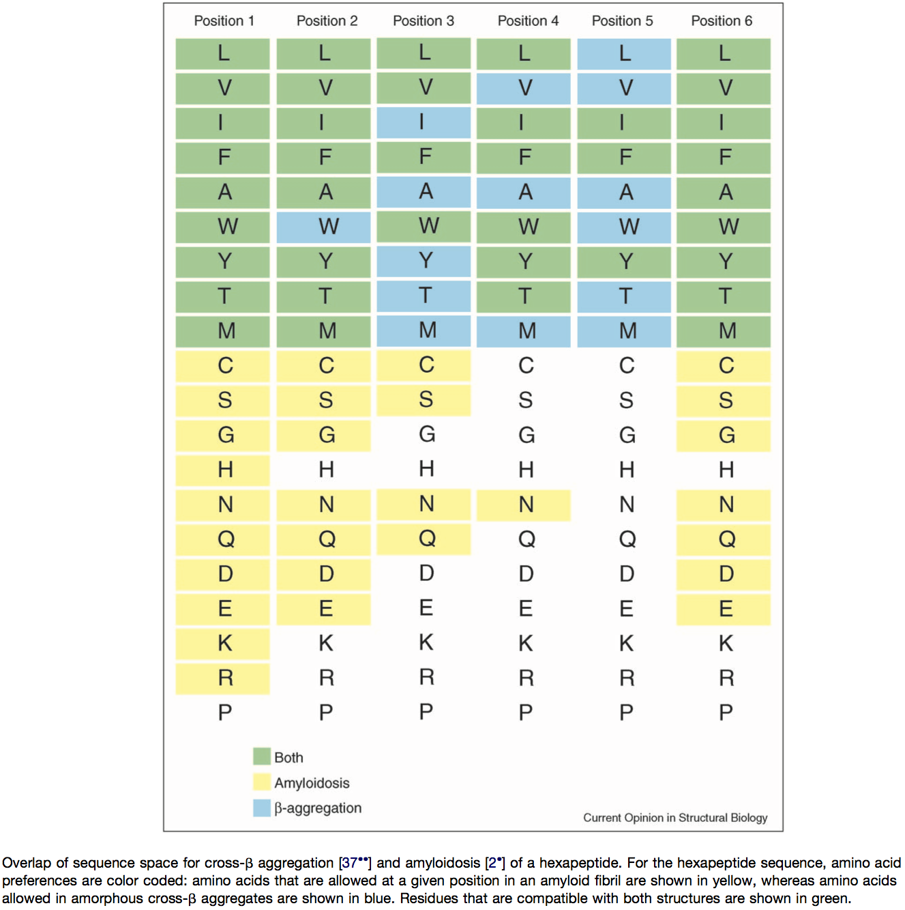

```{r setup, include=FALSE}
knitr::opts_chunk$set(echo = TRUE)

library(RSQLite)
library(seqinr)
library(tidyverse)
#library(data.table)
library(stringr)
#working_directory = "C:/Users/Rachel/OneDrive - University of Iowa/Fall 2019/Bioinformatics/Project work/Paper/Adhesin_Analysis"
```

# Prepare data
## Get proteomes from ftp
_C. auris_ proteome files were retrieved from NCBI ftp sites and stored in the `data/proteome-fasta` folder. Below we read all the files in, store them in a tibble, and calculate their sequence length.

```{r get_proteomes}
Caurisfasta.table <- NULL

# Get data. seqinr package is new and seems powerful but has odd data forms so I have to extract then remake data frames
file.list <- list.files(path = "data/proteome-fasta/", pattern = "*.faa.gz")
strain.list <- str_extract(file.list, "B[0-9]+")
file.list <- file.path("data/proteome-fasta", file.list)
names(file.list) <- strain.list


# working_directory = "./sandbox"
extract.fasta.fn <- function(file, working_directory = "sandbox"){
  #proteome_file <- paste(working_directory, "/","proteome_file.txt.gz", sep = "")
  #download.file(url = raw_url, destfile = proteome_file, quiet = TRUE)
  fasta <- read.fasta(file, seqtype = "AA", as.string = TRUE)
  t1 <- tibble(id = getName(fasta), annotation = unlist(getAnnot(fasta)), seq = unlist(getSequence(fasta, as.string = TRUE)))
  return(t1)
}

Caurisfasta.table <- map_dfr(file.list, ~extract.fasta.fn(.), .id = "strain") %>% 
  mutate(length = nchar(seq))
```

## Write a fasta file

I wrote a combined fasta file using the command fwrite(x = Caurisfasta.table[, c(1,3)], file = "Cauris.txt", sep = "\t", col.names = FALSE)

Using Notepad++ I changed /n to /n> then /t to /n to put in conventional fasta format. Saved as Caurisfasta.txt. There are 27278 proteins.

Note: I wrote a new fasta file to remove B11243 from the file. There are now 21772 proteins.

> **Update 2021-07-04 HB** skipped this step as the concatenated file can be created by `cat *.faa.gz > concatenated_cand_auris.faa.gz` if needed

## PredGPI

Following Bin's method, I used PredGPI to predict GPI anchors. For PredGPI, the maximum number of sequences is 500. To split the file I used the command split Caurisfasta.txt -l 1000 in my Ubuntu instance, which made 55 new files. The output includes name | FPrate | most likely position and the sequence for each. GPI anchor is "highly probable" when FPrate < 0.001, "probable" when 0.001 < FPrate < 0.005, "lowly probable" when 0.005 < FPrate < 0.01. Retain only header lines with the command grep -h ">" GPIPE* > PredGPIResults.txt.

This was done using the file that contained B11243. To remove duplicate results, I used the command grep ">" PredGPIResults.txt | sort -u > PredGPIResults2.txt. Then I renamed PredGPIResults2 PredGPIResults. It has 21772 proteins.

Bin's code:

```{r gpi}
seqInfo <- as.tibble(Caurisfasta.table) %>% select(name = id, strain, length)
tmp <- read_delim("output/PredGPIResults.txt", delim = "|", col_names = c("name","fp","omega"))
pred.gpi <- tmp %>% 
  mutate(name = str_sub(name,2,-2), # remove > and the trailing space
         fp = as.numeric(str_sub(fp, 9, -2)), # extract the numeric part
         is.gpi = fp <= 0.01,    # based on the cutoff of the PredGPI server (prob < 99% -> not GPI-anchored)
         omega = str_sub(omega, 8),
         cleaveRes = str_sub(omega, 1, 1),
         cleavePos = as.integer(str_sub(omega, 3))
         ) %>% 
  left_join(select(seqInfo, name, length), by = c("name" = "name"))

# remove the column if it already exists
if("pred.gpi" %in% names(seqInfo))
  seqInfo <- select(seqInfo, -pred.gpi)
seqInfo <- left_join(seqInfo, select(pred.gpi, name, pred.gpi = is.gpi), by = c("name"="name"))
```

## hmmscan for pfam domains

Using hmmscan to search the pfam database,the maximum allowed number of sequences is 500. I uploaded the same 55 files from PredGPI to hmmscan, providing my email address each time. HmmerWeb version 2.41.1. I resplit the new fasta into 44 files and reran. Copied and pasted results email into hmmer_results_emails.txt - checked to make sure that there were 44 and that each job id matched. Used the command grep ">" hmmer_results_emails.txt | sort > hmmer_results.txt. In Notepad++, copied and pasted header row from emails file.

This chunk will add a column that lists all non-overlapping domains found in each protein. In cases of overlap, the highest-scoring domain wins (using the outcompeted column in the data).

**Update 2021-07-04 HB** See [HMMSCAN help page](https://hmmer-web-docs.readthedocs.io/en/latest/result.html) for clarification on the 'out-competed" column

> In Pfam related entries are grouped into Clans, and as such can often match the same, or similar, regions on the query sequence. An additional column in the results table contains the clan accession for the family, if it belongs to a clan. Pfam employs a specific post processing on families from the same clan where the best match (determined by lowest E-value), is taken and the rest are out-competed.

```{r hmmscan}
hmm.names <- c("seq_id", "alignment_start", "alignment_end", "envelope_start", "envelope_end", "hmm_acc", "hmm_name", "hmm_start", "hmm_end", "hmm_length", "bit_score", "individual_e_value", "conditional_e_value", "database_significant", "outcompeted", "clan")
hmmscan_pfam <- read_table2(file = "output/hmmer_results.txt", col_names = hmm.names, col_types = "ciiiicciiidddiic", skip = 1)

df <- hmmscan_pfam %>% 
  filter(!outcompeted) %>% # remove lower-scored overlapping domains
  mutate(seq_id = str_sub(seq_id, 2)) %>% # remove >
  group_by(seq_id) %>% 
  # collapse into list of pfam domains for each protein
  summarise(pfam_domains = paste0(hmm_name, " (", envelope_start, "-", envelope_end,  ")", collapse = ", "))


# remove the column if it already exists
if("pfam_domains" %in% names(seqInfo))
  seqInfo <- select(seqInfo, -pfam_domains)
seqInfo <- left_join(seqInfo, df, by = c("name"="seq_id"))
```

## SignalP for signal peptides

Use SignalP 5.0 server to predict signal peptides. Maximum number of proteins is 5000, so I split the fasta file into 6 smaller files and submitted, providing my email each time. I used the old file with B11243 to run this. I resplit the new fasta into 5 files and reran. Downloaded .gff files as SignalP_(file #).gff3 and used command `grep -v -h "##" SignalP* | sort > SignalP.txt`


Modified file names, but otherwise Bin's code:

```{r signalP, fig.width=5, fig.height=5}
# Signal peptide
gff.names <- c("id", "source", "name", "start", "end", "prob", "na1", "na2", "na3")
signalp5 <- read_tsv("output/SignalP.txt", comment = "#", col_names = gff.names, col_types = "ccciidccc")

# remove the column if it already exists
if("signalp" %in% names(seqInfo))
  seqInfo <- select(seqInfo, -signalp)
seqInfo <- left_join(seqInfo, select(signalp5, name = id, prob), by = c("name" = "name")) %>% 
  mutate(signalp = !is.na(prob)) %>% select(-prob)
```

> **New problem** B11243 and B11245 are identical. Because B11245 is assembled to the chromosome level, I will retain it and remove B11243 from the results.

## TANGO

Created a .bat file to run tango on the condensed fasta. Used the command `fwrite(x = Caurisfasta.table[, c(1,3)], file = "Cauris.txt", sep = "\t", col.names = FALSE)`. Command file is tango_in.bat. Ran it and compressed all results using the command gzip *.txt.

When I went to analyze I found that multiple files contained trash (columns with value -1.IO and values that didn't match if the single line from the .bat file was rerun). Upon looking in the TANGO documentation, it says that files can't be larger than 1000 sequences. Splitting it still induced errors, so I had Bin rerun all of the TANGO calculations and upload his error-free results to the github. 

> Note: Downloading and processing all of the TANGO output files takes a VERY long time. If you don't need to regenerate the results, just import the file `tango_results_df.txt` as `tango.res.df1`. Everything after extracting the results will work off of that. 

Using Bin's tango extraction functions

```{r extract_tango_info}
library(dplyr)
extract_tango <- function(tango_output, agg_threshold = 5, required_in_serial = 5) {
    require(tidyverse)
    tmp <- read_tsv(file = tango_output, col_types = "icddddd") %>% 
        # a boolean vector for residues above threshold
        mutate(pass = Aggregation > agg_threshold)
    pass.rle <- rle(tmp$pass) # this creates a run length encoding that will be useful for identifying the sub-sequences in a run longer than certain length
    # --- Explanation ---
    # this rle object is at the core of this function
    # an example of the rle looks like
    #   lengths: int[1:10] 5 19 20 8 1 5 19 6 181 18
    #   values: logi[1:10] F T  F  T F T F  T F   T
    #   note that by definition the values will always be T/F interdigited
    # our goal is to identify the sub-sequences that is defined as a stretch of 
    # n consecutive positions with a score greater than the cutoff and record the
    # sub-sequence, its length, start and end position, 90% quantile of the score
    # --- End of explanation ---
    # 1. assigns a unique id for each run of events
    tmp$group <- rep(1:length(pass.rle$lengths), times = pass.rle$lengths)
    # # 2. extract the subsequences
    agg.seq <- tmp %>%
        dplyr::filter(pass) %>% # drop residues not predicted to have aggregation potential
        group_by(group) %>% # cluster by the runs
        summarise(seq = paste0(aa, collapse = ""),
                  start = min(res), end = max(res), length = n(),
                  median = median(Aggregation),
                  q90 = quantile(Aggregation, probs = 0.9),
                  ivt = sum(aa %in% c("I","V","T")) / length(aa),
                  .groups = "drop") %>%
        mutate(interval = start - dplyr::lag(end) - 1) %>%
        dplyr::filter(length >= required_in_serial) %>%
        select(-group)
    return(agg.seq)
}

```

Apply to _C. auris_ proteomes

```{r tango_extract, eval=FALSE, warning=FALSE}
tango.output.files <- list.files(path = "output/tango-output", pattern = ".txt|.txt.gz", full.names = TRUE)
# the read_csv() function used in the custom function can automatically decompress gzipped files
tango.res <- lapply(tango.output.files, extract_tango)
names(tango.res) <- gsub(".txt|.txt.gz", "", basename(tango.output.files))
# to add species information
# seqInfo <- read_tsv("raw-output/XP_028889033_homologs.tsv", comment = "#", col_types = c("ccci"))
tango.res.df <- bind_rows(tango.res, .id = "id")
# tango.res.df <- bind_rows(tango.res, .id = "id") %>% 
#   left_join(select(seqInfo, -length), by = c("id" = "id"))
# # save the tango output
# write_tsv(tango.res.df, "tango_summary_table.tsv.gz")
# # mutate(species = str_split(id, "_(?!.*_)", simplify = TRUE)[,2]) 
# # extract the species names
# # credit: https://stackoverflow.com/questions/20454768/how-to-split-a-string-from-right-to-left-like-pythons-rsplit
# # the split pattern is equivalent to the rsplit() function in python
```

```{r unique motifs}
# tango.res.df1 <- tango.res.df %>% left_join(seqInfo %>% select(name, strain), by = c("id" = "name"))
tango.res.df1 <- read_tsv("output/tango_results_df.txt.gz", col_types = cols())

# find unique motifs and count the number of proteins and strains represented
motif.summary <- tango.res.df1 %>% 
    group_by(seq) %>% 
    summarize(n = n(), n.prot = n_distinct(id), n.strains = n_distinct(strain),
              medScore = round(mean(median),1),
              IVT = round(mean(ivt),2),
              avg.intv = round(mean(interval, na.rm = T),1), mad.intv = round(mad(interval, na.rm = T),1),
              strain = paste0(unique(strain), collapse = ","), .groups = "drop") %>% 
    arrange(desc(n))
motif.summary
```
**_Discussion_**

- Somewhat to our surprise, even in the entire _C. auris_ proteome, the "GVVIVTT" and its variants are still the dominant TANGO motif! Are they all in the Hil family homologs?

### Identify variants of "GVVIVTT"
Since this is the dominant motif in the _C. auris_ proteome, we want to determine what percent of the TANGO sequences in the _C. auris_ proteome belong to this class?

To design the regular expression, we looked at both the TANGO sequences that "look similar" to "GVVIVTT" and also used the patterns summarized in the following reference:

    Rousseau F, Schymkowitz J, Serrano L. 2006. Protein aggregation and amyloidosis: confusion of the kinds? Current Opinion in Structural Biology 16:118–126.

{width=75%}
Below we will restrict the patterns to those with a median TANGO probability above 30.
```{r, results='asis'}
seqs <- motif.summary$seq
# core group, must be G-[VI]x4-TT
pat0 <- "G[VI]{4}TT"
# version 1, requires G-[ALVI][VI][LVI][VI]-(either end of string or at least 1 suitable residue) 
#                  OR (G not required)-[VI]x4-(two suitable residues)
pat1 <- "G[ALVI][VI][LVI][VI]([LVIFAWYTM]{1,2}|$)|[VI]{4}[LVIFAWYTM]{2}"
cat(paste("Identify the group of TANGO sequences most similar to 'GVVIVTT' using the pattern", pat0, sep = " "))
match0 <- grep(pat0, seqs)
motif.summary[match0,] %>% filter(round(medScore,0) >= 30) %>% arrange(desc(n)) %>% select(seq, n, medScore, IVT, strain)
cat(paste("Identify TANGO sequences with slightly more variation from 'GVVIVTT', using `", pat1, "`", sep = ""))
match1 <- grep(pat1, seqs)
# exclude those already identified with pattern 0
motif.summary[setdiff(match1, match0),] %>% filter(round(medScore,0) >= 30) %>% arrange(desc(n)) %>% select(seq, n, medScore, IVT, strain)
```

#### Number and spacing of TANGO hits in each protein sequence
We first summarize the motif sequences within each protein, with the goal of identifying protein-specific patterns (e.g. frequently used motifs).

```{r}
motif.per.seq <- tango.res.df1 %>% 
  # limit to sequences with median score >= 30
  dplyr::filter(median >= 30) %>% 
  group_by(id) %>% 
  # recalculate the interval
  mutate(interval = start - dplyr::lag(end) - 1) %>% 
  group_by(seq, .add = TRUE) %>% 
  summarize(strain = unique(strain),
            n = n(),
            medScore = round(mean(median),1),
            IVT = round(mean(ivt),2),
            avg.intv = round(mean(interval, na.rm = T),1),
            sd.intv = round(sd(interval, na.rm = T),1),
            # median absolute deviation is a robust measure of the scale parameter
            # https://www.rdocumentation.org/packages/stats/versions/3.6.2/topics/mad
            mad.intv = round(mad(interval, na.rm = T),1),
            .groups = "drop_last") %>% 
  arrange(desc(n), desc(medScore))
View(motif.per.seq)
```

#### Summarize tango results for table
Three metrics for the by protein tango results can be number of pat0 (GVVIVTT) sequences, pat1 (GVVIVTT-like) sequences, and total number of aggregation sequences with score > 30

```{r summarize tango}
# core group, must be G-[VI]x4-TT
pat0 <- "G[VI]{4}TT"
# version 1, requires G-[ALVI][VI][LVI][VI]-(either end of string or at least 1 suitable residue) 
#                  OR (G not required)-[VI]x4-(two suitable residues)
pat1 <- "G[ALVI][VI][LVI][VI]([LVIFAWYTM]{1,2}|$)|[VI]{4}[LVIFAWYTM]{2}"
pat2 <- "[VI][VIVM][VI][VI]T"
match0 <- grep(pat0, motif.per.seq$seq)
match1 <- grep(pat1, motif.per.seq$seq)
match2 <- grep(pat2, motif.per.seq$seq)
tango.summ <- seqInfo[,"name"] %>%
  # add pat0 results
  left_join(motif.per.seq[match0,] %>% group_by(id) %>% summarise(n.gvvivtt.seqs = sum(n)), by = c("name" = "id")) %>% 
  # add pat1 results
  left_join(motif.per.seq[setdiff(match1, match0),] %>% group_by(id) %>% summarise(n.gvvivtt.like.seqs = sum(n)), by = c("name" = "id")) %>% 
  # add pat2 results - pat2 from Fassler manual curation of TANGO positive sequences from FungalRV positive proteins in C. lusitaneae, C. auris, C. haemulonis, C. pseudohaemulonis, C. duohaemulonis, S. stipitis, S. cerevisiae, and C. glabrata into GVVIVTT-like and non GVVIVTT groups
  left_join(motif.per.seq[match2,] %>% group_by(id) %>% summarise(n.vvvvt.seqs = sum(n)), by = c("name" = "id")) %>% 
  # add motif.per.seq results
  left_join(motif.per.seq %>% group_by(id) %>% summarise(n.high.score.agg.seq = sum(n)), by = c("name" = "id"))
# join to seqInfo table
# remove the column if it already exists
if("n.gvvivtt.seqs" %in% names(seqInfo))
  seqInfo <- select(seqInfo, -n.gvvivtt.seqs, -n.gvvivtt.like.seqs, -n.vvvvt.seqs, -n.high.score.agg.seq)
seqInfo <- left_join(seqInfo, tango.summ)
seqInfo <- seqInfo %>% mutate(n.gvvivtt.seqs = replace_na(n.gvvivtt.seqs,0), n.gvvivtt.like.seqs = replace_na(n.gvvivtt.like.seqs,0), n.vvvvt.seqs = replace_na(n.vvvvt.seqs,0), n.high.score.agg.seq = replace_na(n.high.score.agg.seq,0))
```
