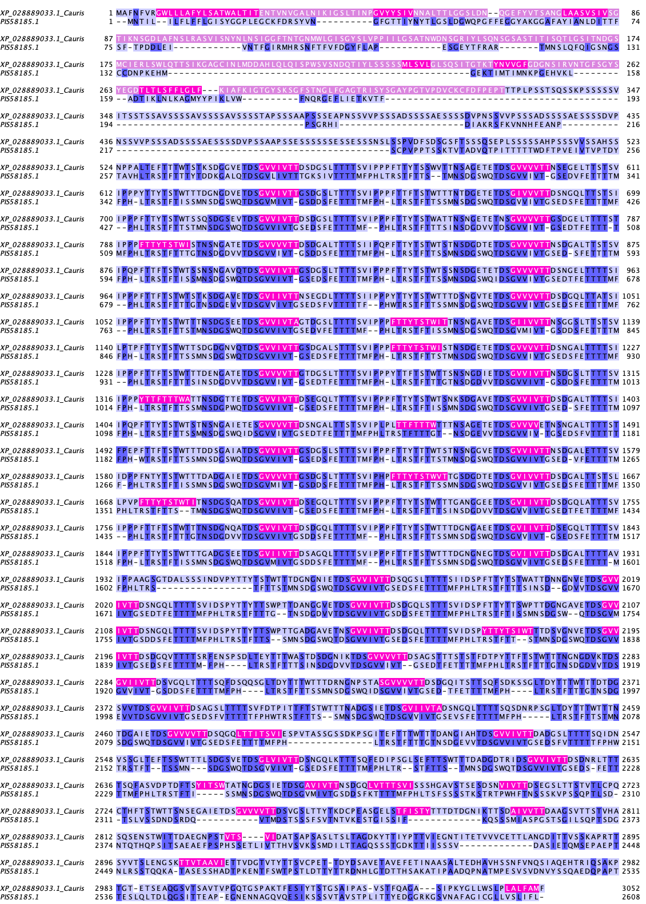

```{r setup, include=FALSE}
knitr::opts_chunk$set(echo = TRUE)

library(RSQLite)
library(seqinr)
library(tidyverse)
library(cowplot)
library(stringr)
#working_directory = "C:/Users/Rachel/OneDrive - University of Iowa/Fall 2019/Bioinformatics/Project work/Paper/Adhesin_Analysis"
```

# Prepare data

## Get proteomes from ftp

*C. auris* proteome files were retrieved from NCBI ftp sites and stored in the `data/proteome-fasta` folder. The concatenated fasta file is stored in the same folder.

```{r get_proteomes, include=FALSE, eval=FALSE}
Caurisfasta.table <- NULL

# Get data. seqinr package is new and seems powerful but has odd data forms so I have to extract then remake data frames
file.list <- list.files(path = "data/proteome-fasta/", pattern = "*.faa.gz")
strain.list <- str_extract(file.list, "B[0-9]+")
file.list <- file.path("data/proteome-fasta", file.list)
names(file.list) <- strain.list


# working_directory = "./sandbox"
extract.fasta.fn <- function(file, working_directory = "sandbox"){
  #proteome_file <- paste(working_directory, "/","proteome_file.txt.gz", sep = "")
  #download.file(url = raw_url, destfile = proteome_file, quiet = TRUE)
  fasta <- read.fasta(file, seqtype = "AA", as.string = TRUE)
  t1 <- tibble(id = getName(fasta), annotation = unlist(getAnnot(fasta)), seq = unlist(getSequence(fasta, as.string = TRUE)))
  return(t1)
}

Caurisfasta.table <- map_dfr(file.list, ~extract.fasta.fn(.), .id = "strain") %>% 
  mutate(length = nchar(seq))
write_tsv(select(Caurisfasta.table, strain, name = id, length), file = "data/Cauris-four-proteomes-seqLen.tsv")
```

## Write a fasta file

I wrote a combined fasta file using the command fwrite(x = Caurisfasta.table[, c(1,3)], file = "Cauris.txt", sep = "\t", col.names = FALSE)

Using Notepad++ I changed /n to /n\> then /t to /n to put in conventional fasta format. Saved as Caurisfasta.txt. There are 27278 proteins.

Note: I wrote a new fasta file to remove B11243 from the file. There are now 21772 proteins.

> **Update 2021-07-04 HB** skipped this step as the concatenated file can be created by `cat *.faa.gz > concatenated_cand_auris.faa.gz` if needed

```{r initiate_seqInfo}
# we want to include the information about whether a protein is in our homologs list
# for that we will important the list of protein ids that were analyzed
Hil <- read_tsv("data/Hil-family-Cauris-homologs-id.txt", col_names = c("name", "strain"), col_types = "cc")

# initiate the seqInfo table
seqInfo <- read_tsv("data/Cauris-four-proteomes-seqLen.tsv", col_types = cols()) %>% 
  mutate(isHIL = name %in% Hil$name)

# number of Hil homologs by strain
seqInfo %>% 
  group_by(strain) %>% 
  summarize(Hil = sum(isHIL))
```

A total of `r sum(seqInfo$isHIL)` proteins in the four strains belong to the Hil family. B11221 misses Hil4 and B11245 misses Hil8. In both cases the reason is because of incomplete genome assembly rather than gene loss. B11220, the representative of clade II, indeed misses 5/8 homologs.

## SignalP for signal peptides

Use SignalP 5.0 server to predict signal peptides. Maximum number of proteins is 5000, so I split the fasta file into 6 smaller files and submitted, providing my email each time. I used the old file with B11243 to run this. I resplit the new fasta into 5 files and reran. Downloaded .gff files as SignalP\_(file \#).gff3 and used command `grep -v -h "##" SignalP* | sort > SignalP.txt`

Modified file names, but otherwise Bin's code:

```{r signalP, fig.width=5, fig.height=5}
# Signal peptide
gff.names <- c("id", "source", "name", "start", "end", "prob", "na1", "na2", "na3")
signalp5 <- read_tsv("output/SignalP.txt", comment = "#", col_names = gff.names, col_types = "ccciidccc")

# remove the column if it already exists
if("signalp" %in% names(seqInfo))
  seqInfo <- select(seqInfo, -signalp)
seqInfo <- left_join(seqInfo, select(signalp5, name = id, prob), by = c("name" = "name")) %>% 
  mutate(signalp = !is.na(prob)) %>% select(-prob)
```

> **New problem** B11243 and B11245 are identical. Because B11245 is assembled to the chromosome level, I will retain it and remove B11243 from the results.

## PredGPI

Following Bin's method, I used PredGPI to predict GPI anchors. For PredGPI, the maximum number of sequences is 500. To split the file I used the command split Caurisfasta.txt -l 1000 in my Ubuntu instance, which made 55 new files. The output includes name \| FPrate \| most likely position and the sequence for each. GPI anchor is "highly probable" when FPrate \< 0.001, "probable" when 0.001 \< FPrate \< 0.005, "lowly probable" when 0.005 \< FPrate \< 0.01. Retain only header lines with the command grep -h "\>" GPIPE\* \> PredGPIResults.txt.

This was done using the file that contained B11243. To remove duplicate results, I used the command grep "\>" PredGPIResults.txt \| sort -u \> PredGPIResults2.txt. Then I renamed PredGPIResults2 PredGPIResults. It has 21772 proteins.

Bin's code:

```{r gpi}
tmp <- read_delim("output/PredGPIResults.txt", delim = "|", col_names = c("name","fp","omega"), col_types = cols())
pred.gpi <- tmp %>% 
  mutate(name = str_sub(name,2,-2), # remove > and the trailing space
         fp = as.numeric(str_sub(fp, 9, -2)), # extract the numeric part
         is.gpi = fp <= 0.01,    # based on the cutoff of the PredGPI server (prob < 99% -> not GPI-anchored)
         omega = str_sub(omega, 8),
         cleaveRes = str_sub(omega, 1, 1),
         cleavePos = as.integer(str_sub(omega, 3))
         ) %>% 
  left_join(select(seqInfo, name, length), by = c("name" = "name"))

# remove the column if it already exists
if("pred.gpi" %in% names(seqInfo))
  seqInfo <- select(seqInfo, -pred.gpi)
seqInfo <- left_join(seqInfo, select(pred.gpi, name, pred.gpi = is.gpi), by = c("name"="name"))
```

## hmmscan for pfam domains

Using hmmscan to search the pfam database,the maximum allowed number of sequences is 500. I uploaded the same 55 files from PredGPI to hmmscan, providing my email address each time. HmmerWeb version 2.41.1. I resplit the new fasta into 44 files and reran. Copied and pasted results email into hmmer_results_emails.txt - checked to make sure that there were 44 and that each job id matched. Used the command grep "\>" hmmer_results_emails.txt \| sort \> hmmer_results.txt. In Notepad++, copied and pasted header row from emails file.

This chunk will add a column that lists all non-overlapping domains found in each protein. In cases of overlap, the highest-scoring domain wins (using the outcompeted column in the data).

**Update 2021-07-04 HB** See [HMMSCAN help page](https://hmmer-web-docs.readthedocs.io/en/latest/result.html) for clarification on the 'out-competed" column

> In Pfam related entries are grouped into Clans, and as such can often match the same, or similar, regions on the query sequence. An additional column in the results table contains the clan accession for the family, if it belongs to a clan. Pfam employs a specific post processing on families from the same clan where the best match (determined by lowest E-value), is taken and the rest are out-competed.

```{r hmmscan}
hmm.names <- c("seq_id", "alignment_start", "alignment_end", "envelope_start", "envelope_end", "hmm_acc", "hmm_name", "hmm_start", "hmm_end", "hmm_length", "bit_score", "individual_e_value", "conditional_e_value", "database_significant", "outcompeted", "clan")
hmmscan_pfam <- read_table2(file = "output/hmmer_results.txt", col_names = hmm.names, col_types = "ciiiicciiidddiic", skip = 1)

df <- hmmscan_pfam %>% 
  filter(!outcompeted,  # remove lower-scored overlapping domains
         !hmm_name %in% c("Hyr1", "Candida_ALS")) %>% # remove two repeat domains
  mutate(seq_id = str_sub(seq_id, 2)) %>% # remove >
  group_by(seq_id) %>% 
  # collapse into list of pfam domains for each protein
  summarise(pfam_domains = paste0(hmm_name, " (", envelope_start, "-", envelope_end,  ")", collapse = ", "))

# remove the column if it already exists
if("pfam_domains" %in% names(seqInfo))
  seqInfo <- select(seqInfo, -pfam_domains)
seqInfo <- left_join(seqInfo, df, by = c("name"="seq_id"))
```

## TANGO

Created a .bat file to run tango on the condensed fasta. Used the command `fwrite(x = Caurisfasta.table[, c(1,3)], file = "Cauris.txt", sep = "\t", col.names = FALSE)`. Command file is tango_in.bat. Ran it and compressed all results using the command gzip \*.txt.

When I went to analyze I found that multiple files contained trash (columns with value -1.IO and values that didn't match if the single line from the .bat file was rerun). Upon looking in the TANGO documentation, it says that files can't be larger than 1000 sequences. Splitting it still induced errors, so I had Bin rerun all of the TANGO calculations and upload his error-free results to the github.

> Note: Downloading and processing all of the TANGO output files takes a VERY long time. If you don't need to regenerate the results, just import the file `tango_results_df.txt` as `tango.res.df1`. Everything after extracting the results will work off of that.

Using Bin's tango extraction functions

```{r extract_tango_info, eval=FALSE}
require(dplyr)
extract_tango <- function(tango_output, agg_threshold = 5, required_in_serial = 5) {
    require(tidyverse)
    tmp <- read_tsv(file = tango_output, col_types = "icddddd") %>% 
        # a boolean vector for residues above threshold
        mutate(pass = Aggregation > agg_threshold)
    pass.rle <- rle(tmp$pass) # this creates a run length encoding that will be useful for identifying the sub-sequences in a run longer than certain length
    # --- Explanation ---
    # this rle object is at the core of this function
    # an example of the rle looks like
    #   lengths: int[1:10] 5 19 20 8 1 5 19 6 181 18
    #   values: logi[1:10] F T  F  T F T F  T F   T
    #   note that by definition the values will always be T/F interdigited
    # our goal is to identify the sub-sequences that is defined as a stretch of 
    # n consecutive positions with a score greater than the cutoff and record the
    # sub-sequence, its length, start and end position, 90% quantile of the score
    # --- End of explanation ---
    # 1. assigns a unique id for each run of events
    tmp$group <- rep(1:length(pass.rle$lengths), times = pass.rle$lengths)
    # # 2. extract the subsequences
    agg.seq <- tmp %>%
        dplyr::filter(pass) %>% # drop residues not predicted to have aggregation potential
        group_by(group) %>% # cluster by the runs
        summarise(seq = paste0(aa, collapse = ""),
                  start = min(res), end = max(res), length = n(),
                  median = median(Aggregation),
                  q90 = quantile(Aggregation, probs = 0.9),
                  ivt = sum(aa %in% c("I","V","T")) / length(aa),
                  .groups = "drop") %>%
        mutate(interval = start - dplyr::lag(end) - 1) %>%
        dplyr::filter(length >= required_in_serial) %>%
        select(-group)
    return(agg.seq)
}

```

Apply to *C. auris* proteomes

```{r tango_extract, eval=FALSE, warning=FALSE}
tango.output.files <- list.files(path = "output/tango-output", pattern = ".txt|.txt.gz", full.names = TRUE)
# the read_csv() function used in the custom function can automatically decompress gzipped files
tango.res <- lapply(tango.output.files, extract_tango)
names(tango.res) <- gsub(".txt|.txt.gz", "", basename(tango.output.files))
# to add species information
# seqInfo <- read_tsv("raw-output/XP_028889033_homologs.tsv", comment = "#", col_types = c("ccci"))
tango.res.df <- bind_rows(tango.res, .id = "id")
# tango.res.df <- bind_rows(tango.res, .id = "id") %>% 
#   left_join(select(seqInfo, -length), by = c("id" = "id"))
# # save the tango output
# write_tsv(tango.res.df, "tango_summary_table.tsv.gz")
# # mutate(species = str_split(id, "_(?!.*_)", simplify = TRUE)[,2]) 
# # extract the species names
# # credit: https://stackoverflow.com/questions/20454768/how-to-split-a-string-from-right-to-left-like-pythons-rsplit
# # the split pattern is equivalent to the rsplit() function in python
```

Top 20 TANGO hits ranked by number of occurrences in all proteins, restricted to the strong hits with a median score \>= 30%.

```{r unique_motifs}
# tango.res.df1 <- tango.res.df %>% left_join(seqInfo %>% select(name, strain), by = c("id" = "name"))
tango.res.df1 <- read_tsv("output/tango_results_df.txt.gz", col_types = cols())

# find unique motifs and count the number of proteins and strains represented
motif.summary <- tango.res.df1 %>% 
  left_join(select(seqInfo, id = name, isHIL)) %>% 
  group_by(seq) %>% 
  summarize(n = n(), n.HIL = sum(isHIL),
            n.prot = n_distinct(id), 
            n.strains = n_distinct(strain),
            medScore = round(mean(median),1),
            IVT = round(mean(ivt),2),
            avg.intv = round(mean(interval, na.rm = T),1), 
            mad.intv = round(mad(interval, na.rm = T),1),
            .groups = "drop") %>% 
  arrange(desc(n))
motif.summary %>% 
  filter(round(medScore,0) >= 30) %>% 
  head(20)
```

***Discussion***

-   Somewhat to our surprise, even in the entire *C. auris* proteome, the "GVVIVTT" and its variants are still the dominant TANGO motif! Are they all in the Hil family homologs?

### Identify variants of "GVVIVTT"

Since this is the dominant motif in the *C. auris* proteome, we want to determine what percent of the TANGO sequences in the *C. auris* proteome belong to this class?

To design the regular expression, we looked at both the TANGO sequences that "look similar" to "GVVIVTT". In particular, Jan manually went through the TANGO hits in *C. lusitaneae, C. auris, C. haemulonis, C. pseudohaemulonis, C. duohaemulonis, S. stipitis, S. cerevisiae*, and *C. glabrata* and summarized the following pattern: `[VI][VIVM[VI][VI]T`

Below we will restrict the patterns to those with a median TANGO probability above 30.

```{r, results='asis'}
seqs <- motif.summary$seq
# core group, must be G-[VI]x4-TT
pat0 <- "G[VI]{4}TT"
# version 1, requires G-[ALVI][VI][LVI][VI]-(either end of string or at least 1 suitable residue) 
#                  OR (G not required)-[VI]x4-(two suitable residues)
# pat1 <- "G[ALVI][VI][LVI][VI]([LVIFAWYTM]{1,2}|$)|[VI]{4}[LVIFAWYTM]{2}"
# version 2, based on Jan's manual inspection of TANGO hits in the following species:
# C. lusitaneae, C. auris, C. haemulonis, C. pseudohaemulonis, C. duohaemulonis, S. stipitis, S. cerevisiae, and C. glabrata
pat.jan <- "[VI][VIVM[VI][VI]T"
cat(paste("Identify the group of TANGO sequences most similar to 'GVVIVTT' using the pattern", pat0, sep = " "))
match0 <- grep(pat0, seqs)
motif.summary[match0,] %>% filter(round(medScore,0) >= 30) %>% arrange(desc(n)) %>% select(seq, n, n.HIL, medScore, IVT)
cat(paste("Identify TANGO sequences with slightly more variation from 'GVVIVTT', using `", pat.jan, "`", sep = ""))
match.jan <- grep(pat.jan, seqs)
# exclude those already identified with pattern 0
motif.summary[setdiff(match.jan, match0),] %>% filter(round(medScore,0) >= 30) %>% arrange(desc(n)) %>% select(seq, n, n.HIL, medScore, IVT)

# export the list of motifs for manual inspection
motif.summary[union(match.jan, match0),] %>% 
  filter(round(medScore,0) >= 30) %>% 
  arrange(desc(n)) %>% 
  write_csv("output/TANGO-GVVIVTT-like-sequences.csv")
```

***Discussion***

-   We can see that the vast majority of GVVIVTT-like sequences are within the Hil family proteins

-   Which non-Hil proteins have GVVIVTT sequences?

    `r motif.per.seq %>% filter(grepl(pat0,seqs), !isHIL)`

    Note that XP_028891378.1 is a partial protein entry that I have determined to be the C-termianl fragment of Hil4 in B11221. So really only QEL63124.1 contains GVVIVTT outside of the Hil family.

-   In the second table that lists GVVIVTT-like sequences that are captured by Jan's more inclusive regex and not my strict one, there is a notable outlier, namely GVVIVT, which is both so close to GVVIVTT and yet **only** present in a group of nonHil sequences, including PIS58185 in B8441 and others.

    `r tango.res.df1 %>% filter(seq == "GVVIVT") %>% select(id, strain) %>% left_join(seqInfo, by = c("id" = "name", "strain")) %>% unique()`

    I analyzed this group of sequences further -- see `README.md` in this folder.

-   This protein is very interesting: it no longer has the PF11765 domain but otherwise shows a high degree of sequence similarity with the latter.

    

#### Number and spacing of TANGO hits in each protein sequence

We first summarize the motif sequences within each protein and then use that to determine the distribution of TANGO hit \# and spacing in the entire proteome, with or without the Hil family.

```{r}
# first count the number of tango hits with median score >= 30 hits for each protein
# motif.per.seq <- tango.res.df1 %>% 
#   group_by(id) %>% 
#   summarize(n.all = sum(round(median, 0) >= 30))

# next we will filter the tango dataset in order to recalculate the intervals
# this will result in 14 sequences to be dropped since they have 0 hits meeting
# the criteria. we will add them back by right_join() with the tibble above
motif.per.seq <- tango.res.df1 %>% 
  # limit to sequences with median score >= 30
  filter(round(median,0) >= 30) %>% 
  group_by(id) %>% 
  # recalculate the interval since we are now limiting the hits to >= 30
  mutate(interval = start - lag(end) - 1) %>% 
  # summarize the results at a sequence level
  summarize(n.all = n(),
            n.type = length(unique(seq)),
            medScore = round(mean(median),1),
            IVT = round(mean(ivt),2),
            avg.intv = round(mean(interval, na.rm = T),1), 
            IQR.intv = round(IQR(interval, na.rm = T)/1.349 ,1),
            # median absolute deviation is a robust measure of the scale parameter
            # https://www.rdocumentation.org/packages/stats/versions/3.6.2/topics/mad
            mad.intv = round(mad(interval, na.rm = T),1),
            seqs = paste(unique(seq), collapse = ","),
            .groups = "drop") %>% 
  right_join(select(seqInfo, strain, id = name, length, isHIL), by = "id") %>% 
  mutate(n.all = ifelse(is.na(n.all), 0, n.all), n.type = ifelse(is.na(n.type), 0, n.type)) %>% 
  arrange(desc(n.all), desc(mad.intv))
#motif.per.seq
```

Distribution of the number of TANGO hits per kilo amino acids protein across the proteome.

```{r}
ggplot(motif.per.seq, aes(x = strain, y = n.all/length*1000)) + 
  geom_boxplot(fill = "gray70", alpha = 0.7, outlier.alpha = 0.2) + ylab("# of TANGO hits per 1000 amino acids") + 
  geom_point(data = filter(motif.per.seq, isHIL), aes(color = length), position = position_jitter(0.05), size = 1.5) +
  scale_color_viridis_c() +
  theme_cowplot()
```

We can see that the 8 Hil orthologs fall into two groups. Hil1-4, which are longer than 1000 amino acids, have relatively high number of TANGO hits relative to their length. In fact, they are all above 89% percentile of the data.

Compare the distribution of TANGO hits \# and score in the Hil family vs the proteome

```{r fig.width=5, fig.height=4.5}
ggplot(motif.per.seq, aes(x = length, y = n.all/length*1000)) + 
  geom_bin_2d(binwidth = c(200, 2)) + scale_fill_viridis_c() + 
  geom_point(data = filter(motif.per.seq, isHIL), color = "red") +
  xlab("Protein length") + ylab("# of TANGO hits per 1000 amino acids") + 
  facet_wrap(~strain, nrow = 2) + theme_grey(base_size = 14)
```

***Discussion***

-   this is another way of plotting the same data, again showing that Hil1-4 are exceptional in the proteome in that they harbor a very high amount of TANGO hits per 1000 amino acid residues relative to proteins of similar length to them.

Next we add the TANGO information to the seqInfo dataset.

```{r}
if("n.tango" %in% names(seqInfo)){
  seqInfo <- seqInfo %>% 
    select(-n.tango, -reg.spaced)
}
seqInfo <- seqInfo %>% 
  left_join(select(motif.per.seq, name = id, n.tango = n.all, mad.intv), by = "name") %>% 
  mutate(mad.intv = ifelse(n.tango > 2, mad.intv, NA),
         reg.spaced = ifelse(n.tango > 3 & mad.intv < 5, TRUE, FALSE)) %>% 
  select(-mad.intv)
```

#### Summarize tango results for table

Three metrics for the by protein tango results can be number of pat0 (GVVIVTT) sequences, pat1 (GVVIVTT-like) sequences, and total number of aggregation sequences with score \> 30

**Update 2021-07-15 [HB]** The code below is no longer included because the above analysese have shown that GVVIVTT and its variants are highly specific to the Hil family, which appears to be an outlier in terms of TANGO hits per protein in the entire proteome. In predicting additional adhesins, we will only look at the total number of TANGO hits.

```{r eval=FALSE, include=FALSE}
# core group, must be G-[VI]x4-TT
pat0 <- "G[VI]{4}TT"
# version 1, requires G-[ALVI][VI][LVI][VI]-(either end of string or at least 1 suitable residue) 
#                  OR (G not required)-[VI]x4-(two suitable residues)
pat1 <- "G[ALVI][VI][LVI][VI]([LVIFAWYTM]{1,2}|$)|[VI]{4}[LVIFAWYTM]{2}"
pat2 <- "[VI][VIVM][VI][VI]T"
match0 <- grep(pat0, motif.per.seq$seq)
match1 <- grep(pat1, motif.per.seq$seq)
match2 <- grep(pat2, motif.per.seq$seq)
tango.summ <- seqInfo[,"name"] %>%
  # add pat0 results
  left_join(motif.per.seq[match0,] %>% group_by(id) %>% summarise(n.gvvivtt.seqs = sum(n)), by = c("name" = "id")) %>% 
  # add pat1 results
  left_join(motif.per.seq[setdiff(match1, match0),] %>% group_by(id) %>% summarise(n.gvvivtt.like.seqs = sum(n)), by = c("name" = "id")) %>% 
  # add pat2 results - pat2 from Fassler manual curation of TANGO positive sequences from FungalRV positive proteins in C. lusitaneae, C. auris, C. haemulonis, C. pseudohaemulonis, C. duohaemulonis, S. stipitis, S. cerevisiae, and C. glabrata into GVVIVTT-like and non GVVIVTT groups
  left_join(motif.per.seq[match2,] %>% group_by(id) %>% summarise(n.vvvvt.seqs = sum(n)), by = c("name" = "id")) %>% 
  # add motif.per.seq results
  left_join(motif.per.seq %>% group_by(id) %>% summarise(n.high.score.agg.seq = sum(n)), by = c("name" = "id"))
# join to seqInfo table
# remove the column if it already exists
if("n.gvvivtt.seqs" %in% names(seqInfo))
  seqInfo <- select(seqInfo, -n.gvvivtt.seqs, -n.gvvivtt.like.seqs, -n.vvvvt.seqs, -n.high.score.agg.seq)
seqInfo <- left_join(seqInfo, tango.summ)
seqInfo <- seqInfo %>% mutate(n.gvvivtt.seqs = replace_na(n.gvvivtt.seqs,0), n.gvvivtt.like.seqs = replace_na(n.gvvivtt.like.seqs,0), n.vvvvt.seqs = replace_na(n.vvvvt.seqs,0), n.high.score.agg.seq = replace_na(n.high.score.agg.seq,0))
```

## S/T frequency

Using Bin's method, I'm running EMBOSS freak for S/T, S, T with a stepping value of 10 and an averaging window of 100. The results were saved as freak_aminoacid(s)\_100_10.txt. Using Bin's format_freaq_output.py script, each was converted to a readable .out file and all files were compressed for storage.

**Update 2021-07-16 [HB]** we will use two types of statistics to summarize the serine/threonine frequencies here. 1) frequency of the residues over the entire protein; 2) maximum frequency of serine or threnonine in a 100 amino acid sliding window (which will ignore any proteins \< 100 residues). in the second measure, we reason that a 100 amino acid window is a reasonable size to capture a genuine "hike" in Serine or Threonine frequency. For one thing, it is large enough to avoid capturing just a small cluster of S/T, and for another thing the Serine rich cluster we observe in Hil1 is \~200 amino acids long and with a consistently elevated Serine content, suggesting that a 100 amino acid window is not too large to lead to diluted signals by flanking residues.

```{r S_T_freq}
# load data
ST.protein <- read_tsv("output/ST-freq/Cauris-ST-freq-per-protein.txt.gz", col_types = cols())
ST.freq <- read_tsv("output/ST-freq/freak_st_100_10_freak.out.gz", col_types = "cid")
S.freq <- read_tsv("output/ST-freq/freak_s_100_10_freak.out.gz", col_types = "cid")
T.freq <- read_tsv("output/ST-freq/freak_t_100_10_freak.out.gz", col_types = "cid")
ST.window <- bind_rows("ST" = ST.freq, "S" = S.freq, "T" = T.freq, .id = "residue") %>% 
  group_by(id, residue) %>% 
  summarize(max = max(freq))
rm(list = c("ST.freq", "S.freq", "T.freq"))
```

```{r fig.cap="Ser/Thr"}
ST.window %>% 
  left_join(select(seqInfo, id = name, isHIL), by = "id") %>% 
  mutate(residue = factor(residue, levels = c("ST", "S", "T"), labels = c("Ser/Thr", "Ser", "Thr")),
         `Hil family` = ifelse(isHIL, "Yes", "No")) %>% 
  ggplot(aes(x = max)) + geom_histogram(binwidth = 0.02) + 
  xlab("Max frequency of Ser/Thr in 100 amino acid window") + scale_y_continuous(position = "right") +
  facet_grid(`Hil family` ~ residue, scales = "free_y", labeller = "label_both", switch = "y") +
  theme_cowplot() + panel_border()
```

***Discussion***

From the above we can see that the not all Hil family proteins have well-above-average Serine or Threonine content alone. But when both residues are counted together, they consistently rank above the majority of the proteome.

```{r}
ST.protein %>% 
  left_join(select(seqInfo, ID = name, isHIL), by = "ID") %>% 
  mutate(`Ser/Thr` = (Ser+Thr)/length, Ser = Ser/length, Thr = Thr/length) %>% 
  pivot_longer(cols = c(`Ser/Thr`, Ser, Thr), names_to = "residue", values_to = "value") %>% 
  mutate(residue = factor(residue, levels = c("Ser/Thr", "Ser", "Thr")),
         `Hil family` = ifelse(isHIL, "Yes", "No")) %>% 
  ggplot(aes(x = value)) + geom_histogram(binwidth = 0.02) + 
  xlab("Frequency of Ser/Thr in the whole protein") + scale_y_continuous(position = "right") +
  facet_grid(`Hil family` ~ residue, scales = "free_y", labeller = "label_both", switch = "y") +
  theme_cowplot() + panel_border()
```

***Discussion***

Similar as above, we see that the combined Ser/Thr frequency appear to better distinguish the Hil family from the rest of the proteins. For this reason let's add the max S/T frequency in 100 amino acid windows and the overall S/T frequency per protein to `seqInfo`

```{r}
#remove columns if present
if("ST.protein" %in% names(seqInfo))
  seqInfo <- select(seqInfo, -ST.prot -ST.window.max)

#join maximums back into seqInfo
tmp <- ST.protein %>% 
  mutate(ST.prot = (Ser+Thr)/length) %>% 
  select(name = ID, ST.prot) %>% 
  left_join(ST.window %>% filter(residue == "ST") %>% select(name = id, ST.window.max = max), by = "name") %>% 
  # for proteins shorter than 100 a.a., the sliding window estimate would be NA. replace it with whole protein estimate in ST.protein
  mutate(ST.window.max = round(coalesce(ST.window.max, ST.prot),3))

seqInfo <- seqInfo %>% left_join(tmp, by = "name")
# rm(list = c("ST.protein", "ST.window"))
```

# Prediction

Here we try to use the sequence properties collected above to identify additional proteins outside of the Hil family that may function as adhesins. The idea here is to apply filters in a step-wise manner and watch if all Hil proteins are still retained and how many non-Hil proteins remain in the dataset.

## Cell wall proteins

How many proteins are likely to be GPI-anchored cell wall proteins?

```{r}
# Load function
# reference: http://rstudio-pubs-static.s3.amazonaws.com/6975_c4943349b6174f448104a5513fed59a9.html
source("http://pcwww.liv.ac.uk/~william/R/crosstab.r")

crosstab(seqInfo, row.vars = "signalp", col.vars = "pred.gpi", type = c("f", "t"), dec.places = 1, addmargins = FALSE)
# summarize the number of proteins passing the SignalP and Pred.GPI filters
# cwp <- with(seqInfo, table(signalp, pred.gpi, dnn = c("SignalP", "Pred-GPI")))
# cat("Count")
# print(cwp)
# cat("Percentage")
# print(round(cwp / sum(cwp), 3))
```

We see that only a very small fraction (1.5%) of the proteome pass both the SignalP and PredGPI tests. By comparison, all eight *C. auris* Hil proteins pass both tests, and the vast majority of Hil homologs pass both tests as well. So far this is the most stringent (aka effective) filter to reduce the number of candidate proteins.

```{r}
filter1 <- seqInfo %>% 
  mutate(`Hil_family` = ifelse(isHIL, "Yes", "No"), 
         `cell_wall` = ifelse(signalp & pred.gpi, "Yes", "No")) %>% 
  select(-signalp, -pred.gpi, -isHIL)

crosstab(filter1, row.vars = "cell_wall", col.vars = "Hil_family", addmargins = FALSE)
```

The two proteins that dropped out `r filter1 %>% filter(cell_wall == "No", Hil_family == "Yes")` are both in the clade IV strain B11245 and appear to be missing the C-terminal sequence, hence failed the PredGPI test.

## Protein length

```{r}
p <- ggplot(data = seqInfo) + 
  geom_histogram(mapping = aes(x=length), binwidth = 50)+
  geom_vline(aes(xintercept = 500), color="blue", size=1) +
  annotate("text", x = 3000, y = 1500, label = paste0("# of proteins >= 500 residues: ", sum(seqInfo$length >= 500)), size = 5) +
  xlab("Protein length (amino acids)") + ylab("# of proteins") + theme_cowplot()
print(p)
```

We classify the CWP hits into two groups based on their length. Those with more than 500 a.a. are labeled as "CWP long" and those smaller than 500 a.a. as "CWP short"

```{r}
filter2 <- filter1 %>% 
  mutate(Len = ifelse(length >= 500, ">=500", "<500"),
         group = ifelse(Hil_family == "Yes",              # group 1: Hil family
                        "Hil", ifelse(cell_wall == "Yes", # group 2&3: cell wall long / short
                                      ifelse(length >=500, "CWP long", "CWP short"), 
                                      "Others")),         # group 4: Others
         group = factor(group, levels = c("Hil", "CWP long", "CWP short", "Others")))

crosstab(filter2, row.vars = c("cell_wall", "Len"), col.vars = "Hil_family", type = c("f", "c"), dec.places = 0, addmargins = FALSE)
```

## Ser/Thr frequency

```{r}
seqInfo %>% 
  pivot_longer(cols = starts_with("ST."), names_to = "type", names_prefix = "ST.", values_to = "value") %>% 
  mutate(type = factor(type, levels = c("prot", "window.max"), labels = c("whole protein", "max in 100 a.a. windows"))) %>% 
  ggplot(aes(x = value, color = isHIL)) + stat_ecdf() + facet_wrap(~type) + 
  scale_x_continuous(limits = c(0,0.8)) + scale_color_manual("Hil family", values = c("black", "gold3")) +
  xlab("Ser+Thr frequency") + ylab("Cumulative probability") + 
  theme_cowplot() + background_grid()
```

```{r}
filter2 %>% 
  pivot_longer(cols = starts_with("ST."), names_to = "type", names_prefix = "ST.", values_to = "value") %>% 
  mutate(type = factor(type, levels = c("prot", "window.max"), labels = c("whole protein", "max in 100 a.a. window"))) %>% 
  ggplot(aes(x = type, y = value, fill = group)) + geom_boxplot(outlier.size = 0.5, outlier.shape = 1) +
  scale_fill_viridis_d() + xlab("") + ylab("Ser/Thr frequency") + theme_grey(base_size = 14)
```

```{r}
ST.th <- c("ST.protein" = 0.18, "ST.window" = 0.28)
ST.th
```

Seems like the two measures behave very similarly. Let's see how they compare by applying the above cutoffs.

```{r}
filter2 %>% 
  mutate(`S/T protein` = ST.prot > ST.th["ST.protein"],
         `S/T max window` = ST.window.max > ST.th["ST.window"]) %>% 
  crosstab(row.vars = c("S/T protein", "S/T max window"), col.vars = "group", addmargins = FALSE)
```

Based on the above, we will apply a third filter of S/T frequency in the whole protein \> 18%, which is slightly more inclusive (liberal) than the `ST.window > 0.28` filter.

```{r}
# ref: https://stackoverflow.com/questions/34096162/dplyr-mutate-replace-several-columns-on-a-subset-of-rows
mutate_cond <- function(.data, condition, ..., envir = parent.frame()) {
  condition <- eval(substitute(condition), .data, envir)
  .data[condition, ] <- .data[condition, ] %>% mutate(...)
  .data
}

filter3 <- filter2 %>%
  mutate(`S/T protein` = ST.prot > 0.18, ST.window.max = NULL) %>% 
  mutate_cond(str_sub(group,1,3) == "CWP" & !`S/T protein`, group = "Others") %>% 
  select(-Len, -`S/T protein`)
```

## TANGO hits

```{r}
filter3 %>% 
  ggplot(aes(x = n.tango, fill = group)) + geom_histogram(binwidth = 1) +
  facet_wrap(~group, nrow = 4, scales = "free_y") +
  scale_fill_viridis_d() +
  xlab("# of strong TANGO hits") + theme_cowplot() + panel_border()
```

As we already showed before, the number and spacing of strong TANGO hits is a divisive feature that separate the Hil family proteins in *C. auris* into two groups -- those that are longer than 1000 a.a. have a lot of them and have them regularly spaced, while the four shorter members have few. We see a similar picture when we look at the candidate adhesin proteins in our analysis up to this point: the cell-wall protein long group showed above average number of TANGO hits while the short ones have very few. I predict if we quantified the amount of tandem repeats, we would see a correlation between length, tandem repeat content and \# of strong TANGO hits.

## Cluster by similarity

Now that we settled on the "CWP long" and "CWP short" lists, we would like to look at the domain architecture and tandem repeat content of them more closely. Since we started with four proteomes, with the goal of capturing a "species-wide" set of candidates, we have presumably four alleles of each protein (may be fewer) in the list. To make it easier to examine the domain features, let's cluster the proteins and assemble a representative list.

1.  Export the protein IDs

```{r}
cat(filter3 %>% filter(str_sub(group, 1, 3) == "CWP") %>% pull(name), file = "data/20210718-cwp-proteins-id.txt", sep = "\n")
```

2.  Extract the fasta, run the following code at the command line

```{bash}
/Users/bhe2/sw/miniconda3/bin/python script/extract_fasta_gz.py data/proteome-fasta/Caurisfasta.faa.gz data/20210718-cwp-proteins-id.txt data/20210718-cwp-proteins.faa
```

3.  Submit the fasta to [CD-hit](https://github.com/weizhongli/cdhit) [webserver](http://weizhong-lab.ucsd.edu/cdhit-web-server/cgi-bin/).

4.  Reformat the CD-hit output

``` {.bash}
/Users/bhe2/sw/miniconda3/bin/python script/format_cd-hit_output.py output/cd-hit/20210718-CD-hit-0.85/1626635903.fas.1.clstr.sorted output/cd-hit/formatted-cd-hit-0.85.tsv
/Users/bhe2/sw/miniconda3/bin/python script/format_cd-hit_output.py output/cd-hit/20210718-CD-hit-0.6/1626636351.fas.1.clstr.sorted output/cd-hit/formatted-cd-hit-0.6.tsv
```

```{r}
cdhit.lo <- read_tsv("output/cd-hit/formatted-cd-hit-0.6.tsv", col_types = "ccc") %>% 
  group_by(cluster) %>% 
  mutate(leader = id[which(identity == "*")], # assign the representative protein ID to new variable "leader"
         identity = ifelse(identity == "*", 100, as.numeric(str_sub(identity, 1, -2)))) %>%  # extract percent identity
  ungroup()

cdhit.hi <- read_tsv("output/cd-hit/formatted-cd-hit-0.85.tsv", col_types = "ccc") %>% 
  group_by(cluster) %>% 
  mutate(leader = id[which(identity == "*")], # assign the representative protein ID to new variable "leader"
         identity = ifelse(identity == "*", 100, as.numeric(str_sub(identity, 1, -2)))) %>%  # extract percent identity
  ungroup()

cdhit <- full_join(cdhit.hi, cdhit.lo, by = "id", suffix = c(".hi", ".lo")) %>% 
  mutate(agree = leader.hi == leader.lo) %>% 
  select(id, everything()) %>% arrange(cluster.lo)
rm(list = c("cdhit.lo", "cdhit.hi"))
```

Disagreement between the two clustering results:

```{r}
cdhit %>% group_by(cluster.lo) %>% filter(length(unique(cluster.hi)) > 1, leader.hi == id) %>% ungroup()
```

To determine if the extra clusters identified with the 85% threshold is real, I used blastp (ncbi server) to align each of the additional leader sequence to the shared leader sequence identified with the 60% threshold. When necessary, I also checked the protein's chromosomal location to determine if they indeed come from different loci.

| leader.lo      | leader.hi  | %qcov | %ident | len.lo | len.hi | chromosome.lo                | chromosome.hi                    | conclusion       | comments                                    |
|:---------------|:-----------|:------|:-------|:-------|:-------|:-----------------------------|:---------------------------------|:-----------------|:--------------------------------------------|
| PIS51179.1     | PIS54714.1 | 83%   | 70%    | 91     | 82     | chr1                         | chr7                             | different        | both in B8441                               |
| PIS48171.1     | PIS48170.1 | 100%  | 67%    | 176    | 166    | chr6:40562-41092             | chr6:39307-39807                 | different        | tandem duplicates                           |
| PIS48171.1     | PIS48172.1 | 100%  | 66%    | 176    | 173    | chr6:40562-41092             | chr6:41619-42140                 | different        | tandem duplicates                           |
| PIS54802.1     | QEL63474.1 | 100%  | 93%    | 861    | 834    | chr7:767294-769879           | chr7:760044-760968,761039-762618 | orthologs        | B8441 and B11245                            |
| PIS56912.1     | QEO20379.1 | NA    | NA     | 765    | 747    | chr3,scaffold5:864995-867292 | chr1:2549461-2551704             | likely orthologs | B8441 and B11220                            |
| QEL58520.1     | PIS51941.1 | 97%   | 88%    | 457    | 440    | chr1                         | chr1,scaffold1                   | orthologs        | B11245 and B8441                            |
| XP_028890844.1 | QEO21242.1 | 100%  | 85%    | 790    | 755    | chr1:3100225-3102597         | chr2:1361822-1364089             | different        | B11221 and B11220, on different chromosomes |
| PIS58185.1     | QEO22553.1 | 100%  | 94%    | 2608   | 970    | chr2                         | chr3                             | different        | see README.md in this folder                |

: **Table.** Determine the orthology of the cluster leaders using the two thresholds

Based on the results above, we will manually update the `cdhit` table

```{r}
write_tsv(cdhit, file = "output/cd-hit/20210719-cdhit-cluster-for-manual-editing.tsv")
```

Then load the updated table and merge the information to produce the final candidate table. Only the leaders (longest representative in each cluster) are shown below.
```{r}
cdhit1 <- read_tsv("output/cd-hit/20210719-cdhit-cluster-for-manually-edited.tsv", col_types = cols()) %>% 
  left_join(select(seqInfo, id = name, length), by = "id") %>% 
  select(-ends_with(c(".hi",".lo"))) %>% 
  group_by(leader) %>% 
  mutate(leader.len = max(length), n = n()) %>% 
  ungroup()

cdhit1 <- cdhit1 %>% 
  filter(is.leader) %>% 
  select(leader, leader.len) %>% 
  arrange(desc(leader.len)) %>% 
  mutate(cluster = seq_along(leader)) %>% 
  right_join(cdhit1, by = c("leader", "leader.len")) %>%
  select(cluster, n, leader, leader.len, id, identity, length, is.leader)

candidates <- filter3 %>% 
  filter(str_sub(group,1,3) == "CWP") %>% 
  left_join(select(cdhit1, name = id, cluster, n, is.leader), by = "name") %>% 
  mutate(`Ser/Thr` = round(ST.prot,2)) %>% 
  select(-ST.prot, -Hil_family, -cell_wall) %>% 
  arrange(cluster)

candidates %>% filter(is.leader) %>% select(-pfam_domains, pfam_domains)
```

```{bash}
cd script
sh xstream.sh ../data/20210718-cwp-proteins.faa cwp-proteins ../output/tandem-repeats
cd ..
```

## Examine the list of candidates so far

Here we will show one strain to avoid redundancy (later we will merge the proteins using `CD-hit`). First let's look at the "CWP long" group.

```{r}
#write_tsv(filter3 %>% filter(group != "Others"), file = "output/Rmd-out/filter3-feature-output.tsv")
filter3 %>% 
  filter(group == "CWP long", strain == "B8441") %>% 
  mutate(`Ser+Thr` = round(ST.prot, 2), ST.prot = NULL) %>% 
  relocate(`Ser+Thr`, .before = n.tango) %>% 
  select(-Hil_family, -group, -cell_wall, -strain, strain) %>% 
  arrange(desc(length)) %>% 
  DT::datatable(options = list(dom = "tip"), rownames = FALSE, caption = "CWP long in B8441")
```

Here is the "CWP short" group.

```{r}
#write_tsv(filter3 %>% filter(group != "Others"), file = "output/Rmd-out/filter3-feature-output.tsv")
filter3 %>% 
  filter(group == "CWP short", strain == "B8441") %>% 
  mutate(`Ser+Thr` = round(ST.prot, 2), ST.prot = NULL) %>% 
  relocate(`Ser+Thr`, .before = n.tango) %>% 
  select(-Hil_family, -group, -cell_wall, -strain, strain) %>% 
  arrange(desc(length)) %>% 
  DT::datatable(options = list(dom = "tip"), rownames = FALSE, caption = "CWP short in B8441")
```
