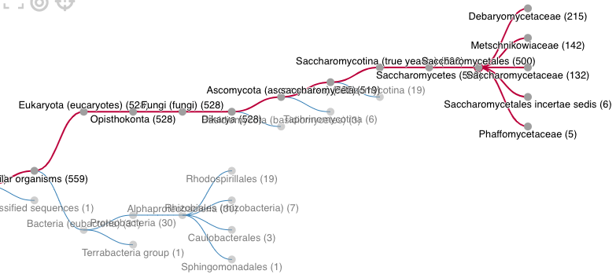
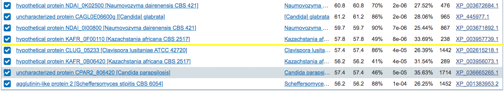

<!--ts-->
   * [Goal](#goal)
   * [Notes](#notes)
      * [2020-07-01 [HB] Repeat BLAST to identify XP_028889033 homologs](#2020-07-01-hb-repeat-blast-to-identify-xp_028889033-homologs)
         * [FungiDB](#fungidb)
         * [Retrieve ref_protein ID for FungiDB hits](#retrieve-ref_protein-id-for-fungidb-hits)
         * [NCBI blast](#ncbi-blast)
         * [Merge the two datasets](#merge-the-two-datasets)
      * [2020-07-22 [HB] Identify homologs in Nakaseomyces](#2020-07-22-hb-identify-homologs-in-nakaseomyces)
         * [Motivation](#motivation)
         * [Approach](#approach)
      * [2020-08-06 [HB] Identify potential homologs in bacteria and in <em>S. cerevisiae</em>](#2020-08-06-hb-identify-potential-homologs-in-bacteria-and-in-s-cerevisiae)
      * [2020-08-09 [HB] Homologs in Bacteria?](#2020-08-09-hb-homologs-in-bacteria)
      * [2020-08-19 [HB] Homologs in <em>S. cerevisiae</em>?](#2020-08-19-hb-homologs-in-s-cerevisiae)
      * [2020-09-13 [HB] Homologs in other <em>C. auris</em> proteomes](#2020-09-13-hb-homologs-in-other-c-auris-proteomes)
      * [2020-10-20 [HB] Correct GRYC mistakes](#2020-10-20-hb-correct-gryc-mistakes)
      * [2021-01-09 [HB] Additional homologs through blastp against refseq_protein](#2021-01-09-hb-additional-homologs-through-blastp-against-refseq_protein)
      * [2021-01-23 [HB] Repeat blast searches with N-360 aa from XP_028889033 (for writing up the results)](#2021-01-23-hb-repeat-blast-searches-with-n-360-aa-from-xp_028889033-for-writing-up-the-results)
      * [2021-01-31 [HB] Vary e-value cutoff with N-360 aa from XP_028889033](#2021-01-31-hb-vary-e-value-cutoff-with-n-360-aa-from-xp_028889033)
      * [2021-03-01 [HB] <em>C. auris</em> clade III should have 8 members in this family](#2021-03-01-hb-c-auris-clade-iii-should-have-8-members-in-this-family)
      * [2021-04-03 [HB] Missing homolog in B11221](#2021-04-03-hb-missing-homolog-in-b11221)

<!-- Added by: bhe2, at: Thu Jun 17 19:45:02 CDT 2021 -->

<!--te-->

# Goal

- Repeat the blast step to clean up the homologs list.
    some species were missing while others, like _C. albicans_, had more than one strain represented in Lindsey's version.

# Notes
## 2020-07-01 [HB] Repeat BLAST to identify XP_028889033 homologs
### FungiDB
Used the beta version of the new site on 2020-07-01

- Used first 560 aa of XP_028889033 as query, e-value cutoff set to 1e-5, low complexity on, and limit the organisms to the CUG clade, _S. cerevisiae_, _C. glabrata_ and _S. pombe_
- Downloaded 95 sequences along with a table with meta information.
- After examining the meta data, I noticed that some sequences are much shorter than others. I then plotted protein length as a function of e-value, both in log scales, and it became apparent that those sequences below 500 amino acids are the ones with the lowest e-values. I thus removed them by printing a list of gene IDs, and used the `extract_fasta.py` program to output the filtered list.
    

### Retrieve ref_protein ID for FungiDB hits
```bash
$ blastp -db refseq_protein -query XP_028889033_homologs_fungidb_use.fasta -outfmt "6 qseqid sseqid qlen slen pident mismatch score bitscore evalue" -max_target_seqs 1 -remote -out XP_028889033_fungidb_refprot_id.txt
```
However, for some reason this command didn't work (2020-07-04: I think it actually just takes a long time. Instead of returning an ID for later retrieval of the results, it appears that the user actually have to wait until the search finishes). Instead, I submitted the XP_028889033_homologs_fungidb_use.fasta to NCBI blastp with the same parameters. The result is registered with RID: G2HK3CWK014. I then downloaded the results with a local command
```bash
$ blast_formatter -rid G2HK3CWK014 -out fungidb_N560_blast_refseq_protein.txt -outfmt "6 qseqid sseqid qlen slen pident mismatch score bitscore evalue" -max_target_seqs 1
$ cut -f1 fungidb_N560_blast_refseq_protein.txt | sort | uniq | wc -l
# 70, correct
```


### NCBI blast
`blastp` with the first 560 aa of XP_028889033, e-value cutoff 1e-5, low complexity sequences masked (there is now an option to only mask the low complexity region when generating the seed, but leave them be during the extension).
- I also tried `Delta-blastp`, which first searches against the conserved domain database and then gather sequences with that domain. This resulted in way too many hits. Didn't pursue further.
- For the `blastp` results, I further required the query coverage to be greater than 50%, which yielded 144 sequences. This cutoff was chosen subjectively as sequences with lower than 50% coverage appear uninteresting (in species that are not what I'm interested in).
- I further excluded 6 species from consideration. These are "Metschnikowia bicuspidata var. bicuspidata NRRL YB-4993 (taxid:869754), Debaryomyces fabryi (taxid:58627), Suhomyces tanzawaensis NRRL Y-17324 (taxid:984487), Candida orthopsilosis Co 90-125 (taxid:1136231), Kazachstania (taxid:71245), Naumovozyma dairenensis CBS 421 (taxid:1071378), Meyerozyma guilliermondii (taxid:4929), Yamadazyma tenuis ATCC 10573 (taxid:590646)"
- The resulting taxonomy is shown 

### Merge the two datasets
1. To merge the two datasets, I decide to blast the fungidb reduced set (a.a. length > 500) to the ref_protein dataset. To do so, I used the following commands
    ```bash
    $ mkdir blastdb; makeblastdb -in XP_028889033_homologs_refprot.fasta -parse_seqids -dbtype prot -title XP_028889033_refprot -out blastdb/XP_028889033_refprot
    $ blastp -db ./blastdb/XP_028889033_refprot -query XP_028889033_homologs_fungidb_use.fasta -outfmt "6 qseqid sseqid qlen slen pident mismatch score bitscore evalue" -max_target_seqs 1 -num_threads 4 -out XP_028889033_fungidb-refprot-blast.txt
    ```
    Explanation
    - -outfmt 6: tabular output, no comments
    - -max_target_seqs 1: only output one (best-scoring) match per sequence
      - **update 2021-06-17**: this option should be avoided as it doesn't do what it sounds like. See [this paper](https://academic.oup.com/bioinformatics/article/35/9/1613/5106166)
      - In the new analysis (script in the rmarkdown), I used `-evalue 1e-180` instead.
    - -num_threads 4: use 4 cpus to perform the search

## 2020-07-22 [HB] Identify homologs in Nakaseomyces
### Motivation
The original blast to both the refseq_protein and fungiDB databases yielded no hits in the well represented _S. cerevisiae_ _sensu stricto_ or _sensu lato_ clade. The only hits were in _C. glabrata_ and _N. castellii_. I'm particularly curious why the other Nakaseomyces group species, e.g. _C. bracarensis_, _N. dephensis_ and _C. nivariensis_ had not hits. Turns out even the NCBI nr_protein database doesn't contain any protein entries for the Nakaseomyces -- I verified this by blast'ing Pho4 protein sequence against the nr_protein and limited the organisms to Nakaseomyces. I then found / remembered that the [Genome Resource for Yeast Chromosomes](http://gryc.inra.fr/index.php) site contains the Nakaseomyces genomes. I verified this by repeating the Pho4p blast. I then blast'ed the first 500 a.a. of XP_028889033 in GRYC, selecting the Nakaseomyces (6 sps)as well as _S. cerevisiae_ (1), Lachancea (12), Naumovozyma (1, _N. castellii_), Yarrowia (3 _Y. lipolytica_ strains) 

### Approach
Got 15 hits from the GRYC blast. Downloaded the fasta sequence and the blast text output. The latter requires a lot of parsing, and there is no option that I can find to change the output format to a table. Instead, I just brutal-forced it -- copy and paste the table on the html page, put it into a text file, and edited it with vim (only 15 rows, not too bad). I also added an ID column to render the sequence ID more in-line with what I have for the other sequences.

I revamped the `blast.Rmd`. In the process of filtering and integrating the new hits, I found that I didn't properly filter the refseq_protein hits with the same length threshold I applied to the fungidb hits. So now I made the analysis consistent with respect to the selection criteria, and removed the _D. rugosa_ sequences (the reason is documented in the `README` files in the `output/gene-tree` folder or subfolders therein). In the end we get 100 sequences in total.
## 2020-08-06 [HB] Identify potential homologs in bacteria and in _S. cerevisiae_
HMMER and BLAST search for homologs of the N-terminal domain (350 a.a.) of XP_028889033 in viruses and bacteria

    MAFNFVRGWLLLAFYLSATWALTITENTVNVGALNIKIGSLTINPGVYYSIVNNALTTLGGSLDNQGEFYVTSANGLAASVSIVSGTIKNSGDLAFNSLRASVISNYNLNSIGGFTNTGNMWLGISGYSLVPPIILGSATNWDNSGRIYLSQNSGSASTITISQTLGSITNDGSMCIERLSWLQTTSIKGAGCINLMDDAHLQLQISPWSVSNDQTIYLSSSSSMLSVLGLSQSITGTKTYNVVGFGDGNSIRVNTGFSGYSYEGDTLTLSFFLGLFKIAFKIGTGYSKSGFSTNGLFGAGTRISYSGAYPGTVPDVCKCFDFPEPTTTPLPSSTSQSSKPSSSSSVIT

restricting the taxonomy to viruses, archaea and eubacteria, and e-value cutoff 0.01  No hits were found using either the PHMMER or JACKHMMER algorithm.

I repeated the search using blastp with e-value cutoff of 10, and taxonomy restricted to the same groups as above. The database in this case is the non-redundant proteins. This time I did get 3 significant hits!


| query acc.ver | subject acc.ver | % identity | alignment length | mismatches | gap opens | q. start | q. end | s. start | s. end | evalue | bit score | % positives |
| --------------|-----------------| ---------- | ---------------- | ---------- | --------- | -------- | ------ | -------- | ------ | ------ | --------- | -----------|
| XP_028889033 | [PYD84265.1](https://www.ncbi.nlm.nih.gov/protein/PYD84265.1/) | 57.609 | 184 | 77 | 1 | 136 | 318 | 3 | 186 | 5.63e-70 | 226 | 76.63 |
| XP_028889033 | [WP_146232083.1](https://www.ncbi.nlm.nih.gov/protein/WP_146232083.1) | 88.372 | 86 | 10 | 0 | 6 | 91 | 6 | 91 | 2.88e-40 | 146 | 95.35 |
| XP_028889033 | [CQB89545.1](https://www.ncbi.nlm.nih.gov/protein/CQB89545.1) | 35.912 | 181 | 96 | 7 | 166 | 330 | 1 | 177 | 5.17e-16 | 89.4 | 51.93 |

As one can see from the query coverage and evalue columns, the first and second matches are quite significant. Both hits are from the species _Pseudomonas syringae_, which belongs to the class gammaproteobacteria. The third hit is from _Chlamydia trachomatis_, which belongs to a completely different phylum, Chlamydiae. Since it is a lot less similar to our query, we will focus just on the first two.

The second hit, while short, has high sequence identity. Wondering why I got 3 bacterial hits -- I expect either none or a lot -- I took the sequence of the first hit and repeated the blastp search. This produced two significant hits, including itself and the 3rd hit above. What does this mean? Are these highly species-specific sequences coming from fungi? Are they ancient proteins that have been lost in many many bacteria except for a few? Could these be annotation errors, namely the sample used to identify these bacterial sequences may be contaminated with fungal material?

## 2020-08-09 [HB] Homologs in Bacteria?

while reading about the [Pfam family (PF11765)](http://pfam.xfam.org/family/PF11765), I noticed that the [description](http://pfam.xfam.org/family/PF11765#tabview=tab0) said that this domain is **specific to fungi**. Does this mean the curator(s) of this family don't believe the bacterial sequences are true hits? From the PFam site I navigated to the linked [InterPro page](http://www.ebi.ac.uk/interpro/entry/InterPro/IPR021031/taxonomy/uniprot/#tree). There I learned that of the 561 members, 530 are in fungi -- in fact, 500/528 are in Saccharomycotina -- and only 31 are from bacteria. The hits in bacteria are almost all (30/31) in the alphaproteobacteria group, which is a different group compared to the gammaproteobacteria that _Pseudomonas syringae_ belongs to (see blast results above). 



The other suspicious sign is when I blast the _Pseudomonas syringae_ hit, which is 186 a.a. long and represents a "partial CDS", to all proteins labeled as _Pseudomonas syringae_ in the nr database, only the query itself came up in the hits. This is unexpected as the species is well studied as a plant pathogen and there must be a large number of well-assembled genomes in the species. At this point I have two theories explaining the blastp hits:

1. The hits represent false positives, likely due to fungal contamination of the bacterial sample.
1. The hits represent true sequeces in a _particular_ strain of the bacterium, possibly as a result of horizontal gene transfer from fungi.


Despite all the suspicious signs and the fact that the two database searches above yielded hits from bacterial species that are very distant from each other, I don't think we can completely rule out the possibility of a more ancient origin of the domain (alternatively, this could result from convergent evolution). A paper studying the Hyr1 protein in _C. albicans_ showed that it is structrually similar to a bacterial adhesin. The bacteria that they identified are of the species _A. baumannii_, which belongs to gammaproteobacteria. But the fact that we get so few hits that are inconsistent between databases suggests that whichever hypothesis is true, the similarity is very low and the Hyphal_reg_CWP domain that we are concerned about is yeast specific.

## 2020-08-19 [HB] Homologs in _S. cerevisiae_?

I went back to the "species" tab on the [Pfam site for (PF11765)](http://pfam.xfam.org/family/PF11765#tabview=tab7) to check for any bacterial members. There indeed are, but the listed species are different from either the InterPro or my ncbi blast results, again raising questions about whether these bacterial hits are real or due to fungal contamination.


Another notable finding is that the PFam species page listed two hits in _S. cerevisiae_: CSS1/YIL169C and HPF1/YOL155C. I used BLASTP-align-two-sequences feature to align them and also the two _C. glabrata_ homologs identified before to the NTD of XP_028889033 (as query) and found that they do appear to share some homology, although with very low sequence identity (~28%). See results below


BLAST alignments for the _S. cerevisiae_ sequences can be viewed below:

[YIL169C](img/20200819-YIL169C-alignment.png)
[YOL155C](img/20200819-YOL155C-alignment.png)

While they do share sequence similarity with the NTD in XP_028889033, their domain architectures are quite different.


Here is the blastp alignment for one of the two _C. glabrata_ homologs, XP_447567.2 ([CAGL0I07293g](http://www.candidagenome.org/cgi-bin/locus.pl?dbid=CAL0130316)), which was annotated as adhesin-like cell wall protein. Both the query coverage and identity are better than the _S. cerevisiae_ hits

[CAL0130316](img/20200819-CAGL0I07293g-alignment.png)

Another way to visualize the similarity/difference between the domain sequences from the _S. cerevisiae_ and _C. glabrata_ sequences and XP_028889033 is a dotplot. Below is a polydot plot produced with the [`flexidot_v1.06`](https://github.com/molbio-dresden/flexidot) script with word size of 7 and allowed substitutions of 2.

```bash
python flexidot_v1.06.py -i PF11765_domains_only.fasta -p 2 -t 0 -k 7 -S 3
```


To gain more insight into the potential functions of the two _S. cerevisiae_ hits, I looked at their annotations on SGD:

> YIL169C: protein of unknown function, secretd when constitutively expressed; ... S/T rich; putative glucan alpha-1,4-glucosidase.
> YOL155C: Haze-protective mannoprotein; reduces the particle size of aggregated proteins in white wines

The latter has some obvious connection to adhesion, based on its role in aggregation. The former hits two features seen also in the adhesins: S/T rich region and putative gluan alpha-1,4-glucosidase activity, but seems to be not anchored on the cell wall (or secreted). Prediction of GPI-anchor using two programs (see `Sc-Cg-members/README.md`) suggests that both may be cell-wall anchored. Given the location of the domain in the _S. cerevisiae_ genes (in the middle) and their likely cell wall localization, I suspect their NTDs are not exposed but rather buried in the cell wall matrix and may be involved in modifying the cell wall composition (with the glucan alpha-1,4-glucosidase activity).

Based on the above results, I'm further convinced that the PF11765 domain is indeed an ancient one. This protein family has either been lost or evolved to perform different functions in most of the Saccharomycetaceae species, but has dramatically expanded in the MDR clade and _C. albicans_ clade to function as adhesins.

I further asked if using the _C. glabrata_ domain sequence as query, I can recover hits in _S. cerevisiae_ and other Saccharomycetales yeasts. **The answer is no.**
## 2020-09-13 [HB] Homologs in other _C. auris_ proteomes
This analysis stems from Jan's question of what other homologs are there in the five _C. auris_ proteomes. To answer this question, I did the following:

1. Bring over the proteome fasta files from the global analysis folder
    ```bash
    mkdir data/Cauris-strains; cd data/Cauris-strains
    ln -s ../../../../01-global-adhesin-prediction/data/proteome-fasta/*Cand_auris* ./
    cd ..
    ```

1. Construct blast database
    ```bash
    cat Cauris-strains/*.gz > Cauris-strains/Cand_auris_five_strains_protein.faa.gz
    gunzip -c Cauris-strains/Cand_auris_five_strains_protein.faa.gz | \
        makeblastdb -in - -parse_seqids -dbtype prot -title Cand_auris_five_strains -out blastdb/Cand_auris_five_strains
    blastp -db ./blastdb/Cand_auris_five_strains -query XP_028889033_query.fasta -max_hsps 1 -outfmt "7" -num_threads 4 -out ../output/XP_028889033-Cauris-five-strains-blast.txt
    ```

1. Edited the output text file by adding a header. Then open that file in Excel and removed the comment lines along with several entries with E-value > 10E-5. The result is stored in an excel file of the same base name as above.

1. Extract all blast-identified _C. auris_ homologs sequences using my custom script:
    ```bash
    cd Cauris-strains
    awk '$1 ~ /^XP_028889033.1_PF11765/ && $4 > 60' XP_028889033-Cauris-five-strains-blast.txt | \
    | cut -f2 | sort > list-Cauris-five-strains-homologs-blast.txt
    python ../../script/extract_fasta_gz.py Cand_auris_five_strains_protein.faa.gz list-Cauris-five-strains-homologs-blast.txt cauris-five-strains-homologs.fasta
    cd ../../07-Cauris-polymorphism/input; ln -s ../../02-blast/data/Cauris-strains/cauris-five-strains-homologs.fasta ./
    ```
## 2020-10-20 [HB] Correct GRYC mistakes
During a discussion Rachel pointed out that the domain architecture figure showed a few sequences that are shorter than 500 a.a. I doubled checked and found that there are two of them. One is from _N. delphensis_ and in my notes I explained the reason why I included it, because it is a "partial CDS". The other is from _N. bracarensis_. It turned out that the length of the protein in the blast hit table is incorrect. I manually edited that file and most likely introduced the error in the process. So I just removed the latter in the new `XP_028889033_homologs_combine.fasta`. Also, I noticed that I included one sequence from _C. auris_ strain B8441, making _C. auris_ the only species with more than one strain represented in the homologs list. Moreover, I didn't systematically include _all_ hits from B8441. So I decided to remove that. Lastly, I decided to include CAGL0L00227g, which was originally excluded because query coverage of this hit was 47%, below the 50% cutoff I set. However, upon further looking, I found this sequence interesting as it is very long (~3kb, similar to the query) and has extremely high Serine content. Thus I decided to include it to demonstrate the evolution of this protein family in _C. glabrata_.

**Update 2020-11-05**
I reversed my decision and removed CAGL0L00227g. The reason is because when I included it in the homologs list, the alignment and gene tree analysis suggested that it is far removed from the existing homologs in the Nakaseomyces, and will throw off the gene tree. This suggested to me that this gene likely evolved from a more ancient duplication. If I want to include it in the tree and properly interpret the topology, I would need to lower my query coverary and/or e-value cutoff to include more potential homologs.
## 2021-01-09 [HB] Additional homologs through blastp against refseq_protein
While writing up the blast results, I repeated the blast search on ncbi against the refseq_protein, and found that more species are found in the hit list, likely because the database has grown over the past few months. But the results won't change the major conclusions. Below is the taxonomy list of all species that contain hits with the same criteria (e-value < 1e-5 and query coverage > 50%)


The red arrows point to species excluded from my homologs list. Among the ones I excluded, the following three are notable for different reasons:

1. the single fission yeast hit from _Schizosaccharomyces cryophilus_. If verified, this would suggest the protein family originated at the root of all Ascomycetes.
1. _Kazachstania africana_ is within the Saccharomycetacea and had 8 hits, more than any other species in the genus, including _C. glabrata_. If verified, this would suggest an independent expansion in the Saccharomycetaceae, in addition to the two expansions in the MDR and _albicans_ clade.
1. _Candida orthopsilosis_ is most closely related to _C. parasiolosis_ and next closest to _L. elongisporus_, both of which harbored significantly fewer homologs than the neighboring _albicans_ clade (~3 vs > 10).

In conclusion, the omission of the above species do not alter the main conclusions reached so far, except for the possibility that the PF11765 domain originated earlier at the root of the fission and budding yeasts.

**Update 2021-01-21** Homolog in fission yeast unlikely to be real

Turns out that both the fission yeast hit and the bacteria hit have query coverage lower than 50%. The fission yeast hit comes from a protein that is only 390 aa long, while the bacterial one is 91 amino acid. The reason they appeared in the taxonomy viewer even after I applied the query coverage filter is unexpected and likely a bug in the blast web tool. In any event, I took those two proteins and blast'ed them against the nr_protein database, restricting the taxonomy to Schizosaccharamycetes and eubacteria respectively, maintaining the same 1e-5 e-value cutoff. In both cases, the only hit recovered is the query protein itself. This suggests to me that the original hits are not worth following up with as they represent lone hits that are likely due to sequencing or annotation errors.

## 2021-01-23 [HB] Repeat blast searches with N-360 aa from XP_028889033 (for writing up the results)

_Issue_

While writing up the results, I realized that my original search was done with the first 560 amino acids from XP_028889033, which includes both the N-terminal PF11765 domain (12-327) and also one the Hyr1 domain (PF15789) repeats. This alone wouldn't change the search result by a lot. But when I later applied the 50% query coverage filter, I was effectively applying a more stringent cutoff, because most of the hits only share similarity with the PF11765 domain and not the Hyr1 domain.

_Investigation_

I repeated the search using the first 360 amino acids from XP_028889033. The resulting hit table and fasta are downloaded. To distinguish these files from the original ones, I added the "N560" and "N360" suffixes. The original search with N-560 aa yielded 190 sequences, of which 154 passed the 50% query coverage cutoff. I excluded 9 species from this list (see notes above) and arrived at the final list. Below is the taxonomy for all hits (not filtered by query coverage cutoff). Species labeled by a red arrow are those not included in the final analysis.


I then compared the new list with the old one (see `blast.Rmd`) and decided to add 7 sequences to the original list. See `blast.Rmd` for details.

_Procedure_

I repeated all three searches (refseq_prot, GRYC, fungidb) with the N360 amino acids as query, so as to make the writing a little easier. The results didn't change for GRYC and fungidb, but a few more sequences are identified in the blastp search against the refseq_prot, which I will incorporate into our analysis.

## 2021-01-31 [HB] Vary e-value cutoff with N-360 aa from XP_028889033

_Notes_

While re-assembling the list of homolog sequences using the new N360 search results, I found that one of the original sequences, XP_001383953.2 from _S. stipitis_, is no longer in the new list. I then repeated the blastp search with the N360 query, relaxing the e-value cutoff from 1e-5 to 1e-3, and lo-and-behold, it's at the bottom of the list. I decide to leave it out so all the results are now based on the N360 with e-value < 1e-5, query coverage > 50% and length > 500 aa. It is of interest to note that changing the e-value from 1e-5 to 1e-3 only added four sequences (see below).



See `blast.Rmd`'s relevant section for more discussion.


## 2021-03-01 [HB] _C. auris_ clade III should have 8 members in this family
While reading Muñoz 2020 Genetics, I noticed that they identified a total of 8 members of this family in Clade I and III of _C. auris_. Since the type strain we used for our analysis comes from Clade III (B11221), I wonder why we missed one.


To investigate this, I performed blastp using the N-terminal 330 amino acids (using 360 should give the same result) against the non_redundant protein database on NCBI, restricting the taxonomy to _Candida auris_ (taxid:498019), and setting e-value cutoff to 0.05 (although everything that was returned had extrememly significant e-values).


As can be seen in the table above (only B8441 - B9J08 and B11221 - CJI97 hits were shown), one B8441 hit doesn't have a corresponding B11221 hit. The ID of it is B9J08_004098. The reason CJI97 had two hits per B9J08 hit is because the nr database contains both the refseq and non-refseq proteins. B11221 is the only _C. auris_ strain with a Refseq assembly, hence the duplicates.

Looks like I might have to do the blastp again, this time adding the B9J08_004098 back to the homologs table. This will minimize the needed changes to other parts of the results, which were all based on our query protein XP_028889033 from B11221.

## 2021-04-03 [HB] Missing homolog in B11221
I subsequently did more blastp search to figure out why I'm missing the 8th member of the family in the clade IV strain B11221. I found several relevant things:

1. If I use B9J08_004098's PF11765 domain (11-326) as query and blast the B11221 translated CDS (or protein) database, I could recover the seven identified previously and also three more hits. Two of them have very short alignment length (less than 50 amino acids), but a third one has 146 amino acids aligned, with ~20.5% identity. I then looked up this sequence in the ref_protein database by its ID (XP_028890323) and found it to be only 177 amino acids long. I did follow the link and found the corresponding gene (NW_021640165) and it appears to be a complete CDS with a stop codon. So it's still unclear why I only found 7 members in the B11221 genome, even though the latest Muñoz et al 2021 Genetics paper showed 8 (Figure 6).

_Discussion (2021-04-19 [HB])_

Continuing to investigate the reason for the missing gene in B11221: this time I blast'ed the entire protein sequence using `tblastn` against either the B8441 or the B11221 assembly, using the default settings (e-value 0.05, word size 6, blosum 62 matrix, gap 11/1). This led to the following discoveries:

- B9J08_004098 is located on scaffold01 in B8441 genome. According to the [supplementary table 1](https://gsajournals.figshare.com/articles/dataset/Supplemental_Material_for_Mu_oz_et_al_2021/13759276?file=26384548) of the Muñoz _et al._ 2021 (PMID: 33769478), scaffold00001 along with 00008 map to chromosome 1.

    

- `tblastn` against the B11221 genome resulted in the following hits (graphic summary)
  
    

    The first three lines are continguous sequences matching the N-terminus and to a less extent the C-terminus, and they are almost surely among the other 7 homologs. The last line is interesting in that it is split into two discontinuous sequences with very high similarity. I checked the scaffolds they came from and they are from scaffolds00001 and 00015, where the former maps to chromosome 1 while the latter is not assembled into the genome. Notably, the match to scaffold00001, which corresponds to the C-terminus of the protein, is nearly 100% identical, with one amino acid mismatch that could result from technical artifacts. I thus determine that the missing Hil4 homolog in B11221 is located on chromosome 1 (scaffold0001) and is located at the 3' end of the sequence (the coding sequence is on the minus strand, explaining why the N-terminal region is missing).

    

    
    
    The lonely match to the N-terminus region on scaffold00015 had only 59% identity. The scaffold00015 sequence itself is only 21,981 bp. To figure out what this match corresponds to, I took the subject sequence `ALLLQKARSLTITEDTVLVSPVNLEIGELNINPGVYFSIVNNVLTVLGGNLNNDGAFYVTSTNGLAASVTIASGSIINRGDLAFNSLKANVITNFNLDSVGTFSNTGNMWLGVPIFSAVPPIILGSALDWENKGMIYLRQELGGASPITISQVLGAIDNSGTICIERLNWLQTTTINGAGCVNVQADGHLQLQISPWSVGEDQTIYLSTPTSALSVLGLEPSLLGTKTYNVVGFGGGNTIGINLGFTSYSYSGSTLTLSFFLGVFKINFNIGEGYSADGFSTNGPGNSGTQITYDGPYPGSVPDKCLCKDF` and searched it either using `tblastn` against the refseq genome (B11221) or using `blastp` against the refseq_prot database. The latter search identified a perfect match in CJI97_005649 (XP_028887965.1), which corresponds to Hil6. The former again hit the scaffold00015 sequence. So I could confirm that this hit is Hil6.
    
    My analysis above led me to the following conclusions:
    
    1. Hil4 homolog is present in B11221 and is located at the 3' tip of chromosome 1 (scaffold00001).
    2. Chromosome 1 in B11221 is incomplete at the 3' tip and there doesn't appear to be an unassembled scaffold that corresponds to that piece. Instead, it may just be missing.
    3. For my downstream chromosomal location analysis, it would be convenient to convert the B9J08_004098 locations to the locations in the B11221 genome. What I can do is to modify the chromosomal information during that analysis to correspond to the scaffold0001 hit here.
