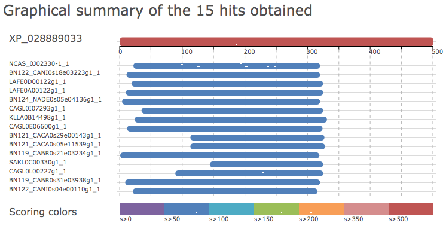
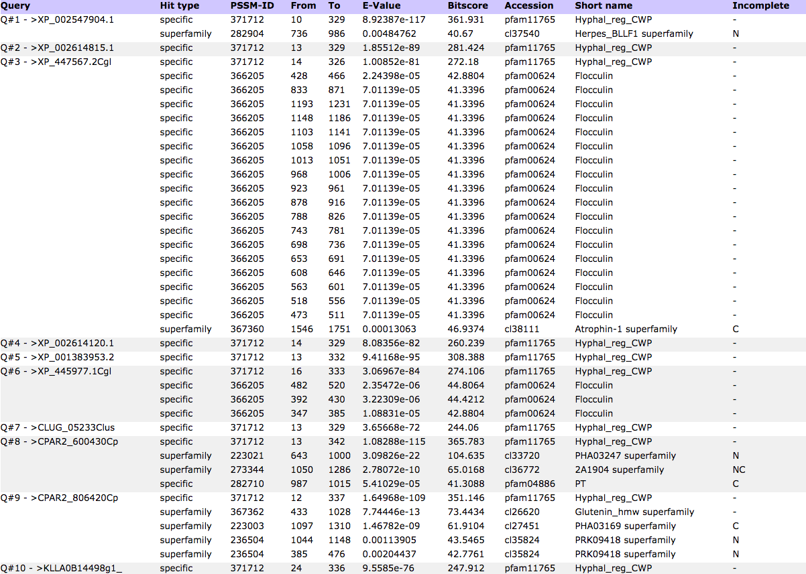
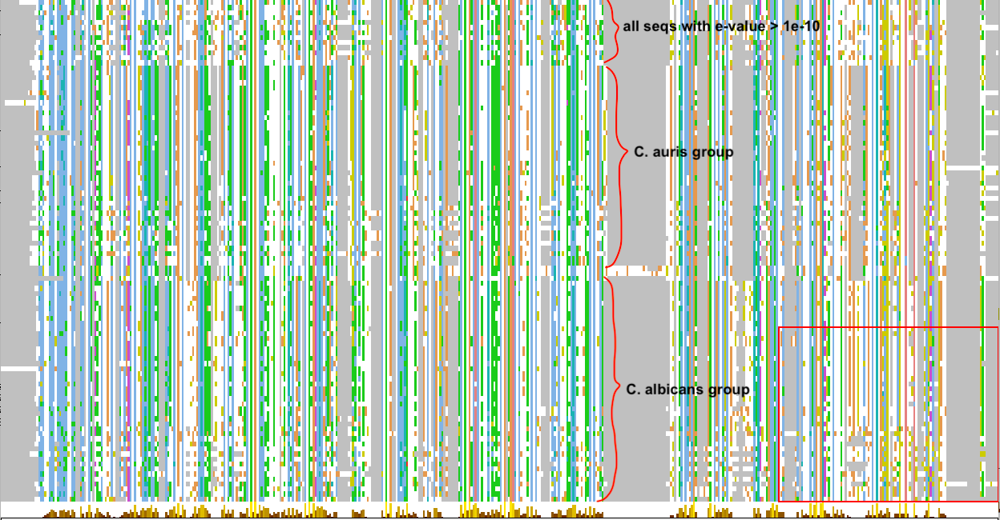

This analysis accompanies the BLAST search to identify homologs for XP_028889033

```{r load_libraries}
suppressPackageStartupMessages(library(tidyverse))
# install rentrez package if not already installed
if (!requireNamespace("rentrez", quietly = TRUE))
    install.packages("rentrez")
suppressPackageStartupMessages(library(rentrez))
# set NCBI Entrez API key
set_entrez_key("f4f01c220f3a0a162bada5b0bd5d4b131908")
# install seqinr package if not already installed
if (!requireNamespace("seqinr", quietly = TRUE))
    install.packages("seqinr")
suppressPackageStartupMessages(library(seqinr))
suppressPackageStartupMessages(library(XML))
```

## Refseq_protein
I used blastp to search the N-terminal 560 residues in XP_028889033 against the refseq_protein database. (See README.md for details). The taxonomy distribution is shown below:

```{r refseq_protein_blast}
# load table
refseq <- read_csv("data/ncbi-refseq/XP_028889033_homologs_refprot_N560_select.csv", col_types = "cddnnnc")
refseq.length <- read_tsv("data/ncbi-refseq/XP_028889033_homologs_refprot_N560_select_length.txt", col_names = c("accession","length"), col_types = "ci")
refseq <- left_join(refseq, refseq.length) %>% select(accession, everything())
# Do the refseq hits show similar relationship between e-value and protein length?
refseq %>% 
  ggplot(aes(x = -log10(e.value), y = log2(length), col = (length > 500))) + geom_point() +
  theme(legend.position = "bottom")
ggsave("img/20200723-XP_028889033-refseq-hits-e-value-by-length.png", width = 3, height = 3)
# The answer is yes. So let's filter these out and show what they are
refseq0 <- refseq %>% 
  filter(length > 500, !grepl("rugosa", description))
refseq %>% filter(length <= 500) %>% select(accession, query.cover, e.value, perc.ident, length, description)
# the above script uses a strange way to move a column to the last, by first removing it and then adding it back
# thanks to https://github.com/tidyverse/dplyr/issues/3051
```
_Discussion_

1. We see that the excluded sequences not only have less significant e-values, but also have barely above 50% query coverage. In terms of species distribution, most of them are from _S. stipitis_ and _D. rugosa_. The second species will be removed anyways (see notes in the `03-gene-tree` folder)
1. Even though a couple of the _S. stipitis_ sequences were annotated as "fungal hyphal regulated cell wall proteins", with less than 500 a.a., they are unlikely to encode the stalk and in a separate analysis, I also found them to not possess the GPI-anchor. All in all, I think these sequences are unlikely to be candidate adhesins.

### NCBI blastp with N360 query
I repeated the NCBI blastp search with the first 360 amino acid residues instead of the first 560. Because the 560 aa sequence contains a copy of the Hyr1 domain in addition to the PF11765 domain, it is possible that some of the hits bear similarity to the Hyr1 and not the Hyphal_reg_CWP domain. Also, when I applied the >50% query coverage filter on the resulting homolog list, the effective cutoff for the PF11765 domain would be higher, since most of the hits don't share the Hyr1 domain.

Below is the taxonomy distribution of the hits:

To determine the effect of changing the query sequence from N560 to N360 amino acids, I downloaded the hits description and the fasta sequences from both searches. Now let's compare them.

```{r, results="asis"}
hitTabColNames <- c("description","sci.name","common.name","taxid","max.score",
                    "total.score","query.cover","e.value","perc.ident","length","acc")
refseq.N360 <- read_csv("data/ncbi-refseq/XP_028889033_homologs_refprot_N360.csv",  col_types = "ccccddcddic", col_names = hitTabColNames, skip = 1) %>% 
  mutate(query.cover = parse_number(query.cover), 
         accession = gsub('[")]','',str_split(acc, ",", simplify = T)[,2]))

cat("**Sequences only in the N360 set after applying the 50% query coverage filter**")
all.N360 <- refseq.N360 %>% filter(query.cover >= 50, length > 500) %>% pull(accession)
only.in.N360 <- setdiff(all.N360, refseq0$accession)
refseq.N360 %>% filter(accession %in% only.in.N360) %>% 
  select(accession, qcov = query.cover, e.value, pident = perc.ident, length, sci.name) %>% 
  arrange(sci.name)

cat("**Sequences only in the N560 set after applying the 50% query coverage filter**")
only.in.N560 <- setdiff(refseq0$accession, all.N360)
refseq0 %>% filter(accession %in% only.in.N560) %>% 
  select(accession, qcov = query.cover, e.value, pident = perc.ident, length)
```

_Discussion_

I would include 7 of the first 10 sequences in the table above, except for those from _C. orthopsilosis_, into the final list. The reason to include them is because the 50% query coverage cutoff was unfairly applied to them, since using the N360 amino acid as query, all of them passed the cutoff. The reason to not include _C. orthopsilosis_ is to limit the total number of species and sequences in the various plots. The main contribution of _C. orthopsilosis_, if I include it, is to enhance the conclusion that the number of homologs in _C. parapsilosis_ and _L. elongatus_ are low. The remaining 15 sequences are from species I'm not going to include.

One sequence from the original blast search, XP_001383953.2 from _S. stipitis_ didn't make the cut in the new search. When I lowered the e-value cutoff to 1e-3, it appeared at the bottom of the hist list. For consistency's sake, I decided to exclude it from the new analysis.

At the same time, I found that **relaxing the e-value cutoff from 1e-5 to 1e-3 only resulted in four new sequences**. This suggests that the list of homologs is not too sensitive to the arbitrary choice of the e-value cutoff. Looking at the three other sequences making the cut at 1e-3, one is from a species I am not including anyway. The other two were actually added from the FungiDB search result (see notes and analysis below). This made me realize that **e-value cutoff is database-size-specific** and thus using the same cutoff doesn't mean the same thing between refseq_db, fungidb and GRYC. But the resulting differences in the number of hits included or excluded are relatively small and thus don't affect the overall conclusions.


```{r include_additiona_seqs_refseq}
refseq.add <- c("XP_024716365.1", "XP_717775.2", "XP_036665264.1", "XP_002547616.1", "XP_002545510.1", "XP_002614115.1", "XP_002770240.1")
# remove one seq, see notes above
refseq0 <- refseq0 %>% filter(accession != "XP_001383953.2")
refseq.combined <- refseq.N360 %>% 
  filter(accession %in% refseq.add) %>% 
  select(accession, description, max.score, total.score, query.cover, e.value, perc.ident, length) %>% 
  bind_rows(refseq0)
```

### Missing homolog in _C. auris_ B11221
**_Update 2021-03-01_**

Muñoz et al 2021 reported 8 members in the Iff/Hyr1 family in _C. auris_ clades I and III.


My own blastp only identified 7 members in the refseq_prot database, which includes B11221 but not B8441. A second blastp search against the nr_prot database, with taxonomy restricted to _C. auris_ confirmed that while B8441 showed 8 hits, B11221 only showed 7. This is inconsistent with the Muñoz 2021 report. The discrepancy could be due to the protein fasta file in the B11221 refseq assembly being incomplete. To keep our results consistent with the recent publication, I'll add this one B8441 sequence to the homolog database manually so we would have 8 members, which is the max size of the family among all know _C. auris_ strains. Although, note that the 8 genes do not all come from the same strain any more. I don't expect this to change any of our downstream analyses, since the two strains are closely related within the same clade in _C. auris_.


## Fungidb

### Update 2021-01-24 [HB] new search with N360 aa

I repeated the search with either N360 or N560 aa, with e-value 1e-5 cutoff and low complexity filter on. The first search yielded 104 hits and the second 105. I downloaded the results from the first search and named them with "N360" in their filenames. Below I will compare the list to my previous list.

```{r fungidb_old_vs_new, results="asis"}
# old: load table
fungidb <- read_tsv("data/fungidb/XP_028889033_homologs_fungidb_N560_table.tsv", col_types = "cccddcccdcc")
fungidb$species_id <- map_chr(str_split(fungidb$organism, " "), function(x) paste0(substr(x[1],1,1), x[2]))
# new: load table
fungidb.new <- read_tsv("data/fungidb/XP_028889033_homologs_fungidb_N360_table.tsv", col_types = "cccddcccccccd")
fungidb.new$species_id <- map_chr(str_split(fungidb.new$organism, " "), function(x) paste0(substr(x[1],1,1), x[2]))
# reveal differences
cat("**sequences in the original list but not in the new one**")
setdiff(fungidb$gene_id, fungidb.new$gene_id)
cat("**sequences in the new list but not in the old one**")
setdiff(fungidb.new$gene_id, fungidb$gene_id)
```

**_Discussion_**

Using the N360 as query resulted in two fewer hits, one of which was excluded anyway later, i.e. CAGL0L00227g, while the other one probably just went slightly below the e-value cutoff. By contrast, using the N360 didn't result in any new hits (the CAWG ones are from the WO-1 strain of _C. albicans_). However, I should pay attention to the query coverage filter used below.

### Filtering fungidb hits by length
Some of the identified homologs have less than 500 amino acids. I want to know if these hits also tend to have less significant _e-values_. If so, I'll exclude them from further analyses.

```{r fungidb_plot}
# plot protein length as a function of e-value
fungidb %>% 
  ggplot(aes(x = -log10(e_value), y = log2(length), col = (length > 500))) + geom_point() +
  theme(legend.position = "bottom")
ggsave("img/20200701-XP_028889033-fungidb-hits-e-value-by-length.png", width = 3, height = 3)
```
Based on the results, I will remove the sequences that are shorter than 500 amino acids. Note that the 50% query coverage filter applied to the NCBI hits was not applied here, as query coverage was not even reported in the original blast search from fungidb.

```{r fungidb_filter}
# output a list of IDs that correspond to sequences greater than 500 a.a.
fdb.filtered <- fungidb %>% 
  filter(str_sub(gene_id, -2, -1) != "_B") %>%  # remove the B allele from C. albicans
  filter(length > 500)                          # require length greater than 500 amino acids

cat(fdb.filtered$gene_id, file = "data/fungidb/fungidb_filter_list.txt", sep = "\n")
```
`r nrow(fdb.filtered)` sequences left

**The python script below will extract those 70 sequences into a separate file for later.**

```bash
cd data/fungidb
python ../../script/extract_fasta.py XP_028889033_homologs_fungidb_N360.fasta fungidb_filter_list.txt
mv fungidb_filter_list.faa XP_028889033_homologs_fungidb_N360_use.fasta
```

## GRYC
> **Update 2020-07-22**
> The original blast to both the refseq_protein and fungiDB databases yielded no hits in the well studied _S. cerevisiae_ _sensu stricto_ or _sensu lato_ clade. The only hits were in _C. glabrata_ and _N. castellii_. I'm particularly curious why the other Nakaseomyces group species, e.g. _C. bracarensis_, _N. dephensis_ and _C. nivariensis_ had no hits. Turns out even the NCBI nr_protein database doesn't contain any protein entries for the Nakaseomyces -- I verified this by blast'ing Pho4 protein sequence against the nr_protein and limited the organisms to Nakaseomyces. I then found / remembered that the [Genome Resource for Yeast Chromosomes](http://gryc.inra.fr/index.php) site contains the Nakaseomyces genomes. I verified this by repeating the Pho4p blast. I then blast'ed the first 500 a.a. of XP_028889033 in GRYC, selecting the Nakaseomyces (6 sps)as well as _S. cerevisiae_ (1), Lachancea (12), Naumovozyma (1, _N. castellii_), Yarrowia (3 _Y. lipolytica_ strains). 



```{r gryc_info}
# load the manually edited blast table
gryc <- read_tsv("data/GRYC/XP_028889033_homologs_gryc_table.txt", col_types = cols())
gryc <- gryc %>% 
  mutate(species_id = paste0(str_sub(species, 1, 1), word(species, 2, 2)))
gryc %>% select(id, species, length, qcov = query_cover, e_value = min_e_value, max_ident, description)
```
_Discussion_

1. For the Ref_seq and fungiDB hits, we applied two additional criteria on top of the E-value cutoff of 1e-5, which are >50% query coverage (280 a.a.) and the protein length > 500 a.a. Let's see which of the hits will be excluded if we apply the same criteria here. `r gryc %>% filter(query_cover < 50 | length < 500) %>% select(-ori_id, -max_bit_score, -description, description)`

1. Among the potentially excluded sequences, I would rescue **NADE0s05e04136g** out of the pile because its short length could be due to the sequence being a "partial CDS". Another sequence potentially of interest is **CAGL0L00227g**, which has 47% query coverage, and is of similar length as XP_028889033. But latter phylogenetic analysis showed that it appears to have diverged from the homologs with >50% coverage significantly. I therefore decided to maintain the criterion of query coverage over 50% and not include it.

1. Lastly, I'll remove the hits from _L. fermentati_. This is arbitrary and the rationale is that I just want to get some representation from the Lanchancea genus, and I already have _L. kluyveri_.

## Merge {#merge}
First we need to find out which sequences were duplicates. To do so we will blast the fungidb and gryc hits against the refseq hits.

> **_update 2021-01-25_** Added new sequences from the refseq_prot search.

### FungiDB
#### Translate fungiDB IDs to refseq_protein IDs
The first approach I took was to directly blast the fungidb hits to the NCBI refseq_prot database and see how many of them had a match there. Note that due to the way e-values are calculated, a fungidb hit that had an identical match in the refseq_prot database may not actually be among the refseq hits, as we will see below.

See README.md for details on how I did BLAST.

```{r refseq_id_for_fungidb_hits, results="asis"}
# load blast table
fdb.hits.blast <- read_tsv("data/fungidb/fungidb_blast_refseq_protein.txt", col_names = c("query_id","subject_id","query_length","subject_length","perc_identity","mismatch","score","bitscore","e_value"), col_types = "ccnndnnnn")

# goal: for each fungidb hit, identify the refseq ID that has the highest Score
fdb.hits.blast.filtered <-  fdb.hits.blast %>% 
  group_by(query_id) %>% 
  filter(score == max(score), str_sub(query_id, -2, -1) != "_B") # this blast was done before I removed the _B alleles

# ID mapping for identical sequences (% identity = 100%)
fdb.refseqID <- fdb.hits.blast.filtered %>% filter(perc_identity == 100) %>% pull(subject_id)
names(fdb.refseqID) <- fdb.hits.blast.filtered %>% filter(perc_identity == 100) %>% pull(query_id)

cat("**Hits not mapped to refseq_prot:**")
#fdb.filtered %>% filter(!gene_id %in% names(fdb.refseqID))
fdb.hits.blast.filtered %>% 
  filter(perc_identity != 100) %>% 
  select(query_id, subject_id, qlen = query_length, slen = subject_length, pident = perc_identity, mismatch, e_value)
```

_Discussion_

1. Of the `r nrow(fdb.filtered)` sequence, `r length(fdb.refseqID)` are present in the refseq database.
1. Among the sequences that didn't map, five belong to the _C. auris_ B8441 strain, which is the only strain of _C. auris_ present in the FungiDB, but apparently is not in the refseq_protein database. Another three sequences in B8441 apparently are identical to sequences from the other _C. auris_ strains included in the refseq database.

    > Each species in the homologs table is represented by one strain, which corresponds to the refseq assembly and is included in the refseq_prot database. To keep with this convention, I will use B11221 as the strain for _C. auris_ and leave B8441 out. In a separate analysis, I will specifically investigate within _C. auris_ polymorphism and will include B8441 and other strains.
        
1. The remaining five sequences belong to _C. paradoxus_ (4) and _C. tropicalis_ (1). See the [Merge](#merge) section for choices to include some additional sequences.

#### Search the fungidb hits against a database made of the refseq_prot hits
The above search only identifies fungidb hits that are don't even have a match in the refseq_prot database. Here we are being more specific and ask which FungiDB hits do not already exist among the refseq_prot hits.

The `bash` script below is to make a blast database from the NCBI blast results and search the FungiDB hits in it to identify matching sequences. Note that we are using all of the N360 hits, including the ones that were filtered out. This is because we are only interested in those FungiDB hits that don't already exist in the refseq hits at all. So if a hit matches a refseq hit that was later filtered, it would still be excluded.
```bash
# make blast database from the NCBI blast results
cd data
mkdir blastdb
makeblastdb -in ncbi-refseq/XP_028889033_homologs_refprot_N360.fasta -parse_seqids -dbtype prot -title XP_028889033_refprot -out blastdb/XP_028889033_refprot
# blastp
# blastp -db ./blastdb/XP_028889033_refprot -query fungidb/XP_028889033_homologs_fungidb_N360_use.fasta -outfmt "6 qseqid sseqid qlen slen pident mismatch score bitscore evalue" -max_target_seqs 1 -num_threads 4 -out fungidb/XP_028889033_fungidb-refprot-N360-blast.txt
# blastp -db ./blastdb/XP_028889033_refprot -query GRYC/XP_028889033_homologs_gryc.fasta -outfmt "6 qseqid sseqid qlen slen pident mismatch score bitscore evalue" -max_target_seqs 1 -num_threads 4 -out GRYC/XP_028889033_gryc-refprot-N360-blast.txt
blastp -db ./blastdb/XP_028889033_refprot -query fungidb/XP_028889033_homologs_fungidb_N360_use.fasta -outfmt "6 qseqid sseqid qlen slen pident mismatch score bitscore evalue" -evalue 1e-180 -num_threads 4 -out fungidb/XP_028889033_fungidb-refprot-N360-blast-allhits.txt

blastp -db ./blastdb/XP_028889033_refprot -query GRYC/XP_028889033_homologs_gryc.fasta -outfmt "6 qseqid sseqid qlen slen pident mismatch score bitscore evalue" -evalue 1e-180 -num_threads 4 -out GRYC/XP_028889033_gryc-refprot-N360-blast_allhits.txt
```

The typical protocol for identifying orthologs is to perform reciprocol blast. But our goal here is to identify identical sequences -- more like what the CDD hits program does -- and thus one sided blast should be fine. The analysis below is meant to identify the shared hits as well as the unique hits in each set.

>**===== Update [HB] 2021-06-12 =====**
>
>The `-max_target_seqs 1` argument to `blastp`, when run locally, led to unexpected behavior -- instead of returning the "best" hit ranked by e-value, as one would intuitive expect, it returns the FIRST hit that is above the threshold, and thus the result will also depend on the order of the sequences in the database. This issue is widely documented on the web if one knows what question to search for. See [Shah _et al._ 2019](https://academic.oup.com/bioinformatics/article/35/9/1613/5106166)
>
>I therefore repeated the above searches, replacing `-max_target_seqs 1` with `-evalue 1e-180`, since what we want to identify is the perfect match. I also changed the `-outfmt` from 6 to 7 to include the comment lines, and named the output files with the suffix `_allhits` to distinguish them from the previous results.
>
>**===== End Update =====**

```{r fungidb_match, results='asis'}
# local blast the fungiDB hits against the library made from the refseq hits
blast.header <- c("query_id","subject_id","query_length","subject_length","perc_identity","mismatch","score","bitscore","e_value")
fdb2refseq <- read_tsv("data/fungidb/XP_028889033_fungidb-refprot-N360-blast-allhits.txt", col_types = "ccnndnnnn", col_names = blast.header, comment = "#")

# for each query sequence, retain the top hit with the best score
fdb2refseq.best.hit <- fdb2refseq %>% 
  group_by(query_id) %>% 
  filter(score == max(score))

# if perc_identity is 100, then we had a match
fdb2refseq.match <- fdb2refseq.best.hit %>% 
  filter(perc_identity == 100) %>%
  pull(query_id)

# print out some stats
sprintf("When searching %i FungiDB hits in the %i refseq_prot hits, %i got at least one hit.",
        nrow(fdb.filtered), nrow(refseq0), nrow(fdb2refseq.best.hit))
sprintf("Among them, %i FungiDB hits were found to have an identical match in the refseq hits.",
        length(fdb2refseq.match))

cat("Below are the FungiDB hits that either had no or non-identical matches in the refseq hits...")
fdb.filtered %>% 
  filter(!gene_id %in% fdb2refseq.match) %>% 
  select(gene_id, organism, `FDB e_value` = e_value, length) %>% 
  left_join(select(fdb2refseq.best.hit, gene_id = query_id, sid = subject_id, 
                   slen = subject_length, pident = perc_identity))
```

**_Discussion_**

1. The top 8 are from B8441 of _C. auris_. As noted above, the refseq strain for the species is B11221. Looking at the perc_identity of the matches, we can see that B11221 misses one of the eight hits in B8441, i.e. B9J08_004098.
1. CAGL0L00227g and CLUG_05233 are both "provisional" refseq sequences, meaning that their records have not been submitted to NCBI for final review.
1. I will use the refseq hits as the base and add _C. auris_ B9J08_004098, CLUG_05233 and the _C. parapsilosis_ sequences (for some reason this species is not included in refseq). To do so, I'll use the `read.fasta()` function from the `seqinr` package to extract their sequences, and use the `write.fasta()` function to output the combined fasta.

>**Update 2020-10-18**
> I realized that by including the one sequence from _C. auris_ B8441, the final dataset would contain two _C. auris_ strains, making it distinct from the other species, each of which is represented by one strain only. This wouldn't change the broader conclusions. But if there is a need to modify the homologs list and repeat the downstream analysis, I would like to remove this sequence (B9J08_004098)

>**Update 2021-03-01**
> I will actually include B9J08_004098. See notes in the fungidb blast section above and also README.md in this folder for reasons.

### GRYC
```{r gryc_match}
# local blast the gryc hits against the library made from the refseq hits
gryc2refseq <- read_tsv("data/GRYC/XP_028889033_gryc-refprot-N360-blast-allhits.txt", col_names = c("query_id","subject_id","query_length","subject_length","perc_identity","mismatch","score","bitscore","e_value"), col_types = "ccnndnnnn", comment = "#")
match.gryc <- gryc2refseq %>% filter(perc_identity > 90) %>% select(-score, -bitscore, -e_value)
```
Among the 15 queries searched, `r length(unique(gryc2refseq$query_id))` got at least one hit among the refseq hits with the evalue cutoff, among which `r nrow(match.gryc)` are redundant with the refseq hits. Here are all those that got a hit `r gryc2refseq %>% select(-score, -bitscore, -e_value)`

```{r gryc_filter}
gryc1 <- gryc %>% 
  filter((!ori_id %in% match.gryc$query_id & species_id != "Lfermentati") & 
           (query_cover > 50 & length >= 500) |
           (id %in% c("NADE0s05e04136g"))) %>% 
  # the second criterion is to remove the one sequence with length smaller than 500 a.a.
  # the last criterion is to add back the Ndelphensis sequence
  select(ori_id, id, species, species_id)
gryc1
```

In the end we added four sequences to the list.

### Merge
In order to make it easier for the downstream tree building and reconciliation, I would like to programmatically reformat the sequence names to conform to the Notung post-script standard, i.e. SeqID_SpeciesName.

Now let's do the renaming and gather some species/strain information as well.
```{r refseq_species}
# use rentrez function to get the organism information
tmp <- entrez_summary(db = "protein", id = refseq.combined$accession)
refseq.orgn.extract <- extract_from_esummary(tmp, elements = c("organism","strain"), simplify = FALSE)
refseq.orgn <- do.call(rbind, lapply(refseq.orgn.extract, unlist))
# Rename the refseq names. The goal is to have SeqID_Species, like XP_028889033_Cauris
# what we have now is a two word species name, which we will shorten to a capital first letter of 
# the first word followed by the entire second word
refseq1 <- cbind(refseq.orgn, refseq.combined) %>% 
  mutate(organism = word(str_replace_all(organism, "[\\x5B\\x5D]", ""), 1, 2),
         # \\x5B\\x5D are Hexadecimal representations of the square brackets
         species = gsub("pseudohaemulonii", "pseudohaemulonis", organism),
         # the new ncbi database renamed the species, but my old results used the "s"
         # therefore I left the organism field alone and created a new variable to 
         # store the "old" name
         species_id = paste0(str_sub(species, 1, 1), word(species, 2,2))) %>%
  filter(species_id != "Drugosa") %>% # remove D. rugosa sequences
  select(accession, species, species_id, everything())
```


```{r merge}
# refseq hit sequences and their names
refseqdb.seq <- read.fasta("data/ncbi-refseq/XP_028889033_homologs_refprot_N360.fasta", seqtype = "AA", as.string = TRUE, strip.desc = TRUE)
refseqdb.list <- refseq1$accession
refseqdb.names <- with(refseq1, paste(accession, species_id, sep = "_"))

# sequences to be added to the refseq list from fungidb hits
fdb.list <- c("CLUG_05233", "B9J08_004098", paste("CPAR2",c(600430,806390,806420),sep = "_"))
fdb.species <- c("Clusitaniae", "Cauris", rep("Cparapsilosis",times = 3))
fdb.names <- paste(fdb.list, fdb.species, sep = "_")
fungidb.seq <- read.fasta("data/fungidb/XP_028889033_homologs_fungidb_N360_use.fasta", seqtype = "AA", as.string = TRUE, strip.desc = TRUE)

# sequences to be added to the refseq list from gryc hits
gryc.seq <- read.fasta("data/GRYC/XP_028889033_homologs_gryc.fasta", seqtype = "AA", as.string = TRUE, strip.desc = FALSE)
gryc.list <- gryc1$ori_id
gryc.names <- gryc1 %>% mutate(name = paste(id, species_id, sep = "_")) %>% pull(name)

# sequences to be added to the 
combined.seq <- c(refseqdb.seq[refseqdb.list], fungidb.seq[fdb.list], gryc.seq[gryc.list])
combined.names <- c(refseqdb.names, fdb.names, gryc.names)
write.fasta(combined.seq, names = combined.names, file.out = "output/XP_028889033_homologs_combine.fasta")
```

```{r}
# in the "output/gene-tree/README.md", I documented an issue with a particular
# sequence, XP_025344407.1, which has a long N-terminal part that is not aligned 
# to any other sequences. the solution is to remove the first 900 a.a. of it
# and output a different version of fasta file just for gene tree analysis
truncated <- str_sub(refseqdb.seq$XP_025344407.1, start = 901)
attributes(truncated) <- attributes(refseqdb.seq$XP_025344407.1)
combined.seq$XP_025344407.1 <- truncated
write.fasta(combined.seq, names = combined.names, file.out = "output/XP_028889033_homologs_combine_for_gene_tree.fasta")
```

## Chromosomal locations
The goal of this analysis is to extract the chromosomal locations for all homologs identified. Notice that not all genomes from which these sequences came are well assembled. If the genome is not fully assembled to the chromosome level, the locations would not be meaningful.

>**Update 2021-06-17** The _C. auris_ refseq strain, B11221, was assembled to the scaffold level on the NCBI Assembly database page. But according to Muñoz _et al._ 2021, the genome was basically assembled to the chromosomal level -- the first 7 scaffolds are chromosomal length, with the remaining scaffolds being short and unassembled fragments. This means I can use the location information for this strain if the gene is located on the first seven scaffolds.

To determine the location on the chromosome, we need to know 1) the coordinate of the gene encoding the protein and 2) the length of the chromosome. Our approach to obtain these data depends upon the source of the sequences. For proteins identified through FungiDB and GRYC, since there are only a small number of them, I just manually searched and entered the information. For Refseq proteins, since it represents the majority of the data, and since the `rentrez` package allowed me to cross-reference information among the NCBI databases, I'll attempt to gather the information programmatically.

1. Collect genome assembly information for all species/strains included in the Refseq dataset.
```{r genome_assembly}
# For all sequences with refseq IDs
# First get the genome assembly ID using the protein ID as query
refseq.strain <- unique(with(refseq1, paste(organism, strain, sep = " ")))
names(refseq.strain) <- word(refseq.strain, 1, 2)
refseq.strain["Naumovozyma castellii"] <- "Naumovozyma castellii CBS 4309"
refseq.strain["Candida glabrata"] <- "Candida glabrata 138" # for some reason the original query wouldn't retrieve the result
refseq.strain["Candida parapsilosis"] <- "ASM18276v2"       # using the species and strain name combo didn't retrieve the refseq assembly
# fungidb didn't add any new species that refseq hits didn't already have
gryc.strain <- unique(gryc1$species)
names(gryc.strain) <- word(gryc.strain, 1, 2)
gryc.strain["Kluyveromyces lactis"] <- "ASM251v1"           # this is the NCBI Assembly for K. lactis NRRL Y-1140, not the GRYC CBS 2359, but we only had one sequence from this species and the sequence is identical to the refseq version from the NRRL strain
all.strain <- c(refseq.strain, gryc.strain)
tmp <- sapply(all.strain, function(i){
  #Sys.sleep(1) # added to avoid the API rate limitation error
  entrez_search(db = "assembly", term = i, use_history = T)$ids
})
assembly.info <- sapply(tmp, function(i){
  if(!is_empty(i))
    entrez_summary(db = "assembly", id = i)
})
```

```{r test, include=FALSE, echo=FALSE}
test <- "XP_718630.1"
#test <- "XP_028889033.1"
tmp.prot <- entrez_summary(db = "protein", id = test)
tmp.pro.lnk <- entrez_link(dbfrom = "protein", id = test, db = "protein")
Sys.sleep(1)
tmp.nuc.lnk <- entrez_link(dbfrom = "protein", id = test, db = "nuccore")
Sys.sleep(1)
tmp.gen.lnk <- entrez_link(dbfrom = "protein", id = test, db = "gene")
Sys.sleep(1)
tmp.genome.lnk <- entrez_link(dbfrom = "protein", id = test, db = "genome")
Sys.sleep(1)
tmp.nuc <- entrez_summary(db = "nuccore", id = tmp.nuc.lnk$links$protein_nuccore)
Sys.sleep(1)
tmp.gen <- entrez_summary(db = "gene", id = tmp.gen.lnk$links$protein_gene)
Sys.sleep(1)
tmp.nuc.all <- entrez_fetch(db = "nuccore", id = tmp.nuc.lnk$links$protein_nuccore, rettype = "seqid", retmode = "text")
```

2. For species with chromosomal level assemblies, we can use the protein ID to fish out the chromosomal location and chromosome length information.

```{r chr_loc1}
# Get the protein's gene ID (not refseq ID)
tmp.gene.lnk <- entrez_link(dbfrom = "protein", id = refseq1$accession, db = "gene", by_id = TRUE)
# extract gene ID
tmp.gene.id <- sapply(tmp.gene.lnk, function(x) x$links$protein_gene)
# fetch summary info from the gene database
tmp.gene <- entrez_summary(db = "gene", id = tmp.gene.id)
# extract gene name
tmp.gene.name <- extract_from_esummary(tmp.gene, elements = "name")
# extract systematic ID (stored in the otheralias field)
tmp.gene.alias <- extract_from_esummary(tmp.gene, elements = "otheraliases")
# extract chromosomal locations, only available for fully assembled genomes
tmp.gene.loc <- bind_rows(extract_from_esummary(tmp.gene, elements = "genomicinfo"), .id = "gene_uid")
# pool the unique chromosome sequence IDs to find out their length
tmp.chr.id <- unique(tmp.gene.loc$chraccver)
# obtain the chromosome length information from the nuccore database
tmp.chr <- entrez_summary("nuccore", id = tmp.chr.id)
tmp.chr.len <- extract_from_esummary(tmp.chr, elements = "slen"); 
names(tmp.chr.len) = tmp.chr.id
# also get the assembly id
tmp.assembly.lnk <- entrez_link(dbfrom = "nuccore", id = tmp.chr.id, db = "assembly", by_id = T)
# some sequences map to more than one assembly. use the first one
tmp.assembly.id <- sapply(tmp.assembly.lnk, function(i) i$links$nuccore_assembly[1])
# 2021-06-18 for unknown reasons, one of the chromosomes failed to get a link even though 
#   searches on the NCBI website gives the expected result. Manually add it in
# tmp.assembly.id[[8]] <- "277478"
tmp.assembly <- map_chr(tmp.assembly.id, function(x)
  entrez_summary(db = "assembly", id = x)$assemblyaccession)
names(tmp.assembly) <- tmp.chr.id
# construct a new tibble to hold the chromosomal location info
refseq2 <- refseq1 %>% 
  select(accession, species, organism) %>% 
  mutate(gene_uid = names(tmp.gene.name), gene_id = tmp.gene.name, alias = tmp.gene.alias) %>% 
  left_join(tmp.gene.loc, by = c("gene_uid" = "gene_uid")) %>% 
  mutate(assembly = tmp.assembly[chraccver], chrL = tmp.chr.len[chraccver],
         relLoc = round(chrstart/chrL,2)) %>% 
  select(-exoncount)
```

```{r separately_treat_fully_from_partially_assembled_genomes}
# since some species are fully assembled while others are not, let's split them into two and deal with the latter separately
refseq2s <- group_split(refseq2, is.na(chraccver), .keep = FALSE)
# print the ones successfully assembled
refseq2s[[1]] %>% select(-gene_uid, -chraccver) %>% arrange(species, relLoc)
```
Above are the ones that we can find the chromosomal information for.

3. Next let's deal with the partially assembled genomes. The idea is to first download the genome annotation files for the species/strains and then extract the genomic information from them. Because some species/strain could have multiple assemblies, we need to collect all of them and then identify the latest / representative one. I found that each species/strain has only one assembly that has the "refseq" status. Therefore I chose that as the representative assembly.

Below are all the species in our dataset, followed by the corresponding refseq assembly.
```{r chr_loc2}
# 1. List the unique species in the dataset
sps.list <- names(all.strain)
sps.list
# 2. Obtain assembly information
## explanation for the fields from the assembly record: https://www.ncbi.nlm.nih.gov/assembly/help/
## to parse information from the "meta" field, which is in XML format, I used the "XML" package
## and to access particular nodes from the object, I used the syntax as specified for XPatH
## reference: https://www.w3schools.com/xml/xpath_syntax.asp
sps.stat <- tibble(species = character(), strain = character(),  assemblyaccession = character(),
                   assemblyname = character(), assemblystatus = character(),
                   n_chr = integer(), n_scaffold = integer(), n_contig = integer(),
                   lastupdate = character(), submitter = character(),
                   refseq = character(), ftpreport = character())

for(s in sps.list){
  ss <- assembly.info[[s]]
  if(class(ss)[1] == "esummary"){
    # some strains have just one assembly
    # most of the information are easily accessible as elements of the list
    # for the # of contigs and # of scaffolds, however, I need to parse the XML formatted "extra" field
    f = newXMLNode("assembly")
    parseXMLAndAdd(ss$meta, f)
    n.chr = getNodeSet(f, "//Stat[@category='chromosome_count']") %>% xmlValue %>% as.integer
    n.scaffold = getNodeSet(f, "//Stat[@category='scaffold_count' and @sequence_tag='all']") %>% xmlValue %>% as.integer
    n.contig = getNodeSet(f, "//Stat[@category='contig_count']") %>% xmlValue %>% as.integer
    tmp.strain = ss$biosource$infraspecieslist$sub_value
    sps.stat <- sps.stat %>% 
      add_row(species = s, strain = ifelse(is.null(tmp.strain), ss$biosource$isolate, tmp.strain), 
              assemblyaccession = ss$assemblyaccession, assemblyname = ss$assemblyname, assemblystatus = ss$assemblystatus,
              n_chr = n.chr, n_scaffold = n.scaffold, n_contig = n.contig,
              lastupdate = ss$lastupdatedate, submitter = ss$submitterorganization,
              refseq = ss$refseq_category, ftpreport = ss$ftppath_assembly_rpt)
  }else if(class(ss)[1] == "esummary_list"){
    # some strains have more than one assembly and we iterate through them
    ss0 = ss
    for(ss in ss0){
      f = newXMLNode("assembly")
      parseXMLAndAdd(ss$meta, f)
      n.chr = getNodeSet(f, "//Stat[@category='chromosome_count']") %>% xmlValue %>% as.integer
      n.scaffold = getNodeSet(f, "//Stat[@category='scaffold_count' and @sequence_tag='all']") %>% xmlValue %>% as.integer
      n.contig = getNodeSet(f, "//Stat[@category='contig_count']") %>% xmlValue %>% as.integer
      sps.stat <- sps.stat %>% 
        add_row(species = s, strain = ss$biosource$infraspecieslist$sub_value, 
                assemblyaccession = ss$assemblyaccession, assemblyname = ss$assemblyname, assemblystatus = ss$assemblystatus,
                n_chr = n.chr, n_scaffold = n.scaffold, n_contig = n.contig,
                lastupdate = ss$lastupdatedate, submitter = ss$submitterorganization, 
                refseq = ss$refseq_category, ftpreport = ss$ftppath_assembly_rpt)
    }
  }
}

sps.stat <- sps.stat %>% 
  mutate(n_chr = ifelse(n_chr <= 1, NA, n_chr),
         n_scaffold = ifelse(n_scaffold <= 1, NA, n_scaffold),
         n_contig = ifelse(n_contig <= 0, NA, n_contig))

sps.stat %>% filter(refseq != "na") %>% select(-assemblyaccession, -assemblyname, -ftpreport, -refseq) %>% arrange(assemblystatus)
```

Now that we have got the representative genome assemblies, we can use the ftppath to download the assembly information.
```{r download_assembly_info, eval=FALSE}
ftpreport <- sps.stat %>% filter(refseq != "na") %>% pull(ftpreport)
ftpfeature <- gsub("_assembly_report.txt", "_feature_table.txt.gz", ftpreport)
for(f in c(ftpreport, ftpfeature)){
  destfile = paste0("data/assembly-info/",last(str_split(f, "/")[[1]]))
  # https://stackoverflow.com/questions/14904983/how-do-i-check-the-existence-of-a-downloaded-file
  if(!file.exists(destfile)){
    tryCatch(download.file(f, destfile), error = function(e) 1)
  }
}
```
Note that three genomes do not have feature tables at the time of downloading (2021-02-04). They are: Nakaseomyces delphensis CBS 2170, Nakaseomyces bracarensis CBS 10154, Nakaseomyces nivariensis CBS 9983.

Instead of loading all the tables, I found it is easier to just search through them using `grep`. The idea is to iterate through the `refseq2s[[2]]`, which contains all the proteins with undetermined locations. For each entry, search the gene ID against the feature tables using `zgrep` and capture the output.
```{r}
search_chr_loc <- function(gene){
  cmd <- sprintf("zgrep %s data/assembly-info/*feature_table.txt.gz | grep ':gene'", gene)
  res <- system(cmd, intern = TRUE)
  if(length(res) > 1){
    stop(sprintf('More than one record found for "%s"', gene))
  }else if(length(res) == 0){
    return(NA)
  }
  gInfo <- str_split(res, "\t")[[1]]
  # 1: file name; 3: assembly name; 7: "chromosome" name; 8: start; 9: end; 10: strand; 17: gene ID; 18: gene length
  assembly.file <- gsub("feature_table.txt.gz:gene", "assembly_report.txt", gInfo[1])
  res1 <- system(paste("grep",gInfo[7],assembly.file), intern = TRUE)
  if(length(res1) > 1)
    stop(sprintf('More than one record found for "%s"', gene[7]))
  chr <- str_split(res1, "\t")[[1]]
  # 7: refseq_acc; 9: length
  final <- tibble(gene_id = gene, assembly = gInfo[3], chraccver = gInfo[7], 
                  chrstart = gInfo[8], chrstop = gInfo[9], chrL = chr[9])
  return(final)
}
```

```{r search_refseq}
tmp1 <- map_dfr(refseq2s[[2]]$gene_id, search_chr_loc)
tmp1 <- tmp1 %>% 
  mutate(chrstart = as.integer(chrstart), chrstop = as.integer(chrstop), chrL = as.integer(chrL),
         relLoc = round(chrstart/chrL, 2))
```

Update the original table
```{r} 
refseq2s[[2]] <- rows_update(refseq2s[[2]], tmp1, by = "gene_id")
refseq3 <- bind_rows(refseq2s)
```

4. Let's do the same search with the FungiDB hits. GRYC has no matches since none of the GRYC strains are in the NCBI assembly database.
```{r search_fdb_gryc}
tmp2 <- map_dfr(fdb.list[-2], search_chr_loc) # the B9J08 sequence is ignored since its genome is not the refseq assembly
tmp2 <- tmp2 %>% 
  mutate(chrstart = as.integer(chrstart), chrstop = as.integer(chrstop), 
         chrL = as.integer(chrL), relLoc = round(chrstart/chrL, 2))
```

5. Finally, we can combine the above results with the manually entered GRYC results
```{r}
non.refseq <- read_tsv("data/GRYC/XP_028889033_homologs_chr_loc_fungidb_gryc.txt", comment = "#") %>% 
  rows_update(tmp2, by = "gene_id") # update the list with the search results above for the fungidb ones

# decide the tibble structure:
# accession (for protein from source); source: GRYC/FungiDB/Refseq; species; species_id; strain
# assembly; assemblystatus; n_seqs; gene_id; gene_name; chraccver; chr_name; chrstart, chrstop;
# chrL; relLoc
refseq4 <- refseq3 %>% 
  rename(gene_id = alias, gene_name = gene_id, chr_name = chrloc) %>% 
  left_join(sps.stat %>% filter(refseq !=  "na") %>% 
              select(organism = species, strain, assembly = assemblyaccession, assemblystatus, starts_with("n_")),
            by = c("organism", "assembly")) %>% 
  mutate(source = "Refseq", species_id = paste0(substr(species,1,1),word(species, 2, 2)), 
         # https://stackoverflow.com/questions/28070878/r-use-min-within-dplyrmutate
         n_seqs = pmin(n_chr, n_scaffold, n_contig, na.rm = T)) %>% 
  select(source, accession, species, species_id, strain, assembly, assemblystatus, n_seqs, gene_id, gene_name,
         chraccver, chr_name, chrstart, chrstop, chrL, relLoc)
all.genes <- bind_rows(refseq4, non.refseq)
write_tsv(all.genes, "output/XP_028889033_homologs_chr_loc.tsv")
```

## Evaluate e-value cutoff

Jan asked whether the 1e-5 cutoff is too liberal such that some of the hits that just "made the cut" may be false positives. I decide to look into this by highlighting those sequences in the alignment, and to examine their features such as protein length and annotated functions.
```{r}
# Identify the subset with E-value between 1e-5 to 1e-10
refseq.highE <- refseq1 %>% filter(-log10(e.value) < 10); refseq.highE
fdb.highE    <- fungidb %>% filter(gene_id %in% fdb.list, -log10(e_value) < 10); fdb.highE
gryc.highE   <- gryc %>% filter(id %in% gryc1$id, -log10(min_e_value) < 10); gryc.highE

# get the subset of sequences
highE.seq <- c(refseqdb.seq[refseq.highE$accession], fungidb.seq[fdb.highE$gene_id],
               gryc.seq[gryc.highE$ori_id])
highE.names <- c(paste(refseq.highE$accession, refseq.highE$species_id, sep = "_"),
                 paste(fdb.highE$gene_id, fdb.highE$species_id, sep = "_"),
                 paste(gryc.highE$ori_id, gryc.highE$species_id, sep = "_"))
write.fasta(highE.seq, names = highE.names, 
            file.out = "output/XP_028889033_homologs_high_Evalue.fasta")
```

When I submitted the `length(highE.names)` sequences to the [CDD batch search site](https://www.ncbi.nlm.nih.gov/Structure/bwrpsb/bwrpsb.cgi) and downloaded the results. Below is a screenshot of the hits:


We can see that all of them have the Hyphally regulated cell wall protein (Hyphal_reg_CWP) domain. Therefore I believe they are true homologs to XP_028889033. Below is the multiple sequence alignment in which I moved all the sequences with e-value > 1e-10 to the top. We can see that while they are more divergent from the rest of the sequences, the alignment appears to be credible.


