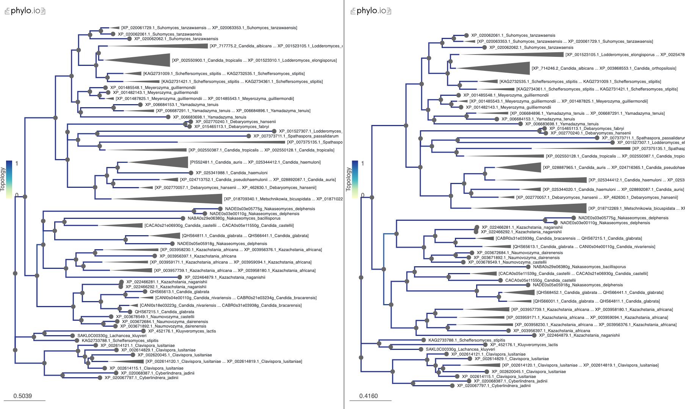

# Goal
There are three changes in this version. First, the homolog list has been expanded to include additional species and homologs identified in newer assemblies. See `02-blast/analysis/expanded-blast` for details. Second, we will experiment with alignment trimming software and test its impact on the resulting tree. In particular, we will try [BMGE](http://gensoft.pasteur.fr/docs/BMGE/1.12/BMGE_doc.pdf) and [ClipKIT](https://github.com/JLSteenwyk/ClipKIT). The former calculates a score that is closely related to entropy, and weight it by a similarity matrix. The idea is to come up with a measure of how likely it is for evolution to generate the observed character states in the column (of the alignment). Some cutoff is used to remove "unlikely" columns. The latter is from the Rokas lab. Instead of removing poorly aligned columns, the software tries to retain columns based on a measure related to how informative it is for parsimony inference. I'll try both methods.

# Notes
## 2022-10-19 Compare protein evolution models on tree results
In response to one of the reviewers' comments on the choice of the ML parameters, I used [modeltest-ng](https://github.com/ddarriba/modeltest) (downloaded as a static v0.17 built for mac, GUI) to select the best model. The result is `VT+I+G4` by either BIC or AIC. Previously I used LG+G4, a choice made primarily based on the raxml-ng github wiki's examples (now the updated wiki mostly uses GTR+G). I reran `raxml-ng` using the `VT+I+G4` model and got a better likelihood (logL: -87073.5, BIC: 176827.4) than what I got with `LG+G4` (logL: -87348.1, BIC: 177370.4). To see how the difference in model affects the topology, I reran `Generax` on the newly generated `raxml-ng` tree using `VT+I+G4` and used [phylo.io](https://beta.phylo.io/) to compare the two corrected trees. The result is highly similar, with only minor changes in some local topologies.

The dark blue color in the two trees above indicate concordant topologies. There are a few branches that show slightly lighter blue, suggesting differences. By and large, the two trees show the same topology. The Robinson-Foulds distance between the two trees are 20/2 = 10. 95% of the leaf nodes were found to be consistent between the two.

## 2022-05-17 Summarize reconciled gene tree results

Here I'll focus on the `clustalo` alignment based results first. The goal is to work out the reconciliation event results both with and without _M. bicuspidata_, reconciled with two different species trees with different placement for the _Debaryomyces_ clade.

First, let's check the final likelihood scores. The main comparison is between the two species tree topologies for the same alignment file.

| #    | _M. bicuspidata_ | Species tree | Phylogenetic LL | Reconcile LL | Joint LL |
| ---- | ---------------- | ------------ | --------------- | ------------ | -------- |
| A    | included         | Shen 2018    | -87384.2        | -481.7       | -87865.9 |
| B    | included         | Edited       | -87379.4        | -478.0       | -87857.4 |
| C    | Excluded         | Shen 2018    | -72943          | -426.4       | -73369.4 |
| D    | Excluded         | Edited       | -72943          | -416.4       | -73359.4 |

Overall it seems the edited species tree topology resulted in lower joint log likelihood scores. This would support the alternative placement of _D. hansenii_ and _D. fabryi_ as outgroups of _C. auris_ and the MDR clade species, but as sister group with the _C. albicans_ and others.

## 2022-05-16 Remove _M. bicuspidata_

To see how excluding this species, in which 10/29 genes are labeled as "incomplete" in the refseq database, affect the resulting tree topology. As a result of this, I now have eight separate trees: with or without _M. bicuspidata_, based on the `clustalo` or the `hmmalign` alignment and reconciled with the Shen _et al._ 2018 species tree or one in which I manually moved the _Debaryomeces_ clade to be the outgroup for the MDR clade.

So far I've only built trees using `ClipKIT` trimmed alignments -- the program preserved most of the columns and mostly removed columns with too many missing states. This led me to expect that a tree based on untrimmed alignment would be very similar with one based on the trimmed one. 

## 2022-05-15 generax reconciliation

In previous analyses, I've used Notung 2.9 to reconcile the gene tree with the species tree. Provided with bootstrap (or similar) support values for the gene tree inference, it is preferable to account for that information. In Notung, this is done via the "rearrangement" procedure: the user specifies a "cutoff" for the support value. Notung algorithm takes all branches whose support values are below the cutoff and test all rearrangement and calculate the total event scores for the resulting tree. It then presents the rearranged tree with the lowest total event score. The downside of this approach is that the choice of the cutoff is arbitrary and can have a large impact on the resulting tree topology. Later when analyzing the within species variations in _C. auris_,  I discovered another program called `generax`, which takes a different approach to the above challenge: instead of relying on the bootstrap support, it takes a starting gene tree and a species tree. It then explicitly model the evolution of the gene family based on the species tree, including speciation, duplication, loss and HGT and incorporate those likelihoods into the total likelihood score. Here I managed to install `generax v2.0.4` using `mamba install -c conda-forge generax=2.0.4`. This version performs reconciliation by default (so I don't have to load the resulting gene tree and the species tree in Notung to do it manually).

## 2022-05-14 raxml-ng

I switched completely to `raxml-ng` and figured out how to use the MPI hybrid mode for parallelization. See `script/README.md`
# Results files
file(s) | description | source 
------- | ----------- | ------
