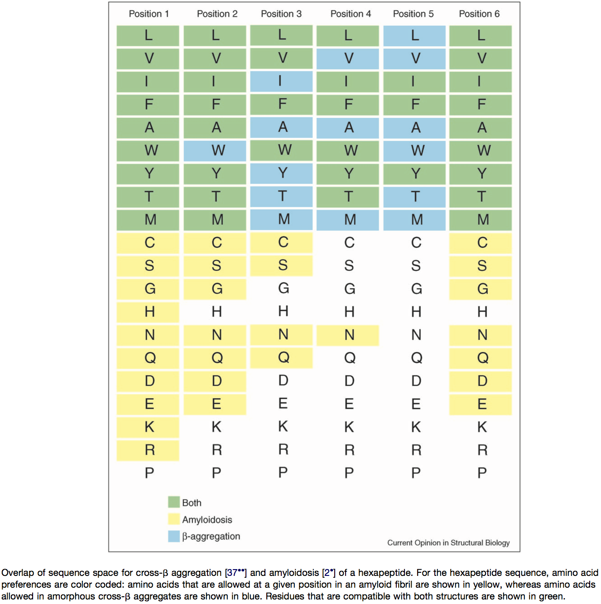

```{r setup}
suppressPackageStartupMessages(library(Biostrings))   # for pairwise alignment and calculating distance
suppressPackageStartupMessages(library(tidyverse))    # for data wrangling and visualization
#suppressPackageStartupMessages(library(Hmisc))       # for summary functions
suppressPackageStartupMessages(library(cowplot))      # supplement ggplot
suppressPackageStartupMessages(library(stringdist))   # for calculating string distances
suppressPackageStartupMessages(library(cluster))      # for visualizing clustering results
suppressPackageStartupMessages(library(dynamicTreeCut))     # for cutting trees
```

The libraries below are used for deriving and plotting weblogos
```{r install_library}
if(!requireNamespace("msa", quietly = TRUE))
  BiocManager::install("msa")
suppressPackageStartupMessages(library("msa"))

if(!requireNamespace("RWebLogo", quietly = TRUE))
  install.packages("RWebLogo")
suppressPackageStartupMessages(library("RWebLogo"))
```

## Background
Adhesin molecules have been shown to harbor aggregation prone sequences, which are often short peptides that are hydrophobic, with preferences for certain amino acids. There is an intricate relationship between the aggregation-prone sequences and amyloid-formation propensity of a protein. The TANGO software was developed to use a thermodynamics model to predict the aggregation potential for short peptide, and has been shown to work for full length protein predictions. Reference for the tool is below:

Fernandez-Escamilla A-M, Rousseau F, Schymkowitz J, Serrano L. 2004. Prediction of sequence-dependent and mutational effects on the aggregation of peptides and proteins. Nature Biotechnology 22:1302–1306.


## Goal

- Analyze TANGO predictions to extract $/beta$-aggregation prone sequences in XP_028889033 homologs. Specifically, determine the presence, frequency and distribution of the TANGO sequences in each protein homolog.
- Attempt to cluster the TANGO sequences by amino acid sequence similarity, and explore the question of the evolution of the C-terminal portion of the protein homologs containing such sequences. The question is, compared with the N-terminal globular domain, does the C-terminal sequence evolve faster or have similar rates of evolution? Did related sequences tend to have the same TANGO motifs? Do they differ in the frequency and distribution of them?

    In other words, we are curious about whether homologs that are more closely related based on the N-terminal domain also share more similarity in their C-terminus sequences. The expectation is yes, which would support the evolutionary model where the ancestral gene was repeatedly duplicated independently in various lineages, and the duplicates subsequently went through fast evolution of their C-terminus, potentially through de novo mutations and repeat-mediated tandem duplications and losses, which led to different lengths and composition of the C-terminus. This, in turn, made the homologs show different total length and domain architecture, which either reflected species-specific requirement for the same function or evolution of distinct functions. For the former, one could imagine that for a homolog in one species to function as an adhesin, the NTD must protrude outside the cell wall matrix, and since different species have different cell wall matrix thickness and composition, the stalk of the protein must adjust itself so the NTD is raised enough to protrude outside.
    
## Analysis
### Custom function to extract information from TANGO output

This function extracts the information of interest from the TANGO output file. It is designed to be used on a single file. Looping through all files in a folder can be easily achieved with `sapply` over a list of files using `list.files`.

```{r extract_tango_info}
extract_tango <- function(tango_output, agg_threshold = 5, required_in_serial = 5) {
    require(tidyverse)
    tmp <- read_tsv(file = tango_output, col_types = "icddddd") %>% 
        # a boolean vector for residues above threshold
        mutate(pass = Aggregation > agg_threshold)
    pass.rle <- rle(tmp$pass) # this creates a run length encoding that will be useful for identifying the sub-sequences in a run longer than certain length
    # --- Explanation ---
    # this rle object is at the core of this function
    # an example of the rle looks like
    #   lengths: int[1:10] 5 19 20 8 1 5 19 6 181 18
    #   values: logi[1:10] F T  F  T F T F  T F   T
    #   note that by definition the values will always be T/F interdigited
    # our goal is to identify the sub-sequences that is defined as a stretch of 
    # n consecutive positions with a score greater than the cutoff and record the
    # sub-sequence, its length, start and end position, 90% quantile of the score
    # --- End of explanation ---
    # 1. assigns a unique id for each run of events
    tmp$group <- rep(1:length(pass.rle$lengths), times = pass.rle$lengths)
    # 2. extract the subsequences
    agg.seq <- tmp %>% 
        filter(pass) %>% # drop residues not predicted to have aggregation potential
        group_by(group) %>% # cluster by the runs
        summarize(seq = paste0(aa, collapse = ""),
                  start = min(res), end = max(res), length = n(),
                  median = median(Aggregation),
                  q90 = quantile(Aggregation, probs = 0.9),
                  ivt = sum(aa %in% c("I","V","T")) / length(aa),
                  .groups = "drop") %>% 
        mutate(interval = start - lag(end) - 1) %>% 
        filter(length >= required_in_serial) %>% 
        select(-group)
    return(agg.seq)
}
```

**Apply to my XP_028889033 homologs**

```{r apply}
getwd()
tango.output.files <- list.files(path = "tango-output", pattern = ".txt|.txt.gz", full.names = T)
# the read_csv() function used in the custom function can automatically decompress gzipped files
tango.res <- lapply(tango.output.files, extract_tango)
names(tango.res) <- gsub(".txt|.txt.gz", "", basename(tango.output.files))
# to add species information
seqInfo.tango <- read_tsv("raw-output/XP_028889033_homologs.tsv", comment = "#", col_types = c("ccci"))
tango.res.df <- bind_rows(tango.res, .id = "id") %>% 
  left_join(select(seqInfo.tango, -length), by = c("id" = "id"))
# save the tango output
write_tsv(tango.res.df, "tango_summary_table.tsv.gz")
# mutate(species = str_split(id, "_(?!.*_)", simplify = TRUE)[,2]) 
# extract the species names
# credit: https://stackoverflow.com/questions/20454768/how-to-split-a-string-from-right-to-left-like-pythons-rsplit
# the split pattern is equivalent to the rsplit() function in python
```

### Species-specific TANGO motifs?
We will group the TANGO sequences into two groups based on whether they are in within the N-terminal Hyp_reg_CWP domain or not.
```{r, results='asis'}
# include the pfam domain information to classify the tango sequences
pfam <- read_tsv("raw-output/HMMER-HMMScan-Pfam-hits.tsv", col_types = "ciiiicciiidddiic")
tango.res.df1 <- tango.res.df %>% 
  left_join(pfam %>% 
              filter(hmm_name == "Hyphal_reg_CWP") %>% 
              select(name = seq_id, domain.start = envelope_start, domain.end = envelope_end), 
            by = c("name" = "name")) %>% 
  mutate(in.domain = (start >= domain.start-10 & end <= domain.end)) %>% 
  select(-domain.start, -domain.end)
# find unique motifs and count the number of proteins and species represented
motif.summary <- tango.res.df1 %>% 
    group_by(in.domain, seq) %>% 
    summarize(n = n(), n.prot = n_distinct(id), n.sps = n_distinct(species),
              medScore = round(mean(median),1),
              IVT = round(mean(ivt),2),
              avg.intv = round(mean(interval, na.rm = T),1), sd.intv = round(sd(interval, na.rm = T),1),
              species = paste0(unique(species), collapse = ","), .groups = "drop") %>% 
    arrange(desc(n))

cat("#### TANGO sequences inside the Hyphal_reg_CWP domain")
print(filter(motif.summary, in.domain) %>% select(-in.domain))
cat("#### TANGO sequences outside the Hyphal_reg_CWP domain")
motif.summary0 <- motif.summary %>% filter(in.domain)
motif.summary <- motif.summary %>% filter(!in.domain) %>% select(-in.domain)
print(motif.summary)
cat("#### What is the level of cross-species use of the same motif?")
motif.summary %>% count(n.sps, wt = n)
cat("#### What are the motifs shared by three or more species?")
motif.summary %>% filter(n.sps >= 3) %>% arrange(desc(n))
```
_**Discussion**_

1. TANGO sequences within the Hyphal_reg_CWP domain are distinct in their sequences from the ones outside and tend to be low in "IVT" content and low in beta-aggregations score.
1. There are very little sharing of TANGO sequences between clades (the MDR and _albicans_) or within the _albicans_ clade. Within the MDR clade, there is a dominant class of motifs, represented by "GVVIVTT".

#### Identify variants of "GVVIVTT"
Since this is the dominant motif used in the MDR clade homologs, I want to determine
1. What percent of the TANGO sequences in the MDR clade belong to this class?
1. Are they used at all in homologs from non-MDR clade species?
1. Among the remaining TANGO sequences, can we identify other clusters?

To design the regular expression, I looked at both the TANGO sequences that "look similar" to "GVVIVTT" and also used the patterns summarized in the following reference:

    Rousseau F, Schymkowitz J, Serrano L. 2006. Protein aggregation and amyloidosis: confusion of the kinds? Current Opinion in Structural Biology 16:118–126.

{width=75%}
```{r, results='asis'}
seqs <- motif.summary$seq
# core group, must be G-[VI]x4-TT
pat0 <- "G[VI]{4}TT"
# version 1, requires G-[ALVI][VI][LVI][VI]-(either end of string or at least 1 suitable residue) 
#                  OR (G not required)-[VI]x4-(two suitable residues)
pat1 <- "G[ALVI][VI][LVI][VI]([LVIFAWYTM]{1,2}|$)|[VI]{4}[LVIFAWYTM]{2}"

cat(paste("Identify the group of TANGO sequences most similar to 'GVVIVTT' using the pattern", pat0, sep = " "))
match0 <- grep(pat0, seqs)
motif.summary[match0,] %>% arrange(desc(n)) %>% select(seq, n, medScore, IVT, species)

cat(paste("Identify TANGO sequences with slightly more variation from 'GVVIVTT', using `", pat1, "`", sep = ""))
match1 <- grep(pat1, seqs)
# exclude those already identified with pattern 0
motif.summary[setdiff(match1, match0),] %>% arrange(desc(n)) %>% select(seq, n, medScore, IVT, species)
```
Now let's check what's remaining among the TANGO sequences in the MDR clade homologs
```{r, results='asis'}
mdr <- c("Cauris","Cpseudohaemulonis","Cduobushaemulonis","Chaemuloni")
albicans <- c("Calbicans","Ctropicalis","Cdubliniensis")
seqc <- tango.res.df1 %>% 
  filter(!in.domain) %>% 
  select(seq, median, species) %>% 
  mutate(clade = ifelse(species %in% mdr, "MDR", ifelse(species %in% albicans, "albicans", "other")),
         group = ifelse(seq %in% seqs[match0], "GVVIVTT", ifelse(seq %in% seqs[match1], "GVVIVTT-like", NA)))

cat("#### What percent of TANGO sequences in the MDR clade belong to the GVVIVTT group?")
seqc %>% filter(clade == "MDR") %>% count(group) %>% mutate(freq = round(n/sum(n),2))

seqs.mdr.non <- seqc %>% filter(clade == "MDR", is.na(group)) %>% pull(seq) %>% unique()
# cat("#### What are the non-GVVIVTT TANGO sequences in _C. auris_ for example?")
# motif.summary %>% 
#   filter(seq %in% seqs.mdr.non, species == "Cauris") %>% 
#   arrange(desc(medScore), desc(n)) %>% 
#   select(seq, n, medScore, IVT, species)
```

#### Are there any dominant clusters among the non-GVVIVTT sequences?
If we look closely at the query and type sequence of this protein family, i.e. XP_028889033 in _C. auris_, we can see a few more motifs that occur more than a few times, e.g. FTTYTSTW: 

```{r}
tango.res.df1 %>% filter(id == "XP_028889033.1", !in.domain) %>% count(seq) %>% arrange(desc(n), seq)
```
In fact, this sequence is part of the repeated domain "Hyr1" in the non-NTD part of this protein. Let's see how often does this motif occur in the MDR clade homologs, using the regular expression `TTY[TS]{2}[TSI]W`.
```{r}
tmpseq <- seqc %>% filter(clade == "MDR", is.na(group)) %>% pull(seq)
tmpn <- sum(grepl("TTY[TS]{2}[TSI]W", tmpseq))
```

A total of `r tmpn` additional TANGO sequences are pulled out using this regex: `r grep("TTY[TS]{2}[TSI]W", tmpseq, value = T)`. So clearly it is not a major pattern.

Next we attempt to use clustering algorithms to look for over-represented motifs. There are two steps in clustering. First, we need to compute the pairwise distance for all sequences to be clustered. We will use the edit distance (counting the number of insertion/deletion/substitution/transposition required to go from one word to another). Second, we need to use an algorithm to produce the cluster. Here we will try either the hierarchical clustering or PAM (Partition around the medoids) method.

Hierarachical clustering: comparing different clustering algorithms using the Agnes package:
```{r gather_motif}
# compute distance matrix between strings using the full Damerau-Levenshtein method
# reference: https://medium.com/my-datascience-journal/using-string-distance-to-group-text-variables-in-r-aa6d0f9226a6
motif.dist <- stringdistmatrix(seqs.mdr.non, method = "osa", weight = c(d = 0.2, i = 0.2, s = 0.1, t = 1), useNames = TRUE)
# by assigning different weights to deletion, insertion, substitution and transposition, I'm actively discouraging transposition, which cannot be achieved by any known mutation mechanism in one step. I'm also disfavoring insertion and deletion, although i would have loved to be able to distinguish between indels at the end (end gaps) from internal indels. The former is totally fine (I would like to cluster a substring of a longer motif with that longer one).

# assess clustering methods
m <- c( "average", "single", "complete", "weighted", "ward")
names(m) <- c( "average", "single", "complete", "weighted", "ward")

# function to compute coefficient
ac <- function(x) {
  agnes(motif.dist, method = x)$ac
}

map_dbl(m, ac)
```

Based on the result above, I used the Ward method to cluster the remaining sequences and show them as a hierarchical tree. To identify the clusters, I used the dynamic cutree method that can adapt the height at which to cut the tree using information such as the "shape" (including spread and gap) of the subtrees. As an alternative to hierarchical clustering, I also tested the PAM method (see below for details). I then visualized the clustering results as colored bars behind the hierarchical tree.
```{r clustering, warning=FALSE, results='asis'}
# hierarchical clustering using Ward method
motif.clust <- agnes(motif.dist, method = "ward")
# dynamically cut the tree
dyn.cut <- dynamicTreeCut::cutreeDynamic(dendro = as.hclust(motif.clust), method = "hybrid", distM = as.matrix(motif.dist), deepSplit = 2, minClusterSize = 5)

# alternatively use Partition Around the Medoids (PAM) method to cluster the sequences, using the same number of clusters as the dynamic cutree result
motif.pam <- pam(motif.dist, k = 7, diss = TRUE)
seq_grp <- cbind("hclust" = dyn.cut, "pam" = motif.pam$clustering)

# plot the hierarchical tree
pltree(motif.clust, cex = 0.2, hang = -1, xlab = "TANGO sequences")
# add the color bars
dendextend::colored_bars(seq_grp, as.dendrogram(motif.clust), add = TRUE, y_shift = -1.5, cex.rowLabels = 0.8)
cat("**Hierarchical clustering** colored bars at the bottom indicate cluster labels by the hierarchical clustering and the PAM approach. Note that the colors are randomly assigned and don't match between the two methods.")
dev.print(pdf,"img/20201225-mdr-clade-noncore-motif-cluster-dendrogram.pdf")

# show all the sequences and clustering result
cat("**Shown below are the sequences and their cluster labels**")
as.tibble(cbind("seq" = seqs.mdr.non, seq_grp)) %>% arrange(pam)
```

Here are the "medoids" from the PAM cluster: 

> `r motif.pam$medoids`

_**Discussion**_

- Overall I didn't immediately identify any other "over-represented" motifs
- An important caveat in this analysis is that the clustering is dependent on the distance measure, and since the measure we use, i.e. edit distance, considers the number of "basic operations" to turn one sequence to another, the order and composition of the residues in the motifs both matter. But maybe, with such short motifs, composition could be all that is important, in which case there doesn't have to be "sequence similarity".

##### Explanation for the PAM method
K-medoids clustering, aka partition around medoids (PAM). For details of this method, refer to [wikipedia](https://en.wikipedia.org/wiki/K-medoids) and [r doc for the `pam()` function](https://www.rdocumentation.org/packages/cluster/versions/2.1.0/topics/pam). According to the latter, PAM has several advantages over K-means, including clustering around one of the objects (by miniziming within cluster dissimilarity _around_ that medoid). This has a great advantage for this case as I can easily examine the "meoids" after the clustering and see if those representatives should have been grouped together.


#### Over-represented TANGO sequences among the _albicans_ clade
We previously showed that the "GVVIVTT" and its variants are heavily used in the MDR clade homologs but virtually non-existing outside the clade. Our question here is whether there are other similar dominant sequences among the _albicans_ clade homologs. We will use a similar clustering approach as above.

```{r, results='asis', warning=FALSE}
# sequences from the albicans clade homologs
seqs.alb <- seqc %>% filter(clade == "albicans") %>% pull(seq) %>% unique()
# calculate the edit distance among the sequences
motif.dist.alb <- stringdistmatrix(seqs.alb, method = "osa", weight = c(d = 0.2, i = 0.2, s = 0.1, t = 1), useNames = TRUE)
# use Ward method to perform hierarchical clustering
motif.clust.alb <- agnes(motif.dist.alb, method = "ward")
# dynamic cutree to avoid using a fixed tree height
dyn.cut.alb <- dynamicTreeCut::cutreeDynamic(dendro = as.hclust(motif.clust.alb), distM = as.matrix(motif.dist.alb), method = "hybrid", deepSplit = 2, minClusterSize = 5)

motif.pam.alb <- pam(motif.dist.alb, k = 6, diss = TRUE)
seq_grp.alb <- cbind("hclust" = dyn.cut.alb, "pam" = motif.pam.alb$clustering)

# plot the hierarchical tree
pltree(motif.clust.alb, cex = 0.2, hang = -1, xlab = "TANGO sequences")
# add the color bars
dendextend::colored_bars(seq_grp.alb, as.dendrogram(motif.clust.alb), add = TRUE, y_shift = -1.5, cex.rowLabels = 0.8)
#dev.print(pdf,"img/20201230-albicans-clade-motif-cluster-dendrogram.pdf")
cat("**Hierarchical clustering** colored bars at the bottom indicate cluster labels by the hierarchical clustering and the PAM approach. Note that the colors are randomly assigned and don't match between the two methods.")
```

```{r, results='asis'}
# show all the sequences and clustering result
cat("**Shown below are the sequences and their cluster labels**")
as.tibble(cbind("seq" = seqs.alb, seq_grp.alb)) %>% arrange(pam)
```
Here are the “medoids” from the PAM cluster:

> `r with(motif.pam.alb,paste(medoids, table(clustering), sep = ": ", collapse = "\n"))`

Here we don't see any pattern. Note, however, that clustering is built upon the distance matrix. If the way we calculated the string distance doesn't make sense, clustering results will not make any sense either. I decide to leave the question here for now. An idea is to build a k-mer dictionary from all _albicans_ clade TANGO sequences and look for over-represented k-mers (this wouldn't work, however, if the function of the elements only rely on the sequence composition, not the order in which the residues are arranged in). The 1-mer frequency is the amino acid residue composition, from which we could predict the dimer, 3-mer and so on's frequency, and compare them with the observation.

### Spatial distribution of TANGO motifs
Here we switch to a different question: instead of asking whether different species or clades use different over-represented sequences -- which, by the way, is true at least in the case of the "GVVIVTT" in the MDR clade -- we now ask whether the number and spacial distribution of the sequences show any distinct patterns.

#### Number and spacing of TANGO hits in each protein sequence
We first summarize the motif sequences within each protein, with the goal of identifying protein-specific patterns (e.g. frequently used motifs).

```{r}
motif.per.seq <- tango.res.df1 %>% 
  # limit to sequences not in the PF11765 domain and with median score >= 30
  filter(!in.domain, median >= 30) %>% 
  group_by(id) %>% 
  # recalculate the interval
  mutate(interval = start - lag(end) - 1) %>% 
  group_by(seq, .add = TRUE) %>% 
  summarize(species = unique(substr(species, 1,4)),
            n = n(),
            medScore = round(mean(median),1),
            IVT = round(mean(ivt),2),
            avg.intv = round(mean(interval, na.rm = T),1),
            sd.intv = round(sd(interval, na.rm = T),1),
            # median absolute deviation is a robust measure of the scale parameter
            # https://www.rdocumentation.org/packages/stats/versions/3.6.2/topics/mad
            mad.intv = round(mad(interval, na.rm = T),1),
            .groups = "drop_last") %>% 
  arrange(species, id, desc(n), desc(medScore))

print(motif.per.seq)
```
```{r, results='asis'}
speciesTreeOrder <- rev(c("Cduobushaemulonis", "Cpseudohaemulonis", "Chaemuloni", "Cauris", "Clusitaniae", "Dhansenii", "Cparapsilosis", "Lelongisporus", "Ctropicalis", "Cdubliniensis", "Calbicans", "Sstipitis", "Klactis", "Ncastellii", "Cglabrata", "Nbracarensis", "Ndelphensis", "Nnivariensis"))
motif.per.seq1 <- tango.res.df1 %>% 
  # limit to sequences not in the PF11765 domain and with median score >= 30
  filter(!in.domain, median >= 30) %>% 
  group_by(species, id) %>% 
  # recalculate the interval
  mutate(interval = start - lag(start)) %>% 
  #group_by(seq, .add = TRUE) %>% 
  summarize(n.type = length(unique(seq)),
            n.all = n(),
            medScore = round(mean(median),1),
            IVT = round(mean(ivt),2),
            avg.intv = round(mean(interval, na.rm = T),1), 
            IQR.intv = round(IQR(interval, na.rm = T)/1.349 ,1),
            # median absolute deviation is a robust measure of the scale parameter
            # https://www.rdocumentation.org/packages/stats/versions/3.6.2/topics/mad
            mad.intv = round(mad(interval, na.rm = T),1),
            seqs = paste(unique(seq), collapse = ","),
            .groups = "drop_last") %>% 
  right_join(select(seqInfo.tango, -name)) %>% 
  mutate(n.type = ifelse(is.na(n.type), 0, n.type),
         n.all = ifelse(is.na(n.all), 0, n.all),
         Clade = ifelse(species %in% mdr, "MDR", 
                        ifelse(species %in% albicans, "albicans", "other")),
         species = factor(species, levels = speciesTreeOrder, labels = substr(speciesTreeOrder, 1, 4))) %>% 
  arrange(species, desc(n.all), desc(medScore))
motif.per.seq1
```

**For each homolog, count the total number and types of TANGO sequences and calculate summary statistics of the intervales, i.e. distance between adjacent TANGO sequences.**

MAD: Medial Absolute Deviation; IQR: Inter-Quartile Range; both are robust measures of deviation. 
```{r, fig.width=7, fig.height=4}
#clavispora <- c("Cduo","Cpse","Chae","Caur","Clus")
#candida <- c("Cpar","Lelo","Ctro","Cdub","Calb")
#saccharo <- c("Klac","Ncas","Cgla","Nbra","Ndel","Nniv")
#clade2.col <- c("#FEA0AB", "yellow3", "grey20", "grey50")
motif.per.seq1 <- motif.per.seq1 %>% 
  mutate(reg.spaced = ifelse(n.all > 3 & mad.intv < 5, TRUE, FALSE),
         mad.intv = ifelse(n.all > 2, mad.intv, NA))
#  mutate(Clade2 = ifelse(species %in% clavispora, "Clavispora",
#                         ifelse(species %in% candida, "Candida", 
#                                ifelse(species %in% saccharo, "Saccharomycetaceae", "other"))))
p0 <- motif.per.seq1 %>% 
  ggplot(aes(x = species, fill = Clade)) + geom_bar() + coord_flip() +
  scale_y_continuous(breaks = c(0,5,10,15), minor_breaks = NULL) + 
  ylab("# homologs")

p1 <- motif.per.seq1 %>% 
  ggplot(aes(x = species, y = n.all, color = Clade)) + 
  geom_point(aes(pch = reg.spaced), position = position_jitter(0.25), size = 2) +
  #geom_text(aes(label = ifelse(n.all > 2 & mad.intv < 5, "*", "")),
  #          color = "grey20") +
  scale_shape_manual(name = "Regularly spaced", values = c(21, 19)) +
  #scale_color_manual(values = clade2.col) +
  coord_flip() + ylab("# TANGO hits/protein")# +
#  scale_y_continuous(trans = "pseudo_log", breaks = c(0:5,10,20,50,100),
#                     minor_breaks = NULL)
legend <- get_legend(p1 + guides(color = guide_legend(nrow = 1), pch = guide_legend(nrow = 1)) +
                       theme(legend.position = "bottom"))

p2 <- motif.per.seq1 %>% 
  ggplot(aes(x = species, y = mad.intv, color = Clade)) + 
  #ggplot(aes(x = species, y = mad.intv)) + 
  geom_point(aes(pch = reg.spaced), position = position_jitter(0.25), size = 2) +
  scale_shape_manual(name = "Regularly spaced", values = c(21, 19)) +
  scale_y_continuous(trans = "sqrt", 
                     breaks = c(0,1,10,100), minor_breaks = NULL) +
  ylab("MAD of distance between motifs") + coord_flip()

prow <- plot_grid(p0 + theme(legend.position = "none" ),
          p1 + theme(axis.text.y = element_blank(), axis.title.y = element_blank(),
                     legend.title = element_text(size = rel(0.8)), legend.text = element_text(size = rel(0.8)),
                     legend.position = "none"),
#          ncol = 2, rel_widths = c(1,2))
          p2 + theme(axis.text.y = element_blank(), axis.title.y = element_blank(),
                     legend.position = "none"),
          ncol = 3, rel_widths = c(1.5,3,3))

plot_grid(prow, legend , ncol = 1, rel_heights = c(1,.1))

ggsave("img/20210111-tango-hits-number-and-interval.png", width =6, height = 4)
```

**_Discussion_**

1. In this protein family, the MDR clade species stand out in that they are enriched for _regularly spaced TANGO hit sequences_, primarily variants of “GVVIVTT”. Pay particular attention to the number of instances, average interval (distance to the previous TANGO hit, not necessarily the same sequence) and the median absolute difference (a robust measure of scale, or “spread”). In comparison, other species’ sequences have less prominent patterns.
1. One question is, are there other over-represented TANGO sequences in the MDR or non-MDR species? As shown above, there doesn't appear to be.

#### Score distribution in relation to IVT percentage and length of the sequence
```{r}
p <- tango.res.df1 %>% 
  filter(!in.domain) %>% 
  mutate(IVT = cut(ivt, breaks = c(0,0.25,0.5,0.75,1), include.lowest = TRUE),
         Length = cut(length, breaks = c(5,7,9,11,25), include.lowest = TRUE)) %>% 
  ggplot(aes(median)) + scale_fill_brewer(type = "div", palette = 1)

p + geom_histogram(aes(fill = IVT), binwidth = 2, position = "stack")

p + geom_histogram(aes(fill = Length), binwidth = 2, position = "stack")
```

_**Discussion**_

We see that the distribution of scores is somewhat bimodal. If we use 30 as the cutoff, perhaps we will see different types of sequences?

#### Location of TANGO sequences within the protein
Here we would like to explore the spatial distribution, including relative location of the TANGO sequences and the intervals between adjacent sequences.
```{r eda, fig.width=10, fig.height=4}
# Where are the TANGO identified motifs located within a sequence?
# color by 90% quantile of agg. probability
p2 <- tango.res.df %>% 
    mutate(score = cut(q90, breaks = c(0,25,50,75,100))) %>% 
    ggplot(aes(start, fill = score)) + geom_histogram(binwidth = 50) +
    scale_fill_brewer(type = "seq", palette = "YlGnBu")

p3 <- tango.res.df %>% 
    filter(start <= 1000) %>% 
    mutate(score = cut(q90, breaks = c(0,25,50,75,100))) %>% 
    ggplot(aes(start, fill = score)) + geom_histogram(binwidth = 25) +
    scale_fill_brewer(type = "seq", palette = "YlGnBu")

plot_grid(p2, p3)
ggsave("img/20201223-motif-location-group-by-agg-score.png")

# color by sequence motif length
p4 <- tango.res.df %>% 
    mutate(Length = cut(length, breaks = c(5,7,9,11,25), include.lowest = TRUE)) %>% 
    ggplot(aes(start, fill = Length)) + geom_histogram(binwidth = 50) +
    scale_fill_brewer(type = "seq", palette = "YlGnBu")

p5 <- tango.res.df %>% 
    filter(start <= 1000) %>% 
    mutate(Length = cut(length, breaks = c(5,7,9,11,25), include.lowest = TRUE)) %>% 
    ggplot(aes(start, fill = Length)) + geom_histogram(binwidth = 25) +
    scale_fill_brewer(type = "seq", palette = "YlGnBu")

plot_grid(p4, p5)
ggsave("img/20201223-motif-location-group-by-length.png")
```


### Appendix: using proper amino acid substitution matrix to calculate distance
Here we use the `Biostrings::stringDist()` function to calculate the pairwise distances between the motifs. What's different about this method compared to the generic string distance function used above is that it is based on pairwise alignment. Specifically, the function uses the following procedure to calculate the distance between any pair of sequences:

1. perform pairwise alignment (local/global) using a given substitution matrix (e.g. BLOSUM62)
1. use the negative of the score as the distance measure


    note that this is different from the edit distance (Levenshtein), which is what is used in the method above

Because the distance calculation is based on pairwise alignment, we need to decide on the "type" of alignment and the scoring matrix to use. According to the [manual](https://bioconductor.org/packages/release/bioc/vignettes/Biostrings/inst/doc/PairwiseAlignments.pdf) of `Biostrings`, there are five types, which differ in which part of the sequence the substitution scoring and gap panelties are applied to:

1. Global

    end-to-end: $[a_1, b_1] = [1,n_1]$ and $[a_2,b_2] = [1,n_2]$, where $n_1$ and $n_2$ denote the lengths of the query and subject sequences, and $a_i$ and $b_i$ denote the starting and end position in the query and subject that the alignment scoring is applied to.

1. Local

    align string fragments: $[a_1, b_1]$ and $[a_2, b_2]$; based on [wikipedia](https://en.wikipedia.org/wiki/Smith%E2%80%93Waterman_algorithm), the local alignment differs from the global alignment in that it sets the negative scoring matrix cells to zero. This means in this mode mismatches are _not penalized_.
    
1. Overlap

    align whole strings without **end gap** penalties: ${[a_1, b_1] = [a_1,n_1], [a_2, b_2] = [1, b_2]}$ or ${[a_1, b_1] = [1,b_1], [a_2, b_2] = [a_2, n_2]}$
    
1. Subject overlap (global-local)

    align whole strings in `pattern` with consecutive subsequences of `subject`: $[a_1,b_1]=[1,n_1]$ and $[a_2,b_2]$

1. Query overlap (local-global)

    align consecutive subsequences in `pattern` with whole strings of subject: $[a_1,b_1]$ and $[a_2,b_2]=[1,n_2]$
    
As for the scoring matrix, we will use a fixed one, BLOSUM62. The `pairwiseAlignment()` also allows for a quality-based scoring matrix. But since our sequences have no associated "quality", or "weights", we will not use that feature.

Lastly, the default for gap opening and extension penalty are 10 and 4, which are quite high for the length of the motif sequences. Therefore we should see no gapped alignment, which I think is the right choice.
```{r test_pairwise_alignmen_params}
# set.seed(seed = 123)
# sample.patterns <- sample(seqs, 10)
sample.patterns <- c("GVVIVTT", "FGVVTITT", "IVIITSGSGIVIVTT", "FTTFTTTFTT", "VLVTT", 
                     "GFFVTSL", "LIVFY", "LSLQALLSAVYCLSSVLALTIT", "FTSIWTTV", "FFSFWLLLNSVLALVIT")
mat <- "BLOSUM50"
pa1 <- pairwiseAlignment(sample.patterns, "GVVIVTT", type = "global", substitutionMatrix = mat)
pa2 <- pairwiseAlignment(sample.patterns, "GVVIVTT", type = "local", substitutionMatrix = mat)
pa3 <- pairwiseAlignment(sample.patterns, "GVVIVTT", type = "overlap", substitutionMatrix = mat)
data.frame(pattern = sample.patterns, glb.aln = aligned(pa1), glb.d = nedit(pa1), glb.S = score(pa1),
           lc.aln = aligned(pa2), lc.d = nedit(pa2), lc.S = score(pa2),
           ov.aln = aligned(pa3), ov.d = nedit(pa3), ov.S = score(pa3))
```

Based on the result above, I decide to try "overlap" (which requires at least one end be anchored) with "BLOSUM" substitution matrix to calculate the distance
```{r}
motif.dist2 <- stringDist(seqs, method = "substitutionMatrix", type = "overlap", substitutionMatrix = "BLOSUM50", gapOpening = 10, gapExtension = 4)
```
```{r determine_optimal_num_clusters}
asw <- numeric(20)
## Note that "k=1" won't work!
for (k in 2:20)
  asw[k] <- pam(motif.dist2, k, diss = TRUE) $ silinfo $ avg.width
k.best <- which.max(asw)
cat("silhouette-optimal number of clusters:", k.best, "\n")

plot(1:20, asw, type= "b", pch = 19, frame = FALSE, main = "pam() clustering assessment",
     xlab= "k  (# clusters)", ylab = "average silhouette width")
axis(1, k.best, paste("best",k.best,sep="\n"), col = "red", col.axis = "red")
```

```{r}
motif.clust2 <- agnes(-motif.dist2, method = "ward")
pltree(motif.clust2, cex = 0.05, hang = -1)
```

