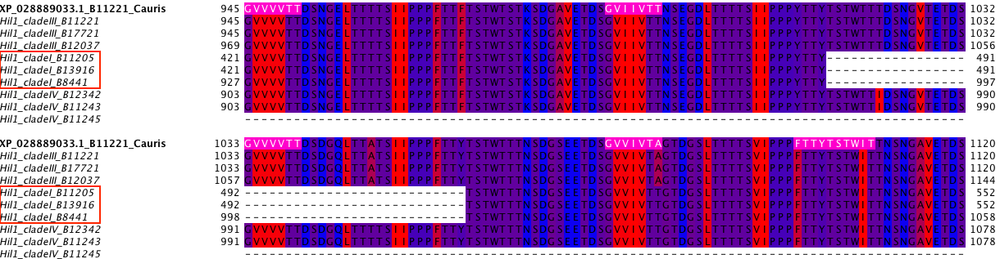
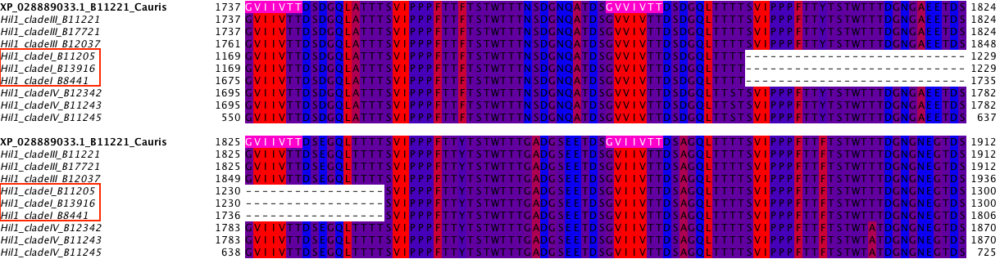

<!--ts-->

   * [Introduction](#introduction)
   * [Updates](#updates)
      * [2021-05-22 [HB]](#2021-05-22-hb)
   * [Analysis](#analysis)
      * [1. Obtain sequences](#1-obtain-sequences)
      * [2. Sequence feature characterization](#2-sequence-feature-characterization)
      * [3. Alignment and gene tree](#3-alignment-and-gene-tree)
      * [4. TANGO prediction](#4-tango-prediction)
      * [5. Confirm C-terminal repeat number variation with additional strains' genomes](#5-confirm-c-terminal-repeat-number-variation-with-additional-strains-genomes)
         * [tblastn to identify orthologs of XP_028889033 in additional <em>C. auris</em> genomes](#tblastn-to-identify-orthologs-of-xp_028889033-in-additional-c-auris-genomes)
         * [Build fasta sequence from the blast results and align](#build-fasta-sequence-from-the-blast-results-and-align)
      * [6. Identify tandem repeat](#6-identify-tandem-repeat)
      * [7. ST frequency](#7-st-frequency)
      * [8. Dotplot for Hil1-8](#8-dotplot-for-hil1-8)

<!-- Added by: bhe2, at: Fri Jul  9 16:40:30 CDT 2021 -->

<!--te-->
# Introduction
This analysis is inspired by a discussion at the poster session during the 2021 Candida and Candidiasis meeting. One of the questions that come up was whethere there are intra-species variation especially in the C-terminal repetitive region of the protein homologs in _C. auris_. Given that our initial analysis in the case study was based almost exclusively on one strain, B11221 from clade III, it has been on our mind to look into any variation in copy number, domain architecture and other sequence features in other _C. auris_ strains. While there are now 80 (and counting) complete genomes [available](https://www.ncbi.nlm.nih.gov/assembly/organism/498019/latest/), we chose to focus on the four strains that each represent one of the four clades in the Muñoz et al 2018 paper, i.e. B8441 (I), B11220 (II), B11221 (III), B11243 (IV).

A number of findings have already been presented in the Muñoz et al 2021 Genetics paper. Here we first summarize their findings:

1. There are 3-8 members of this protein family in the surveyed _C. auris_ strains. In particular, clade II strains have all lost 5/8 of the members, while the majority of the strains in the other three clades have all 8 (although our reference strain B11221 represents a discrepency between our analysis and theirs, where we only identified 7 and they claimed all 8 are present).
1. All 8 members share the N-terminal Signal Peptide followed by the PF11765 domain, while differing substantially in the sequence makeup of the remaining of the protein. Six of the eight members have intergenic tandem repeats.
1. A genome-wide scan for signatures of accelerated evolution (dN/dS) in each of the four representative strains identified among other genes members of this family, including the _RBR3, HYR3, IFF6_ (gene names based on similarity to _C. albicans_ genes).

The questions we will further pursue in this analysis are:

1. Variability in the tandem repeat copy number.
1. Variability in the TANGO predicted Beta-aggregation sequences.
1. TBD

# Updates
## 2021-05-22 [HB]
Removed strain 6684 from the analysis. I manually commented out the three rows in `output/seq-feature/cauris-renamed-seqinfo.tsv` and since the R script I wrote for assembling the data and plotting them starts with this result file, editing this one file is sufficient to remove the three strains from the R analysis.

# Analysis
## 1. Obtain sequences
I performed blastp with the PF11765 domain sequence from XP_028889033 against the combined protein sequence library from five _C. auris_ strains (two clade II strains were used from the Muñoz et al 2018 paper). See `blast/README.md` for details. The resulting fasta file is soft linked to the `input` folder in this analysis.

To make the sequences more easily identifiable, I'd like to standardize the sequence namesas ">STRAIN_ID alternative_name" as in ">B8441_PIS49865.1 B9J08_004892". See `./script/rename_seq.py`, used as `python3 ./script.rename_seq.py ./input/cauris-five-strains-homologs.fasta ./input/cauris-five-strains-renamed.fasta`.

## 2. Sequence feature characterization
1. FungalRV: use the locally installed script to process the input file. See `README.md` in the `FungalRV_adhesin_predictor` folder (linked inside the `script` folder two levels up this folder) for details. The result is symlinked to the `output` folder

    ```bash
    # copy the fasta file to the FungalRV_adhesin_predictor folder under 01-global-analysis/script
    perl ./run_fungalrv_adhesin_predictor.pl cauris-five-strains-renamed.fasta cauris-five-strains-renamed-res.txt y > cauris-five-strains-renamed-frv-log.txt 2>cauris-five-strains-renamed-frv-err.txt
    mv cauris-five-strains-renamed* data-output/
    # finally, copy or link the output file back to the output folder here
    ```

1. FaaPred: the server seems to be down again.
1. PredGPI: results from the [web server](http://gpcr.biocomp.unibo.it/predgpi/)

## 3. Alignment and gene tree
_Goal_

- Determine the gene geneaology of the _C. auris_ sequences.
- Use as the order for plotting sequence traits

_Approach_

1. Add two _D. hansenii_ sequences as determined in previous studies to be the outgroup for the _C. auris_ homologs (XP_002770057.1, XP_462630.1) and make a new fasta file for alignment and gene tree inference.
1. I decided to also add the homologs from _C. haemuloni_ and _C. pseudohaemuloni_, which would help reveal the gene family's evolutionary history within the _Clavispora_ genus.

    ```bash
    bioawk -c fastx '$name ~ /Chaemuloni/{print ">"$name; print $seq}' XP_028889033_homologs_combine.fasta >> cauris-five-strains-for-gene-tree.fasta
    bioawk -c fastx '$name ~ /Cpseudohaemulonis/{print ">"$name; print $seq}' XP_028889033_homologs_combine.fasta >> cauris-five-strains-for-gene-tree.fasta
    ```

    I also added the results associated with these two species to the _C. auris_ results obtained above using `grep` and redirection.

1. Align the sequences, using the script developed previously for the ARGON cluster.
    - Based on RAxML's [user manual](https://cme.h-its.org/exelixis/resource/download/NewManual.pdf), which recommended to leave out the outgroup in the initial tree reconstruction and instead add them later using the [EPA](https://academic.oup.com/sysbio/article/60/3/291/1667010?login=true) pipeline.

    - RAxML detected 12 sequences in the dataset that are identical to other sequences. These are 

## 4. TANGO prediction
- copied the `tango2_3_1` executable from `../../../01-global-adhesin-prediction/output/C_auris/tango-output/`. The exectuable in the `01-global/script` folder doesn't work on ARGON, probably because it was compiled on a different platform (windows?)
- used the `output/tango/format_tango_batch.py` to generate the shell script, and used `qsub -q BH -cwd output/tango/cauris-five-strains-for-tango_tango.sh` to run it on the computing node.
- the resulting txt files were gzipped and commited
- note that I ran the outgroup sequences as well instead of linking them from other places, just for convenience sake. better check that the results are the same.

## 5. Confirm C-terminal repeat number variation with additional strains' genomes

(results are in `output/copynum-var` folder)

_Motivation_

During my presentation of the _C. auris_ polymorphism results, Rachel raised the question over the observed variation in the tandem repeat copy number in the XP028889033 group, where the clade I strain (B8441) homolog appears to have missed two complete repeat units (44 a.a. each). Her question is whether this difference is real or due to sequencing or assembly errors. 

_Approach_

To confirm the difference, my approach is to obtain more homologs in Clade I as well as Clade III and IV (Muñoz _et al._ 2021, PMID: 33769487) and align them.

### `tblastn` to identify orthologs of XP_028889033 in additional _C. auris_ genomes
To do so, I first downloaded these genomes (see notes in `./input/genome-seq/README.md`). Then I built the blast database.

Build the blast database:

```bash
cd input/genome-seq/
cat clade-iii/GCA*.fna.gz > cauris-no-clade-ii.fna.gz
cat clade-i-iv/GCA*.fna.gz >> cauris-no-clade-ii.fna.gz
cd ../
mkdir blastdb
gunzip -c ./genome-seq/cauris-no-clade-ii.fna.gz | makeblastdb -in - -parse_seqids -dbtype nucl -title cauris-no-clade-ii -out ./blastdb/cauris-no-clade-ii
```

The following commands are now in the `script/blast-XXX.sh`.

```bash
tblastn -db ./blastdb/cauris-no-clade-ii -query XP_028889033-query.fasta -db_gencode 12 -evalue 1e-160 -seg "no" -max_hsps 2 -num_threads 4 -outfmt 11 -out ./cauris-no-clade-ii-XP_028889033-homologs.tblastn.asn
# -db_gencode 12: yeast alternative genetic code table when we use the tblastn program
# -evalue 1e-160: cutoff to limit the hits (mainly) to the orthologs for XP_028889033
# -seg "no"     : turn off query masking
# -max_hsps 2   : show only top 2 high scoring pair per subject sequence
#                 the alignment is split into two segments, one covering the PF11765 and the other the stalk
#                 but the middle S-rich region is probably masked at some point, so the results are discontinuous
# -num_threads 4: use 4 threads
# -outfmt 11    : BLAST achive, can be later converted to other formats
blast_formatter -archive ./cauris-no-clade-ii-XP_028889033-homologs.tblastn.asn -outfmt 0 -out ./cauris-no-clade-ii-XP_028889033-homologs.tblastn.aln
blast_formatter -archive ./cauris-no-clade-ii-XP_028889033-homologs.tblastn.asn -outfmt 3 -out ./cauris-no-clade-ii-XP_028889033-homologs.tblastn.flat
blast_formatter -archive ./cauris-no-clade-ii-XP_028889033-homologs.tblastn.asn -outfmt "7 sseqid qcovs qstart qend slen sstart send qcovshsp pident mismatch evalue" -out ./cauris-no-clade-ii-XP_028889033-homologs.tblastn.txt
blast_formatter -archive ./cauris-no-clade-ii-XP_028889033-homologs.tblastn.asn -outfmt "6 sseqid sseq" -out ./cauris-no-clade-ii-XP_028889033-homologs.tblastn.fasta
```

_Results_

Clade I: B8441, B11205, B13916
Clade III: B11221, B12037, B12631, B17721.
Clade IV: B11245, B12342

**Full length protein query**

| Strain | Clade | Chr | sseqid     | s.start | s.end  | q.start | q.end | qcovs | pident | gaps |
|--------|-------|---- |------------|---------|------- | --------| ----- | ------| ------ |------|
| B11221 | III   | 6   | scaffold06 | 23449   | 32604  | 1       | 3052  | 100   | 100    | 0    |
| B17721 | III   | 6   | CP060358.1 | 925910  | 916755 | 1       | 3052  | 100   | 100    | 0    |
|*B12631 | III   | 6   | CP060365.1 | 334     | 1938   | 2518    | 3052  | 18    | 98.9   | 0    |
|*B12037 | III   | 7   | CP060373.1 | 24671   | 33898  | 1       | 3052  | 100   | 99.2   | 24   |
| B12037 | III   | 6   | CP060372.1 | 969691  | 966593 | 1648    | 2678  | 37    | 71.8   | 56   |
| B12342 | IV    | 6   | CP060351.1 | 25433   | 34462  | 1       | 3052  | 100   | 95.8   | 42   |
| B11245 | IV    | 6   | CP043447.1 | 941526  | 935932 | 1188    | 3052  | 82    | 97.4   | 0    |
| B11245 | IV    | 6   | CP043447.1 | 941487  | 936418 | 541     | 2211  | 82    | 62.9   | 0    |
| B11205 | I     | 6   | CP060344.1 | 26478   | 33797  | 613     | 3052  | 83    | 86.6   | 0    |
| B13916 | I     | 6   | CP060379.1 | 17166   | 24485  | 613     | 3052  | 83    | 86.6   | 0    |

_Discussion_

- I couldn't retrieve the entire homologous region from each strain.
    - Not surprisingly, the search identified the query protein itself from B11221
    - B17721 seems to be identical to B11221 in this particular protein, although the genomic location appears to be at the other end of the chromosome -- is this real or could it be artificial?
    - In B12631 only the C-terminal part of the protein is identified and its chromosomal location suggests to me that the chromosome is not completely assembled.
    - In B12037, the entire homologous region was identified, but on a different chromosome (7) while a hit on the same chromosome (6) is partial and has higher level of divergence. Could this also be due to assembly issues?
    - In one of the two Clade IV strains, the entire homologous region can be identified, while in the other one only a portion is recovered. In the latter, two BLAST hits are present that largely overlap.
    - In the two Clade I strains, only the C-terminal portion can be identified.

**NTD query**

The search last time with the full length XP_028889033 weirdly recovered only the C-terminal stalk in many strains, while I had expected the the entire length of the ortholog to be identified. To confirm that I can indeed recover the NTD, I repeated the search (`script/blast-NTD.sh`) with just the NTD of the query. It turns out that `blast` has a neat option named `query_loc start-end` that allows me to do so easily.

Note: I added to the table above, but only included a hit if the original full length blast didn't recover the NTD.

| Query | Strain | Clade | Chr | sseqid     | q.start | q.end | s.start | s.end  | qcovs | pident |
|-------|--------|-------|-----|------------|---------| ----- |---------|------- | ------| ------ |
| full  | B11221 | III   | 6   | scaffold06 | 1       | 3052  | 23449   | 32604  | 100   | 100    |
| full  | B17721 | III   | 6   | CP060358.1 | 1       | 3052  | 925910  | 916755 | 100   | 100    |
| full  |*B12631 | III   | 6   | CP060365.1 | 2518    | 3052  | 334     | 1938   | 18    | 98.9   |
| full  |*B12037 | III   | 7   | CP060373.1 | 1       | 3052  | 24671   | 33898  | 100   | 99.2   |
| full  | B12037 | III   | 6   | CP060372.1 | 1648    | 2678  | 969691  | 966593 | 37    | 71.8   |
| full  | B12342 | IV    | 6   | CP060351.1 | 1       | 3052  | 25433   | 34462  | 100   | 95.8   |
| full  | B11245 | IV    | 6   | CP043447.1 | 12      | 327   | 944923  | 943976 | 10    | 99.4   |
| full  | B11245 | IV    | 6   | CP043447.1 | 541     | 2211  | 941487  | 936418 | 82    | 62.9   |
| full  | B11245 | IV    | 6   | CP043447.1 | 1188    | 3052  | 941526  | 935932 | 82    | 97.4   |
| NTD   | B11205 | I     | 6   | CP060344.1 | 12      | 327   | 24993   | 25940  | 10    | 99.7   |
| full  | B11205 | I     | 6   | CP060344.1 | 613     | 3052  | 26478   | 33797  | 83    | 86.6   |
| NTD   | B13916 | I     | 6   | CP060379.1 | 12      | 327   | 15681   | 16628  | 10    | 99.7   |
| full  | B13916 | I     | 6   | CP060379.1 | 613     | 3052  | 17166   | 24485  | 83    | 86.6   |

_Discussion_

- Now only B12631 is missing the NTD and it seems most likely that chromosome 6 in this strain is incomplete
- B12037 still has the best match on chromosome 7.

### Build fasta sequence from the blast results and align
Using the `.aln` output from the `blast_formatter`, I can easily build a fasta file (the other way is to copy the chromosomal coordinates and use `seqtk faidx` to extract the regions. I then added the three sequences from the original _C. auris_ polymorphism analysis (based on the five strains in Muñoz _et al._ 2018). I subjected the sequences to ClustalO alignment with 5 iterations (in Jalview), and saved the output in `output/blast-out`.

_Results_





_Conclusion_

The two deletion of 44 amino acid each in the clade I strain B8441 are also present in the other two clade I strains. Therefore I'm confident that these two length polymorphisms are real. No additional variation in the C-terminal Thr-rich repeats were discovered with the additional sequences.

## 6. Identify tandem repeat

_Motivation_

Tandem repeats (TR) are both a known sequence feature of characterized fungal adhesins, and could also serve to highlight the differences in the non-NTD portion of the 8 HIL family members in _C. auris_ and in its relatives.

_Approach_

1. Reorder fasta sequences according to the gene tree order. This will allow the block scheme generated by XSTREAM to fit with the gene tree. (turns out this wouldn't work because XSTREAM doesn't use the input sequence order to sort the schematics in the block PNG)

    ```bash
    python3 script/extract_fasta.py input/cauris-five-strains-for-gene-tree.fasta input/cauris-reorder-by-gene-tree.faa
    ```

1. Use [XSTREAM](https://amnewmanlab.stanford.edu/xstream) for TR identification. I created a script in the `script` folder to automate this part. See there for explanation.

1. After the reports are generated, I then made a copy of the excel spreadsheet (actually just a tsv file) and manually added a column named "class", whose value is taken from the first column (number id) in the "html_1" file. This is to combine TRs in the same family and assign them the same ID in order for latter plotting.

1. The goal is to create a plot that is similar to the PNG files generated by XSTREAM. The reason I didn't use that PNG directly is because 1) they were normalized by length while I'd like to keep the cartoon proportional to the length of each sequence and 2) the order of the sequences in the block PNG cannot be adjusted by the user through manipulating the order of the sequences in the input file. The code and output can be viewed under the current folder (Rmd and html output)

## 7. ST frequency
I wrote a script stored in the `script` folder called `ST-freq.sh`.

## 8. Dotplot for Hil1-8
The goal of this analysis is to investigate the similarity and infer the evolutionary process that led to the variable length central domains in Hil1-8 in _C. auris_. The results are documented in `output/dot-plot/` and the revealed a potentially common origin of the main tandem repeat unit, which includes the GVVIVTT motif, in Hil1-4 and Hil7-8.

## 9. Tandem repeat copy number variation in Hil1-4 among _C. auris_ isolates
The goal of this analysis is to extend #5 above to Hil2-4 (Hil5-6 have extremely low complexity regions, Hil7-8 have low tandem repeat content). Tandem repeats are known to increase the chance of recombination-based copy number variations, which in turn could affect the length of the protein, β-aggregation potential (since a strongly β-aggregating sequence is part of the repeat in Hil1-4).

### Download genome fna files
Added Clade II strains. See `../../input/genome-seq/README.md` for details

### Make blast database
```bash
cd ../../input/
cat genome-seq/*.gz | gunzip -c | makeblastdb -in - -parse_seqids -dbtype nucl -title Cand_auris_strains -out blastdb/Cand_auris_strains
```

### Perform tblastn
See `../../script/blast-{full,NTD}-Hil?.sh` for details.

#### Hil1

copies from above (#5)

| Query | Strain  | Clade | Chr  | sseqid     | q.start | q.end | s.start | s.end  | qcovs | pident |
| ----- | ------- | ----- | ---- | ---------- | ------- | ----- | ------- | ------ | ----- | ------ |
| full  | B11221  | III   | 6    | scaffold06 | 1       | 3052  | 23449   | 32604  | 100   | 100    |
| full  | B17721  | III   | 6    | CP060358.1 | 1       | 3052  | 925910  | 916755 | 100   | 100    |
| full  | *B12631 | III   | 6    | CP060365.1 | 2518    | 3052  | 334     | 1938   | 18    | 98.9   |
| full  | *B12037 | III   | 7    | CP060373.1 | 1       | 3052  | 24671   | 33898  | 100   | 99.2   |
| full  | B12037  | III   | 6    | CP060372.1 | 1648    | 2678  | 969691  | 966593 | 37    | 71.8   |
| full  | B12342  | IV    | 6    | CP060351.1 | 1       | 3052  | 25433   | 34462  | 100   | 95.8   |
| full  | B11245  | IV    | 6    | CP043447.1 | 12      | 327   | 944923  | 943976 | 10    | 99.4   |
| full  | B11245  | IV    | 6    | CP043447.1 | 541     | 2211  | 941487  | 936418 | 82    | 62.9   |
| full  | B11245  | IV    | 6    | CP043447.1 | 1188    | 3052  | 941526  | 935932 | 82    | 97.4   |
| NTD   | B11205  | I     | 6    | CP060344.1 | 12      | 327   | 24993   | 25940  | 10    | 99.7   |
| full  | B11205  | I     | 6    | CP060344.1 | 613     | 3052  | 26478   | 33797  | 83    | 86.6   |
| NTD   | B13916  | I     | 6    | CP060379.1 | 12      | 327   | 15681   | 16628  | 10    | 99.7   |
| full  | B13916  | I     | 6    | CP060379.1 | 613     | 3052  | 17166   | 24485  | 83    | 86.6   |

_Discussion_

- Now only B12631 is missing the NTD and it seems most likely that chromosome 6 in this strain is incomplete
- B12037 still has the best match on chromosome 7.

#### Hil2

| Query | Strain | Clade | Chr  | sseqid     | s.start | s.end  | q.start | q.end | qcovs | pident |
| ----- | ------ | ----- | ---- | ---------- | ------- | ------ | ------- | ----- | ----- | ------ |
| Full  | B11221 | III   | 5    | scaffold05 | 23930   | 29088  | 1       | 1720  | 100   | 99.9   |
| Full  | B17721 | III   | 5    | CP060357.1 | 23904   | 29063  | 1       | 1720  | 100   | 99.9   |
| Full  | B12631 | III   | 5    | CP060364.1 | 971210  | 967512 | 491     | 1720  | 72    | 99.4   |
| Full  | B12037 | III   | 6    | CP060372.1 | 969691  | 966353 | 608     | 1720  | 70    | 99.8   |
| Full  | B12342 | IV    | 5    | CP060350.1 | 978453  | 975616 | 775     | 1720  | 72    | 85.6   |
| NTD   | B12342 | IV    | 5    | CP060350.1 | 979950  | 979003 | 1       | 316   | 100   | 99.4   |
| Full  | B11245 | IV    | 5    | CP043446.1 | 969534  | 966697 | 775     | 1720  | 72    | 85.6   |
| NTD   | B11245 | IV    | 5    | CP043446.1 | 971031  | 970084 | 1       | 316   | 100   | 99.4   |
| Full  | B11205 | I     | 5    | CP060343.1 | 978557  | 973398 | 1       | 1720  | 100   | 100    |
| Full  | B13916 | I     | 5    | CP060378.1 | 978609  | 973450 | 1       | 1720  | 100   | 100    |

_Discussion_

- Even after combining the NTD and full query searches, I'm still missing the NTD for B12631 and B12037

#### Hil3

| Query | Strain | Clade | Chr  | sseqid     | s.start | s.end   | q.start | q.end | qcovs | pident |
| ----- | ------ | ----- | ---- | ---------- | ------- | ------- | ------- | ----- | ----- | ------ |
| full  | B11205 | I     | 1    | CP060339.1 | 4175151 | 4171027 | 1       | 1375  | 100   | 100    |
| full  | B13916 | I     | 1    | CP060374.1 | 4168117 | 4163993 | 1       | 1375  | 100   | 100    |
| full  | B13463 | II    | 1    | CP050652.1 | 4049649 | 4047835 | 760     | 1364  | 44    | 98.5   |
| full  | B11221 | III   | 3    | scaffold03 | 1547027 | 1542903 | 1       | 1375  | 100   | 99.9   |
| full  | B17721 | III   | 3    | CP060355.1 | 1547318 | 1543194 | 1       | 1375  | 100   | 99.9   |
| full  | B12631 | III   | 3    | CP060362.1 | 1541847 | 1537723 | 1       | 1375  | 100   | 99.9   |
| full  | B12037 | III   | 1    | CP060367.1 | 6640    | 10764   | 1       | 1375  | 100   | 99.8   |
| full  | B12342 | IV    | 1    | CP060346.1 | 8814    | 11981   | 1       | 1087  | 99    | *76.6  |
| full  | B12342 | IV    | 1    | CP060346.1 | 9858    | 12143   | 603     | 1364  | 99    | 95.5   |
| NTD   | B12342 | IV    | 1    | CP060346.1 | 8835    | 9782    | 1       | 316   | 100   | 99.4   |
| full  | B11245 | IV    | 1    | CP043442.1 | 4181052 | 4177885 | 1       | 1087  | 99    | *76.6  |
| full  | B11245 | IV    | 1    | CP043442.1 | 4180008 | 4177732 | 603     | 1361  | 99    | 95.4   |
| NTD   | B11245 | IV    | 1    | CP043442.1 | 4181031 | 4180084 | 1       | 316   | 100   | 98.7   |

_Discussion_

- Note that three of the four Clade III strains have Hil3 on chromosome 3 instead of chromosome 1, consistent with Muñoz 2021 report showing a translocation event relative to B8441, where the chromosome tip of Chr1 is translocated to the tip of Chr3. Why B12037 had it on Chr1 is unclear and interesting.
- The two hits with <80% identity are likely misalignment. I looked carefully into B11245, extracted the range CP043442.1:4177732-4181052, and translated it _in silico_, and aligned it to B8441 Hil3. It does show a good alignment, with some deletions in the middle.

#### Hil4

| Query | Strain | Clade | Chr  | sseqid     | s.start | s.end   | q.start | q.end | qcovs | pident |
| ----- | ------ | ----- | ---- | ---------- | ------- | ------- | ------- | ----- | ----- | ------ |
| full  | B11205 | I     | 1    | CP060339.1 | 18486   | 22226   | 1       | 1247  | 100   | 100    |
| full  | B13916 | I     | 1    | CP060374.1 | 18349   | 22089   | 1       | 1247  | 100   | 100    |
| full  | B11221 | III   | 1    | scaffold01 | 4303397 | 4301979 | 775     | 1247  | 38    | 99.8   |
| full  | B17721 | III   | 1    | CP060353.1 | 4276715 | 4273152 | 1       | 1234  | 99    | 90.0   |
| full  | B12631 | III   | 1    | CP060360.1 | 4267550 | 4263987 | 1       | 1234  | 99    | 90.0   |
| full  | B12037 | III   | 4    | CP060370.1 | 15741   | 19304   | 1       | 1234  | 99    | 90.0   |
| full  | B12342 | IV    | 1    | CP060346.1 | 4188629 | 4184889 | 1       | 1247  | 100   | 99.6   |
| full  | B11245 | IV    | 1    | CP043442.1 | 12526   | 15780   | 163     | 1247  | 100   | 98.0   |
| NTD   | B11245 | IV    | 1    | CP043442.1 | 12071   | 12598   | 1       | 176   | 100   | 97.7   |

### 

### Assemble BED file to extract the sequences
Based on the tblastn results as shown in the README file in the parent folder, I assembled a BED file `Cauris-Hil-homologs-tblastn.bed` and installed `bedtools` to use its `getfasta` command to extract the sequences. `seqtk subseq` can do the same thing but doesn't allow for renaming the output files, while `bedtools` allows one to use the optional `name` field in the BED file to rename the extracted sequences. `bedtools` does require the input fasta file to be not compressed.

Several changes need to be made for the BED file
1. start must be smaller than the end, so for features on the minus strand, the `sstart` and `send` from tblastn output need to be swapped
1. strand information has to be explicitly encoded in BED file in the fifth column. 4th column is "score", which is not used but must be written (used 1)
1. BED is 0-based, so all start positions (the smaller number) need to go down by 1 from the tblastn output

```bash
# extract the nucleotide sequences using bedtools
bedtools getfasta -fi ../../input/genome-seq/all-cauris-strains.fna -bed Cauris-Hil-homologs-tblastn.bed -s -name -fo cauris-Hil-homologs-tblastn.fna
# edit the resulting fasta file by replacing "::" with " " so the next tool will properly deal with the sequence names
# translate to amino acid sequences using the yeast alternative nuclear code table using EMBOSS::transeq
transeq -table 12 -sequence cauris-Hil-homologs-tblastn.fna -outseq cauris-Hil-homologs-tblastn.faa
# convert the resulting fasta to a single line format using bioawk
bioawk -c fastx '{print ">"$name" "$comment; print $seq}' cauris-Hil-homologs-tblastn.faa >| cauris-Hil-homologs-tblastn.faa1
# examine the result and if satisfied, replace the previous file with the reformatted file
mv cauris-Hil-homologs-tblastn.faa1 cauris-Hil-homologs-tblastn.faa
```

### Write Hil1-4 homologs into fasta files
The goal here is to form four fasta files, one for each of Hil1-4. The basis would be the extracted and translated protein sequences from the previous step, but as some of the sequences there are incorrect (premature stop codons in sequences), I also used blast against the specific strain's genome to obtain the protein sequence directly from NCBI. My general approach is to copy and paste all protein sequences belonging to Hil1, for example, into clustalo website and align them. Note that B8441, which was used as the query strain, needs to be added. If the resulting alignment looks good, all sequences are directly copied to the new fasta file. If one or more sequences show large discrepancy, likely due to errors in the sequence and the ranges, I manually blast that strain's genome using the B8441 sequence query and identify the homolog. The sequence names in the resulting fasta files show which ones are from the previous extraction and which ones are from NCBI protein database.

### Align the Hil1-4 homologs
Used `clustao` locally

```bash
clustalo -i Hil1/Hil1-cauris-homologs.fasta --iter=5 -o Hil1/Hil1-cauris-homologs.faa
```

Visualize the results in Jalview, and created a Jalview project file to preserve the arrangement of the windows.

### XSTREAM detects tandem repeats and quantify the copy numbers
In order to quantify the number of tandem repeat copies, I used xstream with a modified substitution table (letting "V=I") to detect tandem repeats and it worked better than using the default table, because it allowed the GVVIVTT variants to properly align. The reason for using xstream to quantify the copy number is because it is tedious to manually count the copy number in the alignment. However, the xstream output needs to be carefully checked because different sequences may have slightly different consensus, starting and ending position. Therefore the result needs to be manually edited.

1. run `sh xstream-hil1-4.sh ../output/copynum-var/cauris-Hil-homologs-final.fasta cauris-Hil-homologs-sub ../output/tandem-repeats`
1. edit the `.xslx` file by renaming the headings and adding the "type" column, whose values comes from the first html file generated
1. import into R (see main analysis Rmd in the `07-Cauris-polymorphism` folder)
1. cross-reference the alignment output (second html output from xstream) and the alignment generated above to determine the copy numbers
