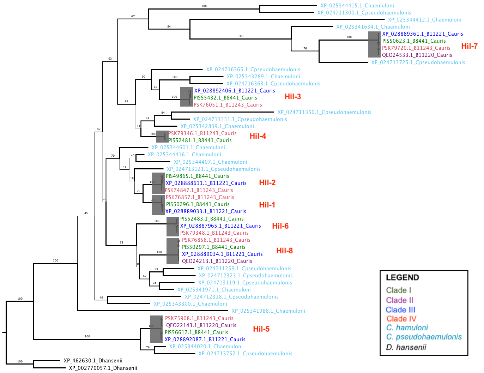

```{r setup, include=FALSE}
knitr::opts_chunk$set(echo = TRUE)
```

```{r load_libraries, echo = FALSE}
suppressPackageStartupMessages(library(tidyverse))
suppressPackageStartupMessages(library(cowplot))
suppressPackageStartupMessages(library(treeio))
suppressPackageStartupMessages(library(ggtree))
suppressPackageStartupMessages(library(plotly))
```

## Goal

Analyze the evolution of sequence features of the XP_028889033 homologs within _C. auris_ species. In particular, we are interested in intra-species variation in copy number, NTD protein sequence evolutionary rates, stalk repeat numbers and sequences.

## Homologs identification
Homologs of the PF11765 domain containing proteins were identified in the five strains of _C. auris_ used in Muñoz _et al._ 2018 Nat. Genet. Homologs from _C. pseudohaemulonis_ and _C. haemuloni_ were added to help provide the evolutionary context, e.g. timing of gene duplication and sequence evolution both within and between closely related species. Finally, two homologs from the outrgroup species _D. hansenii_ were added to root the gene tree. A third _D. hansenii_ sequencing with the PF11765 domain was not included as it belong to the Clavispora/Candida duplicate 2 branch, which didn't include any _C. auris_ sequences.

**Update 2021-05-21 [HB] Clade I strain 6684 is removed from this analysis, leaving four strains repesenting one of the four clades**

As shown in Muñoz _et al._ 2021 Genetics, _C. auris_ as a species has a total of eight members in this family. The number of members present in each strain varies. In particular, Clade II strains, represented by B11220 in our dataset, has only three. Below we will show the domain architecture for the eight members from the clade I strain B8441. The data for this plot is actually generated in the [latter part](#B8441) of this R markdown file

```{r}
# read in data
len <- read_tsv("input/B8441-homologs-length-name.tsv", col_types = cols())
B8441 <- read_tsv("input/B8441-homologs-feature-table.tsv", col_types = cols()) %>% 
  mutate(type = ifelse(grepl("TR-",type), "Tandem Repeat", ifelse(type == "SignalP", "Signal Peptide", type)), 
         type = ordered(type, levels = unique(type))) %>% 
  left_join(select(len, shortName = name, gID, pID), by = c("name" = "pID")) %>% 
  select(shortName, gID, pID = name, type, start, end)
B8441.tango <- read_tsv("input/B8441-homologs-tango.tsv", col_types = cols()) %>% 
  left_join(select(len, shortName = name, gID, pID), by = c("name" = "pID"))

# sort the sequences by protein length
seq.order <- len$gID
B8441$gID <- ordered(B8441$gID, levels = seq.order)
B8441.tango$gID <- ordered(B8441.tango$gID, levels = seq.order)
```

```{r}
# plot
colors <- c(Hyphal_reg_CWP = "#3d85c6", "Signal Peptide" = "#cc0000", "GPI-anchor" = "#6a3d9a", "Tandem Repeat" = "#af8400")
p1 <- ggplot(B8441 %>% filter(type == "entire protein"), aes(x = gID, y = start)) + 
  geom_segment(aes(xend = gID, yend = end), color = "black", size = 7) +
  geom_segment(aes(xend = gID, yend = end), color = "grey80", size = 6.5)
p2 <- geom_segment(data = B8441 %>% filter(type != "entire protein"), aes(x = gID, y = start + 1, xend = gID, yend = end - 1, color = type), size = 6.5)
p3 <- geom_segment(data = B8441.tango, aes(xend = gID,  y = ifelse(start-3 >= 0, start-3, 0),  yend = end + 3, alpha = median),
                   position = position_nudge(x = -0.4, y = 0), color = "darkred", size = 2)
p4 <- p1 + p2 + p3 + coord_flip() + theme_cowplot() + 
  scale_color_manual(values = colors) + 
  scale_x_discrete(labels = paste0(len$gID, " (", len$name, ")")) +
  scale_alpha(guide = "none") +
  labs(y = "Position in sequence", x = NULL, color = "FEATURES") + 
  theme(legend.position = c(0.7,0.4),
        legend.box.margin = margin(6,6,6,6),
        legend.box.background = element_rect(size = 0.5, linetype = "solid", color = 1))
p4
ggsave("output/figure/20210526-B8441-domain-tandem-repeats.png", width = 8, height = 3.5)
```
**Fig. 1 Domain schematic of the eight homologs in the Hyr/Iff-like (Hil) family in _C. auris_ strain B8441**. The gene name is shown to the left and sorted based on the length of the predicted proteins. Various features were shown as colored blocks, including the Hyphal_reg_CWP (PF11765) domain, Signal Peptide as predicted by SignalP 5.0 server, GPI-anchor predicted by PredGPI server and tandem repeats predicted by XSTREAM (see Materials and Methods). The short bars behind each sequence's schematic represents TANGO predicted β-aggregation motifs, whose predicted strength (score) is proportional to the transparency of the bar.

`r len %>% arrange(desc(length))`

**TANGO predicted β-aggregation sequences (prob > 25%):**

```{r}
B8441.tango %>% 
  select(pID = name, species_id, strain, seq, median) %>% 
  left_join(select(len, -length), by = "pID") %>% 
  filter(median > 25) %>% 
  group_by(name, gID, seq) %>% # reorder columns
  summarize(n = n(), avg.median = mean(median), .groups = "drop") %>% 
  arrange(name, desc(n))
```

For S/T frequencies, please first run the script at the end of this notebook to load the data [link](#STB8441)

## Evolution (duplications and losses)
### Gene tree
The gene tree inferred based on the PF11765 domain in each sequence is presented below:


**Fig. 2 RAxML inferred gene tree for Hyr/Iff-Like (HIL) family members in _C. auris_, two MDR clade species _C. pseudohaemulonis_ and _C. haemuloni_, as well as an outgroup _D. hansenii_.** The branch thickness is shown proportional to the value of the rapid bootstrapping value. The tree is manually rooted on the two _D. hansenii_ sequences. The root choice is based on the gene tree including homologs from across the Ascomycetes. The short terminal branch lengths among the _C. auris_ strains indicate that there had been little divergence in the PF11765 domain in these sequences. Lastly, the colors of the leaf node names for the _C. auris_ strains are based on Muñoz _et al._ 2018 Nat. Genet.

### Reconciliation and rearrangement
To infer the timing of gene duplication and loss events, the gene tree is reconciled with the species tree in Notung 2.9. Rearrangement of the reconciled gene tree was performed in the same software, allowing for swapping of branches with rapid bootstrapping values lower than **90%**. The rearranged tree has a total of **15** duplication and **13** losses. Note that the clade I strain 6684 appeared to have experienced several losses, but this is very likely due to the relatively poor assembly status of the strain, not real evolutionary losses.

**Update 2021-12-06**
Now the reconciliation is done using [GeneRax](https://github.com/BenoitMorel/GeneRax). See the accompanying paper for details [link](https://doi.org/10.1093/molbev/msaa141). The reason is because Notung's rearrangement function doesn't work very well with the _C. auris_ and MDR Hil tree. GeneRax works by incorporating the evolutionary events like speciation, duplications and losses into the maximum likelihood function of gene tree inference. See `script/generax/run-generax.sh`
```{r fig.height=8, fig.width=8}
# read in reconciled and rearranged gene tree
gene.tree <- read.nhx("output/gene-tree/notung/GeneRax-corrected-reconciled-gene-tree-20211206.nhx") %>% 
  as_tibble() %>% # convert to a tibble
  mutate(strains = ordered(S, levels = c("Cauris.B8441", "Cauris.B11220", "Cauris.B11221", "Cauris.B11243",
                                           "Cpseudohaemulonis", "Chaemuloni", "Dhansenii"), 
                             labels = c("C. auris Clade I", "C. auris Clade II", "C. auris Clade III", "C. auris Clade IV", 
                                        "C. pseudohaemulonis", "C. haemuloni", "D. hansenii")))

# set up species/strains tip label colors
#gene.tree <- gene.tree %>% 
#  groupOTU()
gene.tree %>%
  as.treedata() %>% 
  ggtree(branch.length = "none") +
  geom_tiplab(aes(colour = strains), size = 3, fontface = 2) + xlim(0,20) +
  scale_color_manual(name = "LEGEND", values = c("#345714", "#952395", "#0030ff", "#ff2900", 
                                                 "gray50", "gray50", "#000000")) +
  geom_hilight(node = 81,  fill = "gray20", alpha = 0.2, color = "white") + # Hil-1
  geom_hilight(node = 79,  fill = "gray20", alpha = 0.2, color = "white") + # Hil-2
  geom_hilight(node = 68,  fill = "gray20", alpha = 0.2, color = "white") + # Hil-3
  geom_hilight(node = 66, fill = "gray20", alpha = 0.2, color = "white") + # Hil-4
  geom_hilight(node = 57,  fill = "gray20", alpha = 0.2, color = "white") + # Hil-5
  geom_hilight(node = 85,  fill = "gray20", alpha = 0.2, color = "white") + # Hil-6
  geom_hilight(node = 100,  fill = "gray20", alpha = 0.2, color = "white") + # Hil-7
  geom_hilight(node = 87,  fill = "gray20", alpha = 0.2, color = "white") + # Hil-8
  geom_cladelabel(node = 81,  label = "Hil-1", offset = 7, color = "red", fontface = 2) + # Hil-1
  geom_cladelabel(node = 79,  label = "Hil-2", offset = 7, color = "red", fontface = 2) + # Hil-2
  geom_cladelabel(node = 68,  label = "Hil-3", offset = 7, color = "red", fontface = 2) + # Hil-3
  geom_cladelabel(node = 66, label = "Hil-4", offset = 7, color = "red", fontface = 2) + # Hil-4
  geom_cladelabel(node = 57,  label = "Hil-5", offset = 7, color = "red", fontface = 2) + # Hil-5
  geom_cladelabel(node = 85,  label = "Hil-6", offset = 7, color = "red", fontface = 2) + # Hil-6
  geom_cladelabel(node = 100,  label = "Hil-7", offset = 7, color = "red", fontface = 2) + # Hil-7
  geom_cladelabel(node = 87,  label = "Hil-8", offset = 7, color = "red", fontface = 2) + # Hil-8
  theme(legend.text = element_text(size = 10, face = 3))
ggsave("output/figure/20211207-reconciled-NTD-tree-annotated.png", width = 9, height = 8)
```
**Fig. 3 The same tree in Fig. 3 after reconciliation and rearrangement using Notung v2.9.** The species/strains tree and the gene tree as shown in Fig. 3 were used as input for reconciliation in Notung v2.9. Rooting and reconciliation were performed in a single step, after which the tree is rearranged by allowing branches with < 90% rapid bootstrap support to be swapped in order to reduce the total number of events (duplications and losses), resulting in the rearranged tree. Because of the rearrangement, branch lengths do not correspond to the estimated substitution number. Red nodes indicate inferred duplication events. Losses were not shown explicitly. Sequence names were colored in the same way as in Fig. 2

We can summarize the inferred gains and losses on the species/strains tree.

1. Read in the tree in Newick format
1. Read in the parsable statistic (copied from Notung "events summary" output)
1. Plot using ggtree

```{r parse_stats}
sps.tree <- read.tree("output/gene-tree/notung/cauris-four-strains-outgroup-tree.nwk")
notung.stat <- read_tsv("output/gene-tree/notung/GeneRax-corrected-reconciled-gene-tree-20211206-stats.txt", col_types = 'cii')
sps.tree.tb <- as_tibble(sps.tree) %>% 
  full_join(notung.stat, by = "label")
sps.tree <- as.treedata(sps.tree.tb)
```

```{r, warning=FALSE, message=FALSE, fig.height=3, fig.width=3}
sps.tree %>%
  ggtree() + 
  geom_tiplab(as_ylab = TRUE, size = 11, face = 4) +
  geom_text(aes(x = branch, label = duplications), vjust = -.4, size = 3, color = "red", face = 2) +
  geom_text(aes(x = branch, label = losses), vjust = 1.4, size = 3, color = "grey20", face = 2)
ggsave("output/figure/20211207-gains-losses-reconciliation.png", width = 3, height = 3)
```
**Fig. 4 Summary of inferred duplication and loss events in _C. auris_ strains and selected outgroups.** The tree topology is based on Muñoz _et al._ 2018 PMID: 30559369. The number of duplications (red) and losses (black) were inferred using Notung 2.9 and labeled on the top and bottom of the branches respectively. 

> Note that all seven duplications that led to the eight members of the Hil family in _C. auris_ occurred in the ancestor of the MDR clade, which includes _C. pseudohamulonis_, _C. haemuloni_ and _C. duobushaemulonis_, the last of which was not included in this tree. Additional duplications were inferred in the MDR clade but not on the _C. auris_ branches. In terms of losses, the most notable branch is the _C. auris_ B11220 strain, which belongs to clade II, that has lost five of the eight members. This is consistent with previous studies, e.g. Muñoz _et al._ 2021 Genetics. The single loss event in the _C. auris_ strain B11221 was inconsistent with the study just mentioned. Further investigations suggested that this was most likely due to incomplete assembly of its genome.

## Evolution of sequence features
### Sequence IDs, species and strain information.
```{r load_seq_info}
sps.list <- c("Cauris","Cpseudohaemulonis","Chaemuloni","Dhansenii")
seqInfo <- read_tsv("output/seq-feature/cauris-renamed-seqinfo.tsv", comment = "#", col_types = "cccci") %>% 
  mutate(species_id = factor(species, levels = sps.list), species = NULL)
```

### Adhesin prediction

    FungalRV threshold: 0.51; FaaPred using ACHM model with the recommended -0.8 threshold.
    
```{r adhesin_prediction}
frv.th = 0.511 # recommended FungalRV score threshold
frv <- read_tsv("output/seq-feature/cauris-renamed-fungalrv.txt", skip = 3, col_names = c("name","frv.score"), col_types = "cd") %>% 
  mutate(name = str_sub(name, 2), frv.pred = frv.score > frv.th)
faa <- read_tsv("output/seq-feature/cauris-renamed-faapred.txt", col_names = c("name","faa.score","faa.pred"), col_types = "cdc") %>% 
  mutate(faa.pred = ifelse(faa.pred == "Adhesin", TRUE, FALSE))
if("frv.score" %in% names(seqInfo))
  seqInfo <- select(seqInfo, -frv.score, -frv.pred, -faa.score, -faa.pred)
seqInfo <- seqInfo %>% left_join(frv) %>% left_join(faa)
seqInfo %>% 
  group_by(species_id, strain) %>% 
  summarize(n = n(), fungalRV = sum(frv.score > 0.511), faapred = sum(faa.pred, na.rm = T), 
            both = sum(frv.score > 0.511 & faa.pred))
```

### SignalP and GPI prediction

GPI-anchored proteins are characterized by an N-terminal signal peptide, which would direct the protein to the secretary pathway, and a C-terminal GPI-anchor peptide, which would be cleaved and replaced by the GPI-anchor, allowing the protein to be tethered to the cell wall. For signal peptide, I used SignalP server. Its latest version is 5.0. But I also ran the sequences through their 4.1 version, with two settings. The results of the latter two are almost identical, except for one sequence "XP_024711350.1", which is only included in the sensitive version, and has a probability lower than 0.5.

- For GPI-anchor prediction, I used the [PredGPI server](http://gpcr.biocomp.unibo.it/predgpi/).
- For signal peptide prediction, I used the [SignalP 5.0 server](http://www.cbs.dtu.dk/services/SignalP/)

```{r signalP, fig.width=5, fig.height=5}
# Signal peptide
gff.names <- c("id", "source", "name", "start", "end", "prob", "na1", "na2", "na3")
signalp5 <- read_tsv("output/seq-feature/cauris-renamed-signalp5.gff3", comment = "#", col_names = gff.names, col_types = "ccciidccc")

if("signalp" %in% names(seqInfo))
  seqInfo <- select(seqInfo, -signalp)

seqInfo <- left_join(seqInfo, select(signalp5, name = id, prob), by = c("name" = "name")) %>% 
  mutate(signalp = !is.na(prob)) %>% select(-prob)
```

```{r gpi}
tmp <- read_delim("output/seq-feature/cauris-renamed-predgpi.txt", delim = "|", col_names = c("name","fp","omega"), col_types = cols())
pred.gpi <- tmp %>%  
  mutate(name = str_sub(name, 2, -2), # remove > and the trailing space
         fp = as.numeric(str_sub(fp, 9, -2)), # extract the numeric part
         is.gpi = fp <= 0.01,    # based on the cutoff of the PredGPI server (prob < 99% -> not GPI-anchored)
         omega = str_sub(omega, 8),
         cleaveRes = str_sub(omega, 1, 1),
         cleavePos = as.integer(str_sub(omega, 3)),
         ) %>% 
  left_join(select(seqInfo, name, length), by = c("name" = "name"))

# remove the column if it already exists
if("pred.gpi" %in% names(seqInfo))
  seqInfo <- select(seqInfo, -pred.gpi)
seqInfo <- left_join(seqInfo, select(pred.gpi, name, pred.gpi = is.gpi), by = c("name"="name"))

seqInfo %>% 
  group_by(species_id, strain) %>% 
  summarize(Total = n(), SignalP = sum(signalp), GPI_Pred = sum(pred.gpi), Both = sum(signalp & pred.gpi), .groups = "drop")

write_tsv(seqInfo, "output/seq-feature/R-seqinfo-table.tsv", col_names = TRUE)
```

### Tandem repeat structures

The non-NTD portion of the proteins evolve rapidly and many of them contain tandem repeats. Therefore, characterizing and visualizing the type, number and spatial distribution of the tandem repeats serve to highlight the differences in the non-NTD part of the proteins in this family.

To identify and group tandem repeats, I used [XSTREAM](https://amnewmanlab.stanford.edu/xstream) with the following parameters `java -Xmx1000m -Xms1000m -jar ~/sw/XSTREAM/xstream.jar $in -i.7 -I.7 -g3 -e2 -L15 -z -G -O -Asub.txt`. The parameters were chosen to identify degenerate tandem repeats that occur at least two times and must be a minimum length of 5 a.a. or longer and the minimum length of a tandem repeat domain (=period x copy #) must be greater than 15 a.a. Please see `script/xstream.sh` for explanation of the parameters.

```{r}
tandem <- read_tsv("output/tandem-repeats/XSTREAM_cauris_outgr_sub_i0.7_g3_m5_L15_chart.tsv", 
                   col_types = "ciiifidcccd", comment = "#") %>% 
  rename(name = identifier)
# now let's create a tibble for plotting, which would contain each instance of the tandem repeat on a separate row
tandem.div <- tandem %>% 
  rowwise(name) %>% 
  summarize(div = list(c(seq(from = start, to = end, by = period), end)), .groups = "drop") %>% 
  unnest(div)
```

```{r, fig.width=6, fig.height=5}
# summarize stats of tandem repeats
repeats <- tandem %>% 
  group_by(type, period) %>% 
  summarize(n = n(), copyMean = mean(copyN), .groups = "drop") %>% 
  mutate(length = period * copyMean)
ggplot(repeats, aes(x = period, y = copyMean)) + geom_hex(binwidth = c(3,2)) + 
  scale_fill_gradient(low = "grey10", high = "yellow2", breaks = seq(1,17,2)) +
  scale_x_continuous(breaks = seq(0,100,6)) + 
  scale_y_continuous(breaks = seq(0,100,4)) + 
  ylab("Mean copy number per sequence") + theme_bw()
```
**Fig. 4 Tandem Repeats (TRs) identified among the protein sequences.** A total of `r nrow(repeats)` types of TRs were identified by the XSTREAM program as described above. The period (unit length) of the TRs are plotted against the mean copy number per sequence for the same TRs. Data are binned by 3 for the period and 2 for the mean copy number, and the number of TRs in each bin is shown in dark-gray to yellow gradient. Note that many TRs are both short (<= 15 a.a.) and have few copies per sequence (< 4). There are, however, a number of TRs that are long (> 30 a.a.) and repeat for more than 10 times per sequence. Those are potentially of more interest.
```{r, fig.width=5, fig.height=4}
repeats %>%
  ggplot(aes(x = length)) + stat_ecdf(geom = "step") + 
  scale_x_continuous(breaks = c(10,20,40,80,160,320,640,1280), trans = "log2") +
  ylab("Probability") + xlab("length (= period * mean copies)") + 
  theme_cowplot() + background_grid()
```
**Fig. 5 Tandem Repeat domain length cumulative distribution.** Empirical cumulative distribution is calculated for the length of each tandem repeat domain, defined as the period (unit length) of a domain multiplied by the mean copy number in all sequences that contain this domain. The x-axis is log2 transformed. Note that ~50% of the domains have a length < 40 residues and ~80% < 160 residues.

```{r write_to_table}
# this is for the purpose of drawing just XP_028889033
tandem %>% filter(grepl("XP_028889033", name)) %>% write_tsv(file = "../01-XP_028889033_drawing/input/XP_028889033_tandem_sub.tsv")
tandem.div %>% filter(grepl("XP_028889033", name)) %>% 
  write_tsv(file = "../01-XP_028889033_drawing/input/XP_028889033_tandem_sub_div.tsv")

# also export the subset belonging to the B8441 homologs
tandem.div %>% filter(grepl("PIS", name)) %>% 
  write_tsv(file = "output/seq-feature/B8441-homologs-tandem_sub_div.tsv")
```

#### **Update 2021-11-12** Hil1-4 in multiple _C. auris_ isolates per clade
In order to characterize the tandem repeat copy number variation among _C. auris_ isolates (see `README.md` in the `output/copynum-var` folder), I combined the homologs of Hil1-4 from the various isolates into a single file and performed XSTREAM analysis using the following command:
```bash
sh xstream.sh ../output/copynum-var/cauris-Hil-homologs-final.fasta cauris-Hil-homologs_sub ../output/tandem-repeats
```
Below I analyze the results from that analysis, with the goal of quantifying the tandem repeat copy number differences among homologs.

```{r}
tandem1 <- read_tsv("output/tandem-repeats/XSTREAM_cauris-Hil-homologs-sub_i0.7_g3_m5_L15_chart.tsv", 
                   col_types = "ciiifidcccd", comment = "#") %>% 
  rename(name = identifier)
```

Summarize results: the goal is to count the number of tandem repeat units for the major repeat type (the ~44 aa with GVVIVTT)
```{r}
tandem1.sum <- tandem1 %>% 
  filter(period > 10, grepl("[VI]{4}TT", consensus_nogap, perl = TRUE)) %>%  # repeats with the (G)VVIVTT variants
  separate(name, into = c("Hil", "strain", "clade"), sep = "_") %>% 
  #mutate(copy = floor(copyN)) %>% 
  select(Hil, strain, clade, length = seqLength, period, copyN) %>% 
  arrange(Hil, clade, strain)
tandem1.sum
```

### Domain architecture {#B8441}

The goal is to produce a cartoon-like plot for each homolog outlining their main features, such as the locations of the pfam domains (mainly the Hyp_reg_CWP), locations of the signal peptide and GPI-anchor, types and distribution of tandem repeats. Note that all these features can be represented as a range with associated metadata. So the first step is to collect the coordinates of the features

organize the non-TR features
```{r}
# GPI-anchor
# use pred.gpi
# Pfam domains
pfam <- read_tsv("output/seq-feature/cauris-renamed-hmmer-scan.txt", col_types = "ciiiicciiidddiic")
# save feature file for Jalview examination
# pfam %>% filter(grepl("XP_028889033",seq_id)) %>% select(hmm_name, seq_id, envelope_start, envelope_end) %>% mutate(featuretype = "domain") %>% write_tsv("XP_028889033_features.jalview")
# I manually edited the feature file, so I commented out the line above to avoid accidentally 
# overwriting my own edits

# feature set
# structure: id  feature  start  end
feature <- bind_rows(
  seqInfo %>% mutate(type = "entire protein", start = 1) %>% select(name, type, start, end = length),
  pfam %>% select(name = seq_id, type = hmm_name, start = envelope_start, end = envelope_end) %>% 
    filter(type == "Hyphal_reg_CWP"),
  # extend the signal peptide segment by 10 amino acids to make it more visible
  signalp5 %>% mutate(type = "SignalP", end = end + 10) %>% select(name = id, type, start = start, end),
  # extend the GPI-anchor C-terminus segment by 20 amino acids to make it more visible
  pred.gpi %>% filter(is.gpi) %>% mutate(type = "GPI-anchor", start = cleavePos-10) %>% 
    select(name, type, start, end = length)
  ) %>% filter(!grepl("KND", name)) %>% # remove strain 6684
  mutate(tip = ifelse(type == "entire protein", as.character(name), as.character(type)))
#feature$type = ordered(feature$type, levels = c("entire protein", "Hyphal_reg_CWP", "SignalP", "GPI-anchor"))
feature.colors <- c("grey", "#1f78b4","#e31a1c", "#6a3d9a")
```

organize the tandem repeats features
```{r}
tr <- tandem %>% 
  left_join(select(repeats, type, copyMean), by = c("type" = "type")) %>% 
  mutate(type = paste("TR", type, sep = "-"), 
         tip = paste0(consensus_nogap,
                      "\ntype: ", type,
                      "\nperiod: ", period, 
                      "\ncopyN: ", copyMean)) %>% 
  select(name, type, start, end, tip)
require(RColorBrewer)
tr.col <- character(nrow(repeats)) # create a color vector
short.rp <- which(repeats$length < 40) # identify the short repeats indices
long.rp <- setdiff(1:nrow(repeats), short.rp) # the long repeats indices
set.seed(123) # for reproducibly shuffling the order before assigning the colors
short.rp <- sample(short.rp)
tr.col[short.rp] <- colorRampPalette(
  brewer.pal(12, "Paired")[seq(3,11,by=2)])(length(short.rp)
                                     ) # assign the short repeats a lower contrast color
set.seed(231) # for reproducibly shuffling the order before assigning the colors
long.rp <- sample(long.rp)
tr.col[long.rp] <- colorRampPalette(
  brewer.pal(12, "Paired")[seq(4,12,by=2)])(length(long.rp)
                                     ) # assign the long repeats a higher contrast color
repeats$color <- tr.col
```

Combine domains, SP and GPI-anchor with TR features.
```{r transform_tandem_feature_data}
# combine sequence features with tandem repeats
tr.feature <- bind_rows(feature, tr) %>% 
  mutate(type = ordered(type, levels = unique(type)))
comb.col <- c(feature.colors, tr.col)

# Extract the subset for XP_028889033 for plotting
tr.feature %>%  select(-tip) %>% 
  filter(grepl("XP_028889033", name)) %>%
  write_tsv(file = "../01-XP_028889033_drawing/input/XP_028889033-domain-features.txt")

# Extract the subset from _C. auris_ B8441 for the schematic plot in the beginning.
B8441 <- tr.feature %>% 
  select(-tip) %>% 
  filter(grepl("PIS", name))
write_tsv(B8441, file = "output/seq-feature/B8441-homologs-feature-table.tsv", col_names = TRUE)
```

reorder the sequences by their positions in the gene tree
```{r}
# in order to plot properties of the sequences in an order that is consistent with the sequences' position in the gene tree
genetreeOrder <- scan("input/cauris-four-strains-reorder-by-gene-tree.txt", what = "character")
genetreeColor <- tibble(name = genetreeOrder) %>% 
  mutate(color = case_when(
    grepl("haemuloni", name) ~ "#2596be70",
    grepl("B8441", name) ~ "#0e8c07",
    grepl("B11220", name) ~ "#780a76",
    grepl("B11221", name) ~ "#0409fb",
    grepl("B11243", name) ~ "#ff4c00",
    TRUE ~ "#000000"
    ))
#feature$name <- ordered(feature$name, levels = rev(genetreeOrder))
tr.feature$name <- ordered(tr.feature$name, levels = rev(genetreeOrder))
write_tsv(tr.feature, file = "output/seq-feature/R-feature-table.tsv", col_names = TRUE)
```

```{r plotly_tandem_repeats, warning=FALSE, fig.height=7, fig.width=9}
# plot
p1 <- ggplot(tr.feature, aes(x = name, y = start, xend = name, yend = end)) + 
  geom_segment(aes(color = type, text = tip), size = 2.5)
p2 <- geom_segment(data = tandem.div, aes(x = name, xend = name, y = div, yend = div + 1.5), size = 2.5, color = "white")
p3 <- p1 + coord_flip() + theme_classic() + 
  scale_color_manual(values = comb.col) +
  theme(axis.text.y = element_text(size = 7, colour = rev(genetreeColor$color)),
        axis.line.y = element_blank(), axis.ticks.y = element_blank(),
        axis.line.x = element_blank(), axis.ticks.x = element_blank(),
        legend.position = "none",
        panel.background = element_rect(fill = alpha("lightblue",0.5))) +
  ylim(-2, 4500) + labs(y = "Position in sequence", x = "Sequences", color = "FEATURES") + 
  ggtitle("Protein sequence features")
p3 + p2
ggsave("output/figure/20210524-domain-tandem-repeats.png", width = 7, height = 6)
```

```{r}
DT::datatable(
  tandem %>% 
    rename(seqL = seqLength, err = consensus_error, seq = consensus_nogap) %>% 
    select(-seqAlign, -type, -consensus_gap, -seq, seq) %>% 
    arrange(desc(name)),
  fillContainer = FALSE, options = list(pageLength = 10)
)
```

```{r plot_tandem_repeats, warning=FALSE, fig.height=9, fig.width=9}
# plot
require(plotly)
ggplotly(p3, tooltip = "text", width = 800, height = 700)
```
**Note** Blue boxes indicate the PF11765 domains while all other non-grey boxes indicate XSTREAM-determined tandem repeat domains. Colors are used to group highly similar tandem repeats. The black thin lines demarcate adjacent tandem repeat units. The table below shows the copy number, period and consensus sequence for each tandem domain organized by the host sequences.

### TANGO prediction of $\beta$-aggregation prone sequences

The amyloid-like $\beta$-aggregation prone sequences have the ability to mediate self-aggregation, which boosts the local concentration of the adhesin molecules on the cell-surface. Similar to the S/T frequency above, we would like to use the output from the prediction algorithm, TANGO, to visulize the distribution of such sequence motifs along the length of the XP_028889033 homolog sequences.

#### Parse tango output
```{r extract_tango_info}
extract_tango <- function(tango_output, agg_threshold = 5, required_in_serial = 5) {
    require(tidyverse)
    tmp <- read_tsv(file = tango_output, col_types = "icddddd") %>% 
        # a boolean vector for residues above threshold
        mutate(pass = Aggregation > agg_threshold)
    pass.rle <- rle(tmp$pass) # this creates a run length encoding that will be useful for identifying the sub-sequences in a run longer than certain length
    # --- Explanation ---
    # this rle object is at the core of this function
    # an example of the rle looks like
    #   lengths: int[1:10] 5 19 20 8 1 5 19 6 181 18
    #   values: logi[1:10] F T  F  T F T F  T F   T
    #   note that by definition the values will always be T/F interdigitated
    # our goal is to identify the sub-sequences that is defined as a stretch of 
    # n consecutive positions with a score greater than the cutoff and record the
    # sub-sequence, its length, start and end position, 90% quantile of the score
    # --- End of explanation ---
    # 1. assigns a unique id for each run of events
    tmp$group <- rep(1:length(pass.rle$lengths), times = pass.rle$lengths)
    # 2. extract the subsequences
    agg.seq <- tmp %>% 
        filter(pass) %>% # drop residues not predicted to have aggregation potential
        group_by(group) %>% # cluster by the runs
        summarize(seq = paste0(aa, collapse = ""),
                  start = min(res), end = max(res), length = n(),
                  median = median(Aggregation),
                  q90 = quantile(Aggregation, probs = 0.9),
                  ivt = sum(aa %in% c("I","V","T")) / length(aa),
                  .groups = "drop") %>% 
        mutate(interval = start - lag(end) - 1) %>% 
        filter(length >= required_in_serial) %>% 
        select(-group)
    return(agg.seq)
}
```

```{r apply}
tango.output.files <- list.files(path = "output/tango", pattern = ".txt|.txt.gz", full.names = T)
# the read_csv() function used in the custom function can automatically decompress gzipped files
tango.res <- lapply(tango.output.files, extract_tango)
names(tango.res) <- gsub(".txt|.txt.gz", "", basename(tango.output.files))
# to add species information
tango.res.df <- bind_rows(tango.res, .id = "id") %>%
  mutate(id = gsub("_B[0-9]+$", "", id))
# save the tango output
write_tsv(tango.res.df, "output/tango/tango_summary_table.tsv.gz")
# mutate(species = str_split(id, "_(?!.*_)", simplify = TRUE)[,2]) 
# extract the species names
# credit: https://stackoverflow.com/questions/20454768/how-to-split-a-string-from-right-to-left-like-pythons-rsplit
# the split pattern is equivalent to the rsplit() function in python
```

#### Plotting TANGO hits
```{r plot_tango_sequences, warning=FALSE, fig.height=7, fig.width=9}
# add species and strain information for plotting
tango <- left_join(select(seqInfo, name, id, species_id, strain),  tango.res.df, by = c("id" = "id"))
# write results to file for B8441 for plotting
tango %>% filter(grepl("PIS", name)) %>% write_tsv(file = "./input/B8441-homologs-tango.tsv")
# reorder the sequences for plotting
feature1 <- feature %>% 
  mutate(name = ordered(name, levels = rev(genetreeOrder)))
tango$name <- ordered(tango$name, levels = rev(genetreeOrder))
# plot
p1 <- ggplot(filter(feature1, type == "entire protein")) + 
  geom_segment(aes(x = name, y = start, xend = name, yend = end), size = 2.5, color = "grey40")
p2 <- geom_segment(data = filter(feature1, type == "Hyphal_reg_CWP"), aes(x = name, y = start, xend = name, yend = end), size = 2.5, color = "#1f78b4")
p3 <- geom_segment(data = tango, aes(x = name, xend = name,  y = ifelse(start-4 >= 0, start-4, 0), yend = end + 4, color = median), size = 2.5)
p1 + p2 + p3 + coord_flip() + theme_classic() + 
  scale_color_distiller(type = "seq", palette = 17, direction = 1) +
  theme(axis.text.y = element_text(size = 7, colour = rev(genetreeColor$color)),
        axis.line.y = element_blank(), axis.ticks.y = element_blank(),
        axis.line.x = element_blank(), axis.ticks.x = element_blank(),
        legend.position = c(0.8,0.8),
        panel.background = element_rect(fill = alpha("lightblue",0.5))) +
  ylim(-2, 4500) + labs(y = "Position in sequence", x = "Sequences", color = "Median TANGO score") + 
  ggtitle("TANGO hits with Hyphal_reg_CWP domain shown behind")
ggsave("output/figure/20210526-tango-score-segment.png", width = 7, height = 6)
```

### Serine/Threonine frequencies

S/T sites are potential sites for O-glycosylation, which could increase the rididity of the stalk of the protein and allow the N-terminal domain to protrude out of the cell wall facing the exterior. More evidence for the importance of O-glycosylation in a serine/threonine-rich domain can be found [here](https://ec.asm.org/content/10/10/1317.long).

To determine the S/T frequency in the XP_028889033 homologs, I ran the program `freak` from the EMBOSS suite with the parameters of 100 aa sliding window and a step size of 10 aa. After reformating the output, the rest of the analysis is accomplished below.

```{r S_T_freq}
# load data
ST.freq <- read_tsv("output/seq-feature/ST_freq_100_10_freak.out.gz", col_types = "cid")
S.freq <- read_tsv("output/seq-feature/S_freq_100_10_freak.out.gz", col_types = "cid")
T.freq <- read_tsv("output/seq-feature/T_freq_100_10_freak.out.gz", col_types = "cid")
# convert sequence name column to an ordered list sorted based on the gene tree sequence
ST.freq <- ST.freq %>%  mutate(id = ordered(id, levels = rev(genetreeOrder))) # this will produce the desired order
S.freq <- S.freq %>%  mutate(id = ordered(id, levels = rev(genetreeOrder))) # this will produce the desired order
T.freq <- T.freq %>%  mutate(id = ordered(id, levels = rev(genetreeOrder))) # this will produce the desired order
```

```{r plot_ST_freq, fig.height=7, fig.width=9}
ggplot(ST.freq, aes(x = id, y = pos)) +  geom_tile(aes(fill = freq)) +
  coord_flip() + theme_classic() + scale_fill_distiller(palette = "RdGy", limits = c(0, 0.8), oob = scales::squish, breaks = seq(0, 0.6, by = 0.2)) +
  theme(axis.text.y = element_text(size = 7, colour = rev(genetreeColor$color)),
        axis.line.y = element_blank(), axis.ticks.y = element_blank(),
        axis.line.x = element_blank(), axis.ticks.x = element_blank(),
        legend.position = c(0.8,0.8),
        panel.background = element_rect(fill = alpha("lightblue",0.5))) +
  ylim(-2, 4500) + labs(y = "Position in sequence", x = "Sequences", color = "Frequency") + 
  ggtitle("Serine/Threonine frequency in 100 aa sliding windows")
ggsave("output/figure/20210530-homologs-ST-freq-100aa-window.png", bg = "transparent", width = 7, height = 6)
```
```{r, fig.width=10}
ST.comb <- bind_rows("S/T" = ST.freq, S = S.freq, T = T.freq, .id = "Var") %>% 
  mutate(Var = ordered(Var, levels = c("S/T","S","T")))
ggplot(ST.comb, aes(x = id, y = pos)) + geom_tile(aes(fill = freq)) + 
  facet_wrap(~Var, scales = "fixed") + theme_minimal() + coord_flip() + 
  scale_fill_distiller(palette = "RdGy", limits = c(-0.05, 0.55), oob = scales::squish, breaks = seq(0,0.5,by=0.1)) +
  #scale_fill_gradient2(low = "#1a1a1a", high = "#b30000", midpoint = 0.2) +
  theme(axis.text.y = element_text(size = 7, colour = rev(genetreeColor$color)),
        axis.line.y = element_blank(), axis.ticks.y = element_blank(),
        axis.line.x = element_blank(), axis.ticks.x = element_blank(),
        legend.position = c(0.95,0.8),
        panel.background = element_rect(fill = alpha("lightblue",0.5))) +
  ylim(1, 4500) + ylab("Position in sequence") + xlab("Sequences") + 
  ggtitle("Ser/Thr frequency in 100 aa windows (frequency > 0.55 replaced by 0.55)")
ggsave("output/figure/20210530-ST-freq-composite.png", width = 10, height = 6)
```

#### S/T in B8441 {#STB8441}
Sliding window plot of S/T frequency for Hil family proteins in B8441
```{r}
B8441.ST <- ST.comb %>% 
  filter(grepl("B8441", id)) %>% 
  left_join(select(len, shortName = name, gID, pID), by = c("id" = "pID")) %>% 
  mutate(gID = ordered(gID, levels = seq.order))
```
```{r}
ggplot(B8441.ST, aes(x = gID, y = pos)) + geom_tile(aes(fill = freq)) + 
  facet_wrap(~Var, nrow = 3, scales = "fixed") + coord_flip() + 
  #scale_fill_distiller(palette = "RdGy", limits = c(-0.05, 0.55), oob = scales::squish, breaks = seq(0,0.5,by=0.1)) +
  scale_fill_viridis_b(option = "D", n.breaks = 10) +
  scale_x_discrete(labels = paste0(len$gID, " (", len$name, ")")) +
  labs(y = "Position in sequence", x = NULL, fill = "Freq") + 
  theme_cowplot() +
  theme(axis.text.y = element_text(size = 10),
        axis.line.y = element_blank(), axis.ticks.y = element_blank(),
        axis.line.x = element_blank(), axis.ticks.x = element_blank(),
        strip.background = element_blank(),
        panel.background = element_rect(fill = alpha("gray90", 0.5)),
        legend.position = "right") +
  ggtitle("Ser/Thr frequency in 100 aa sliding windows")
ggsave("output/figure/20211118-B8441-ST-freq.png", width = 8, height = 6.5)
```

Compare the Hil family to the proteome in B8441
```{r}
B8441.STprot <- read_tsv("input/Cauris-ST-freq-per-protein.txt.gz", col_types = cols()) %>% 
  mutate(Ser = Ser/length, Thr = Thr/length) %>% 
  pivot_longer(cols = c(Ser, Thr), names_to = "residue", values_to = "value") %>% 
  mutate(residue = factor(residue, levels = c("Ser", "Thr")))
```
```{r}
B8441.STprot %>% 
  ggplot(aes(value)) + 
  geom_histogram(bins = 30) +
  #scale_fill_viridis_c(option = "B", direction = -1) + 
  #scale_fill_distiller(palette = "OrRd", direction = 1) +
  geom_segment(data = filter(B8441.STprot, ID %in% str_split(len$pID, "_", simplify = T)[,1]), 
               aes(xend = value, y = -200, yend = 200), 
               color = "red", size = 0.9) +
  facet_wrap(~residue, nrow = 2, scales = "free") +
  xlab("Ser/Thr frequency in protein") + ylab("") + 
  theme_cowplot()
ggsave("output/figure/20211118-B8441-ST-freq-distr-to-all-proteins.png", width = 6, height = 4)
```

