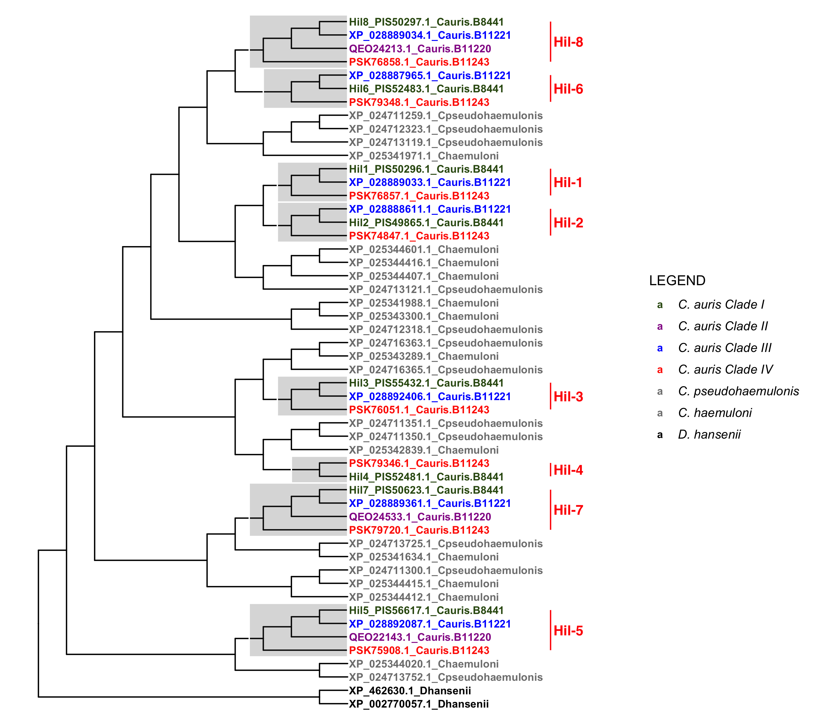
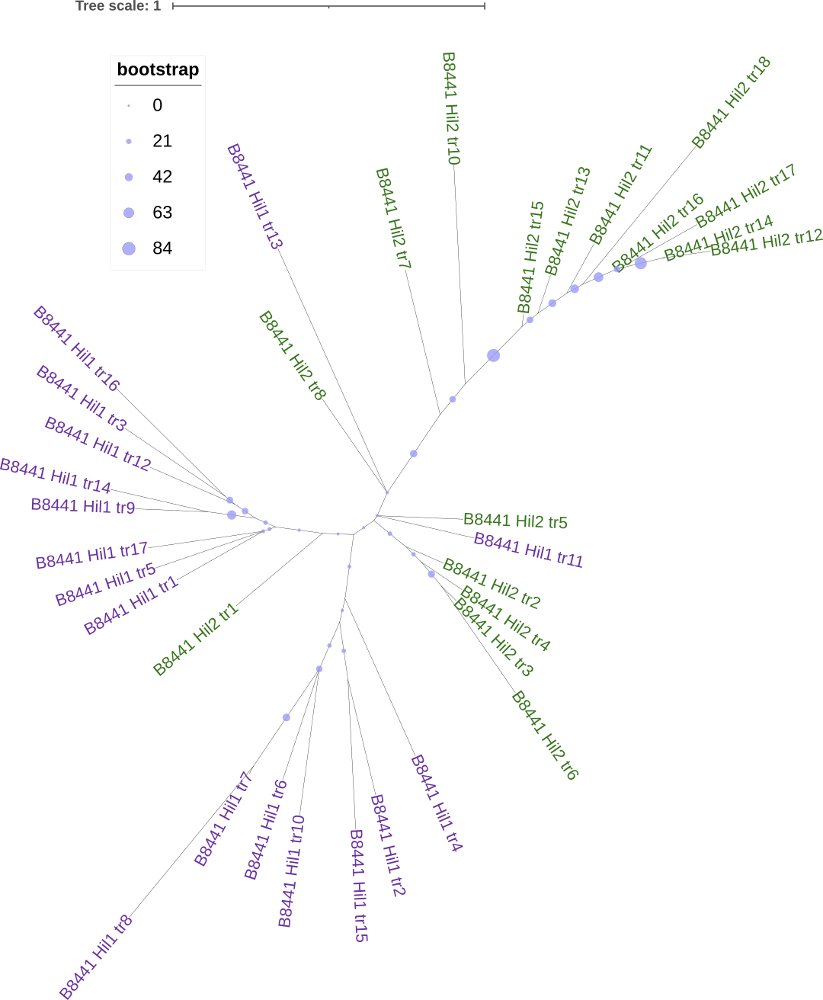

# Background and Goal
The key question is this: during the expansion and the subsequent divergence of the Hil family in _C. auris_ and other species, what types of selection forces were at play? Was it mostly drift? Purifying selection? Or was positive selection involved? I suspect that the N-terminal PF11765 domain is likely to have evolved under strong purifying selection, while the repeat sequences may have been under relaxed purifying selection or possibly positive selection.

Zhang Yong (张勇) at the CAS Zoology Institute suggested a paper by by Persi, Wolf and Koonin 2016, Nat Comm on testing for selection in repeat regions (there is a term called Variable Number of Tandem Repeats, or VNTR). In this work they developed an analysis pipeline to identify "nearly-perfect" repeats that are highly periodical (identical length) and similar (high information content). This allowed them to align them and estimate the dn/ds ratios. Their study was motivated by the observation that while VNTRs tend to evolve very rapidly, they are sometimes conserved through long spans of evolution. Note that when applied to the entire protein, it reflects the **average selection forces** and since most of times positive selection only affect a small number of amino acids, the average dN/dS is likely to be less than one. When applied to the PRDM9 protein in human as a case study, they identified an extremely high dn/ds ratio, more than 2. This strong signature of positive selection for the divergence  among the repeats fits whatq we know about the protein's function perfectly -- the repeats in PRDM9 encode zinc fingers, each of which recognizes a similar but not identical DNA motif. Together, they form a combinatorial code that determines the binding location of the protein in the genome. As PRDM9 is known to evolve rapidly (see references in that paper) specifically in the DNA sequences they recognize, which is mediated by changes in individual zinc fingers, it makes sense that the repeats would diverge under positive selection (for different binding motifs). This pattern only applies when the individual repeats perform distinct functions (e.g., recognize a unit of the combinatorial DNA supermotif).

The goal here is to replicate the Persi, Wolf and Koonin's approach, which treats the repeats *within a protein* as paralogous copies (since they originated from duplications) and calculate the pairwise dN/dS ratios between them as an indication for the selection forces that has acted on them through the protein's evolutionary history. The same approach can be applied to orthologous pairs. The analysis on the human proteome by the above paper concluded that "horizontal evolution of repeats (repeats within the same protein) is markedly accelerated compared with their divergence from orthologues in closely related species".

A related question to explore is whether after the duplications the N-terminal domains have also functionally diverged (possibly evolving new substrate specificity). This would be reflected in the dN/dS of the NTD on different branches.

# Approach
Note that there are several comparisons we could make:
1. between repeats within the same protein, e.g., Hil1, as described above (horizontal)
1. between in-paralogs, e.g., Hil1 vs Hil2 (in-paralogs) -- if global alignment of the central domain is not possible, use individual repeats
1. between alleles within _C. auris_ for the same protein, e.g. Hil1, for all of its repeats as long as they align (polymorphism)
    Read Sergey's dN/dS for polymorphisms paper
1. between orthologs in closely related species for Hil1 (orthologs)
    Because of the frequent duplications, the most closely related homolog for Hil1, not counting alleles within the species, is actually the in-paralog Hil2.

What we know about the evolutionary history of the Hil family in _C. auris_:


In some cases, the in-paralogs are more closely related to each other than they are to the most closely related ortholog in related species -- this is the case for Hil1/Hil2, which arose by duplication after _C. auris_ diverged from the other MDR species sampled here. In other cases, the orthologs in the MDR relatives would be more closely related than the in-paralog, such as Hil3/Hil4.

# Notes
## Hil1 TR horizontal repeat evolution
The goal of this subanalysis is to calcualte the pairwise dn/ds ratios between repeats within a protein.

### Collect sequence
The first step is to extract the paralogous repeat alignments, which I already did when making a supplementary figure. With it, I should be able to test various dN/dS calculation functions available [here](https://rdrr.io/rforge/seqinr/man/kaks.html), [here](https://rdrr.io/cran/ape/man/dnds.html) and [here](https://github.com/a1ultima/hpcleap_dnds).

1. Download the nucleotide and amino acid sequences for XP_028889033.1 (B11221 Hil1) from [NCBI](https://www.ncbi.nlm.nih.gov/gene/40029317/)
1. Open the nucleotide sequence in Jalview and translate it using gencode 12 (yeast alternative nuclear). This leads to a split view.
1. Select 541-1906 in the amino acid window. The corresponding nucleotides are selected automatically.
1. Export the selected sequences (both nucleotide and amino acid) as fasta files.
1. In Vim, use regex search and replace to first combine the sequences into one line, with the header deleted.
1. Use `fold -w44 file > out` to reformat the amino acid sequence so that each repeat is on its own line. Replace "44" with "132" for the nucleotide sequence
1. Following this [tip](https://vim.fandom.com/wiki/Insert_line_numbers), add the headers for each repeat sequence using the line numbers.
    `:%s/^/\=printf('Caur_Hil1_tr%-2d|', line('.'))/` and then replace the "|" with a newline character
1. With the nucleotide alignment file, I use either MEGA11 or the `dnds()` function in the `ape` package in R to calculate the pairwise dn/ds ratios.

### PAML analysis
1. Use `pal2nal.pl` to generate a PHYLIP format nucleotide alignment (since the nucleotide sequences are already aligned, this step can also be done with any program that can convert a fasta to a phylip format).
1. PAML author (Yang Ziheng) recommended using `runmode = -2` in PAML to perform pairwise ML analysis to estimate dN/dS ratios, rather than the NG86 estimates. Both were produced in the run. For NG86, many sites cannot be estimated due to saturation. ML produced an estimate for each pairwise comparison.
### Results and discussion

## Hil1,2 orthologs in MDR, PF11765 domain
Goal of this subanalysis is to provide a background omega ratio estimate to be compared with the pairwise dn/ds ratios from the horizontal evolution among the repeats.
### Prepare sequences for the orthologs of Hil1,2 in MDR
I extracted 10 sequences that form a clade in the MDR clade Hil tree, including Hil1 and Hil2 from three strains of _C. auris_ and outgroup sequences from the other MDR species. The protein sequences were extracted from the `input/cauris-four-strains-for-gene-tree-epa.fasta` using `seqtk subseq in.fasta list.txt > out.fasta` command, with the IDs in `input/id-list-extract-fasta.txt`. The corresponding nucleotide sequences were from NCBI by searching the protein ID and then either going for the corresponding RefSeq_RNA record if available, or, if not, use the locus tag (e.g. B9J08_004109) to extract the mRNA feature from the chromosome or scaffold sequence file in the nucleotide database from BCBI.
1. Use `clustalo -i in.fasta -o out.fasta --iter=5` to align the `input/Hil1-2-MDR-full-unaligned.faa`. Inspect the alignment in Jalview.
1. Align the nucleotide sequence based on the amino acid sequence alignment using `pal2nal pep.aln nuc.fasta -output fasta -codontable 12`. (`pal2nal` installed via conda, [link](https://anaconda.org/bioconda/pal2nal))
1. Extract the PF11765 domain portion in Jalview and export to `input/Hil1-2-MDR-NTD-aligned.fXa`
### Infer phylogenetic tree for the NTD sequences
This step is needed to perform the tree-aware ML analysis in PAML (instead of the pairwise estimates). The advantage of this approach is that it leverages all sequence data and the tree to increase the confidence in the estimate. For it to work, however, we need to assume that the omega parameter is the same across the tree, which is reasonable in this case as we are focusing on just the Hil1 and Hil2 part of the tree, where we don't hypothesize there was positive selection for the NTD in any of the lineages.

To infer the tree, I installed [`raxml-ng`](https://github.com/amkozlov/raxml-ng) by downloading the pre-compiled binary for macos. The following command was used for tree inference:
```bash
raxml-ng --msa input/Hil1-2-MDR-NTD-aligned.faa --model LG+G --seed 123 --threads 3 --prefix output/gene-tree/Hil1-2-MDR-NTD/20211227a
```

The resulting tree was rooted in FigTree and exported in Newick format, further edited to remove the single quotes (PAML doesn't like them) and the branch length estimates. The edited tree was copied to the PAML folder.
### Estimate omega ratios using paml
The purpose of the PAML analysis are
1. Estimate omega for the NTD among the selected sequences (assuming a single omega).
1. Test for positive selection (not expected, but would like to test it anyway).

The `codeml.ctl` control file contains all the parameters used. The key ones are:
```
      seqfile = Hil1-2-MDR-NTD-aligned.nuc * sequence data filename
     treefile = raxml-rooted-20211227.nwk  * tree file
      outfile = mcl                        * main result file name

        model = 0
                    * models for codons:
                        * 0:one, 1:b, 2:2 or more dN/dS ratios for branches

      NSsites = 0 1 2 * dN/dS among sites. 0:no variation, 1:neutral, 2:positive
        icode = 8  * 8: yeast alt nuc
```

### Results and interpretation
1. Turns out PAML outputs the NG86 estimates (Jukes-Cantor corrected for multiple hits) of dS and dN in both its main output file and also the individual files of `2NG.dS` and `2NG.dN`. I compared the results to the estimates by MEGA11 using NG (JC corrected). The PAML estimates are slightly higher (~2%).
1. There is no evidence for positive selection -- the site model M2a (three categories of sites: constrained with ω < 1, neutral with ω = 1 and positive with ω > 1) has nearly the same log likelihood score as the neutral M1a model, and the ω estimate for the third category is actually 1, suggesting there is no evidence for positive selection.
1. The overall ω estimate is made by two models. M1a assumes two categories of sites -- those that evolve neutrally and those that evolve under selective constraints -- and this model estimates that 85% of the sites evolve under constraint, with an ω value of 0.06. M0 assumes a single category of sites and it estimates an ω value of 0.108. The reason M0 estimate is higher is because it lumps the neutrally evolving sites into the constrained sites and thus inflates the ω estimate. It is worth noting that the LRT statistic (-2 difference in log likelihood scores between the two models) is ~160 and is highly significant suggesting that M1a is a much better fit. In other words, there is strong evidence of variable selective constraints among sites in the NTD.
## Hil1-8 in _C. auris_ with MDR outgroups
Using the locus tags or pIDs, e.g., B9J08_004109 or PIS50296.1 for Hil1, I can extract the CDS sequences from the [genome file](https://ftp.ncbi.nlm.nih.gov/genomes/all/GCA/002/759/435/GCA_002759435.2_Cand_auris_B8441_V2/GCA_002759435.2_Cand_auris_B8441_V2_cds_from_genomic.fna.gz) using Vim (if more sequences need to be extracted, can automate using either bioawk or [seqkit](https://www.biostars.org/p/318979/)).

## Hil1, 2 repeats tree
Hil1 and Hil2 are the most closely related Hil homologs in _C. auris_. The NTD tree suggest that the duplication event occurred after _C. auris_ diverged from the closely related MDR species. The two proteins have the most similar repeats among all eight Hil proteins, with identical period (44 aa). Hil1 has more copies than Hil2 does. The question we are asking here is, what's the evolutionary history of the repeats in these two proteins relative to the genes' duplication, and what has been the type and strength of selection on them.

To answer the evolutionary history question, I used `raxml-ng` to build ML trees for the repeats in the two proteins. I selected the first 17 repeats from Hil1 and 17/19 repeats from Hil2, both from the B8441 strain. The two that were omitted from Hil2 were of different lengths than the rest. I extracted both the amino acid and coding sequences for them and inferred phylogenetic trees using `raxml-ng`. The amino acid sequences turn out to be too close for some of the repeats and resulted in zero branch length for a couple of them. In the meantime, the level of divergence appear to be not so great as to overwhelm the nucleotide sequence tree. So I decided to use the latter. The best ML tree with branch support (from 2000 Felsenstein Bootstrap replicates) is shown below (annotated in iTol)



- The tree is unrooted
- Notably, repeat 1 from Hil2, which is the first repeat after the NTD, is close to the clade that includes the 1st repeat from Hil1. In addition, repeats 2-6 from Hil2 form a clade that also includes repeat 11 from Hil1, and which is somewhat close to the other repeats from Hil1. Beyond those two, the majority of the Hil2 repeats form a distant clade with one repeat from Hil1 mixed with them. This overall pattern suggests that
    a. The repeats from the two proteins did share a common origin, as shown by the close relationship between the first repeat unit in both proteins.
    a. It's unclear how many repeats were in the ancestral protein and how many got duplicated into Hil1 and Hil2. But from the tree it appears that if Hil1 and Hil2 used to share many repeats from their ancestor, those repeats were either later lost or other evolutionary forces have made them look more like other repeats in the same protein than with their "ortholog". Homogenizing processes could occur among repeats in the same protein via gene conversion for example.

## Hil1, 2 repeats, horizontal vs vertical and compared with NTD
The goal is to compare the evolutionary rates and selective constraints among repeats within the protein vs those between closely related proteins. There are three sets of comparisons here:

1. Horizontal: among repeats within Hil1 or Hil2
1. Vertical: between Hil1, Hil2 and closely related MDR homologs, for the repeat region
1. PF11765: between Hil1, Hil2 and closely related MDR homologs, for the PF11765 region

For each comparison, we will primarily look at `t` and `omega`. Note that for the second one, because the alignment is not reliable for the repeat region and since the phylogenetic tree above suggests that most of the repeats in the two proteins likely originated after the duplication event for Hil1 and Hil2, we will just do an all pairwise comparison. 

## PF11765 domain evolution
The question here is whether after the duplications that led to Hil1-8 in _C. auris_, there has been selection on the PF11765 domain to diversify in its function among the paralogs. So far I've been describing the evolution of the NTD as being conserved. While this is true relative to the fast-evolving repeat regions, it ignored the possibility of positive selection acting on the backdrop of purifying selection in the background (for most of the sites). After all, if positive selection was indeed involved, it would have only acted on a few residues.

I have two specific questions here:

1. Assuming equal selective forces on all branches (for Hil1-8), can the site-model detect fast evolution for certain sites within PF11765?
1. Assuming equal selective constraints on all sites, can we detect certain branches with elevated dN/dS (omega) over the background, which would suggest episodes of relaxed constraints or positive selection?

### Branch model
I wrote several scripts in the `script` folder to extract, align and transform the coding sequences for Hil1-8 for PAML analysis. I also used the `ape` package's `drop.tip()` function to prune the GeneRax corrected gene tree for the MDR homologs for use with PAML analysis. For PAML, the important parameters used are

```
      seqtype = 1  * 1:codons; 2:AAs; 3:codons-->AAs
    CodonFreq = 1  * 0:1/61 each, 1:F1X4, 2:F3X4, 3:codon table
        clock = 0   * 0: no clock, unrooted tree, 1: clock, rooted tree
        model = 1
                    * models for codons:
                        * 0:one, 1:b, 2:2 or more dN/dS ratios for branches

      NSsites = 0  * dN/dS among sites. 0:no variation, 1:neutral, 2:positive
        icode = 8  * 8: yeast alt nuc

    fix_kappa = 0  * 1: kappa fixed, 0: kappa to be estimated
        kappa = 2  * initial or fixed kappa
    fix_omega = 0  * 1: omega or omega_1 fixed, 0: estimate 
        omega = .4 * initial or fixed omega, for codons or codon-based AAs

        getSE = 1  * 0: don't want them, 1: want S.E.s of estimates

   Small_Diff = .5e-6
    cleandata = 0  * remove sites with ambiguity data (1:yes, 0:no)?
  fix_blength = 0  * 0: ignore, -1: random, 1: initial, 2: fixed
```

- The `model` parameter is varied between 0, 1 and 2 depending on the analysis (one dN/dS ratio across the tree, free ratios vs multiple ratios as defined in the tree).
- The `CodonFreq` parameter was originally left out and I found that the default was 0, i.e. equal frequency. To explore the robustness of the result, I changed this to 1 or 2 and repeated the analysis. The results suggest that for the Hil1-8 dataset, `CodonFreq = 2` results in very large dS estimates for some branches and a transition/transversion ratio of ~1.2, which is much lower than the 1.7-2.3 that I've been getting with `CodonFreq = 0 / 1` and the pairwise analysis. Some branches identified as having dramatically elevated dN/dS with `CodonFreq=2` differed from those identified under the other two situations. But one branch was consistently identified as having much higher dN/dS than the rest.
- `clock=0` is the default if the line is commented out.

### Site model
The site model is to detect particular sites under positive selection. Based on PAML's manual and Ziheng Yang's papers (e.g. Yang et al 2000, PMID: 10790415), I ran `NSsites = 0 1 2 7 8`, where the comparisons of interests are M1a vs M2a (1 vs 2) and M7 vs M8 (7 vs 8). According to the manual, the first comparison is more stringent than the second one. M1a specifies two categories of sites, with `omega_0 < 1` (constrained) and `omega_1 = 1` (neutral); M2a has one more class than M1a, i.e. `omega_2 > 1`. M7 and M8 are similar to M1a and M2a except that a beta distribution was used to model the constrained and neutral class, with two parameters for the beta distribution (p, q).

I again ran the tests under the three `CodonFreq` options (0, 1, 2). In all three cases, the M1a vs M2a comparison turned out insignificant (the LL scores are nearly identical), while the M7 vs M8 comparison was highly significant (chi^2 test p-values < 0.001). A serine residue in column 261 in the alignment was consistently identified as under strong positive selection.
