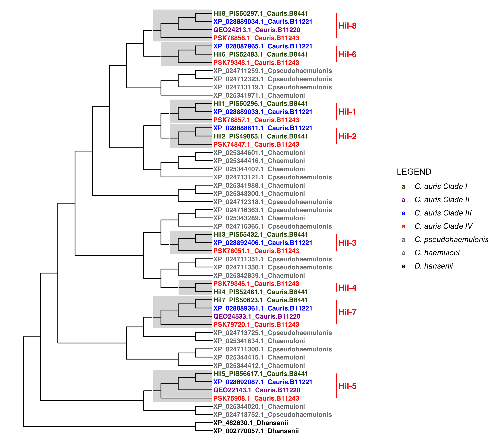

# Background and Goal
The key question is this: during the expansion and the subsequent divergence of the Hil family in _C. auris_ and other species, what types of selection forces were at play? Was it mostly drift? Purifying selection? Or was positive selection involved? I suspect that the N-terminal PF11765 domain is likely to have evolved under strong purifying selection, while the repeat sequences may have been under relaxed purifying selection or possibly positive selection. A seminal paper on the so-called Variable Number of Tandem Repeats (VNTR) phenomenon by Persi, Wolf and Koonin 2016, Nat Comm developed an analysis pipeline to address this type of question. Their study was motivated by the observation that while VNTRs tend to evolve very rapidly, they are sometimes conserved through long spans of evolution. Their approach to infer the evolutionary forces on the repeat sequences is the classical dN/dS ratio tests, where the rationale is that by using the evolutionary rate at the snonymous sites (dS) is an approximation for neutrality, one could ask whether there is a significantly lower rate at the non-synonymous sites, which would indicate purifying selection maintaining the amino acid identities, or a significantly higher rate, which is consistent with positive selection acting on amino acid replacement. Note that when applied to the entire protein, it reflects the **average selection forces** and since most of times positive selection only affect a small number of amino acids, the average dN/dS is likely to be less than one.

The goal here is to replicate the Persi, Wolf and Koonin's approach, which treats the repeats *within a protein* as paralogous copies (since they originated from duplications) and calculate the pairwise dN/dS ratios between them as an indication for the selection forces that has acted on them through the protein's evolutionary history. The same approach can be applied to orthologous pairs. The analysis on the human proteome by the above paper concluded that "horizontal evolution of repeats (repeats within the same protein) is markedly accelerated compared with their divergence from orthologues in closely related species".

# Approach
Note that there are several comparisons we could make:
1. between repeats within the same protein, e.g., Hil1, as described above (horizontal)
1. between alleles within _C. auris_ for the same protein, e.g. Hil1, for all of its repeats as long as they align (polymorphism)
1. between orthologs in closely related species for Hil1 (orthologs)
1. between in-paralogs, e.g., Hil1 vs Hil2 (in-paralogs) -- if global alignment of the central domain is not possible, use individual repeats

What we know about the evolutionary history of the Hil family in _C. auris_:

In some cases, the in-paralogs are more closely related to each other than they are to the most closely related ortholog in related species -- this is the case for Hil1/Hil2, which arose by duplication after _C. auris_ diverged from the other MDR species sampled here. In other cases, the orthologs in the MDR relatives would be more closely related than the in-paralog, such as Hil3/Hil4.

# Notes
## Test with Hil1
I plan to first build the analysis pipeline using Hil1 as an example. The first steps are to extract the paralogous repeat alignments, which I already did to make a supplementary figure. With it, I should be able to test various dN/dS calculation functions available [here](https://rdrr.io/rforge/seqinr/man/kaks.html), [here](https://rdrr.io/cran/ape/man/dnds.html) and [here](https://github.com/a1ultima/hpcleap_dnds).

1. Download the nucleotide and amino acid sequences for XP_028889033.1 (B11221 Hil1) from [NCBI](https://www.ncbi.nlm.nih.gov/gene/40029317/)
1. Open the nucleotide sequence in Jalview and translate it using gencode 12 (yeast alternative nuclear). This leads to a split view.
1. Select 541-1906 in the amino acid window. The corresponding nucleotides are selected automatically.
1. Export the selected sequences (both nucleotide and amino acid) as fasta files.
1. In Vim, use regex search and replace to first combine the sequences into one line, with the header deleted.
1. Use `fold -w44 file > out` to reformat the amino acid sequence so that each repeat is on its own line. Replace "44" with "132" for the nucleotide sequence
1. Following this [tip](https://vim.fandom.com/wiki/Insert_line_numbers), add the headers for each repeat sequence using the line numbers.
    `:%s/^/\=printf('Caur_Hil1_tr%-2d|', line('.'))/` and then replace the "|" with a newline character
1. With the nucleotide alignment file, I use either MEGA11 or the `dnds()` function in the `ape` package in R to calculate the pairwise dn/ds ratios.

## Collect sequences
### All Hil genes CDS in B8441
1. Using the locus tags or pIDs, e.g., B9J08_004109 or PIS50296.1 for Hil1, I can extract the CDS sequences from the [genome file](https://ftp.ncbi.nlm.nih.gov/genomes/all/GCA/002/759/435/GCA_002759435.2_Cand_auris_B8441_V2/GCA_002759435.2_Cand_auris_B8441_V2_cds_from_genomic.fna.gz) using Vim (if more sequences need to be extracted, can automate using either bioawk or [seqkit](https://www.biostars.org/p/318979/)).
1. 
