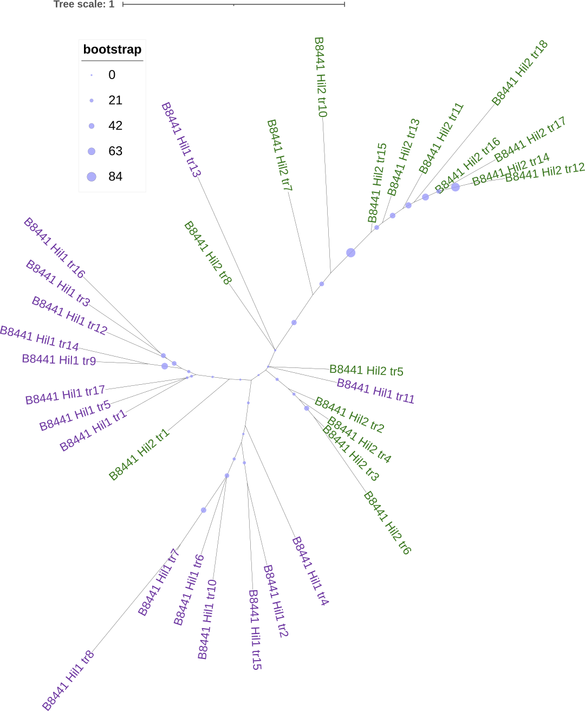

```{r}
require(tidyverse)
require(cowplot)
require(usedist)
require(ape)
```

# Goal

- Compare dN, dS, omega and t within Hil1 and Hil2 repeats and between the two groups.
- Compare the horizontal evolutionary rates and selection pressures to vertical evolutionary rates and forces
    - NTD
    - aligned region of the repeats
    - both will include MDR outgroup sequences in the Hil1-2 clade

# Data

1. First 17 repeats from B8441 Hil1 and 17/19 repeats from B8441 Hil2, rates estimated using `yn00`

# Analysis
## Hil1 repeats, all
```{r}
# I wrote a simple shell script that can parse the PAML distance matrix output to three files
# so that the processing will be easier
# the function below is based a solution from here: https://github.com/tidyverse/readr/issues/659
read.dist <- function(file){
  cmd <- paste0("sh ../script/parse-paml-dist-out.sh ", file)
  try(system(cmd))
  len <- scan("tmp.len")
  names <- scan("tmp.names", what = "char")
  x <- scan("tmp.lower")
  m <- matrix(NA, nrow = len, ncol = len)
  m[upper.tri(m, diag = FALSE)] <- x
  m <- t(m) # the reason for this and the above is because scan() reads by rows while matrix() fills by columns
  d <- as.dist(m)
  d <- dist_setNames(d, names)
  return(d)
}
```

First read the rates for all of B8441 Hil1's repeats
```{r}
header <- c("seq1", "seq2", "S", "N", "t", "k", "omega", "dN", "SE.dN", "dS", "SE.dS")
Hil1 <- read_table("../output/paml/B8441-Hil1-repeat-yn00/rst1", col_names = header, col_types = "iiddddddddd") %>% 
  mutate(distance = (seq1-seq2)*44)
```
Examine the relationship between the estimates and standard errors for dS. Note that because the repeats are relatively short (44 aa) compared with a typical gene, and since only 1/3 of the sites are synonymous, and given the large divergence, the estimates of dS are associated with large errors.
```{r}
Hil1 %>% 
  select(rate_dN = dN, rate_dS = dS, SE_dN = SE.dN, SE_dS = SE.dS) %>% 
  pivot_longer(everything(), names_to = c(".value", "par"), names_sep = "_") %>% 
  mutate(CV = SE/rate) %>% 
  ggplot(aes(x = rate, y = CV)) + geom_point() + 
  facet_wrap(~par, scales = "free") + theme_cowplot()
```
- errors on dS are primarily driven by diverged sequences, while errors on dN are driven by small number of changes observed
- filter out all pairs with dS estimates >= 3 and SE.dS/dS > 1

Plot evolutionary distance vs physical distance
```{r}
Hil1.f <- Hil1 %>% 
  filter(dS < 3, SE.dS/dS < 2)

Hil1.f %>% 
  ggplot(aes(x = distance, y = t)) + 
  geom_point() + stat_smooth(method = "lm") +
  theme_cowplot()

m <- lm(t ~ distance, Hil1.f)
summary(m)
```
- The slope is significantly above zero, but the correlation is pretty low `sqrt(summary(m)$r.squared)`

## Hil2 repeats & Hil1 first 17
Here we attempt to compare between Hil1 and Hil2 repeats. An ML tree inferred by `raxml-ng` is shown below to illustrate the putative evolutionary relationship among them:


```{r}
Hil1n2 <- read_table("../output/paml/B8441-Hil1-2-repeat-yn00/rst1", col_names = header, col_types = "iiddddddddd")
names <- scan("../output/paml/B8441-Hil1-2-repeat-yn00/seq-names.txt", what = "char")
which.Hil2 <- grep("Hil2", names)
Hil2 <- Hil1n2 %>% 
  filter(seq1 %in% which.Hil2, seq2 %in% which.Hil2) %>% 
  mutate(Seq1 = names[seq1], Seq2 = names[seq2],
         seq1 = as.numeric(gsub("B8441_Hil2_tr", "", Seq1)),
         seq2 = as.numeric(gsub("B8441_Hil2_tr", "", Seq2)),
         distance = (seq1-seq2)*44
         ) %>% 
  select(-Seq1, -Seq2)
```
Plot evolutionary distance vs physical distance for Hil2
```{r}
Hil2.f <- Hil2 %>% 
  filter(dS < 3, SE.dS/dS < 2)

Hil2.f %>% 
  ggplot(aes(x = distance, y = t)) + 
  geom_point() + stat_smooth(method = "lm") +
  theme_cowplot()

m <- lm(t ~ distance, Hil2.f)
summary(m)
```
- The correlation between physical and evolutionary distances are stronger in Hil2 than in Hil1.

Compare the within vs between protein divergence
```{r}
groups <- factor(str_extract(names, "Hil\\d"))
Hil1n2.gr <- Hil1n2 %>% 
  filter(dS < 3, SE.dS/dS < 2) %>% 
  mutate(
    seq1gr = groups[seq1], seq2gr = groups[seq2],
    group = case_when(
      seq1gr == "Hil1" & seq2gr == "Hil1" ~ "Hil1",
      seq1gr == "Hil2" & seq2gr == "Hil2" ~ "Hil2",
      seq1gr != seq2gr ~ "Hil1 vs Hil2"
    ),
    group = factor(group, levels = c("Hil1", "Hil2", "Hil1 vs Hil2"))
  )
```

```{r}
Hil1n2.gr %>% 
  select(group, seq1, seq2, t, dN, dS, omega) %>% 
  pivot_longer(t:omega, names_to = "par", values_to = "estimate") %>% 
  ggplot(aes(x = group, y = estimate)) + geom_boxplot(notch = TRUE) +
  facet_wrap(~par, scales = "free_y") + theme_cowplot()
```
- After duplication, the repeats in Hil1 and Hil2 had a period to accumulate more nonsynonymous changes. Afterwards, however, there seems to be stronger constraint to maintain the amino acid sequences of the repeats within a protein. One plausible explanation is that repeats within a protein assemble into a β-solenoid structure and for that it is necessary for the sequences to be compatible with each other (stacking?)

## Hil3 and 4 repeats
```{r}
Hil3 <- read_table("../output/paml/B8441-Hil3-repeat-yn00/rst1", col_names = header, col_types = "iiddddddddd") %>% 
  mutate(distance = (seq1-seq2)*51)
Hil4 <- read_table("../output/paml/B8441-Hil4-repeat-yn00/rst1", col_names = header, col_types = "iiddddddddd") %>% 
  mutate(distance = (seq1-seq2)*47)
```
```{r}
Hil3n4.f <- bind_rows(list(Hil3 = Hil3, Hil4 = Hil4), .id = "group") %>% 
  filter(dS < 3, SE.dS/dS < 2)
Hil3n4.f %>% 
  ggplot(aes(x = distance, y = t)) + 
  geom_point() + stat_smooth(method = "lm") +
  facet_wrap(~group, scales = "free_x") + theme_cowplot()
```

```{r}
Hil3n4.f %>% 
  select(group, seq1, seq2, t, dN, dS, omega) %>% 
  pivot_longer(t:omega, names_to = "par", values_to = "estimate") %>% 
  ggplot(aes(x = group, y = estimate)) + geom_boxplot(notch = TRUE) +
  facet_wrap(~par, scales = "free_y") + theme_cowplot()
```

## Compare with NTD (PF11765): evolutionary constraints
Here we wish to compare the selective constraints applied to horizontal vs vertical evolution, either of repeats or of the NTD. To illustrate the phylogenetic relationship among the sequences being compared, let's first look at the inferred (unrooted) tree for them:
```{r}
MDR.tree <- read.tree("../output/gene-tree/Hil1-2-MDR-NTD/20220114a.raxml.bestTree")
plot.phylo(MDR.tree)
```

Now we can import and compare the estimated rates:

```{r}
vt.TR <- read_table("../output/paml/Hil1-2-MDR-tr-yn00/rst1", col_names = header, col_types = "iiddddddddd")
vt.NTD <- read_table("../output/paml/Hil1-2-MDR-PF11765-yn00/rst1", col_names = header, col_types = "iiddddddddd")
vt <- bind_rows(list("R.inter TR" = vt.TR, "R.inter PF11765" = vt.NTD), .id = "group")
hz <- Hil1n2.gr %>% 
  select(group, seq1:SE.dS) %>% 
  mutate(group = factor(group, levels = c("Hil1", "Hil2", "Hil1 vs Hil2"), 
                        labels = c("R.intra Hil1", "R.intra Hil2", "R.inter Rep1v2")
                        ))
df <- bind_rows(list(protein = vt, repeats = hz), .id = "type")
df$group <- factor(df$group, levels = c("R.inter PF11765", "R.inter TR", "R.inter Rep1v2", "R.intra Hil1", "R.intra Hil2", "R.intra Hil3", "R.intra Hil4"))
rm(list = c("vt", "hz", "vt.TR", "vt.NTD"))
```

```{r}
clrs <- c("R.intra Hil1" = "#6a329f",
          "R.intra Hil2" = "#38761d",
          "R.inter Rep1v2" = "#22a884",
          "R.inter PF11765" = "#3d85c6",
          "R.inter TR" = "#af8400")
clrs[] <- paste0(clrs, "bf") # preserve the names of the vector
df %>% 
  ggplot(aes(x = group, y = omega, fill = group)) + geom_boxplot() +
  scale_fill_manual(values = clrs) + 
  facet_grid(~type, scales = "free_x", space = "free_x") +
  xlab("Comparison groups") + ylab("dN/dS") +
  theme_cowplot() + theme(axis.text.x = element_blank())
```

