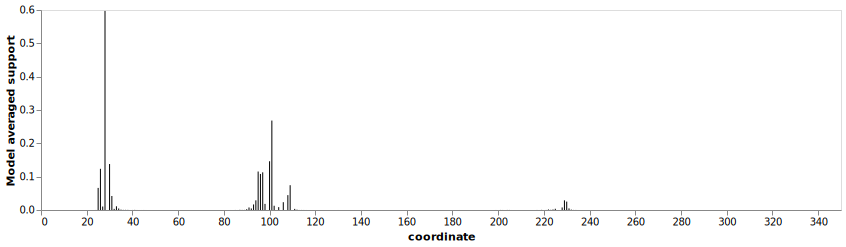
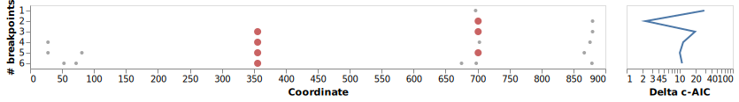
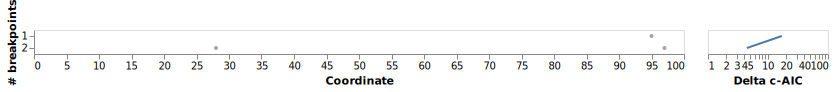
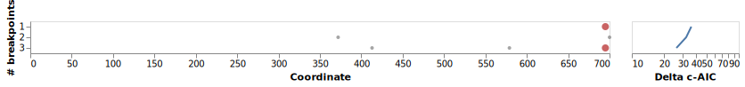
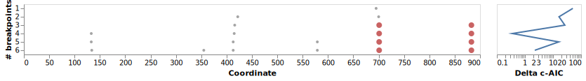

## Background

At the suggestion of a reviewer, we used [GARD](https://academic.oup.com/mbe/article/23/10/1891/1096946) (part of the [HYPHY](https://github.com/veg/hyphy) package) to detect recombination as a pre-step for the PAML analysis. GARD is installed via conda (v2.5.2)

## Method

Analyses were performed on the [datamonkey server](https://datamonkey.org/), with the aligned nucleotide or amino acid sequences for the PF11765 domain in Hil1-8 in _C. auris_ as input.

**Update 2022-07-01**: I realized the need to include an outgroup in the analysis so that I can root the resulting tree for each putative non-recombining fragments and it would be useful also for the PAML analysis later. Based on the [latest gene tree](../../../03-gene-tree/20220512-raxmlng-expanded/output/generax/generax-clustalo-shen2018-wScer/results/Hil/geneTree.newick), I selected XP_018709340.1 from _M. bicuspidata_ as the outgroup, because the _M. bicuspidata_ sequences, which form a cluster, are the most closely related to the MDR clade sequences. Among the 29 _M. bicuspidata_ sequences, XP_018709340.1 is the second longest (>500 aa), the protein is not labeled as incomplete, and its branch length is relatively short, suggesting that it has not diverged significantly since its divergence from the _C. auris_ sequences.

## Results

### Overview

I tested both amino acid and nucleotide sequence as input. For nucleotide sequence, I tested the default setting with no rate-variation and a scenario allowing for rate-variation following a beta-gamma distribution with four classes. In summary, GARD found strong evidence for recombination in all three analyses, but the inferred number and locations of the breakpoints vary.

**Table 1. Summary of GARD analysis result, without outgroup**

| Run type   | Rate variation              | Breakpoints                           |
| ---------- | --------------------------- | ------------------------------------- |
| Amino acid | No                          | 28, 101, 230 (nucl: 84, 303, 690)     |
| Amino acid | general discrete, 3 classes | 29, 102 (nucl: 87, 306)               |
| Nucleotide | No                          | 54, 73, 357, 676, 699, 880            |
| Nucleotide | general discrete, 3 classes | 29, 366, 702, 867                     |
| Nucleotide | beta-gamma, 4 classes       | 29, 357, 425, 678, 698, 737, 881, 975 |

**Table 2. Summary of GARD analysis result, with XP_018709340.1 as outgroup**

| Run type   | Rate variation              | Breakpoints (# differ from above) |
| ---------- | --------------------------- | --------------------------------- |
| Amino acid | No                          | 29, 110 (nucl: 87, 330)           |
| Amino acid | general discrete, 3 classes | 29, 98 (nucl: 87, 294)            |
| Nucleotide | No                          | 123, 347, 414, 580, 695           |
| Nucleotide | general discrete, 3 classes | 414, 580, 696                     |
| Nucleotide | beta-gamma, 4 classes       | 135, 356, 414, 580, 702, 884      |

Overall I conclude that

- there is evidence of recombination.
- locations of the breakpoints are not consistent across models.
  1. one breakpoint is strongly supported by most of the nucleotide based analyses and by some of the amino acid based ones. it is located at around 690-700th column in the nucleotide alignment, corresponding to the 230th column in the amino acid alignment.
  2. the second most supported breakpoint is at around 350th column in the nucleotide alignment. In the amino acid model, however, the inferred breakpoint is at 101-102th column without outgroup, or at most 110 with outgroup.

Based on the above I plan to create severeal putative non-recombining segments based on the alignment with outgroup. These are 1-414, 1-580, 1-695 and 695-981. Slight variations in the choice of the breakpoint is not expected to affect the downstream analyses. I will infer a gene tree for each fragment separately and conduct PAML analysis on each.

### No outgroup

I tried to find legends explaining what the difference is between the gray, small dots and red large dots, but couldn't. It relates to a parameter named "span", which I can't find documentation for. Nonetheless, it seems the red ones are more "important".

#### Amino acid input, no rate variation

#### Amino acid input, general discrete 3 classes

#### Nucleotide input, no rate variation

#### Nucleotide input, general discrete 3 classes

#### Nucleotide input, beta-gamma distribution, 4 classes

### With outgroup
#### Amino acid input, no rate variation

#### Amino acid input, general discrete 3 classes

#### Nucleotide input, no rate variation

#### Nucleotide input, general discrete 3 classes

#### Nucleotide input, beta-gamma distribution, 4 classes

