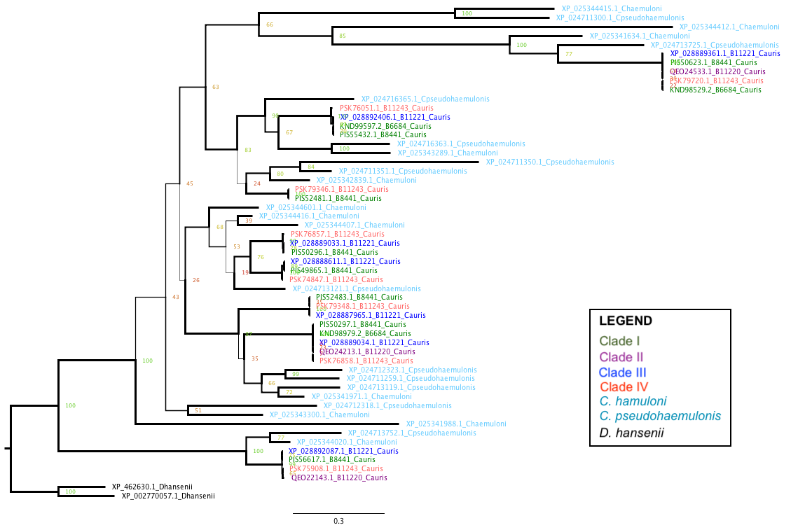

```{r setup, include=FALSE}
knitr::opts_chunk$set(echo = TRUE)
```

```{r load_libraries, echo = FALSE}
suppressPackageStartupMessages(library(tidyverse))
suppressPackageStartupMessages(library(cowplot))
```

## Goal

Analyze the evolution of sequence features of the XP_028889033 homologs within _C. auris_ species. In particular, we are interested in intra-species variation in copy number, NTD protein sequence evolutionary rates, stalk repeat numbers and sequences.

## Homologs identification
Homologs of the PF11765 domain containing proteins were identified in the five strains of _C. auris_ used in Muñoz _et al._ 2018 Nat. Genet. Homologs from _C. pseudohaemulonis_ and _C. haemuloni_ were added to help provide the evolutionary context, e.g. timing of gene duplication and sequence evolution both within and between closely related species. Finally, two homologs from the outrgroup species _D. hansenii_ were added to root the gene tree. A third _D. hansenii_ sequencing with the PF11765 domain was not included as it belong to the Clavispora/Candida duplicate 2 branch, which didn't include any _C. auris_ sequences.

## Evolution (duplications and losses)
### Gene tree
The gene tree inferred based on the PF11765 domain in each sequence is presented below:


**Figure 1. RAxML inferred gene tree for Hyr/Iff-Like (HIL) family members in _C. auris_, two MDR clade species _C. pseudohaemulonis_ and _C. haemuloni_, as well as an outgroup _D. hansenii_.** The branch thickness is shown proportional to the value of the rapid bootstrapping value. The tree is manually rooted on the two _D. hansenii_ sequences. The root choice is based on the gene tree including homologs from across the Ascomycetes. The short terminal branch lengths among the _C. auris_ strains indicate that there had been little divergence in the PF11765 domain in these sequences. Lastly, the colors of the leaf node names for the _C. auris_ strains are based on Muñoz _et al._ 2018 Nat. Genet.

### Reconciliation and rearrangement
To infer the timing of gene duplication and loss events, the gene tree is reconciled with the species tree in Notung 2.9. Rearrangement of the reconciled gene tree was performed in the same software, allowing for swapping of branches with rapid bootstrapping values lower than **90%**. The rearranged tree has a total of **15** duplication and **13** losses. Note that the clade I strain 6684 appeared to have experienced several losses, but this is very likely due to the relatively poor assembly status of the strain, not real evolutionary losses.

## Evolution of sequence features
### Build datasets
1. Sequence IDs, species and strain information.
1. Adhesin prediction results

    FungalRV threshold: 0.51; FaaPred using ACHM model with the recommended -0.8 threshold.
    
1. GPI-anchor prediction (including signal peptide)

    GPI-anchored proteins are characterized by an N-terminal signal peptide, which would direct the protein to the secretary pathway, and a C-terminal GPI-anchor peptide, which would be cleaved and replaced by the GPI-anchor, allowing the protein to be tethered to the cell wall. For signal peptide, I used SignalP server. Its latest version is 5.0. But I also ran the sequences through their 4.1 version, with two settings. The results of the latter two are almost identical, except for one sequence "XP_024711350.1", which is only included in the sensitive version, and has a probability lower than 0.5.
    For GPI-anchor prediction, I used the [PredGPI server](http://gpcr.biocomp.unibo.it/predgpi/).
    For signal peptide prediction, I used the [SignalP 5.0 server](http://www.cbs.dtu.dk/services/SignalP/)

```{r load_seq_info}
sps.list <- c("Cauris","Cpseudohaemulonis","Chaemuloni","Dhansenii")
seqInfo <- read_tsv("output/seq-feature/cauris-renamed-seqinfo.tsv", comment = "#", col_types = "cccci") %>% 
  mutate(species_id = factor(species, levels = sps.list), species = NULL)
```

```{r adhesin_prediction}
frv.th = 0.511 # recommended FungalRV score threshold
frv <- read_tsv("output/seq-feature/cauris-renamed-fungalrv.txt", skip = 3, col_names = c("name","frv.score"), col_types = "cd") %>% 
  mutate(name = str_sub(name, 2), frv.pred = frv.score > frv.th)
faa <- read_tsv("output/seq-feature/cauris-renamed-faapred.txt", col_names = c("name","faa.score","faa.pred"), col_types = "cdc") %>% 
  mutate(faa.pred = ifelse(faa.pred == "Adhesin", TRUE, FALSE))
if("frv.score" %in% names(seqInfo))
  seqInfo <- select(seqInfo, -frv.score, -frv.pred, -faa.score, -faa.pred)
seqInfo <- seqInfo %>% left_join(frv) %>% left_join(faa)
seqInfo %>% 
  group_by(species_id, strain) %>% 
  summarize(n = n(), fungalRV = sum(frv.score > 0.511), faapred = sum(faa.pred, na.rm = T), 
            both = sum(frv.score > 0.511 & faa.pred))
```

```{r signalP, fig.width=5, fig.height=5}
# Signal peptide
gff.names <- c("id", "source", "name", "start", "end", "prob", "na1", "na2", "na3")
signalp5 <- read_tsv("output/seq-feature/cauris-renamed-signalp5.gff3", comment = "#", col_names = gff.names, col_types = "ccciidccc")

if("signalp" %in% names(seqInfo))
  seqInfo <- select(seqInfo, -signalp)

seqInfo <- left_join(seqInfo, select(signalp5, name = id, prob), by = c("name" = "name")) %>% 
  mutate(signalp = !is.na(prob)) %>% select(-prob)
```

```{r gpi}
tmp <- read_delim("output/seq-feature/cauris-renamed-predgpi.txt", delim = "|", col_names = c("name","fp","omega"))
pred.gpi <- tmp %>%  
  mutate(name = str_sub(name, 2, -2), # remove > and the trailing space
         fp = as.numeric(str_sub(fp, 9, -2)), # extract the numeric part
         is.gpi = fp <= 0.01,    # based on the cutoff of the PredGPI server (prob < 99% -> not GPI-anchored)
         omega = str_sub(omega, 8),
         cleaveRes = str_sub(omega, 1, 1),
         cleavePos = as.integer(str_sub(omega, 3)),
         ) %>% 
  left_join(select(seqInfo, name, length), by = c("name" = "name"))

# remove the column if it already exists
if("pred.gpi" %in% names(seqInfo))
  seqInfo <- select(seqInfo, -pred.gpi)
seqInfo <- left_join(seqInfo, select(pred.gpi, name, pred.gpi = is.gpi), by = c("name"="name"))

seqInfo %>% 
  group_by(species_id) %>% 
  summarize(Total = n(), SignalP = sum(signalp), GPI_Pred = sum(pred.gpi), Both = sum(signalp & pred.gpi))

write_tsv(seqInfo, "output/seq-feature/R-seqinfo-table.tsv", col_names = TRUE)
```

### Plot feature map for homologs

The goal is to produce a cartoon-like plot for each homolog outlining their main features, such as the locations of the PFam domains (mainly the Hyp_reg_CWP), locations of the signal peptide and GPI-anchor, distribution of TANGO sequences. Note that all these features can be represented as a range with associated metadata. So the first step is to collect the coordinates of the features

```{r}
# GPI-anchor
# use pred.gpi
# Pfam domains
pfam <- read_tsv("output/seq-feature/cauris-renamed-hmmer-scan.txt", col_types = "ciiiicciiidddiic")
# save feature file for Jalview examination
# pfam %>% filter(grepl("XP_028889033",seq_id)) %>% select(hmm_name, seq_id, envelope_start, envelope_end) %>% mutate(featuretype = "domain") %>% write_tsv("XP_028889033_features.jalview")
# I manually edited the feature file, so I commented out the line above to avoid accidentally 
# overwriting my own edits

# feature set
# structure: id  feature  start  end
feature <- bind_rows(
  seqInfo %>% mutate(type = "entire protein", start = 1) %>% select(id = name, type, start, end = length),
  pfam %>% select(id = seq_id, type = hmm_name, start = envelope_start, end = envelope_end),
  # extend the signal peptide segment by 10 amino acids to make it more visible
  signalp5 %>% mutate(type = "SignalP", end = end + 10) %>% select(id, type, start = start, end),
  # extend the GPI-anchor C-terminus segment by 20 amino acids to make it more visible
  pred.gpi %>% filter(is.gpi) %>% mutate(type = "GPI-anchor", start = cleavePos-10) %>% 
    select(id = name, type, start, end = length)
)
feature$type = ordered(feature$type, levels = c("entire protein", "Hyphal_reg_CWP", "Asp", "Hyr1", "SignalP", "GPI-anchor"))
feature.colors <- c("grey", "#1f78b4", "#b2df8a", "#ff7f00", "#e31a1c", "#6a3d9a")
# in order to plot properties of the sequences in an order that is consistent with the sequences' position in the gene tree
genetreeOrder <- scan("output/seq-feature/cauris-reorder-by-gene-tree.txt", what = "character")
genetreeColor <- tibble(name = genetreeOrder) %>% 
  mutate(color = case_when(
    grepl("haemuloni", name) ~ "#2596be70",
    grepl("6684", name) ~ "#0e8c07",
    grepl("B8441", name) ~ "#0e8c07",
    grepl("B11220", name) ~ "#780a76",
    grepl("B11221", name) ~ "#0409fb",
    grepl("B11243", name) ~ "#d84862",
    TRUE ~ "#000000"
    ))
feature$id <- ordered(feature$id, levels = rev(genetreeOrder))
write_tsv(feature, file = "output/seq-feature/R-feature-table.tsv", col_names = TRUE)
```

```{r plot_features, fig.height=6, fig.width=9, warning=FALSE}
p <- ggplot(feature, aes(x = id, y = start)) + 
  geom_segment(aes(xend = id, yend = end, color = type), size = 2)
p + coord_flip() + theme_classic() + scale_color_manual(values = feature.colors) +
  theme(axis.text.y = element_text(size = 6, colour = rev(genetreeColor$color)),
        axis.line.y = element_blank(), axis.ticks.y = element_blank(),
        axis.line.x = element_blank(), axis.ticks.x = element_blank(),
        legend.position = c(0.8,0.8),
        panel.background = element_rect(fill = alpha("lightblue",0.5))) +
  ylim(1, 4500) + labs(y = "Position in sequence", x = "Sequences", color = "Domain / Feature") + 
  ggtitle("Domain architecture")
ggsave("output/figure/20210425-homologs-domains-schematics.png", bg = "transparent", width = u, height = 6)
```

## TANGO prediction of $\beta$-aggregation prone sequences

The amyloid-like $\beta$-aggregation prone sequences have the ability to mediate self-aggregation, which boosts the local concentration of the adhesin molecules on the cell-surface. Similar to the S/T frequency above, we would like to use the output from the prediction algorithm, TANGO, to visulize the distribution of such sequence motifs along the length of the XP_028889033 homolog sequences.

### Parse tango output
```{r extract_tango_info}
extract_tango <- function(tango_output, agg_threshold = 5, required_in_serial = 5) {
    require(tidyverse)
    tmp <- read_tsv(file = tango_output, col_types = "icddddd") %>% 
        # a boolean vector for residues above threshold
        mutate(pass = Aggregation > agg_threshold)
    pass.rle <- rle(tmp$pass) # this creates a run length encoding that will be useful for identifying the sub-sequences in a run longer than certain length
    # --- Explanation ---
    # this rle object is at the core of this function
    # an example of the rle looks like
    #   lengths: int[1:10] 5 19 20 8 1 5 19 6 181 18
    #   values: logi[1:10] F T  F  T F T F  T F   T
    #   note that by definition the values will always be T/F interdigited
    # our goal is to identify the sub-sequences that is defined as a stretch of 
    # n consecutive positions with a score greater than the cutoff and record the
    # sub-sequence, its length, start and end position, 90% quantile of the score
    # --- End of explanation ---
    # 1. assigns a unique id for each run of events
    tmp$group <- rep(1:length(pass.rle$lengths), times = pass.rle$lengths)
    # 2. extract the subsequences
    agg.seq <- tmp %>% 
        filter(pass) %>% # drop residues not predicted to have aggregation potential
        group_by(group) %>% # cluster by the runs
        summarize(seq = paste0(aa, collapse = ""),
                  start = min(res), end = max(res), length = n(),
                  median = median(Aggregation),
                  q90 = quantile(Aggregation, probs = 0.9),
                  ivt = sum(aa %in% c("I","V","T")) / length(aa),
                  .groups = "drop") %>% 
        mutate(interval = start - lag(end) - 1) %>% 
        filter(length >= required_in_serial) %>% 
        select(-group)
    return(agg.seq)
}
```

```{r apply}
tango.output.files <- list.files(path = "output/tango", pattern = ".txt|.txt.gz", full.names = T)
# the read_csv() function used in the custom function can automatically decompress gzipped files
tango.res <- lapply(tango.output.files, extract_tango)
names(tango.res) <- gsub(".txt|.txt.gz", "", basename(tango.output.files))
# to add species information
tango.res.df <- bind_rows(tango.res, .id = "id") %>%
  mutate(id = gsub("_B[0-9]+$", "", id))
# save the tango output
write_tsv(tango.res.df, "output/tango/tango_summary_table.tsv.gz")
# mutate(species = str_split(id, "_(?!.*_)", simplify = TRUE)[,2]) 
# extract the species names
# credit: https://stackoverflow.com/questions/20454768/how-to-split-a-string-from-right-to-left-like-pythons-rsplit
# the split pattern is equivalent to the rsplit() function in python
```

```{r plot_tango_sequences, warning=FALSE, fig.height=6, fig.width=9}
# add species and strain information for plotting
tango <- left_join(select(seqInfo, name, id, species_id, strain),  tango.res.df, by = c("id" = "id"))
# reorder the sequences for plotting
tango$name <- ordered(tango$name, levels = rev(genetreeOrder))
# plot
p1 <- ggplot(filter(feature, type == "entire protein"), aes(x = id, y = start)) + 
  geom_segment(aes(xend = id, yend = end), size = 2, color = "grey40")
p2 <- geom_segment(data = tango, aes(x = name, xend = name,  y = ifelse(start-4 >= 0, start-4, 0), yend = end + 4, color = median), size = 2)
p3 <- geom_segment(data = filter(feature, type == "Hyphal_reg_CWP"), aes(x = id, y = start, xend = id, yend = end), size = 2, color = "#1f78b4")
p1 + p2 + p3 + coord_flip() + theme_classic() + 
  scale_color_distiller(type = "seq", palette = 17, direction = 1) +
  theme(axis.text.y = element_text(size = 6, colour = rev(genetreeColor$color)),
        axis.line.y = element_blank(), axis.ticks.y = element_blank(),
        axis.line.x = element_blank(), axis.ticks.x = element_blank(),
        legend.position = c(0.8,0.8),
        panel.background = element_rect(fill = alpha("lightblue",0.5))) +
  ylim(-2, 4500) + labs(y = "Position in sequence", x = "Sequences", color = "Median TANGO score") + 
  ggtitle("TANGO hits with Hyphal_reg_CWP domain masked")
ggsave("output/figure/20210425-tango-score-segment.png", width = 7, height = 6)
```

```{r, eval=FALSE, include=FALSE}
# read in TANGO output
# tango output are stored as gzipped files for each individual sequence. we need to read in all of the files into a list of tibbles
tango.output.files <- list.files(path = "tango-output", pattern = "*.txt.gz", include.dirs = T)
ltango <- lapply(tango.output.files, function(x) {
  read_tsv(paste0("tango-output/",x), col_types = "icddddd") %>% select(res, aa, Aggregation)
  })
names(ltango) <- gsub(".txt.gz","",tango.output.files)
tango.output <- bind_rows(ltango, .id = "id")
# the id column stores only the refseq_id, without the species name portion. to make sure that the sequences
# are plotted in the desirable order, we do the following
names(genetreeOrder) <- gsub("_[A-Za-z]+$","", genetreeOrder, perl = TRUE)
tango.ordered <- tango.output %>% 
  mutate(new_id = genetreeOrder[id], ordered_id = ordered(new_id, levels = rev(genetreeOrder))) %>% 
  select(ordered_id, res, aa, aggregation = Aggregation)
```

Now we can plot them the same way as we plotted the S/T frequencies:
```{r, eval=FALSE, include=FALSE}
p <- ggplot(tango.ordered, aes(x = ordered_id, y = res)) + geom_tile(aes(fill = aggregation)) + 
  scale_fill_gradient(limits = c(5,100), breaks = c(5,20,50,100), low = "white", high = "yellow", trans = "sqrt") +
  coord_flip() +  theme_classic() +
  theme(axis.text.y = element_text(size = 5),
        axis.line.y = element_blank(), axis.ticks.y = element_blank(),
        axis.line.x = element_blank(), axis.ticks.x = element_blank(),
        legend.position = c(0.9,0.8),
        panel.background = element_rect(fill = alpha("lightblue",0.5))) +
  ylim(1, 4500) + ylab("Position in sequence") + xlab("Sequences") + ggtitle("TANGO predicted aggregation score")
p
ggsave("img/20200811-tango-score-tile.png", p, bg = "transparent", width = 7, height = 7)
```

