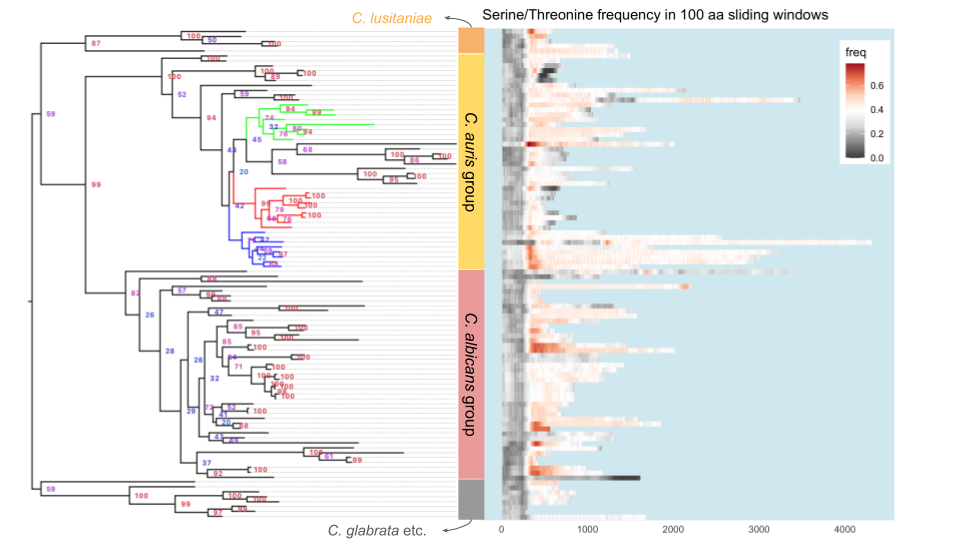

```{r setup, include=FALSE}
knitr::opts_chunk$set(echo = TRUE)
```

```{r load_libraries, echo = FALSE}
#if (!requireNamespace("BiocManager", quietly = TRUE))
#    install.packages("BiocManager")
#if (!requireNamespace("treeio", quietly = TRUE))
#    BiocManager::install("treeio")
#if (!requireNamespace("ggtree", quietly = TRUE))
#    BiocManager::install("ggtree")
library(tidyverse)
library(cowplot)
```

## Goal

Analyze the gene tree and the adhesin properties of the XP_028889033 homologs (putative adhesin in _C. auris_)
This is version 2 of the analysis, using the updated homologs on 2020-07-23

## Approach
1. Load gene tree
1. Parse various computational prediction results and assemble a master table with one row for each homolog
1. Plot the data

## Build datasets
First get the basic information about the 100 sequences in this study. I decide to write a simple Python script to extract such info.
```{bash}
# edit the PYTHON path below to match your local system
~/sw/miniconda3/bin/python extract_seq_info.py
```

Load in the sequence information.
```{r load_seq_info}
seqInfo <- read_tsv("XP_028889033_homologs.tsv", comment = "#", col_types = "ccci") %>% 
  mutate(species = factor(species, levels = c("Cduobushaemulonis","Cpseudohaemulonis","Chaemuloni","Cauris","Clusitaniae","Dhansenii","Cparapsilosis","Lelongisporus","Ctropicalis","Cdubliniensis","Calbicans","Sstipitis","Klactis","Ncastellii","Cglabrata","Nbracarensis","Ndelphensis","Nnivariensis")))
```

```{r plot_prot_length, fig.width=8, fig.height=5}
# plot the length distribution of the homologs in each species
ggplot(seqInfo, aes(x = species, y = length)) + 
  geom_point() + 
  stat_summary(fun.data = mean_cl_boot, geom = "crossbar", col = "red", width = 0.5) + 
  coord_flip() +
  labs(title = "Distribution of XP_028889033 homologs' protein length",
       subtitle = "thick red line indicates group mean and the box the 95% confidence interval by bootstrapping"
       )
```
_Discussion_

- Homologs in the MDR group tend to be longer.

## Adhesin predictors
Now let's import the fungalRV and FaaPred results.
```{r adhesin_prediction}
frv.th = 0.511 # recommended FungalRV score threshold
frv <- read_tsv("raw-output/fungalRV_result.txt", skip = 3, col_names = c("name","frv.score"), col_types = "cd") %>% 
  mutate(name = str_sub(name, 2), frv.pred = frv.score > frv.th)
faa <- read_tsv("raw-output/faapred_result.txt", col_names = c("name","faa.score","faa.pred"), col_types = "cdc") %>% 
  mutate(faa.pred = ifelse(faa.pred == "Adhesin", TRUE, FALSE))
if("frv.score" %in% names(seqInfo))
  seqInfo <- select(seqInfo, -frv.score, -frv.pred, -faa.score, -faa.pred)
seqInfo <- seqInfo %>% left_join(frv) %>% left_join(faa)
seqInfo %>% 
  group_by(species) %>% 
  summarize(n = n(), mean.frv = mean(frv.score), mean.faa = mean(faa.score), fungalRV = sum(frv.score > 0.511), faapred = sum(faa.pred), both = sum(frv.score > 0.55 & faa.pred))
```


## GPI-anchor prediction
GPI-anchored proteins are characterized by an N-terminal signal peptide, which would direct the protein to the secretary pathway, and a C-terminal GPI-anchor peptide, which would be cleaved and replaced by the GPI-anchor, allowing the protein to be tethered to the cell wall. For signal peptide, I used SignalP server. Its latest version is 5.0. But I also ran the sequences through their 4.1 version, with two settings. The results of the latter two are almost identical, except for one sequence "XP_024711350.1", which is only included in the sensitive version, and has a probability lower than 0.5.

```{r signalP, fig.width=5, fig.height=5}
# Signal peptide
gff.names <- c("id", "source", "name", "start", "end", "prob", "na1", "na2", "na3")
signalp5 <- read_tsv("raw-output/signalp_5.0.gff", comment = "#", col_names = gff.names, col_types = "ccciidccc")
signalp4s <- read_tsv("raw-output/signalp_4.0_sensitive.gff", comment = "#", col_names = gff.names, col_types = "ccciidccc")
signalp4d <- read_tsv("raw-output/signalp_4.0_default.gff", comment = "#", col_names = gff.names, col_types = "ccciidccc")
# the only difference between the sensitive and default settings 
signalp <- full_join(select(signalp5, id, prob, start, end), select(signalp4s, id, prob, start, end),
                     by = c("id" = "id"), suffix = c("5.0", "4.0"))
  
signalp %>% ggplot(aes(prob4.0, prob5.0)) + geom_point() + geom_abline(slope = 1, intercept = 0, linetype = 2) +
  xlim(0.4, 1) + ylim(0.4, 1)

if("signalp" %in% names(seqInfo))
  seqInfo <- select(seqInfo, -signalp)

seqInfo <- left_join(seqInfo, select(signalp, name = id, prob5.0), by = c("name" = "name")) %>% 
  mutate(signalp = !is.na(prob5.0)) %>% select(-prob5.0)
```
The probability appears to be shifted upwards in the 5.0 result. However, there are two reasons why we don't have to worry about this. First, all the sequences included here are already filtered by the SignalP server, that is, even though the probability values reported by 4.0 for some sequences appear to be low (~0.5), they did make the cutoff. Second, it is likely that the overall shift in probability reflects the fact that the 5.0 algorithm is more sensitive, which is what the authors [claimed](http://www.cbs.dtu.dk/services/SignalP/faq.php#changes5.0)

For GPI-anchor prediction, I used the [PredGPI server](http://gpcr.biocomp.unibo.it/predgpi/).
```{r gpi}
tmp <- read_delim("raw-output/predgpi_result.txt", delim = "|", col_names = c("name","fp","omega"))
pred.gpi <- tmp %>% 
  mutate(name = str_sub(name,2,-2), # remove > and the trailing space
         fp = as.numeric(str_sub(fp, 9, -2)), # extract the numeric part
         is.gpi = fp <= 0.01,    # based on the cutoff of the PredGPI server (prob < 99% -> not GPI-anchored)
         omega = str_sub(omega, 8),
         cleaveRes = str_sub(omega, 1, 1),
         cleavePos = as.integer(str_sub(omega, 3))
         ) %>% 
  left_join(select(seqInfo, name, length), by = c("name" = "name"))

# remove the column if it already exists
if("pred.gpi" %in% names(seqInfo))
  seqInfo <- select(seqInfo, -pred.gpi)
seqInfo <- left_join(seqInfo, select(pred.gpi, name, pred.gpi = is.gpi), by = c("name"="name"))

seqInfo %>% 
  group_by(species) %>% 
  summarize(Total = n(), SignalP = sum(signalp), GPI_Pred = sum(pred.gpi), Both = sum(signalp & pred.gpi))
```

## Build feature map for homologs

The goal is to produce a cartoon-like plot for each homolog outlining their main features, such as the locations of the PFam domains (mainly the Hyp_reg_CWP), locations of the signal peptide and GPI-anchor, distribution of TANGO sequences. Note that all these features can be represented as a range with associated metadata. So the first step is to collect the coordinates of the features

```{r}
# GPI-anchor
# use pred.gpi
# Pfam domains
pfam <- read_tsv("raw-output/HMMER-HMMScan-Pfam-hits.tsv", col_types = "ciiiicciiidddiic")
# save feature file for Jalview examination
# pfam %>% filter(grepl("XP_028889033",seq_id)) %>% select(hmm_name, seq_id, envelope_start, envelope_end) %>% mutate(featuretype = "domain") %>% write_tsv("XP_028889033_features.jalview")
# I manually edited the feature file, so I commented out the line above to avoid accidentally 
# overwriting my own edits

# feature set
# structure: id  feature  start  end
feature <- bind_rows(
  seqInfo %>% mutate(type = "entire protein", start = 1) %>% select(id = name, type, start, end = length),
  pfam %>% select(id = seq_id, type = hmm_name, start = envelope_start, end = envelope_end),
  # extend the signal peptide segment by 10 amino acids to make it more visible
  signalp %>% mutate(type = "SignalP", end = end5.0 + 10) %>% select(id, type, start = start5.0, end),
  # extend the GPI-anchor C-terminus segment by 20 amino acids to make it more visible
  pred.gpi %>% filter(is.gpi) %>% mutate(type = "GPI-anchor", start = cleavePos-10) %>% 
    select(id = name, type, start, end = length)
)
feature$type = ordered(feature$type, levels = c("entire protein", "Hyphal_reg_CWP", "Asp", "Candida_ALS", "Flocculin", "Flocculin_t3", "Hyr1", "PT", "SignalP", "GPI-anchor"))
feature.colors <- c("grey", "#1f78b4", "#b2df8a", "#33a02c", "#fb9a99", "#fdbf6f", "#ff7f00", "#cab2d6", "#e31a1c", "#6a3d9a")
# in order to plot properties of the sequences in an order that is consistent with the sequences' position in the gene tree
genetreeOrder <- scan("reorder_by_gene_tree.txt", what = "character")
feature$id <- ordered(feature$id, levels = rev(genetreeOrder))
```

```{r plot_features, fig.width=10}
p <- ggplot(feature, aes(x = id, y = start)) + 
  geom_segment(aes(xend = id, yend = end, color = type), size = 2)
p + coord_flip() + theme_classic() + scale_color_manual(values = feature.colors) +
  theme(axis.text.y = element_text(size = 5),
        axis.line.y = element_blank(), axis.ticks.y = element_blank(),
        axis.line.x = element_blank(), axis.ticks.x = element_blank(),
        legend.position = c(0.85,0.25),
        panel.background = element_rect(fill = alpha("lightblue",0.5))) +
  ylim(1, 4500) + labs(y = "Position in sequence", x = "Sequences", color = "Domain / Feature") + 
  ggtitle("Domain architecture")
ggsave("img/20200906-homologs-domains-schematics.png", bg = "transparent", width = 7, height = 7)
```

## Serine/Threonine content

S/T sites are potential sites for O-glycosylation, which could increase the rididity of the stalk of the protein and allow the N-terminal domain to protrude out of the cell wall facing the exterior. More evidence for the importance of O-glycosylation in a serine/threonine-rich domain can be found [here](https://ec.asm.org/content/10/10/1317.long).

To determine the S/T frequency in the XP_028889033 homologs, I ran the program `freak` from the EMBOSS suite with the parameters of 100 aa sliding window and a step size of 10 aa. After reformating the output, the rest of the analysis is accomplished below.

```{r S_T_freq}
# load data
ST.freq <- read_tsv("raw-output/ST_freq_100_10_freak.out.gz", col_types = "cid")
S.freq <- read_tsv("raw-output/S_freq_100_10_freak.out.gz", col_types = "cid")
T.freq <- read_tsv("raw-output/T_freq_100_10_freak.out.gz", col_types = "cid")
# convert sequence name column to an ordered list sorted based on the gene tree sequence
ST.freq <- ST.freq %>%  mutate(id = ordered(id, levels = rev(genetreeOrder))) # this will produce the desired order
S.freq <- S.freq %>%  mutate(id = ordered(id, levels = rev(genetreeOrder))) # this will produce the desired order
T.freq <- T.freq %>%  mutate(id = ordered(id, levels = rev(genetreeOrder))) # this will produce the desired order
```

```{r, fig.width=10}
ST.comb <- bind_rows("S/T" = ST.freq, S = S.freq, T = T.freq, .id = "Var") %>% 
  mutate(Var = ordered(Var, levels = c("S/T","S","T")))
ggplot(ST.comb, aes(x = id, y = pos)) + geom_tile(aes(fill = freq)) + 
  facet_wrap(~Var, scales = "fixed") + theme_minimal() +
  coord_flip() + scale_fill_distiller(palette = "RdGy", limits = c(-0.05, 0.55), oob = scales::squish,
                                      breaks = seq(0,0.5,by=0.1)) +
  #scale_fill_gradient2(low = "#1a1a1a", high = "#b30000", midpoint = 0.2) +
  theme(axis.text.y = element_blank(),
        axis.line.y = element_blank(), axis.ticks.y = element_blank(),
        axis.line.x = element_blank(), axis.ticks.x = element_blank(),
        legend.position = c(0.95,0.24),
        panel.background = element_rect(fill = alpha("lightblue",0.5))) +
  ylim(1, 4500) + ylab("Position in sequence") + xlab("Sequences") + 
  ggtitle("Ser/Thr frequency in 100 aa windows (freq > 0.55 replaced by 0.55)")
ggsave("img/20200904-ST-freq-composite.png", width = 8, height = 4.5)
```




The plot above was constructed using google slides, where I combined the gene tree, visually edited in FigTree 1.4.4, and the S/T frequency plot generated in R with the code above. However, I'd like to be able to generate such figures programmatically, so that their reproduction would be automatic, and that I don't have to manually scale the two images to align the sequences. For this I'll turn to the `ggtree` package.
```{r, eval=FALSE, include=FALSE}
suppressPackageStartupMessages(library(ggtree))
geneTree <- read.tree("XP_028889033_homologs_gene_tree.nwk")
```

## TANGO prediction of $\beta$-aggregation prone sequences

The amyloid-like $\beta$-aggregation prone sequences have the ability to mediate self-aggregation, which boosts the local concentration of the adhesin molecules on the cell-surface. Similar to the S/T frequency above, we would like to use the output from the prediction algorithm, TANGO, to visulize the distribution of such sequence motifs along the length of the XP_028889033 homolog sequences.

TANGO predictions and the subsequent extraction of $\beta$-aggregation prone sequences were documented in separate Python script, README files and the `tango.Rmd`.
```{r tango_sequences, fig.width=10}
# here we only look at the extracted tango sequences
tango <- read_tsv("tango_summary_table.tsv.gz", col_types = "cciiiddicc")
# reorder the sequences for plotting
tango$name <- ordered(tango$name, levels = rev(genetreeOrder))
# plot
p1 <- ggplot(filter(feature, type == "entire protein"), aes(x = id, y = start)) + 
  geom_segment(aes(xend = id, yend = end), size = 2, color = "grey40")
p2 <- geom_segment(data = tango, aes(x = name, xend = name,  y = ifelse(start-4 >= 0, start-4, 0), yend = end + 4, color = median), size = 2)
p3 <- geom_segment(data = filter(feature, type == "Hyphal_reg_CWP"), aes(x = id, y = start, xend = id, yend = end), size = 2, color = "#1f78b4")
p1 + p2 + p3 + coord_flip() + theme_classic() + 
  scale_color_distiller(type = "seq", palette = 17, direction = 1) +
  theme(axis.text.y = element_text(size = 5),
        axis.line.y = element_blank(), axis.ticks.y = element_blank(),
        axis.line.x = element_blank(), axis.ticks.x = element_blank(),
        legend.position = c(0.85,0.25),
        panel.background = element_rect(fill = alpha("lightblue",0.5))) +
  ylim(-2, 4500) + labs(y = "Position in sequence", x = "Sequences") + 
  ggtitle("TANGO predicted aggregation-prone sequences", subtitle = "Hyphal_reg_CWP domain masked")
ggsave("img/20200910-tango-score-segment.png", width = 7, height = 7)
```

```{r, eval=FALSE, include=FALSE}
# read in TANGO output
# tango output are stored as gzipped files for each individual sequence. we need to read in all of the files into a list of tibbles
tango.output.files <- list.files(path = "tango-output", pattern = "*.txt.gz", include.dirs = T)
ltango <- lapply(tango.output.files, function(x) {
  read_tsv(paste0("tango-output/",x), col_types = "icddddd") %>% select(res, aa, Aggregation)
  })
names(ltango) <- gsub(".txt.gz","",tango.output.files)
tango.output <- bind_rows(ltango, .id = "id")
# the id column stores only the refseq_id, without the species name portion. to make sure that the sequences
# are plotted in the desirable order, we do the following
names(genetreeOrder) <- gsub("_[A-Za-z]+$","", genetreeOrder, perl = TRUE)
tango.ordered <- tango.output %>% 
  mutate(new_id = genetreeOrder[id], ordered_id = ordered(new_id, levels = rev(genetreeOrder))) %>% 
  select(ordered_id, res, aa, aggregation = Aggregation)
```

Now we can plot them the same way as we plotted the S/T frequencies:
```{r, eval=FALSE, include=FALSE}
p <- ggplot(tango.ordered, aes(x = ordered_id, y = res)) + geom_tile(aes(fill = aggregation)) + 
  scale_fill_gradient(limits = c(5,100), breaks = c(5,20,50,100), low = "white", high = "yellow", trans = "sqrt") +
  coord_flip() +  theme_classic() +
  theme(axis.text.y = element_text(size = 5),
        axis.line.y = element_blank(), axis.ticks.y = element_blank(),
        axis.line.x = element_blank(), axis.ticks.x = element_blank(),
        legend.position = c(0.9,0.8),
        panel.background = element_rect(fill = alpha("lightblue",0.5))) +
  ylim(1, 4500) + ylab("Position in sequence") + xlab("Sequences") + ggtitle("TANGO predicted aggregation score")
p
ggsave("img/20200811-tango-score-tile.png", p, bg = "transparent", width = 7, height = 7)
```

