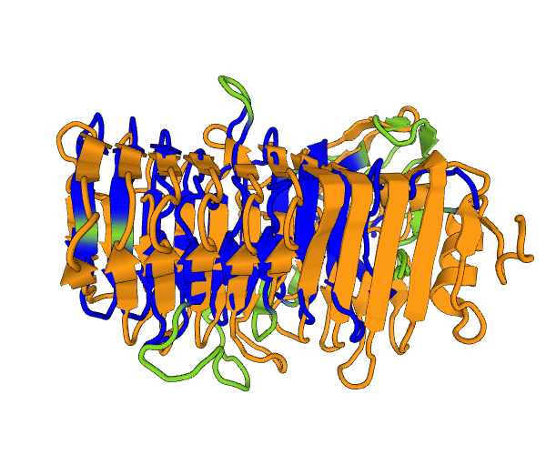
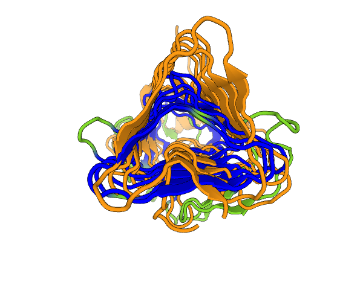

# Observation & Question

I noticed that the template identified by Uppuluri et al. 2018 for _C. albicans_ Hyr1 is not described as a β-solenoid structure. The bacterial adhesins that were identified by template search via Phyre2 came from a group of gram-negative bacteria, different from the template (SRRPs) for the _C. auris_ Hil1 NTD, which came from gram-positive bacteria

My question is, how different are the two bacterial adhesins identified as templates for the _C. auris_ Hil1 NTD and _C. albicans_ Hyr1 NTD? The underlying question is, are the two Hil family protein’s NTDs significantly different in structure?

# Approaches

- Literature reading: see paper reading notes (on gDrive) for details on β-solenoid vs β-helices etc.
- Submitted the two structural templates (1RWRA and 5NY0A, where A stands for chain #) to the DALI server (suggested by Kobe and Kajava 2000, Table 2).

# Results
I downloaded the DALI result to the git repository. But the hyperlinked apps in the html are not viewable. They do provide the option to download the software and run it locally, which I plan to look into. But for this comparison, the structural similarity is apparent. In particular, a **Z-score of 11.4** suggests that the similarity is highly significant. A side view and a top view is shown below:

Orange cartoon is for the subject of the search -- 5NY0. The query, 1RWR, is shown in a gradient of green to dark blue, with dark blue indicating high levels of structural similarity.

