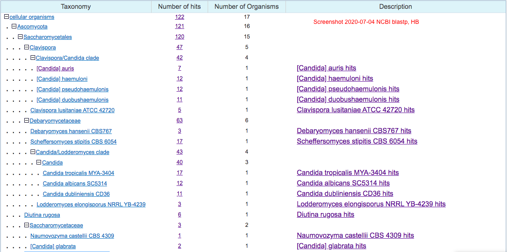
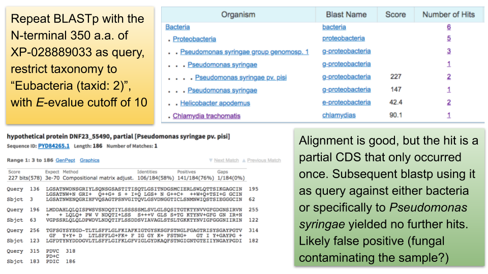

<!--ts-->
   * [Goal](#goal)
   * [Content](#content)
   * [Notes](#notes)
      * [2020-07-01 [HB] Repeat BLAST to identify XP_028889033 homologs](#2020-07-01-hb-repeat-blast-to-identify-xp_028889033-homologs)
         * [FungiDB](#fungidb)
         * [Retrieve ref_protein ID for FungiDB hits](#retrieve-ref_protein-id-for-fungidb-hits)
         * [NCBI blast](#ncbi-blast)
         * [Merge the two datasets](#merge-the-two-datasets)
      * [2020-07-22 [HB] Identify homologs in Nakaseomyces](#2020-07-22-hb-identify-homologs-in-nakaseomyces)
         * [Motivation](#motivation)
         * [Approach](#approach)
      * [2020-08-06 [HB] HMMER and BLAST search for homologs of the N-terminal domain (350 a.a.) of XP_028889033 in viruses and bacteria](#2020-08-06-hb-hmmer-and-blast-search-for-homologs-of-the-n-terminal-domain-350-aa-of-xp_028889033-in-viruses-and-bacteria)

<!-- Added by: bhe2, at: Sun Aug  9 12:16:52 CDT 2020 -->

<!--te-->

# Goal

- Repeat the blast step to clean up the homologs list.
    some species were missing while others, like _C. albicans_, had more than one strain represented in Lindsey's version.


# Content

| File | Description | Source | User/Date |
| -----|-------------|--------|---------- |
| XP_028889033_homologs_fungidb.fasta | New blast results, 95 sequences | fungidb, see notes below | HB/2020 |
| XP_028889033_homologs_fungidb_table.tsv | Accompanying meta data for the file above | fungidb | HB/2020 |
| XP_028889033_homologs_fungidb_use.fasta | filtered list with length > 500, 82 sequences | fungidb, see notes below | HB/2020 |
| XP_028889033_fungidb-refprot-blast.txt | fungiDB hits blasted against the refseq_protein database to identify matching sequences | NCBI BLAST | HB/2020 |
| XP_028889033_homologs_refprot.fasta | XP_028889033 blast against refseq_protein database | NCBI refseq_protein | HB/2020 |
| XP_028889033_homologs_refprot_tab.csv | Accompanying "description" table for the file above | NCBI BLAST | HB/2020 |
| XP_028889033_homologs_refprot_length.txt | protein length | `bioawk -c fastx '{print $name, length($seq)}' XP_028889033_homologs_refprot.fasta` | HB/2020 |
| XP_028889033_homologs_gryc.fasta | blast identified homologs in the Nakaseomyces group | [GRYC](http://gryc.inra.fr/index.php) | HB/2020 |
| XP_028889033_homologs_gryc_blastp.out | accompanying blast alignment output for the above file | GRYC | HB/2020 |
| XP_028889033_homologs_gryc_table.txt | accompanying meta data for the above file | GRYC html, manually edited | HB/2020 |
| 20200704-ncbi-blastp-XP_028889033-taxonmy-distribution.png | screenshot of the taxonomy distribution of the above blast result | NCBI blast | HB/2020 |
| 20200701-XP_028889033-homologs-e-value-by-length.png | plot protein length by e-value | see `blast.Rmd` for details | HB/2020 |
| blast.* and fungidb_* | script and intermediate files for merging the blast hits | see `blast.Rmd` for details | HB/2020 |

# Notes
## 2020-07-01 [HB] Repeat BLAST to identify XP_028889033 homologs
### FungiDB
Used the beta version of the new site on 2020-07-01

- Used first 560 aa of XP_028889033 as query, e-value cutoff set to 1e-5, low complexity on, and limit the organisms to the CUG clade, _S. cerevisiae_, _C. glabrata_ and _S. pombe_
- Downloaded 95 sequences along with a table with meta information.
- After examining the meta data, I noticed that some sequences are much shorter than others. I then plotted protein length as a function of e-value, both in log scales, and it became apparent that those sequences below 500 amino acids are the ones with the lowest e-values. I thus removed them by printing a list of gene IDs, and used the `extract_fasta.py` program to output the filtered list.
    
    <!---->

### Retrieve ref_protein ID for FungiDB hits
```bash
$ blastp -db refseq_protein -query XP_028889033_homologs_fungidb_use.fasta -outfmt "6 qseqid sseqid qlen slen pident mismatch score bitscore evalue" -max_target_seqs 1 -remote -out XP_028889033_fungidb_refprot_id.txt
```
However, for some reason this command didn't work (2020-07-04: I think it actually just takes a long time. Instead of returning an ID for later retrieval of the results, it appears that the user actually have to wait until the search finishes). Instead, I submitted the XP_028889033_homologs_fungidb_use.fasta to NCBI blastp with the same parameters. The result is registered with RID: G2HK3CWK014. I then downloaded the results with a local command
```bash
$ blast_formatter -rid G2HK3CWK014 -out fungidb_blast_refseq_protein.txt -outfmt "6 qseqid sseqid qlen slen pident mismatch score bitscore evalue" -max_target_seqs 1
$ cut -f1 fungidb_blast_refseq_protein.txt | sort | uniq | wc -l
# 70, correct
```


### NCBI blast
`blastp` with the first 560 aa of XP_028889033, e-value cutoff 1e-5, low complexity sequences masked (there is now an option to only mask the low complexity region when generating the seed, but leave them be during the extension).
- I also tried `Delta-blastp`, which first searches against the conserved domain database and then gather sequences with that domain. This resulted in way too many hits. Didn't pursue further.
- For the `blastp` results, I further required the query coverage to be greater than 50%, which yielded 144 sequences. This cutoff was chosen subjectively as sequences with lower than 50% coverage appear uninteresting (in species that are not what I'm interested in).
- I further excluded 6 species from consideration. These are "Metschnikowia bicuspidata var. bicuspidata NRRL YB-4993 (taxid:869754), Debaryomyces fabryi (taxid:58627), Suhomyces tanzawaensis NRRL Y-17324 (taxid:984487), Candida orthopsilosis Co 90-125 (taxid:1136231), Kazachstania (taxid:71245), Naumovozyma dairenensis CBS 421 (taxid:1071378), Meyerozyma guilliermondii (taxid:4929), Yamadazyma tenuis ATCC 10573 (taxid:590646)"
- The resulting taxonomy is shown 

### Merge the two datasets
1. To merge the two datasets, I decide to blast the fungidb reduced set (a.a. length > 500) to the ref_protein dataset. To do so, I used the following commands
    ```bash
    $ mkdir blastdb; makeblastdb -in XP_028889033_homologs_refprot.fasta -parse_seqids -dbtype prot -title XP_028889033_refprot -out blastdb/XP_028889033_refprot
    $ blastp -db ./blastdb/XP_028889033_refprot -query XP_028889033_homologs_fungidb_use.fasta -outfmt "6 qseqid sseqid qlen slen pident mismatch score bitscore evalue" -max_target_seqs 1 -num_threads 4 -out XP_028889033_fungidb-refprot-blast.txt
    ```
    Explanation
    - -outfmt 6: tabular output, no comments
    - -max_target_seqs 1: only output one (best-scoring) match per sequence
    - -num_threads 4: use 4 cpus to perform the search

## 2020-07-22 [HB] Identify homologs in Nakaseomyces
### Motivation
The original blast to both the refseq_protein and fungiDB databases yielded no hits in the well represented _S. cerevisiae_ _sensu stricto_ or _sensu lato_ clade. The only hits were in _C. glabrata_ and _N. castellii_. I'm particularly curious why the other Nakaseomyces group species, e.g. _C. bracarensis_, _N. dephensis_ and _C. nivariensis_ had not hits. Turns out even the NCBI nr_protein database doesn't contain any protein entries for the Nakaseomyces -- I verified this by blast'ing Pho4 protein sequence against the nr_protein and limited the organisms to Nakaseomyces. I then found / remembered that the [Genome Resource for Yeast Chromosomes](http://gryc.inra.fr/index.php) site contains the Nakaseomyces genomes. I verified this by repeating the Pho4p blast. I then blast'ed the first 500 a.a. of XP_028889033 in GRYC, selecting the Nakaseomyces (6 sps)as well as _S. cerevisiae_ (1), Lachancea (12), Naumovozyma (1, _N. castellii_), Yarrowia (3 _Y. lipolytica_ strains) 

### Approach
Got 15 hits from the GRYC blast. Downloaded the fasta sequence and the blast text output. The latter requires a lot of parsing, and there is no option that I can find to change the output format to a table. Instead, I just brutal-forced it -- copy and paste the table on the html page, put it into a text file, and edited it with vim (only 15 rows, not too bad). I also added an ID column to render the sequence ID more in-line with what I have for the other sequences.

I revamped the `blast.Rmd`. In the process of filtering and integrating the new hits, I found that I didn't properly filter the refseq_protein hits with the same length threshold I applied to the fungidb hits. So now I made the analysis consistent with respect to the selection criteria, and removed the _D. rugosa_ sequences (the reason is documented in the `README` files in the `output/gene-tree` folder or subfolders therein). In the end we get 100 sequences in total.
## 2020-08-06 [HB] HMMER and BLAST search for homologs of the N-terminal domain (350 a.a.) of XP_028889033 in viruses and bacteria
I did a HMMER search with the first 350 amino acid 

    MAFNFVRGWLLLAFYLSATWALTITENTVNVGALNIKIGSLTINPGVYYSIVNNALTTLGGSLDNQGEFYVTSANGLAASVSIVSGTIKNSGDLAFNSLRASVISNYNLNSIGGFTNTGNMWLGISGYSLVPPIILGSATNWDNSGRIYLSQNSGSASTITISQTLGSITNDGSMCIERLSWLQTTSIKGAGCINLMDDAHLQLQISPWSVSNDQTIYLSSSSSMLSVLGLSQSITGTKTYNVVGFGDGNSIRVNTGFSGYSYEGDTLTLSFFLGLFKIAFKIGTGYSKSGFSTNGLFGAGTRISYSGAYPGTVPDVCKCFDFPEPTTTPLPSSTSQSSKPSSSSSVIT

restricting the taxonomy to viruses, archaea and eubacteria, and e-value cutoff 0.01  No hits were found using either the PHMMER or JACKHMMER algorithm.

I repeated the search using blastp with e-value cutoff of 10, and taxonomy restricted to the same groups as above. The database in this case is the non-redundant proteins. This time I did get 3 significant hits!


| query acc.ver | subject acc.ver | % identity | alignment length | mismatches | gap opens | q. start | q. end | s. start | s. end | evalue | bit score | % positives 
| ---------------|-----------------| ---------- | ---------------- | ---------- | --------- | -------- | ------ | -------- | ------ | ------ | --------- | -----------
| XP_028889033 | PYD84265.1 | 57.609 | 184 | 77 | 1 | 136 | 318 | 3 | 186 | 5.63e-70 | 226 | 76.63
| XP_028889033 | WP_146232083.1 | 88.372 | 86 | 10 | 0 | 6 | 91 | 6 | 91 | 2.88e-40 | 146 | 95.35
| XP_028889033 | CQB89545.1 | 35.912 | 181 | 96 | 7 | 166 | 330 | 1 | 177 | 5.17e-16 | 89.4 | 51.93

As one can see from the query coverage and evalue columns, the first and second matches are quite significant. The second hit, while short, has high sequence identity. Wondering why I got 3 bacterial hits -- I expect either none or a lot -- I took the sequence of the first hit and repeated the blastp search. This produced two significant hits, including itself and the 3rd hit above. What does this mean? Are these highly species-specific sequences coming from fungi? Are they ancient proteins that have been lost in many many bacteria except for a few? Could these be annotation errors, namely the sample used to identify these bacterial sequences may be contaminated with fungal material?

**Update 2020-08-09**: while reading about the [Pfam family (PF11765)](http://pfam.xfam.org/family/PF11765) that the N-terminal domain of XP_028889033 is a member of, I learned that of the 559 members, 538 are in fungi -- in fact, 500/528 are in Saccharomycotina -- and only 31 are from bacteria. 


Interestingly, in the description of this protein family, it was said that this domain is specific to fungi, suggesting that the curators of this family don't believe the bacterial sequences are true hits. Among the 31 bacterial members, the majority (30) are in the group of alphaproteobacteria, which is a different group compared to the gammaproteobacteria that _Pseudomonas syringae_ belongs to. The other suspicious sign is when I blast the _Pseudomonas syringae_ hit, which is 186 a.a. long and represents a "partial CDS", to all proteins labeled as _Pseudomonas syringae_ in the nr database, only the query itself came up in the hits. This is unexpected as the species is well studied as a plant pathogen and there must be a large number of well-assembled genomes in the species. At this point I have two theories explaining the blastp hits:

1. The hits represent false positives, likely due to fungal contamination of the bacterial sample.
1. The hits represent true sequeces in a _particular_ strain of the bacterium, possibly as a result of horizontal gene transfer from fungi.

In either case, I would conclude that XP_028889033 belongs to a fungi-specific protein family.


