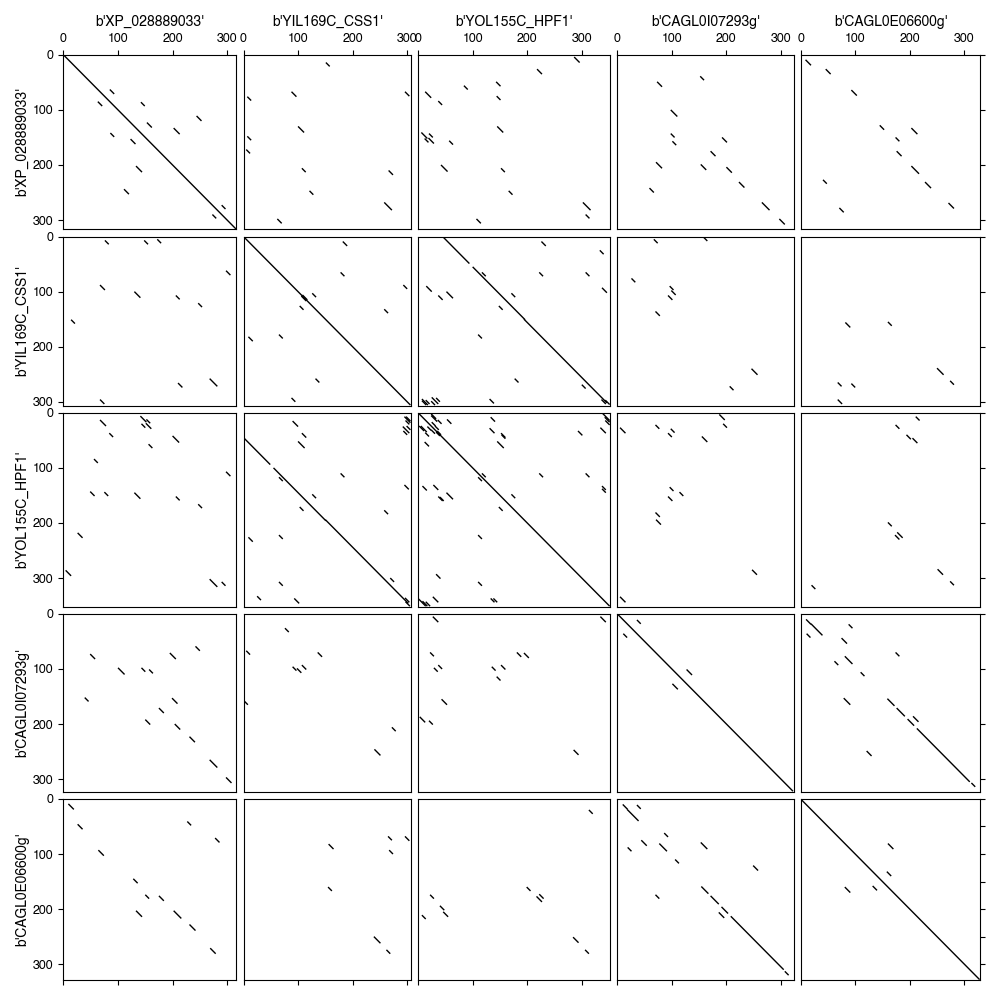

My initial BLAST search didn't recover any hits in _S. cerevisiae_, bu did recover 2 in _C. glabrata_. Upon examining the [PFam site](http://pfam.xfam.org/family/PF11765) for PF11765, I noticed that 2 and 9 members were listed for the Hyphal_reg_CWP domain in these two species respectively. I wondered why this is the case and whether these additional hits should be included in my tree reconstruction. The following ideas were tested:

1. Using the _C. glabrata_ sequence that was part of the my initial BLASTp result as a query and search against the Saccharomycetales. The idea is that perhaps using a more closely related species sequence as query will recover the _S. cerevisiae_ and its close relatives. I tried this and found _no additional hits_ compared with my initial BLAST using XP_028889033 1st 360 aa as query.

1. Use dot-plot to visualize the similarity between the _S. cerevisiae_ or _C. glabrata_ hits and XP_028889033.

1. Submitted the sequences (`PF11765_full_sequences.fasta`) to [GPI-SOM](http://genomics.unibe.ch/cgi-bin/gpi.cgi) and [PredGPI](http://gpcr.biocomp.unibo.it/predgpi/pred.htm) and saved the results locally.

_Results_

1. Dot plot

    

1. PredGPI

    - highly probable: XP_028889033_Cauris, YOL155C_HPF1_Scerevisiae, CAGL0I07293g_Cglabrata
    - probable: CAGL0E06600g_Cglabrata
    - weakly probable: YIL169C_CSS1_Scerevisiae
