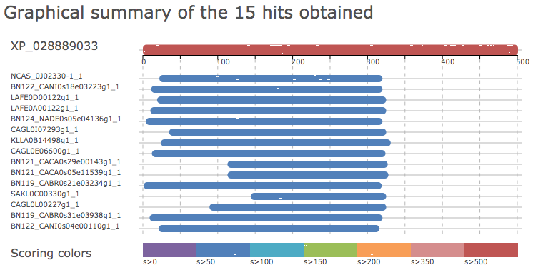

This analysis accompanies the BLAST search to identify homologs for XP_028889033

```{r load_libraries}
suppressPackageStartupMessages(library(tidyverse))
# install rentrez package if not already installed
if (!requireNamespace("rentrez", quietly = TRUE))
    install.packages("rentrez")
suppressPackageStartupMessages(library(rentrez))
# install seqinr package if not already installed
if (!requireNamespace("seqinr", quietly = TRUE))
    install.packages("seqinr")
suppressPackageStartupMessages(library(seqinr))
```

## Fungidb BLAST hits and filtering the results
Some of the identified homologs have less than 500 amino acids. I want to know if these hits also tend to have low _e-values_. If so, I'll exclude them from further analyses

```{r fungidb_plot}
# load table
fungidb <- read_tsv("XP_028889033_homologs_fungidb_table.tsv", col_types = "cccddcccdcc")
# plot protein length as a function of e-value
fungidb %>% 
  ggplot(aes(x = -log10(e_value), y = log2(length), col = (length > 500))) + geom_point() +
  theme(legend.position = "bottom")
ggsave("20200701-XP_028889033-fungidb-hits-e-value-by-length.png", width = 3, height = 3)
```
Based on the results, I will remove the sequences that are shorter than 500 amino acids.

```{r fungidb_filter}
# output a list of IDs that correspond to sequences greater than 500 a.a.
fungidb %>% 
  filter(str_sub(gene_id, -2, -1) != "_B") %>%  # remove the B allele from C. albicans
  filter(length > 500) %>%                      # require length greater than 500 amino acids
  pull(gene_id) %>% cat(file = "fungidb_filter_list.txt", sep = "\n")
```
70 sequences left

```{bash extract_filtered_sequences}
/Users/bhe2/sw/miniconda3/bin/python ../../script/extract_fasta.py XP_028889033_homologs_fungidb.fasta fungidb_filter_list.txt
mv fungidb_filter_list.faa XP_028889033_homologs_fungidb_use.fasta
```

### Translate fungiDB IDs to refseq_protein IDs
Next we use BLAST to find out the corresponding refseq IDs for these sequences (see README.md for details on how I did BLAST)

```{r refseq_id_for_fungidb_hits}
# load blast table
fdb.hits.blast <- read_tsv("fungidb_blast_refseq_protein.txt", col_names = c("query_id","subject_id","query_length","subject_length","perc_identity","mismatch","score","bitscore","e_value"), col_types = "ccnndnnnn")

# goal: for each fungidb hit, identify the refseq ID that has the highest Score
fdb.hits.blast.filtered <-  fdb.hits.blast %>% 
  group_by(query_id) %>% 
  filter(score == max(score), str_sub(query_id, -2, -1) != "_B") # this blast was done before I removed the _B alleles

# ID mapping for identical sequences (% identity = 100%)
fdb.refseqID <- fdb.hits.blast.filtered %>% filter(perc_identity == 100) %>% pull(subject_id)
names(fdb.refseqID) <- fdb.hits.blast.filtered %>% filter(perc_identity == 100) %>% pull(query_id)
```

_Discussion_

1. Of the 70 sequence, 60 are present in the refseq database.
1. Among the 10 sequences that didn't map, five belong to the _C. auris_ B8441 strain, which apparently are not in the refseq_protein database, although three other sequences in the same strain are identical with other _C. auris_ strains.
1. The remaining five sequences belong to _C. paradoxus_ (4) and _C. tropicalis_ (1)

## Refseq_protein BLAST hits and filtering

I also blasted XP_028889033 using NCBI blast against the refseq_protein database. (See README.md for details). The taxonomy distribution is shown below:

```{r refseq_protein_blast}
# load table
refseq <- read_csv("XP_028889033_homologs_refprot_tab.csv", col_types = "cddnnnc")
refseq.length <- read_tsv("XP_028889033_homologs_refprot_length.txt", col_names = c("accession","length"), col_types = "ci")
refseq <- left_join(refseq, refseq.length) %>% select(accession, everything())
# Do the refseq hits show similar relationship between e-value and protein length?
refseq %>% 
  ggplot(aes(x = -log10(e.value), y = log2(length), col = (length > 500))) + geom_point() +
  theme(legend.position = "bottom")
ggsave("20200723-XP_028889033-refseq-hits-e-value-by-length.png", width = 3, height = 3)
# The answer is yes. So let's filter these out and show what they are
refseq0 <- refseq %>% 
  filter(length > 500)
refseq %>% filter(length < 500) %>% select(-description, -total.score, description)
# the above script uses a strange way to move a column to the last, by first removing it and then adding it back
# thanks to https://github.com/tidyverse/dplyr/issues/3051
```
_Discussion_

1. We see that the excluded sequences not only have less significant e-values, but also have barely above 50% query coverage. In terms of species distribution, most of them are from _S. stipitis_ and _D. rugosa_. The second species will be removed anyways (see notes in the `output/gene-tree` folder)
1. Even though a couple of the _S. stipitis_ sequences were annotated as "fungal hyphal regulated cell wall proteins", with less than 500 a.a., they are unlikely to encode the stalk and in a separate analysis, I also found them to not possess the GPI-anchor. All in all, I think these sequences are unlikely to be candidate adhesins.

### Evaluate e-value cutoff

## GRYC BLAST hits and filtering
> **Update 2020-07-22**
> The original blast to both the refseq_protein and fungiDB databases yielded no hits in the well represented _S. cerevisiae_ _sensu stricto_ or _sensu lato_ clade. The only hits were in _C. glabrata_ and _N. castellii_. I'm particularly curious why the other Nakaseomyces group species, e.g. _C. bracarensis_, _N. dephensis_ and _C. nivariensis_ had not hits. Turns out even the NCBI nr_protein database doesn't contain any protein entries for the Nakaseomyces -- I verified this by blast'ing Pho4 protein sequence against the nr_protein and limited the organisms to Nakaseomyces. I then found / remembered that the [Genome Resource for Yeast Chromosomes](http://gryc.inra.fr/index.php) site contains the Nakaseomyces genomes. I verified this by repeating the Pho4p blast. I then blast'ed the first 500 a.a. of XP_028889033 in GRYC, selecting the Nakaseomyces (6 sps)as well as _S. cerevisiae_ (1), Lachancea (12), Naumovozyma (1, _N. castellii_), Yarrowia (3 _Y. lipolytica_ strains). 



```{r gryc_info}
# load the manually edited blast table
gryc <- read_tsv("XP_028889033_homologs_gryc_table.txt")
gryc <- gryc %>% 
  mutate(species_id = paste0(str_sub(species, 1, 1), word(species, 2, 2)))
gryc %>% select(id, species, length, query_cover, min_e_value, max_ident, description)
```
_Discussion_

1. For the Ref_seq and fungiDB hits, we applied two additional criteria on top of the E-value cutoff of 1e-5, which are >50% query coverage (280 a.a.) and the protein length > 500 a.a. Let's see which of the hits will be excluded if we apply the same criteria here. `r gryc %>% filter(query_cover < 50 | length < 500) %>% select(-ori_id, -max_bit_score, -description, description)`

1. Among the potentially excluded sequences, I would rescue NADE0s05e04136g out of the pile because its short length could be due to the sequence being a "partial CDS".

1. Lastly, I'll remove the hits from _L. fermentati_. This is arbitrary and the rationale is that I just want to get some representation from the Lanchancea genus, and I already have _L. kluyveri_.

```{r gryc_filter}
gryc1 <- gryc %>% 
  filter(!ori_id %in% match.gryc$query_id, species_id != "Lfermentati", query_cover > 50, id != "CANI0s18e03223g") %>% # the last criterion is to remove the one sequence with length smaller than 500 a.a.
  select(ori_id, id, species, species_id)
```

## Merge fungidb, gryc and ref_prot blast results
First we need to find out which sequences were duplicates. To do so we will blast the fungidb and gryc hits against the refseq hits.

### FungiDB
```{bash blast}
# make blast database from the NCBI blast results
mkdir blastdb
makeblastdb -in XP_028889033_homologs_refprot.fasta -parse_seqids -dbtype prot -title XP_028889033_refprot -out blastdb/XP_028889033_refprot
# blastp
blastp -db ./blastdb/XP_028889033_refprot -query XP_028889033_homologs_fungidb_use.fasta -outfmt "6 qseqid sseqid qlen slen pident mismatch score bitscore evalue" -max_target_seqs 1 -num_threads 4 -out XP_028889033_fungidb-refprot-blast.txt
blastp -db ./blastdb/XP_028889033_refprot -query XP_028889033_homologs_gryc.fasta -outfmt "6 qseqid sseqid qlen slen pident mismatch score bitscore evalue" -max_target_seqs 1 -num_threads 4 -out XP_028889033_gryc-refprot-blast.txt
```

The typical protocol for identifying orthologs is to perform reciprocol blast. But our goal here is to identify identical sequences -- more like what the CDD hits program does -- and thus one sided blast should be fine. The analysis below is meant to identify the shared hits as well as the unique hits in each set.
```{r fungidb_match}
# local blast the fungiDB hits against the library made from the refseq hits
fdb2refseq <- read_tsv("XP_028889033_fungidb-refprot-blast.txt", col_names = c("query_id","subject_id","query_length","subject_length","perc_identity","mismatch","score","bitscore","e_value"), col_types = "ccnndnnnn")
sprintf("There are a total of %i queries submitted", length(unique(fdb2refseq$query_id)))
match <- fdb2refseq %>% filter(perc_identity > 90) %>% select(-score, -bitscore, -e_value)

# do we indeed have one entry per query?
match %>% add_count(query_id) %>% filter(n > 1) %>% arrange(desc(n))
# answer is yes

# which proteins are unique to the fungidb hits?
uniq.fdb <- setdiff(fdb2refseq$query_id, match$query_id)
paste(uniq.fdb, collapse = " ")

# were they unqiue because the sequences were not in refseq or because they have low e-values?
fungidb %>% 
  filter(gene_id %in% uniq.fdb) %>% 
  mutate(refseq_id = fdb.refseqID[gene_id]) %>% 
  select(gene_id, refseq_id, organism, e_value)
```
Note: any rows with "NA" in the "refseq_id" column means the fungidb hit is not included in the refseq_protein database. Of the remaining sequences in the refseq_protein database but not included in the refseq hits, all but CLUG_05233 have lower than 50% query coverage. CAGL0L00227g and CLUG_05233 are both "provisional" refseq sequences, meaning that their records have not been submitted to NCBI for final review. All in all, I think I can safely use the refseq hits as the base and add the _C. auris_ B9J08_004098, CLUG_05233 and the _C. paradoxus_ sequences (for some reason this species is not included in refseq). To do so, I'll use the `read.fasta()` function from the `seqinr` package to extract their sequences, and use the `write.fasta()` function to output the combined fasta.

### GRYC
```{r gryc_match}
# local blast the gryc hits against the library made from the refseq hits
gryc2refseq <- read_tsv("XP_028889033_gryc-refprot-blast.txt", col_names = c("query_id","subject_id","query_length","subject_length","perc_identity","mismatch","score","bitscore","e_value"), col_types = "ccnndnnnn")
match.gryc <- gryc2refseq %>% filter(perc_identity > 90) %>% select(-score, -bitscore, -e_value)
```
There are a total of `r length(unique(gryc2refseq$query_id))` queries submitted, among which `r nrow(match.gryc)` are redundant with the refseq hits, which are `r match.gryc` The rest are new entries, although some of them will be excluded (see analysis above). In the end we will just add 5 sequences to the total list.

### Merge
In order to make it easier for the downstream tree building and reconciliation, I would like to programmatically reformat the sequence names to conform to the Notung post-script standard, i.e. SeqID_SpeciesName.

Now let's do the renaming and gather some species/strain information as well.
```{r refseq_species}
# use rentrez function to get the organism information
tmp <- entrez_summary(db = "protein", id = refseq0$accession)
refseq.orgn.extract <- extract_from_esummary(tmp, elements = c("organism","strain"), simplify = FALSE)
refseq.orgn <- do.call(rbind, lapply(refseq.orgn.extract, unlist))
# Rename the refseq names. The goal is to have SeqID_Species, like XP_028889033_Cauris
# what we have now is a two word species name, which we will shorten to a capital first letter of 
# the first word followed by the entire second word
refseq1 <- cbind(refseq.orgn, refseq0) %>% 
  mutate(organism = word(str_replace_all(organism, "[\\x5B\\x5D]", ""), 1, 2),
         # \\x5B\\x5D are Hexadecimal representations of the square brackets
         species_id = paste0(str_sub(organism, 1, 1), word(organism, 2,2))) %>%
  rename(species = organism) %>% 
  filter(species_id != "Drugosa") %>% # remove D. rugosa sequences
  select(accession, species, species_id, everything())
```


```{r merge}
# refseq hit sequences and their names
refseqdb.seq <- read.fasta("XP_028889033_homologs_refprot.fasta", seqtype = "AA", as.string = TRUE, strip.desc = TRUE)
refseqdb.list <- refseq1$accession
refseqdb.names <- with(refseq1, paste(accession, species_id, sep = "_"))
# in the "output/gene-tree/README.md", I documented an issue with a particular
# sequence, XP_025344407.1, which has a long N-terminal part that is not aligned 
# to any other sequences. the solution is to remove the first 900 a.a. of it
truncated <- str_sub(refseqdb.seq$XP_025344407.1, start = 901)
attributes(truncated) <- attributes(refseqdb.seq$XP_025344407.1)
refseqdb.seq$XP_025344407.1 <- truncated

# sequences to be added to the refseq list from fungidb hits
fdb.list <- c("B9J08_004098","CLUG_05233",paste("CPAR2",c(600430,806390,806410,806420),sep = "_"))
fdb.species <- c("Cauris", "Clusitaniae", rep("Cparapsilosis",times = 4))
fdb.names <- paste(fdb.list, fdb.species, sep = "_")
fungidb.seq <- read.fasta("XP_028889033_homologs_fungidb_use.fasta", seqtype = "AA", as.string = TRUE, strip.desc = TRUE)

# sequences to be added to the refseq list from gryc hits
gryc.seq <- read.fasta("XP_028889033_homologs_gryc.fasta", seqtype = "AA", as.string = TRUE, strip.desc = FALSE)
gryc.list <- gryc1$ori_id
gryc.names <- gryc1 %>% mutate(name = paste(id, species_id, sep = "_")) %>% pull(name)

# sequences to be added to the 
combined.seq <- c(refseqdb.seq[refseqdb.list], fungidb.seq[fdb.list], gryc.seq[gryc.list])
combined.names <- c(refseqdb.names, fdb.names, gryc.names)
write.fasta(combined.seq, names = combined.names, file.out = "XP_028889033_homologs_combine.fasta")
```
