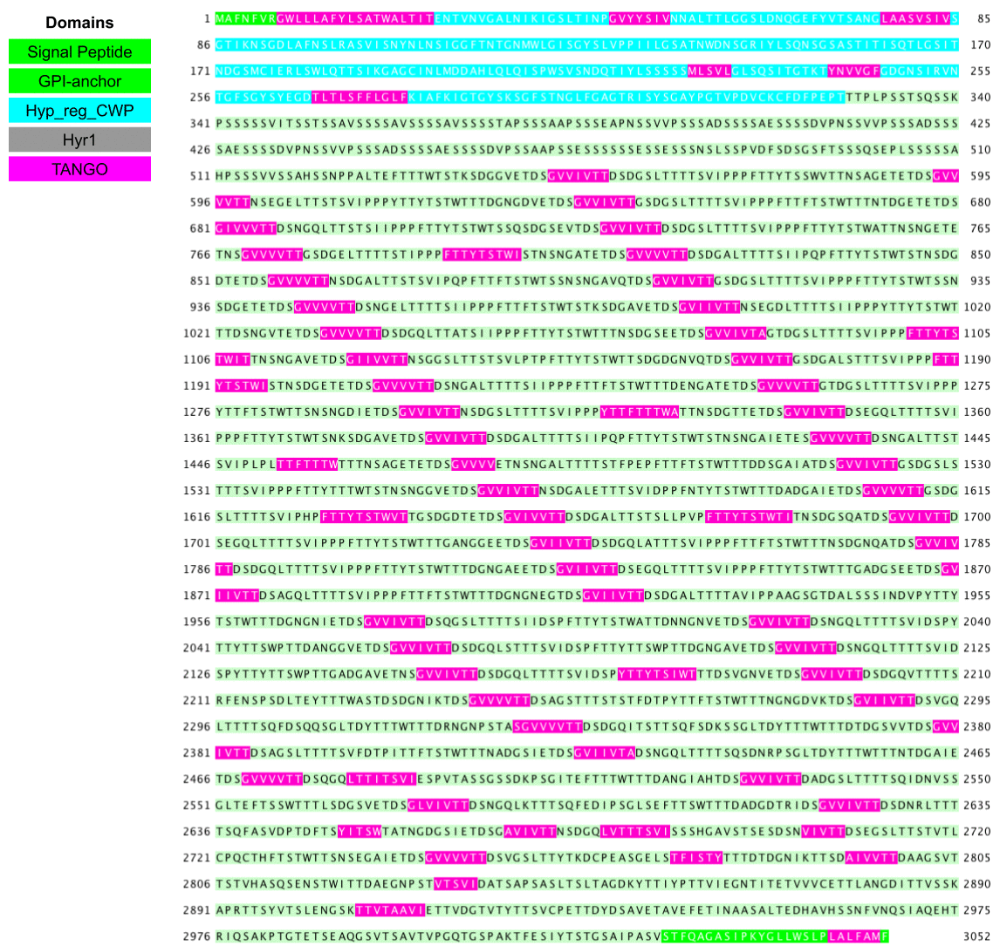

## Overview
The overall question in the phylogenetic analysis of the protein family is to understand where did this putative adhesin evolve from, whether its homologs in other species also possess the adhesin properties and how has the protein family expanded or contracted -- whether there is any correlation between the trend of family expansion and pathogenecity potential of the species. My blast analysis was aimed at collecting homologs for this family from related commensal and free-living species. The gene tree reconstruction was to infer the evolutionary relationship between those sequences to infer the duplication and loss events in each species. Now I'd like to collect adhesin related properties for all the homologs, including FungalRV prediction, FaaPred, GPI-anchor & Signal peptide and MEME/XSTREM (for repeats). Once these statistics are gathered, the goal is to combine them in a data frame and plot them using the ggtree package.

This folder was created to repeat the 2020-07-17 analysis with the updated homologs sequences.

## Data
`XP_028889033_homologs.fasta` was copied from `../../blast/XP_028889033_homologs_combine.fasta`, created on 2020-07-23, with the exception that the first 900 amino acid was added back to XP_025344407.1

## Analysis
### FungalRV
I found that the results obtained from the [FungalRV server](http://fungalrv.igib.res.in/query.php) has inconsistencies. The scores differ between the submission with fasta file vs through the input box. Instead, I ran the analysis locally (had to compile the source code for SVM light as the binary downloaded before no longer work on Catalina).

### FaaPred
Split the fasta sequence file into subsets of 25 using `split -l 50 XP_028889033_homologs.fasta`. Submit the 5 subset files to the FaaPred [website app](http://bioinfo.icgeb.res.in/faap/query.html), copy and paste the results into Sublime Text and removed the first index column, resulting in the `raw-output/faapred_result.txt`.

### Fungal GPI pattern (skipped)
> There is a feature on the FungalRV server result, where each sequence has an associated "Search for GPI fungal pattern" link. Upon looking into it, I found it is a simple "fuzzy search" using a quasi-regular-expression very similar to the PROSITE patterns. I think this pattern is simply made by the FungalRV authors. The program used for the search is `fuzzpro`, which is part of the well-known `EMBOSS` suite. I implemented that search locally and get the result using the following command

> ```bash
> fuzzpro -sequence XP_028889033_homologs.fasta -sformat fasta -pattern "[GNSDAC]-[GASVIETKDLF]-[GASV]-X(4,19)-[FILMVAGPSTCYWN](10)>" -outfile fungalGPIanchor.txt
> ```

> The output includes the sequence name, what looks like a FDR-adjusted _P_-value and the predicted cleavage site ($\Omega$ site). For our purpose, we just need the names of the sequences with the second column smaller than or equal to 0.05.

### GPI anchor by GPI-SOM
The [GPI-SOM](http://genomics.unibe.ch/cgi-bin/gpi.cgi) web-tool appears to be down. No matter whether I submit a single sequence through the input box or by uploading a fasta file, the output is always an error "GPI-SOM wasn't able to process all input sequences." Given the similar results from GPI-SOM and PredGPI for the 2020-07-14 result, I decide to skip this one.

Update [2020-07-26]: the server is back to being functional. Followed the same analysis pipeline as in the 2020-07-17 analysis.

### PredGPI
[Website](http://gpcr.biocomp.unibo.it/predgpi/pred.htm) tool provides a simple interface and the result can be directly downloaded. The result file contains the original fasta sequences, which we don't need. I just used `grep` to only retain the sequence name lines.

### $\Beta$-aggregation sequence counts and intervals
Jan and Rachel's talks have shown that a $\Beta$ aggregation signature motif, in the form of "G[VI]{1,4}T{0,4}", is present in XP_028889033 as well as two other homologs. The goal here is to identify all such motifs among all homologs. Here I'll use the same `fuzzpro` program used above to identify GPIanchor to search for this pattern.

To be able to run TANGO myself, I registered an account on the author's [website](http://tango.crg.es/examples.jsp), downloaded the binary for Mac, and wrote a simple python script to format the intput file (`format_tango_input.py`). I used the parameters that Rachel decided based on the literature (see `01-global-adhesin-prediction/output/TANGO` for details). The input file is stored as `XP_028889033_homologs_tango.txt`. In doing so, I found that the tango v2.3.1 I downloaded didn't expect the "tf" parameter. So I removed that part in the input file. This resulted in some differences in the output. To be safe, I asked Rachel to run the same file through her Windows binary and saved the file as a zip archive under the `2020-07-24` folder.

I initially used a different approach from Rachel's. Hers is to write a "bat" file in Windows to call Tango individually on each sequence, while I formated the input file to be taken in by Tango as a whole. To do so, I need to invoke the `tango_2_3_1` binary on the command line, answer "Y" to the question of whether to record individual residue prediction results, and paste in the name of the input file. Then I need to patiently wait for the program to run, during which time it will output a lot of information on the screen in addition to writing the results to the files.

**Update 2020-08-10**
The results from my approach missed 22 sequences in the residue-level predictions, that is, there are only 78 individual result files, even though all 100 sequences are in the aggregated result. I found that the problem was some of the sequence names were too long. Simply cutting them shorter solved the issue. Also, I decided to switch to Rachel's approach of writing a shell batch script so that I can incorpor. To do so, I modified `format_tango_input.py` to only write the sequence ID without the species name, since the former is already unique, and I made the script generate shell scripts. The new python script is called `format_tango_batch.sh`, and it generates an `.sh` file that can be directly run at the command line.

```bash
python3 format_tango_batch.py XP_028889033_homologs.fasta
bash XP_028889033_homologs_tango.sh
```

Because Tango output one file per sequence, to avoid cluttering the results folder, I created a `tango-output` folder for it, and kept the output files gzipped -- my R code can easily read in gzipped files with little runtime cost.

The script used to parse and explore the TANGO results are in `tango.Rmd`

### S/T frequency
1. Use `freak` from EMBOSS suite to calculate the frequency of Serine or Threonine in each of the 100 sequences in the homolog file.

    ```bash
    freak XP_028889033_homologs.fasta -letters "ST" -window 100 -step 10 -outfile ST_freq_100_10.freak -odirectory raw-output
    ```
1. Convert the output to a table format for plotting
    
    ```bash
    python format_freak_out.py raw-output/ST_freq_100_10.freak
    ```

1. Compress the output for storage

    ```bash
    gzip ST_freq*
    ```


1. For plotting, we would like to create a vector of sequence names in the same order as shown in the rooted gene tree. To do so, I loaded the `../gene-tree/20200723-raxml-hb/RAxML_bipartitions.muscle_4318866` in FigTree 1.4.4, rooted the tree on the Saccharomycotaceae, and rotated the auris and albicans groups, then saved the tree in Newick format. I then copied that file over to the current folder and edited in vim. By removing the branch lengths and other symbols such as parentheses, I got the sequence names in rows in the same order as the gene tree.

1. At Jan's suggestion, I expanded the analysis above to separately document the frequency of Serine and Threonine. I also altered the window size and step size to 50 and 5 bp.

### Collect feature profiles for a schematic plot for each homolog

We would like to collect features including Signal peptide (N-terminus), GPI-anchor (C-terminus), NTD Hyp_reg_CWP domain, S/T frequency and TANGO sequences.

#### Signal peptide and GPI-anchor
Update [2020-08-27]: understanding GPI-SOM output in order to define the coordinates for the signal peptide and GPI-anchor


Below is an example of GPI-SOM output:

```
>XP_028889033.1_Cauris  [Best match for cleavage site at C-21]
seq0 x:15 y:10 map:G omega:21 oq:58
```

- "Best match for cleavage site at C-21":

    This is based on the C-score from [SignalP](http://www.cbs.dtu.dk/services/SignalP-3.0/output.php), which has a value for each residue and should peak at the cleavage site. Note that in the SignalP output, the "peak" position actually points to the first residue in the mature protein. Hence it's the residue before that peak that is the "cleavage site". In this case it is residue 21.

    Notice, however, the GPI-SOM output file doesn't report the probability of there being a signal peptide, as reported by SignalP. But it seems that the `gpi-anchor-list.txt`, which is from the fifth row on the result page, did remove sequences whose SignalP predicted probability is low (1x ~0.3 and 2x ~0.03). It's too bad that they don't make these things clear

- In light of the above, I discarded the GPI-SOM results altogether and opted to use [SignalP 5.0 server](http://www.cbs.dtu.dk/services/SignalP-5.0/) to predict the N-terminal signal peptide, and use PredGPI (see below) to predict the C-terminal GPI anchor. The new SignalP 5.0 result is now in `raw-output/signalp_5.0.gff`.

- To get the position of the GPI-anchor, I turn to the PredGPI result. An example is shown below:

    ```
    >XP_028889033.1_Cauris | FPrate:0.000 | OMEGA:S-3027
    ```
    Here we get the starting position of the GPI-anchor sequence

#### Hyp_reg_CWP
Some thoughts are, the Pfam site has many of these sequences and have the Pfam cartoon showing the positions of the NTD. Alternatively, I could use the alignment to define the boundaries of the NTD in each homolog. 

What I ended up doing is submitting the sequence to the [HMMSCAN tool](https://www.ebi.ac.uk/Tools/hmmer/search/hmmscan) and selects pfam as the target profile-HMM database. The batch result page didn't provide a link to download the collected hit table. Luckily, I filled in my email address at the time of submission, and the result is emailed to me. This is saved as `raw-output/HMMER-HMMScan-Pfam-hits.tsv`. I edited the header to make it friendly for R.

To understand the output file, I referred to the [HMMER v3 manual](http://eddylab.org/software/hmmer3/3.1b2/Userguide.pdf). When HMMER searches a profile-HMM database, e.g. pfam, with the user-input query sequence(s), it tries to identify the region that matches the domain profiles. In doing so, it will produce three sets of coordinates, two of which refer to the query and one to the profile in the database. For the latter, we have "model start/end/length", which tells us which part of the model (profile) the query matches. For the former, there are the "alignment start/end" and "envelope start/end". The first refers to the best guess of the start and end of the query that matches the domain profile. The second is a slightly wider region that captures most of the posterior probability mass in the HMM run. HMMER usually uses the envelope start and end to annotate the domains in the protein.
### Annotate XP_028889033 with Hyp_reg_CWP, Hyr1 and TANGO sequences
_Goal_

1. Visualize the domain architecture of XP_028889033
1. Determine the relationship between the Hyr1 repeats and the regularly spaced TANGO sequences

_Approach_

To visualize the various domains along with TANGO sequences in Jalview, I followed Jalview's own feature file format and made a feature file for XP_028889033, by exporting the data from R. I then exported png files with or without the Hyr1 and TANGO features on or off, and made a GIF file from them.

```bash
convert -delay 180 20200830*.png -loop 0 20200830-XP_028889033-annotated.gif
```




