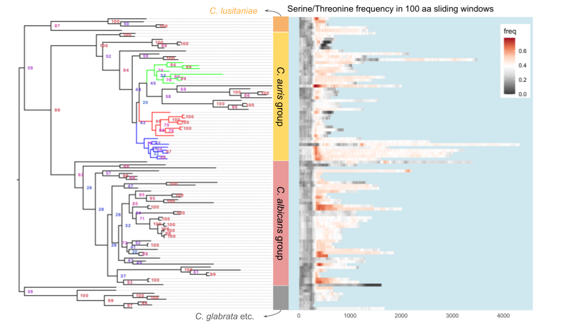

```{r setup, include=FALSE}
knitr::opts_chunk$set(echo = TRUE)
```

```{r load_libraries, echo = FALSE}
if (!requireNamespace("BiocManager", quietly = TRUE))
    install.packages("BiocManager")
if (!requireNamespace("treeio", quietly = TRUE))
    BiocManager::install("treeio")
if (!requireNamespace("ggtree", quietly = TRUE))
    BiocManager::install("ggtree")
library(tidyverse)
```

## Goal

Analyze the gene tree and the adhesin properties of the XP_028889033 homologs (putative adhesin in _C. auris_)
This is version 2 of the analysis, using the updated homologs on 2020-07-23

## Approach
1. Load gene tree
1. Parse various computational prediction results and assemble a master table with one row for each homolog
1. Plot the data

## Build datasets
First get the basic information about the 100 sequences in this study. I decide to write a simple Python script to extract such info.
```{bash}
# edit the PYTHON path below to match your local system
~/sw/miniconda3/bin/python extract_seq_info.py
```

### Sequence info
Load in the sequence information.
```{r load_seq_info}
seqInfo <- read_tsv("XP_028889033_homologs.tsv", comment = "#", col_types = "ccci") %>% 
  mutate(species = factor(species, levels = c("Cduobushaemulonis","Cpseudohaemulonis","Chaemuloni","Cauris","Clusitaniae","Dhansenii","Cparapsilosis","Lelongisporus","Ctropicalis","Cdubliniensis","Calbicans","Sstipitis","Klactis","Ncastellii","Cglabrata","Nbracarensis","Ndelphensis","Nnivariensis")))
```

```{r plot_prot_length, fig.width=8, fig.height=6}
# plot the length distribution of the homologs in each species
ggplot(seqInfo, aes(x = species, y = length)) + 
  geom_point() + 
  stat_summary(fun.data = mean_cl_boot, geom = "crossbar", col = "red", width = 0.5) + 
  coord_flip() +
  labs(title = "Distribution of XP_028889033 homologs' protein length",
       subtitle = "thick red line indicates group mean and the box the 95% confidence interval by bootstrapping"
       )
```
_Discussion_

- Homologs in the MDR group tend to be longer.

### Adhesin predictors
Now let's import the fungalRV and FaaPred results.
```{r adhesin_prediction}
frv.th = 0.511 # recommended FungalRV score threshold
frv <- read_tsv("raw-output/fungalRV_result.txt", skip = 3, col_names = c("name","frv.score"), col_types = "cd") %>% 
  mutate(name = str_sub(name, 2), frv.pred = frv.score > frv.th)
faa <- read_tsv("raw-output/faapred_result.txt", col_names = c("name","faa.score","faa.pred"), col_types = "cdc") %>% 
  mutate(faa.pred = ifelse(faa.pred == "Adhesin", TRUE, FALSE))
if("frv.score" %in% names(seqInfo))
  seqInfo <- select(seqInfo, -frv.score, -frv.pred, -faa.score, -faa.pred)
seqInfo <- seqInfo %>% left_join(frv) %>% left_join(faa)
seqInfo %>% 
  group_by(species) %>% 
  summarize(n = n(), mean.frv = mean(frv.score), mean.faa = mean(faa.score), fungalRV = sum(frv.score > 0.511), faapred = sum(faa.pred), both = sum(frv.score > 0.55 & faa.pred))
```


### GPI-anchor prediction

```{r gpi}
# GPI-SOM
tmp <- read_delim("raw-output/gpi-anchored-list.txt", delim = " ", col_names = FALSE) %>% pull(X1)
gpi.som <- str_sub(tmp, 2)
if("gpi.som" %in% names(seqInfo))
  seqInfo <- select(seqInfo, -gpi.som)
seqInfo <- mutate(seqInfo, gpi.som = ifelse(name %in% gpi.som, TRUE, FALSE))
# FungalRV pattern matching (this is based on the FungalRV pattern for fungal GPI-anchor sequences)
# this is not very useful as all 110 sequences have >= 1 hit.

# Pred-GPI http://gpcr.biocomp.unibo.it/predgpi
tmp <- read_delim("raw-output/predgpi_result.txt", delim = "|", col_names = c("name","fp","omega"))
pred.gpi <- tmp %>% 
  mutate(name = str_sub(name,2,-2), # remove > and the trailing space
         fp = as.numeric(str_sub(fp, 9, -2)), # extract the numeric part
         pred.gpi = fp <= 0.05,
         omega = str_sub(omega, 7)
         )

if("pred.gpi" %in% names(seqInfo))
  seqInfo <- select(seqInfo, -pred.gpi)
seqInfo <- left_join(seqInfo, pred.gpi %>% select(name, pred.gpi), by = c("name"="name"))

seqInfo %>% 
  group_by(species) %>% 
  summarize(Total = n(), GPI_SOM = sum(gpi.som), GPI_Pred = sum(pred.gpi), Both = sum(gpi.som & pred.gpi))
```

### Serine/Threonine content

S/T sites are potential sites for O-glycosylation, which could increase the rididity of the stalk of the protein and allow the N-terminal domain to protrude out of the cell wall facing the exterior. More evidence for the importance of O-glycosylation in a serine/threonine-rich domain can be found [here](https://ec.asm.org/content/10/10/1317.long).

To determine the S/T frequency in the XP_028889033 homologs, I ran the program `freak` from the EMBOSS suite with the parameters of 100 aa sliding window and a step size of 10 aa. After reformating the output, the rest of the analysis is accomplished below.

```{r}
# load data
ST.freq <- read_tsv("raw-output/ST_freq_100_10_freak.out.gz", col_types = "cid")
# in order to plot properties of the sequences in an order that is consistent with the sequences' position in the gene tree
genetreeOrder <- scan("reorder_by_gene_tree.txt", what = "character")
# convert sequence name column to an ordered list sorted based on the gene tree sequence
ST.freq <- ST.freq %>% 
  mutate(id = ordered(id, levels = rev(genetreeOrder))) # this will produce the desired order
```

```{r, fig.width=7}
# plot the results using geom_tile()
p <- ggplot(ST.freq, aes(x = id, y = pos)) + geom_tile(aes(fill = freq)) + 
  coord_flip() + scale_fill_distiller(palette = "RdGy") +  theme_classic() +
  theme(axis.text.y = element_text(size = 5),
        axis.line.y = element_blank(), axis.ticks.y = element_blank(),
        axis.line.x = element_blank(), axis.ticks.x = element_blank(),
        legend.position = c(0.9,0.85),
        panel.background = element_rect(fill = alpha("lightblue",0.5))) +
  ylim(1, 4500) + ylab("Position in sequence") + xlab("Sequences") + ggtitle("Serine/Threonine frequency in 100 aa sliding windows")
ggsave("img/20200810-ST-freq-tile.png", p, bg = "transparent", width = 7, height = 7)
```



The plot above was constructed using google slides, where I combined the gene tree, visually edited in FigTree 1.4.4, and the S/T frequency plot generated in R with the code above. However, I'd like to be able to generate such figures programmatically, so that their reproduction would be automatic, and that I don't have to manually scale the two images to align the sequences. For this I'll turn to the `ggtree` package.
```{r}
suppressPackageStartupMessages(library(ggtree))
geneTree <- read.tree("XP_028889033_homologs_gene_tree.nwk")
```

### TANGO prediction of $\beta$-aggregation prone sequences

The amyloid-like $\beta$-aggregation prone sequences have the ability to mediate self-aggregation, which boosts the local concentration of the adhesin molecules on the cell-surface. Similar to the S/T frequency above, we would like to use the output from the prediction algorithm, TANGO, to visulize the distribution of such sequence motifs along the length of the XP_028889033 homolog sequences.

```{r}
# read in TANGO output
# tango output are stored as gzipped files for each individual sequence. we need to read in all of the files into a list of tibbles
tango.output.files <- list.files(path = "tango-output", pattern = "*.txt.gz", include.dirs = T)
ltango <- lapply(tango.output.files, function(x) {
  read_tsv(paste0("tango-output/",x), col_types = "icddddd") %>% select(res, aa, Aggregation)
  })
names(ltango) <- gsub(".txt.gz","",tango.output.files)
tango.output <- bind_rows(ltango, .id = "id")
# the id column stores only the refseq_id, without the species name portion. to make sure that the sequences
# are plotted in the desirable order, we do the following
names(genetreeOrder) <- gsub("_[A-Za-z]+$","", genetreeOrder, perl = TRUE)
tango.ordered <- tango.output %>% 
  mutate(new_id = genetreeOrder[id], ordered_id = ordered(new_id, levels = rev(genetreeOrder))) %>% 
  select(ordered_id, res, aa, aggregation = Aggregation)
```

Now we can plot them the same way as we plotted the S/T frequencies:
```{r}
p <- ggplot(tango.ordered, aes(x = ordered_id, y = res)) + geom_tile(aes(fill = aggregation)) + 
  scale_fill_gradient(limits = c(5,100), breaks = c(5,20,50,100), low = "white", high = "yellow", trans = "sqrt") +
  coord_flip() +  theme_classic() +
  theme(axis.text.y = element_text(size = 5),
        axis.line.y = element_blank(), axis.ticks.y = element_blank(),
        axis.line.x = element_blank(), axis.ticks.x = element_blank(),
        legend.position = c(0.9,0.8),
        panel.background = element_rect(fill = alpha("lightblue",0.5))) +
  ylim(1, 4500) + ylab("Position in sequence") + xlab("Sequences") + ggtitle("TANGO predicted aggregation score")
p
ggsave("img/20200811-tango-score-tile.png", p, bg = "transparent", width = 7, height = 7)
```

